# Ejercicio 4: Escalar la aplicación y validar la Alta Disponibilidad

### Duración estimada: 120 minutos

## Descripción general

En este punto, ha desplegado una sola instancia de los contenedores de servicios Web y API Productos. En este ejercicio, aumentará el número de instancias de contenedor para el servicio web y escalará el front-end en el clúster existente.

## Objetivos del laboratorio

Podrá completar las siguientes tareas:

- Tarea 1: Modificar las implementaciones de recursos de Kubernetes en el servicio de Kubernetes
- Tarea 2: Resolver errores de aprovisionamiento de réplicas
- Tarea 3: Configurar el escalado automático horizontal para pods del servicio Kubernetes
- Tarea 4: Escalado automático en el clúster de Azure Kubernetes Service
- Tarea 5: Reiniciar los contenedores y validar la alta disponibilidad (HA)
- Tarea 6: Configurar el escalado automático de Cosmos DB
- Tarea 7: Probar el escalado automático de Cosmos DB

## Tarea 1: Modificar las implementaciones de recursos de Kubernetes en el servicio de Kubernetes

En esta tarea, aumentará el número de instancias para la implementación del API en AKS. Mientras se está implementando, observará el estado cambiante.

1. Vaya al Portal de Azure, abra el servicio de Kubernetes **contoso-traders-aks<inject key="DeploymentID" enableCopy="false" />** del grupo de recursos **contosoTraders-<inject key="DeploymentID" enableCopy="false" />**. Seleccione **Cargas de trabajo (1)** en recursos de Kubernetes en el menú del lado izquierdo y luego seleccione la implementación **contoso-traders-products (2)**.

   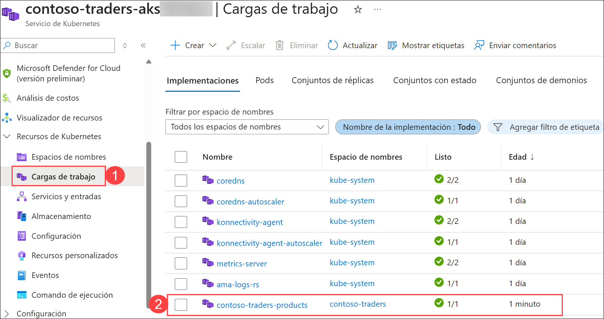

1. Seleccione **YAML (1)** en el menú de la izquierda en la Descripción general de **contoso-traders-products** y desplácese hacia abajo hasta encontrar **réplicas** en la sección **especificaciones**. Cambie el número de réplicas a **2 (2)** y luego seleccione **Revisar y guardar (3)**. 

   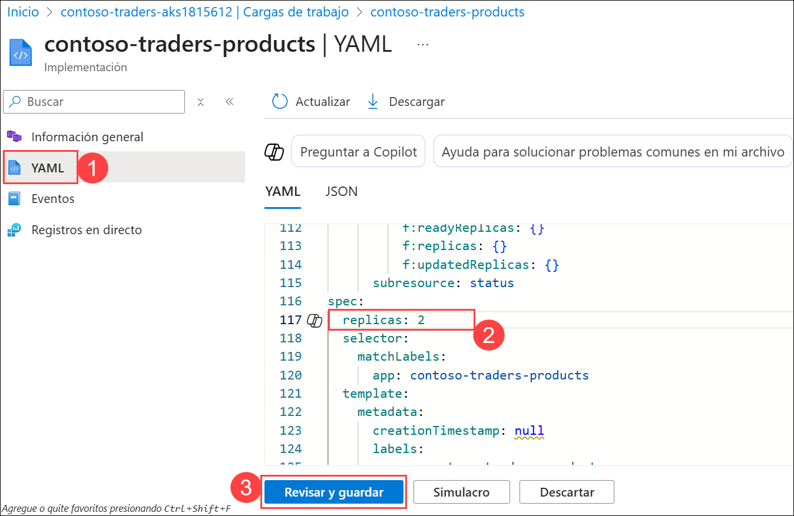

    >**Nota**: Si la implementación se completa rápidamente, es posible que no vea la implementación en estados de espera en el portal, como se describe en los siguientes pasos.

1. Cuando se le solicite Confirmar los cambios en el manifiesto, marque **Confirmar cambio de manifiesto (1)** y seleccione **Guardar (2)**.

    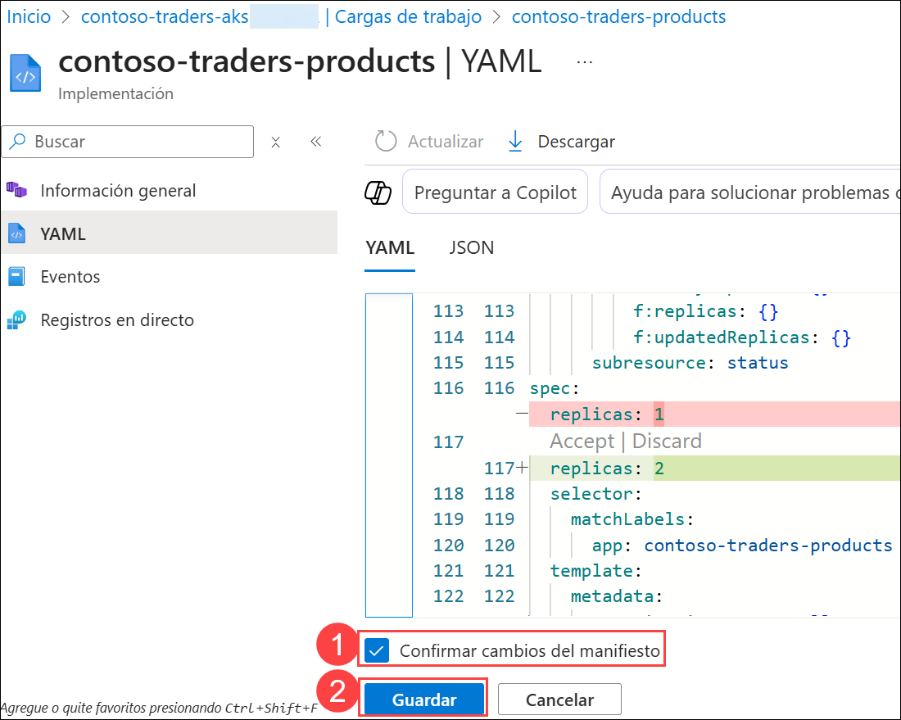

1. Actualmente se está implementando y puede ver que hay una instancia en estado sana y otra en espera.

1. Abra la aplicación web Contoso Traders y podrá comprobar que la aplicación sigue funcionando sin errores.

    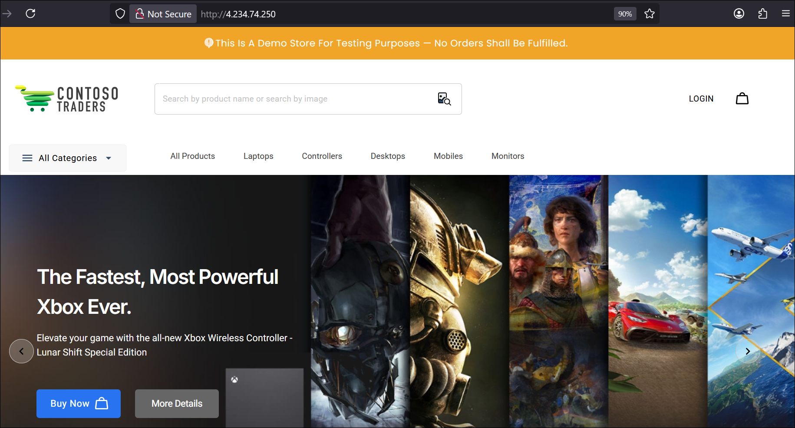

1. Si encontró algún error o problema al agregar una nueva instancia en la Tarea 2, continúe con la Tarea 2 para solucionarlo. Si no encontró ningún problema, omita la Tarea 2 y continúe directamente con la Tarea 3.

> **Felicitaciones** por completar la tarea. Ahora es momento de validarla. Estos son los pasos:
> - Si recibe un mensaje de éxito, puede continuar con la siguiente tarea.
> - Si no es así, lea atentamente el mensaje de error y vuelva a intentar el paso, siguiendo las instrucciones de la guía de laboratorio.
> - Si necesita ayuda, comuníquese con nosotros a cloudlabs-support@spektrasystems.com. Estamos disponibles las 24 horas, los 7 días de la semana para ayudarlo.

<validation step="	39567d0b-df57-4e1b-a388-c7e0c82f4bc6" />

## Tarea 2: Resolver errores de aprovisionamiento de réplicas

En esta tarea, resolverá las réplicas de API fallidas, que suelen ocurrir debido a la falta de recursos para cumplir con los requisitos solicitados. Realice esta tarea solo si encontró errores o problemas en la tarea anterior. Si no encontró problemas, puede omitir esta tarea.

1. En el servicio Kubernetes **contoso-traders-aks<inject key="DeploymentID" enableCopy="false" />**, seleccione **Cargas de trabajo (1)** y luego elija la implementación **contoso-traders-products (2)**. 

    

1. Seleccione **YAML (1)** en el menú de la izquierda en la Descripción general de **contoso-traders-products**.

   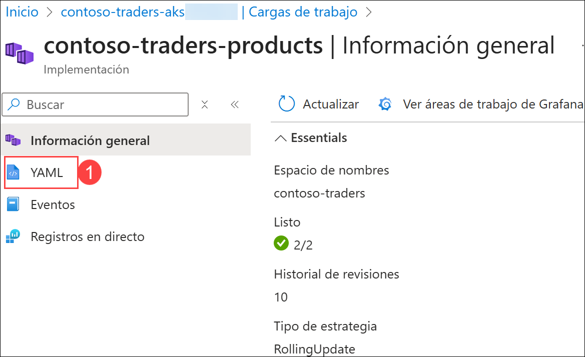

1. En la pantalla **YAML**, desplácese hacia abajo y actualice los siguientes elementos. Seleccione **Revisar y guardar (4)** una vez realizados los cambios.

   - En la sección **especificaciones (1)**, asegúrese de que se proporcionen los siguientes **ports** :

      ```yaml
      ports:
        - containerPort: 3001
          protocol: TCP
      ```

   - Modifique la **CPU** y la **Memoria** **(3)** en la misma sección de especificaciones. La CPU se divide entre todos los pods de un nodo.

      ```yaml
      requests:
         cpu: 100m
         memory: 128Mi
      ```

      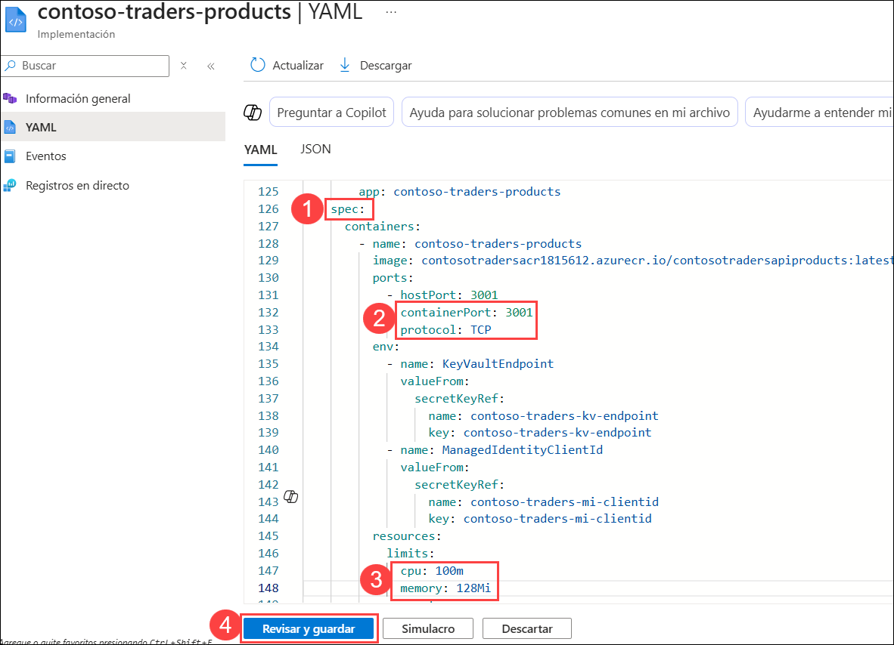

1. Cuando se le solicite Confirmar cambio de manifiesto, marque **Confirmar cambio de manifiesto** y seleccione **Guardar**.

1. Regrese a la vista principal **Cargas de trabajo (1)** del servicio de Kubernetes **contoso-traders-aks<inject key="DeploymentID" enableCopy="false" />**, refresque la página y ahora verá que la implementación está sana con **dos (2)** Pods en funcionamiento.

   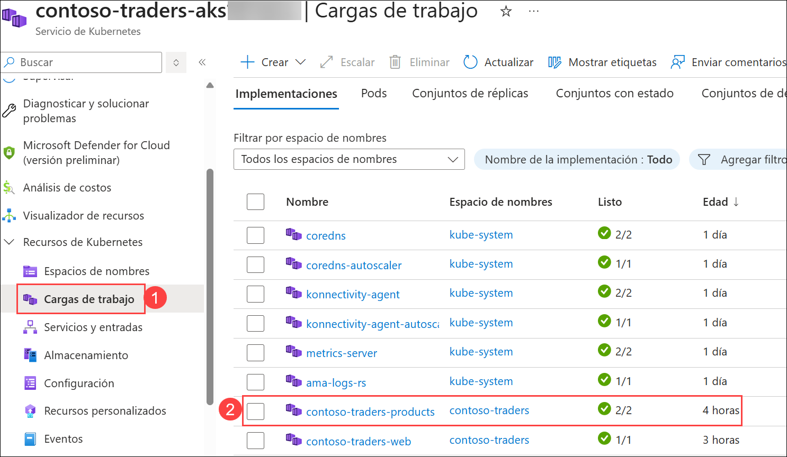       

## Tarea 3: Configurar el Autoescalado Horizontal para pods del servicio de Kubernetes

En esta tarea, configurará el autoescalado horizontal para sus pods del servicio de Kubernetes.
   
1. Vuelva al Símbolo del sistema de Windows.

1. Ejecute el siguiente comando para configurar el autoescalado horizontal para sus pods del API de Productos.

   ```bash 
   kubectl autoscale deployment contoso-traders-products -n contoso-traders --cpu-percent=50 --min=1 --max=10
   ```
   
   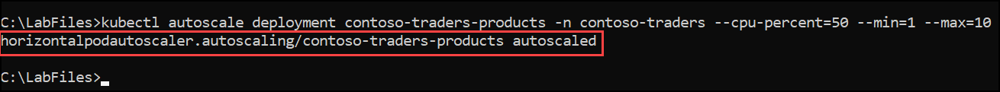
   
1. Ejecute el siguiente comando para comprobar el estado del Autoescalador Horizontal de Pods recién añadido.

   ```
   kubectl get hpa -n contoso-traders
   ```
   
   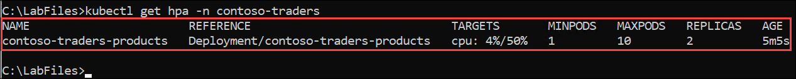

   >**Nota:** Si no obtiene el resultado esperado, espere unos minutos ya que puede tardar un tiempo en reflejarse.

## Tarea 4: Escalado automático en el clúster de Azure Kubernetes Service

En esta tarea, habilitará el autoescalador del clúster para el clúster de AKS existente y escalará automáticamente los grupos de nodos del clúster.

1. Vuelva al símbolo del sistema de Windows. Si no ha iniciado sesión en Azure, hágalo con el siguiente comando después de actualizar los valores en el comando.

    ```
    az login -u <inject key="AzureAdUserEmail"></inject> -p <inject key="AzureAdUserPassword"></inject>
    ```
    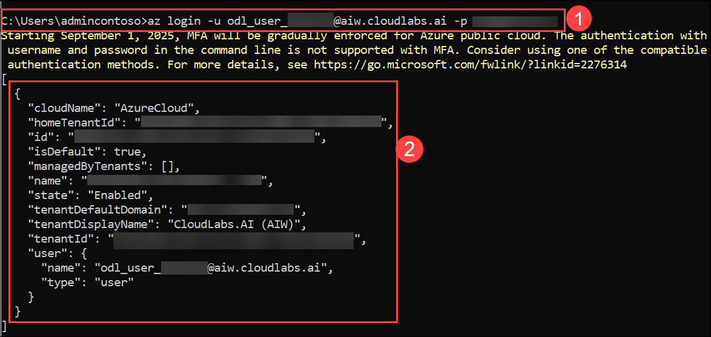

1. Para configurar la conexión del clúster de Kubernetes, proporcione el siguiente comando y ejecútelo.

    ```
    az aks get-credentials --resource-group ContosoTraders-<inject key="DeploymentID" enableCopy="true"/> --name contoso-traders-aks<inject key="DeploymentID" enableCopy="true"/>
    ```
    
1.  Verifique el `recuento` **(1)** de grupos de nodos en el clúster y asegúrese de que `enableblingAutoScaling` sea `false` **(2)**. Proporcione el siguiente comando y ejecútelo.   
    
     ```
     az aks nodepool list --resource-group ContosoTraders-<inject key="DeploymentID" enableCopy="true"/> --cluster-name contoso-traders-aks<inject key="DeploymentID" enableCopy="true"/>
     ```   
    
    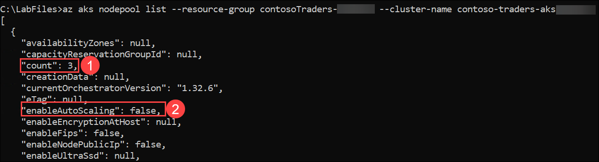

1. Ejecute el siguiente comando para habilitar el autoescalado del clúster en el clúster existente. Verifique que `enablementAutoScaling` sea `true`. Proporcione el siguiente comando y ejecútelo.

    ```
    az aks update --resource-group ContosoTraders-<inject key="DeploymentID" enableCopy="true"/> --name contoso-traders-aks<inject key="DeploymentID" enableCopy="true"/> --enable-cluster-autoscaler --min-count 1 --max-count 3
    ```
  
   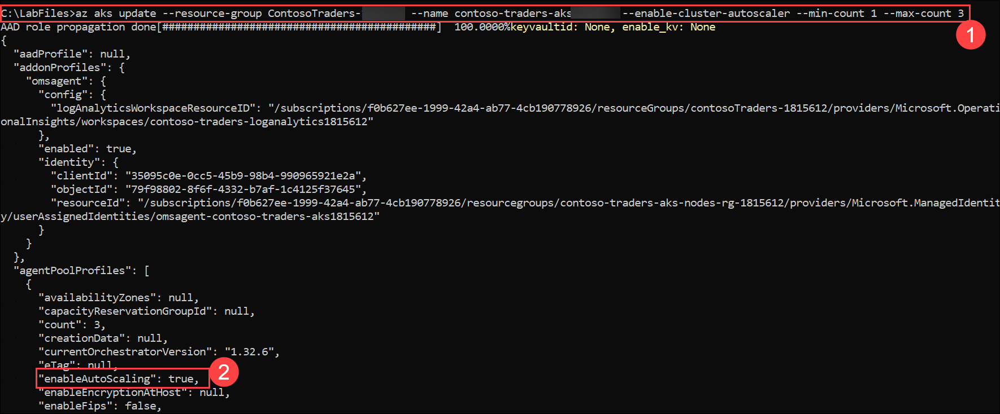
   
    >**Nota**: Tenga en cuenta que el comando anterior puede tardar hasta 5 minutos en finalizar la actualización. Antes de realizar cualquier otra acción, asegúrese de que se ejecute correctamente.
   
1. Ejecute el siguiente comando para escalar automáticamente los grupos de nodos en el clúster existente. Proporcione el siguiente comando y ejecútelo.

    ```
    az aks update --resource-group ContosoTraders-<inject key="DeploymentID" enableCopy="true"/> --name contoso-traders-aks<inject key="DeploymentID" enableCopy="true"/> --update-cluster-autoscaler --min-count 1 --max-count 5
    ```
   
    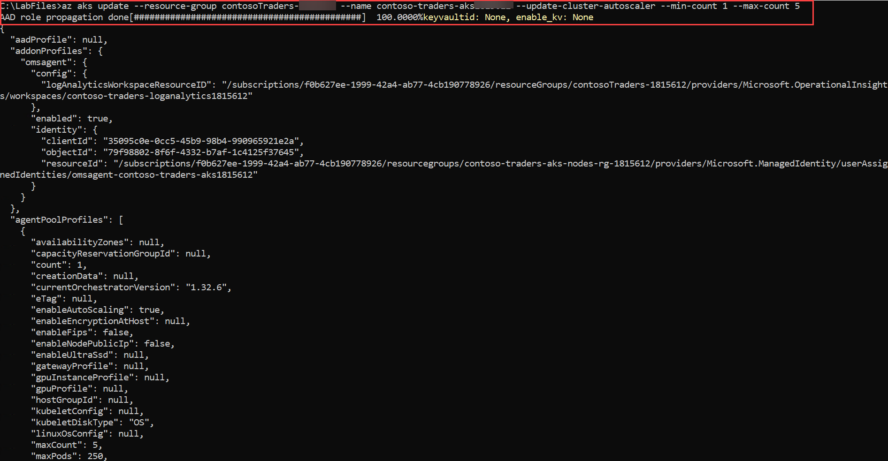
   
   >**Nota**: Tenga en cuenta que el comando anterior puede tardar hasta 5 minutos en finalizar la actualización. Antes de realizar cualquier otra acción, asegúrese de que se ejecute correctamente.

## Tarea 5: Reiniciar los contenedores y validar la alta disponibilidad (HA)

En esta tarea, reiniciará los contenedores y validará que el reinicio no afecte al servicio en ejecución.

1. En la hoja Azure Kubernetes Service, seleccione **Cargas de trabajo (1)** y luego seleccione la implementación **contoso-traders-product (2)**.

   

1. Seleccione el elemento de navegación **YAML (1)** y aumente el contador de réplicas requeridas a `4` **(2)**, luego haga clic en **Revisar y guardar (3)** y, cuando se le solicite Confirmar cambio de manifiesto, marque **Confirmar cambio de manifiesto** y seleccione **Guardar**.
 
   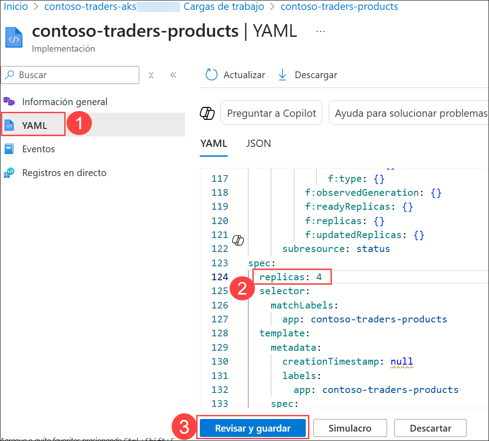

1. Cuando se le solicite que confirme el cambio de manifiesto, marque la opción "Confirmar cambio de manifiesto" (1) y seleccione "Guardar" (2). Luego, haga clic en "Resumen" (3) para volver a las implementaciones.

    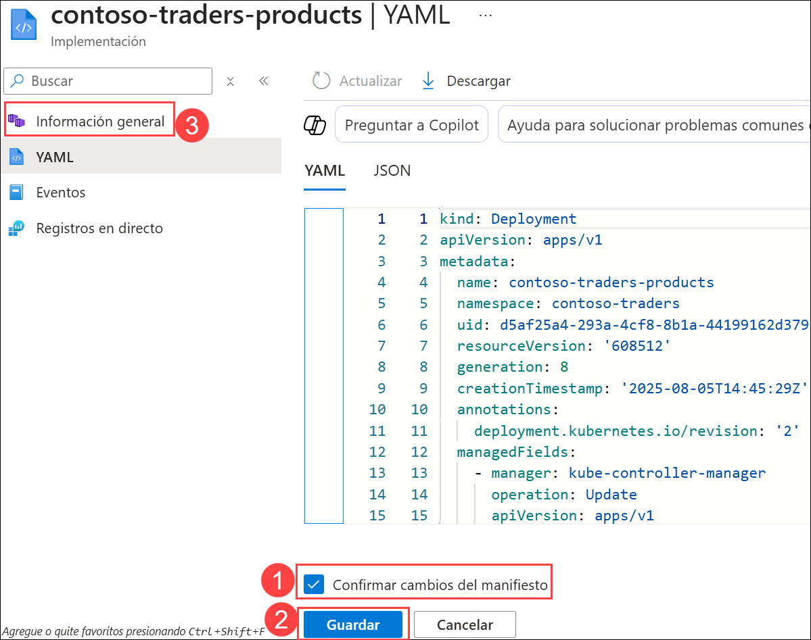

1. Después de unos momentos, encontrará que el despliegue de **contoso-traders-product** ahora está ejecutando `4` réplicas exitosamente.

    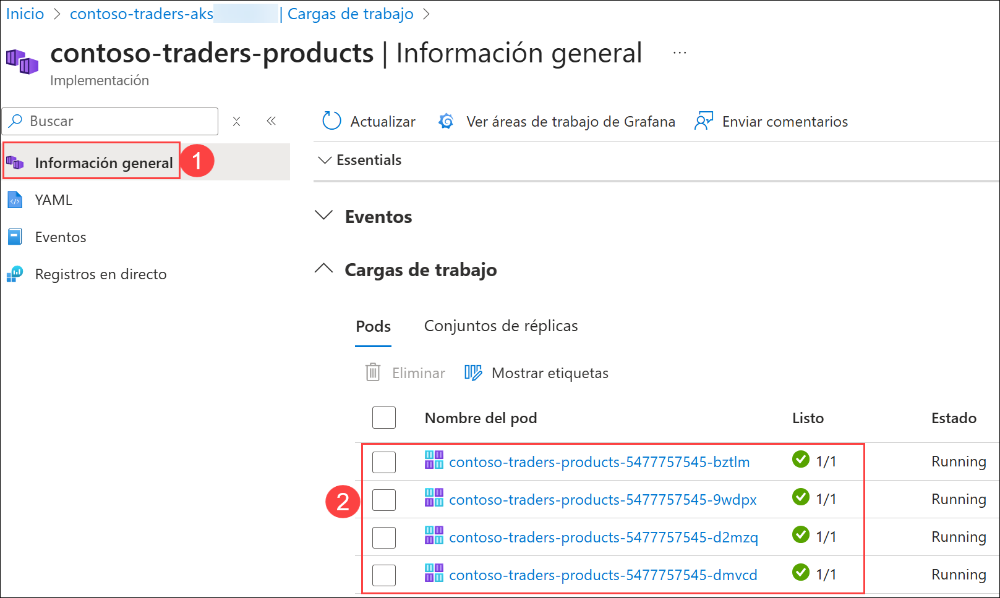

1. Regrese a la pestaña del navegador con la página de la aplicación web cargada. Actualice la página una y otra vez. No verá ningún error.

   

1. Regrese a la página **contoso-traders-products| Descripción general**, seleccione **dos de los Pods (1)** al azar y elija **Eliminar (2)**.

   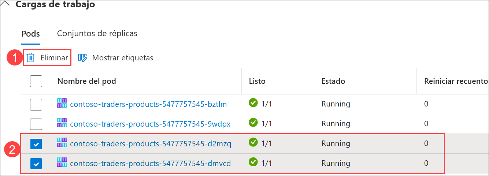

1. En la página **Eliminar**, seleccione **Confirmar eliminación (1)** y haga clic en **Eliminar (2)** nuevamente.

   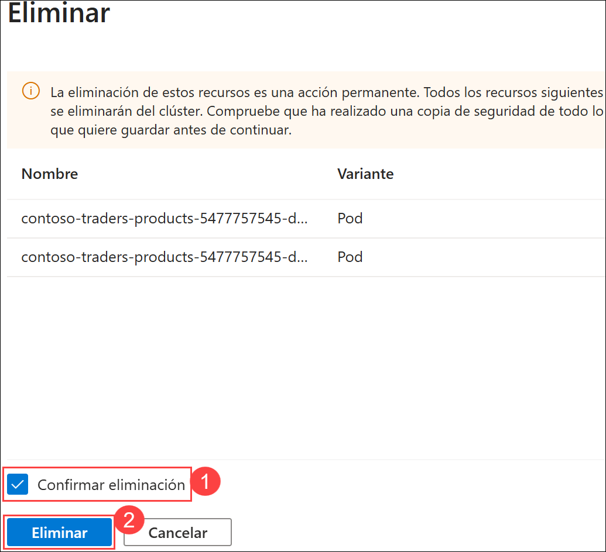

1. Kubernetes lanzará nuevos Pods para cumplir con el número de réplicas requerido. Dependiendo de su vista, es posible que vea las instancias antiguas con el estado Finalizando y nuevas instancias con el estado Creado.

   

1. Regrese a la implementación de API de **contoso-traders-product**. Seleccione el elemento de navegación **YAML** y escale nuevamente a la réplica `1`.

   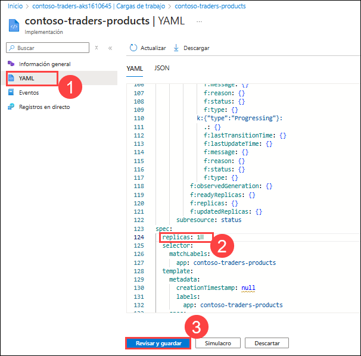

1. Seleccione **Revisar y guardar** y, cuando se le solicite Confirmar cambio de manifiesto, marque **Confirmar cambio de manifiesto** y seleccione **Guardar**.

1. Regrese a la página web de ContosoTraders en el navegador y actualice mientras Kubernetes reduce la cantidad de Pods. Debería poder ver el sitio web ejecutándose sin ningún problema.

    

> **Felicitaciones** por completar la tarea. Ahora es momento de validarla. Estos son los pasos:
> - Si recibe un mensaje de éxito, puede continuar con la siguiente tarea.
> - Si no es así, lea atentamente el mensaje de error y vuelva a intentar el paso, siguiendo las instrucciones de la guía de laboratorio.
> - Si necesita ayuda, comuníquese con nosotros a cloudlabs-support@spektrasystems.com. Estamos disponibles las 24 horas, los 7 días de la semana para ayudarlo.

<validation step="	010994f7-b80b-4ba5-a807-e1d6ac030ea7" />

## Tarea 6: Configurar el escalado automático de Cosmos DB

En esta tarea, configurará Autoscale en Azure Cosmos DB.

1. En el portal de Azure, navegue hasta la cuenta de Azure Cosmos DB para MongoDB **Contosotraders-<inject key="DeploymentID" enableCopy="false" />**.

   

1. Seleccione **Explorador de datos (1)** del menú del lado izquierdo. En **Explorador de datos**, expanda la base de datos `contentdb` **(2)**.

    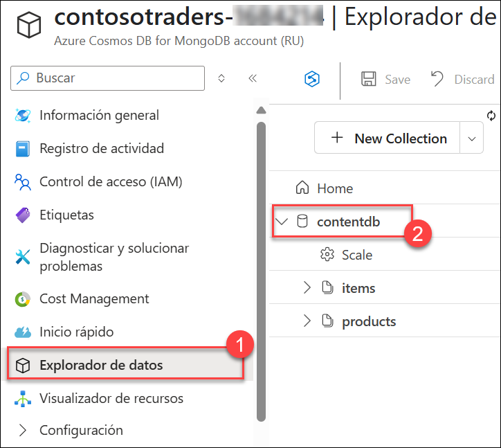

1. En la base de datos `contentdb`, expanda la colección **Items (1)**, seleccione **Settings (2)**.

    

1. En la pestaña **Scale & Settings (1)**, seleccione **Autoscale (2)** para la configuración **Throughput** en **Scale** y haga clic en **Save (3)**.

    

> **Felicitaciones** por completar la tarea. Ahora es momento de validarla. Estos son los pasos:
> - Si recibe un mensaje de éxito, puede continuar con la siguiente tarea.
> - Si no es así, lea atentamente el mensaje de error y vuelva a intentar el paso, siguiendo las instrucciones de la guía de laboratorio.
> - Si necesita ayuda, comuníquese con nosotros a cloudlabs-support@spektrasystems.com. Estamos disponibles las 24 horas, los 7 días de la semana para ayudarlo.

<validation step="56f38190-cea0-441f-ba7d-717395a4a622" />

## Tarea 7: Probar el escalado automático de Cosmos DB

En esta tarea, ejecutará un script de prueba de rendimiento que probará la característica Autoscale de Azure Cosmos DB para que pueda ver que ahora escalará a más de 400 RU/s.

1. En el portal de Azure, navegue hasta la cuenta de Azure Cosmos DB para MongoDB **Contosotraders-<inject key="DeploymentID" enableCopy="false" />**.

   

1. Seleccione **Cadena de conexión** en **Configuración**.

   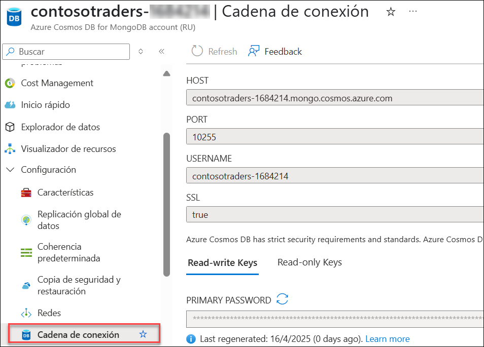

1. En el panel **Cadena de conexión**, copie los valores **HOST (1)**, **NOMBRE DE USUARIO (2)** y **CONTRASEÑA PRINCIPAL (3)**. Guárdelos en un archivo de texto para usarlos más adelante.

    

1. Abra el símbolo del sistema y conéctese a la MV del Agente de Compilación usando el comando  **<inject key="Command to Connect to Build Agent VM" enableCopy="true" />** proporcionado.

1. Cuando se le solicite la contraseña, ingrese la **Contraseña de la MV del Agente de Compilación** que se proporciona a continuación.

   * Contraseña: **<inject key="Build Agent VM Password" enableCopy="true" />**

1. En la **MV del Agente de Compilación**, mavegue hasta el directorio `~/labfiles`.

    ```bash
    cd Cloud-Native-Application/labfiles/src
    ```

1. Ejecute el siguiente comando para abrir el script `perftest.sh` en la ventana del editor.

    ```bash
    sudo chmod 777 perftest.sh
    vi perftest.sh
    ```

1. Hay varias variables declaradas en la parte superior del script `perftest.sh`. Presione **_i_** para ingresar al modo `insert`. Luego modifique las variables **host**, **username** y **password** estableciendo sus valores en los valores correspondientes de la Cadena de Conexión de Cosmos DB que se copiaron anteriormente.

    

1. Luego presione **_ESC_**, escriba **_:wq_** para guardar los cambios y cerrar el archivo.
    
    >**Nota**: Si **_ESC_** no funciona, presione `ctrl+[` y luego escriba **_:wq_** para guardar los cambios y cerrar el archivo.
    
1. Ejecute el siguiente comando para ejecutar el script `perftest.sh` para ejecutar una pequeña prueba de carga en CosmosDB. Este script consumirá RUs en CosmosDB al insertar muchos documentos en el contenedor Sessions.

    ```bash
    bash ./perftest.sh
    ```

    > **Nota:** No esperes a que el script termine; continúa con el siguiente paso.

1. Una vez que se complete la ejecución del script, regrese a la **Cuenta de CosmosDB** en el Portal de Azure.

1. Desplácese hacia abajo en el panel **Descripción general** de la hoja **Cuenta de Cosmos DB** y busque el gráfico **Cargo de la solicitud**.

    > **Nota:** La actividad en la colección CosmosDB puede tardar de 2 a 5 minutos en aparecer en el registro de actividad. Espere un par de minutos y luego actualice la página si la carga de las solicitudes recientes no aparece en este momento.

1. Observe que el **Cargo de la solicitud** ahora muestra que hubo actividad en la **cuenta de CosmosDB** que superó el límite de 400 RU/s que se estableció previamente antes de activar Autoscale.

    
    
    >**Nota**: En caso de que no vea datos en el gráfico, configure el rango de tiempo para que dure 1 hora.

1. Haga clic en el botón **Siguiente** ubicado en la esquina inferior derecha de esta guía de laboratorio para continuar con el siguiente ejercicio.

      
## Resumen

En este ejercicio, ha aumentado las instancias de servicio y configurado el autoescalado horizontal para los pods de AKS. Además, ha configurado y probado CosmosDB Autoscale.

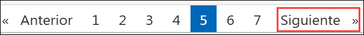