# Exercise 4: Scale the application and validate HA

### Estimated Duration: 120 minutes

## Overview

At this point, you have deployed a single instance of the Web and Products API service containers. In this exercise, you will increase the number of container instances for the web service and scale the front end in the existing cluster.

## Lab Objectives

You will be able to complete the following tasks:

- Task 1: Modify the Kubernetes resource deployments in the Kubernetes service
- Task 2: Resolve failed replica provisioning
- Task 3: Configure Horizontal Autoscaling for Kubernetes service pods
- Task 4: Autoscaling on Azure Kubernetes Service cluster
- Task 5: Restart containers and validate HA
- Task 6: Configure Cosmos DB Autoscale
- Task 7: Test CosmosDB Autoscale

### Task 1: Modify the Kubernetes resource deployments in the Kubernetes service

In this task, you will increase the number of instances for the API deployment in the AKS. While it is deploying, you will observe the changing status.

1. Navigate to Azure portal, open **contoso-traders-aks<inject key="DeploymentID" enableCopy="false" />** Kubernetes service from **ContosoTraders-<inject key="DeploymentID" enableCopy="false" />** resource group. Select **Workloads (1)** under Kubernetes resources from the left side menu and then select the **contoso-traders-products (2)** deployment.

   .png "Setting replicas to 2")

1. Select **YAML (1)** from the left menu in the **contoso-traders-products** overview and scroll down until you find **replicas** under **spec** section. Change the number of replicas to **2 (2)**, and then select **Review + save (3)**. 

   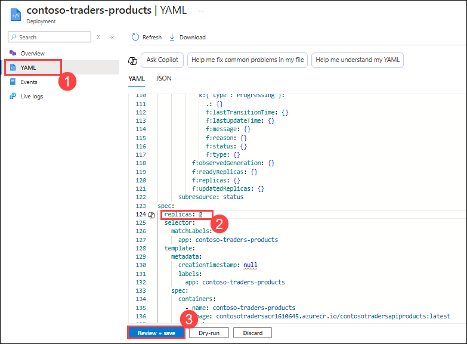

1. When prompted to confirm manifest change, check **Confirm manifest change (1)** and select **Save (2)**. Then, click on **Overview (3)** to navigate back to deployments.

    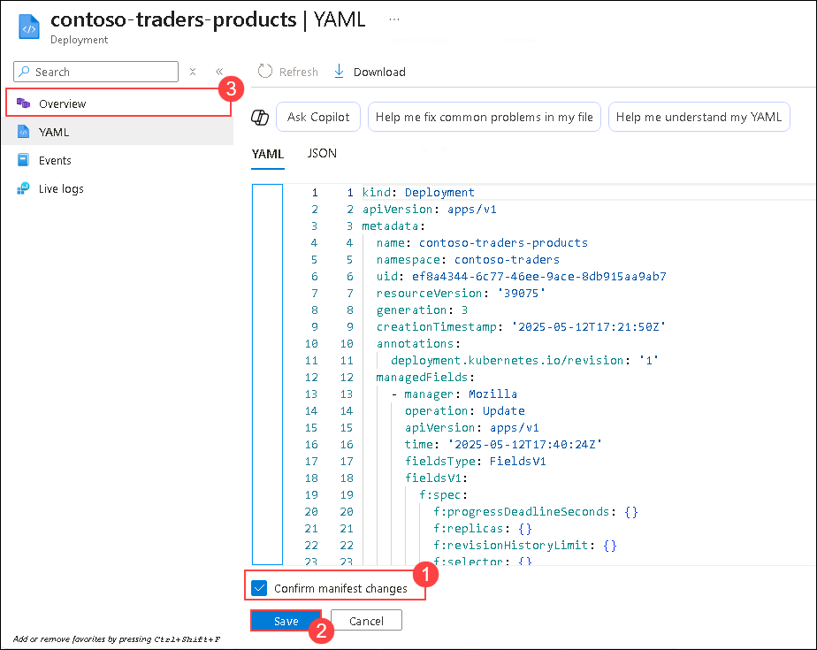

    >**Note**: If the deployment completes quickly, you may not see the deployment in waiting states in the portal, as described in the following steps.    

1. It is currently deploying, and you can see that there is one healthy instance and one awaiting instance.

1. Open the Contoso Traders web application, and you can see that the application should still work without errors.

    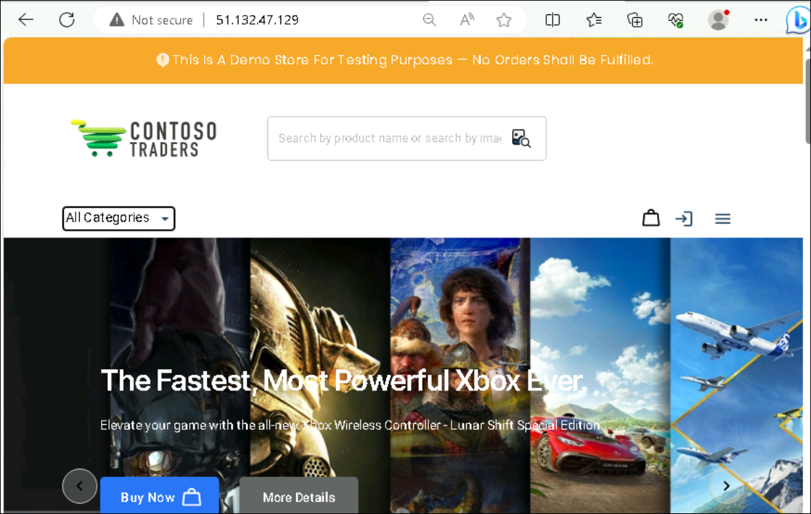

1. If you encountered any errors or issues while adding a new instance in Task 2, continue with Task 2 to troubleshoot and resolve them. If no issues were encountered, skip Task 2 and proceed directly to Task 3.

> **Congratulations** on completing the task! Now, it's time to validate it. Here are the steps:
> - If you receive a success message, you can proceed to the next task.
> - If not, carefully read the error message and retry the step, following the instructions in the lab guide. 
> - If you need any assistance, please contact us at cloudlabs-support@spektrasystems.com. We are available 24/7 to help you out.

<validation step="cd2e41f5-e0af-43fc-97ac-3358da846e31" />

### Task 2: Resolve failed replica provisioning 

In this task, you will resolve failed API replicas, which typically occur due to insufficient resources to meet the requested requirements. Perform this task only if you encountered errors or issues in the previous task. If no issues were encountered, you may skip this task.

1. In the **contoso-traders-aks<inject key="DeploymentID" enableCopy="false" />** Kubernetes service, select **Workloads (1)** and then select the **contoso-traders-products (2)** deployment. 

    .png "API deployment is now healthy")

1. Select the **YAML** from the left menu in the **contoso-traders-products** Overview.

   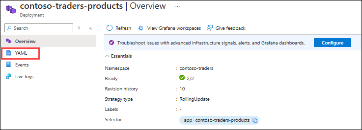

1. In the **YAML** screen, scroll down and update the following items:

   - Under the **spec** section, make sure the following ports are provided:

      ```yaml
      ports:
        - containerPort: 3001
          protocol: TCP
      ```

   - Modify the **cpu** and set it to **100m**. The CPU is divided between all Pods on a Node.

      ```yaml
      requests:
         cpu: 100m
         memory: 128Mi
      ```

      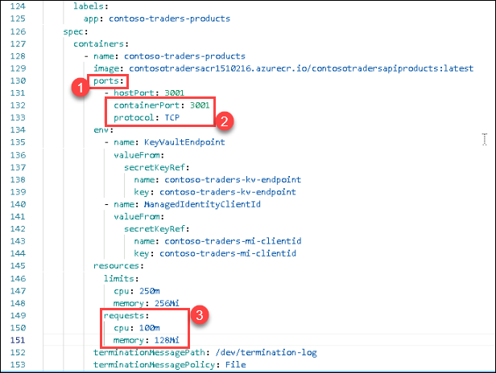

1. Select **Review + save**, and When prompted Confirm manifest change, check **Confirm manifest change** and select **Save**.

1. Return to the **Workloads (1)** main view of the **contoso-traders-aks<inject key="DeploymentID" enableCopy="false" />** Kubernetes service, refresh the page and you will now see that the Deployment is healthy with **two (2)** Pods operating.

   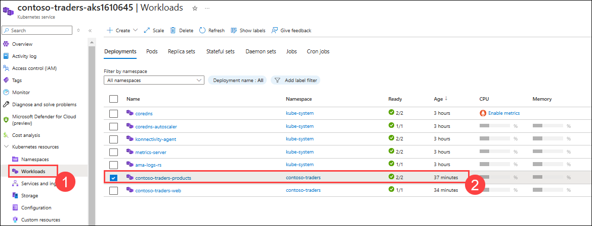       

### Task 3: Configure Horizontal Autoscaling for Kubernetes service pods

In this task, you will be configuring the Horizontal Autoscaling for your Kubernetes service pods.
   
1. Navigate back to your Windows command prompt.

1. Run the below command to configure the Horizontal autoscaling for your API Products pods.

   ```bash 
   kubectl autoscale deployment contoso-traders-products -n contoso-traders --cpu-percent=50 --min=1 --max=10
   ```
   
   
   
1. Run the below command to check the status of the newly added Horizontal Pod Autoscaler.

   ```
   kubectl get hpa -n contoso-traders
   ```
   
   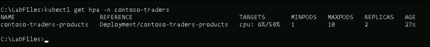

   >**Note:** If you do not get the expected output, please wait for a few minutes as it may take some time to reflect.

### Task 4: Autoscaling on Azure Kubernetes Service cluster

In this task, you will be enabling the cluster autoscaler for the existing AKS cluster, and you will be autoscaling the cluster node pools.

1. Navigate back to your Windows command prompt. If you are not logged into Azure, log in to Azure with the command below.

    ```
    az login -u <inject key="AzureAdUserEmail"></inject> -p <inject key="AzureAdUserPassword"></inject>
    ```

1. In order to set up the Kubernetes cluster connection, run the following command.

    ```
    az aks get-credentials --resource-group ContosoTraders-<inject key="DeploymentID" enableCopy="true"/> --name contoso-traders-aks<inject key="DeploymentID" enableCopy="true"/>
    ```
    
1.  Verify the `count` of node pools in the cluster and ensure that `enablingAutoScaling` is `false`.
    
     ```
     az aks nodepool list --resource-group ContosoTraders-<inject key="DeploymentID" enableCopy="true"/> --cluster-name contoso-traders-aks<inject key="DeploymentID" enableCopy="true"/>
     ```   
    
    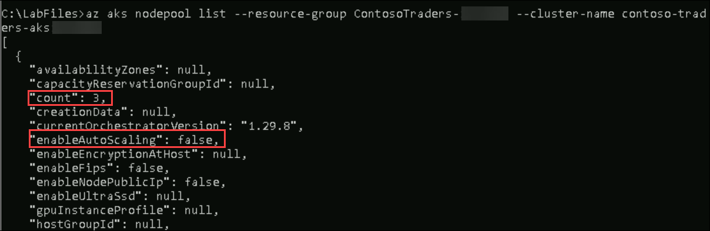

1. Run the below command to enable the cluster autoscale in the existing cluster. Verify that `enablingAutoScaling` is `true`.

    ```
    az aks update --resource-group ContosoTraders-<inject key="DeploymentID" enableCopy="true"/> --name contoso-traders-aks<inject key="DeploymentID" enableCopy="true"/> --enable-cluster-autoscaler --min-count 1 --max-count 3
    ```
  
   
   
    >**Note**: Please be aware that the above command may take up to 5 minutes to finish the updation. Before taking any further action, make sure it runs successfully.
   
1. Run the below command to autoscale the node pools in the existing cluster.

    ```
    az aks update --resource-group ContosoTraders-<inject key="DeploymentID" enableCopy="true"/> --name contoso-traders-aks<inject key="DeploymentID" enableCopy="true"/> --update-cluster-autoscaler --min-count 1 --max-count 5
    ```
   
   
   
   >**Note**: Please be aware that the above command may take up to 5 minutes to finish the updation. Before taking any further action, make sure it runs successfully.

### Task 5: Restart containers and validate HA

In this task, you will restart containers and validate that the restart does not impact the running service.

1. In the Azure Kubernetes Service blade, select **Workloads (1)** and then select the **contoso-traders-product (2)** deployment. 

   

1. Select the **YAML (1)** navigation item and increase the required replica count to `4` **(2)** then click on **Review + save (3)**.
 
   

1. When prompted to confirm manifest change, check **Confirm manifest change (1)** and select **Save (2)**. Then, click on **Overview (3)** to navigate back to deployments.

    

1. You will find that the **contoso-traders-product** deployment is now running `4` replicas successfully after 5 minutes.

    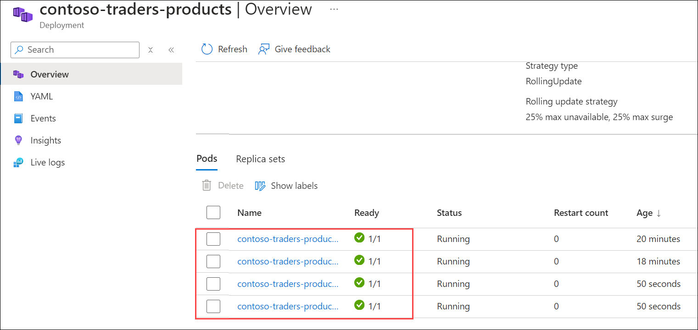

1. Return to the browser tab with the web application stats page loaded. Refresh the page over and over. You will not see any errors.

   

1. Go back to the **contoso-traders-products| Overview** page, Select **two of the Pods (1)** randomly and choose **Delete (2)**. 

   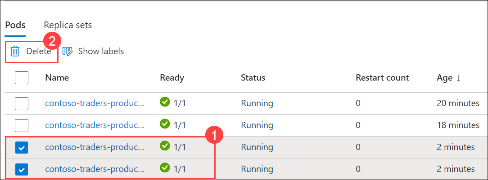

1. On the **Delete** page, Select **Confirm delete (1)**, and click on **Delete (2)** again.

   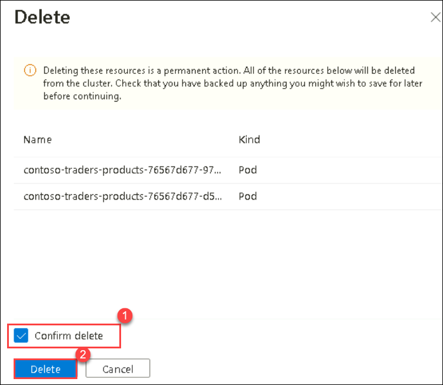

1. Kubernetes will launch new Pods to meet the required replica count. Depending on your view, you may see the old instances terminating and new instances being created.

   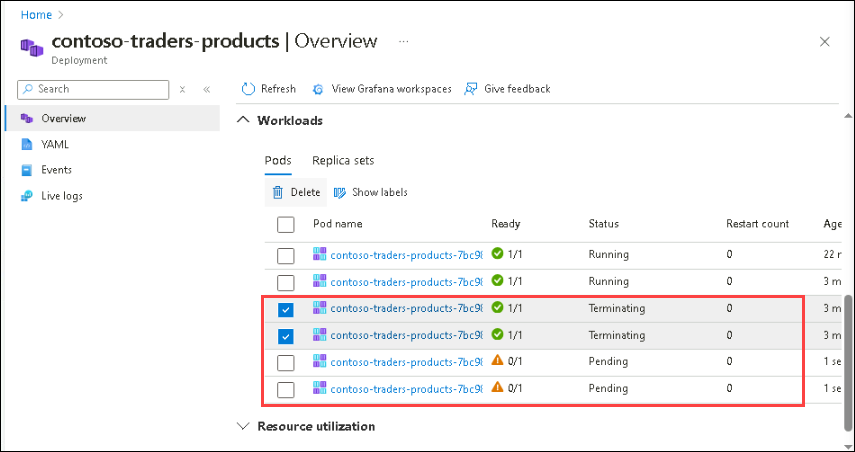

1. Return to the **contoso-traders-product** API Deployment. Select the **YAML** navigation item and scale it back to the `1` replica.

   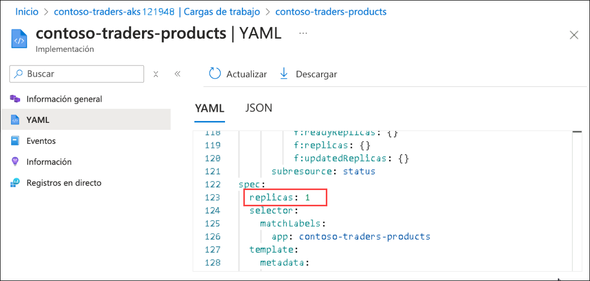

1. Select **Review + save**, and When prompted Confirm manifest change, check **Confirm manifest change** and select **Save**.

1. Return to the ContosoTarders website's stats page in the browser and refresh while Kubernetes is scaling down the number of Pods. You should be able to see the website running without any issues

    


> **Congratulations** on completing the task! Now, it's time to validate it. Here are the steps:
> - If you receive a success message, you can proceed to the next task.
> - If not, carefully read the error message and retry the step, following the instructions in the lab guide. 
> - If you need any assistance, please contact us at cloudlabs-support@spektrasystems.com. We are available 24/7 to help you out.

<validation step="0cddaf1e-5cbe-4a3c-8b20-0e6999478048" />

### Task 6: Configure Cosmos DB Autoscale

In this task, you will set up Autoscale on Azure Cosmos DB.

1. In the Azure Portal, navigate to the **Contosotraders-<inject key="DeploymentID" enableCopy="false" />** Azure Cosmos DB Account.

    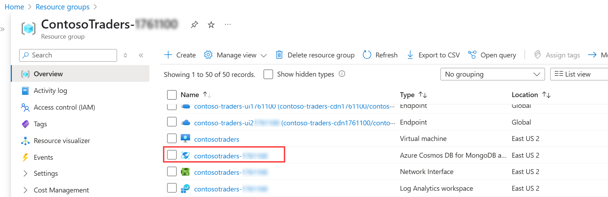

2. Select **Data Explorer (1)** from the left side menu. Within **Data Explorer**, expand the `contentdb` **(2)** database.

    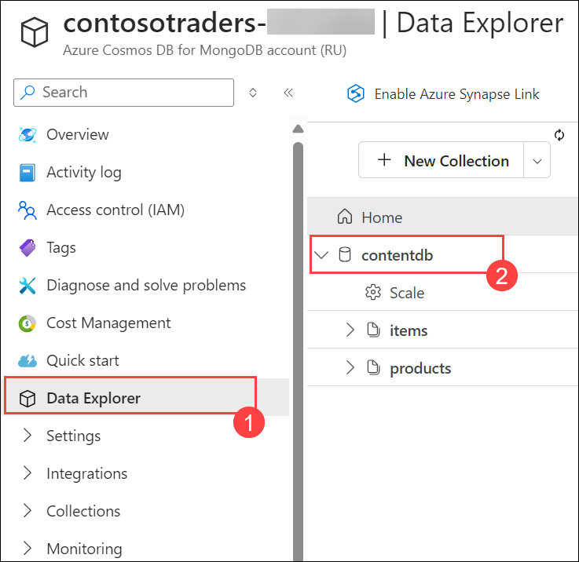

4. Under the `contentdb` database, expand **items (1)** collection, select **Settings (2)**.

    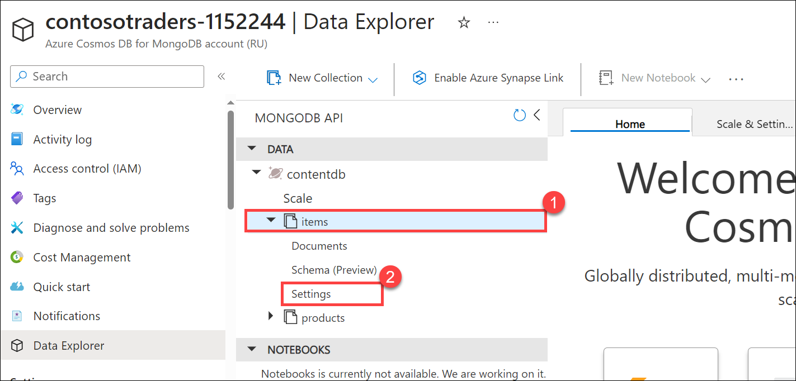

5. In the **Scale & Settings (1)** tab, select **Autoscale (2)** for the **Throughput** setting under **Scale** and click on **Save (3)**.

    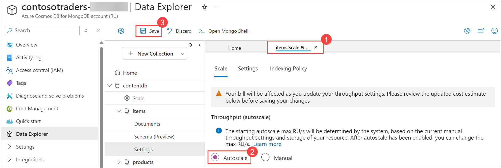


> **Congratulations** on completing the task! Now, it's time to validate it. Here are the steps:
> - If you receive a success message, you can proceed to the next task.
> - If not, carefully read the error message and retry the step, following the instructions in the lab guide. 
> - If you need any assistance, please contact us at cloudlabs-support@spektrasystems.com. We are available 24/7 to help you out.

   <validation step="772e22fb-588f-41b1-b761-428e48c79279" />

### Task 7: Test CosmosDB Autoscale

In this task, you will run a performance test script that will test the Autoscale feature of Azure Cosmos DB so you can see that it will now scale greater than 400 RU/s.

1. In the Azure Portal, navigate to the **contosotraders-<inject key="DeploymentID" enableCopy="false" />** Azure Cosmos DB Account.

    

1. Select **Connection strings** under **Settings** tab.

   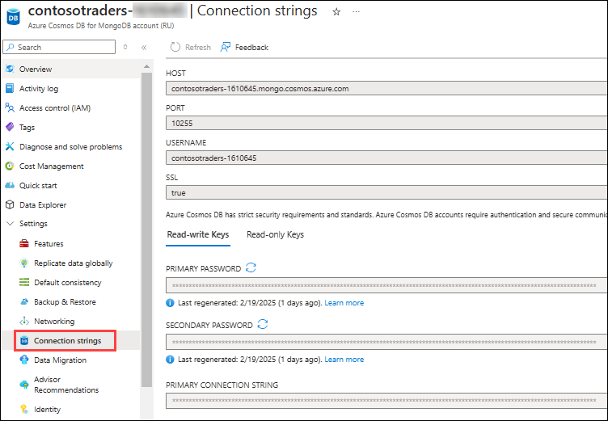

1. On the **Connection String** pane, copy the **HOST (1)**, **USERNAME (2)**, and **PRIMARY PASSWORD (3)** values. Save these in a text file for later use.

    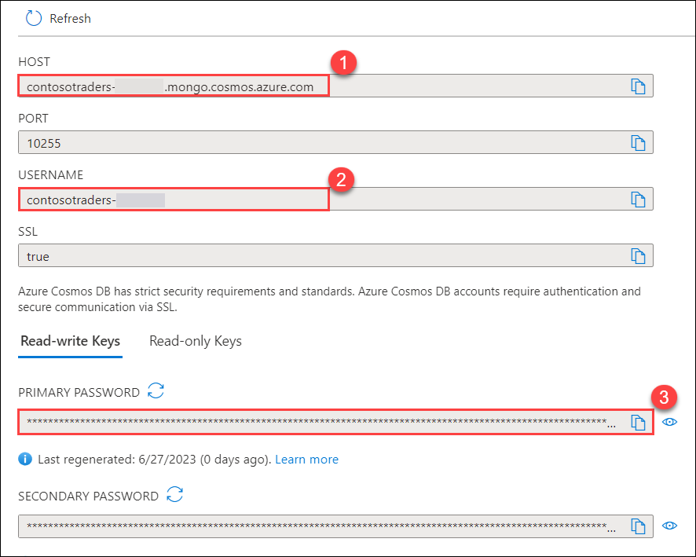

1. Open the Command prompt, and connect to the build agent VM using the given command **<inject key="Command to Connect to Build Agent VM" enableCopy="true" />**.

1. When asked for the password, enter the **Build Agent VM Password** given below.

   * Password: **<inject key="Build Agent VM Password" enableCopy="true" />**

1. On the **Build agent VM**, navigate to the `~/labfiles` directory.

    ```bash
    cd Cloud-Native-Application/labfiles/src
    ```

1. Run the following command to open the `perftest.sh` script in the editor window.

    ```bash
    sudo chmod 777 perftest.sh
    vi perftest.sh
    ```

1. There are several variables declared at the top of the `perftest.sh` script. Press **_i_** to get into `insert` mode. Then modify the **host**, **username**, and **password** variables by setting their values to the corresponding Cosmos DB Connection String values that were copied previously.

    

1. Then press **_ESC_**, write **_:wq_** to save your changes and close the file.
    
    >**Note**: If **_ESC_** doesn't work press `ctrl+[` and then write **_:wq_** to save your changes and close the file.
    
1. Run the following command to execute the `perftest.sh` script to run a small load test against Cosmos DB. This script will consume RUs in Cosmos DB by inserting many documents into the Sessions container.

    ```bash
    bash ./perftest.sh
    ```

    > **Note:** The script will take a few minutes to complete its execution, if the script get stuck while getting executed, click `Ctrl+C` to stop the script.

1. Once the script execution is completed, navigate back to the **Cosmos DB account** in the Azure portal.

1. Scroll down on the **Overview** pane of the **Cosmos DB account** blade and locate the **Request Charge** graph.

    > **Note:** It may take 2 - 5 minutes for the activity on the Cosmos DB collection to appear in the activity log. Wait a couple of minutes and then refresh the page if the recent Request charge doesn't show up right now.

1. Notice that the **Request charge** now shows there was activity on the **Cosmos DB account** that exceeded the 400 RU/s limit that was previously set before Autoscale was turned on.

    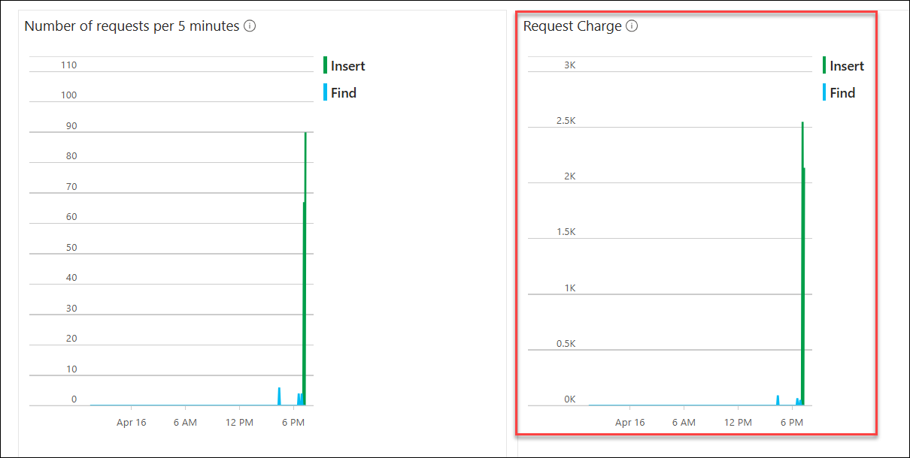
    
    >**Note**: In case you don't see data on the graph, please set the time range to last 1 hour.

1. Click the **Next** button located in the bottom right corner of this lab guide to continue with the next exercise.

## Summary

In this exercise, you have increased service instances and configured horizontal autoscaling for AKS pods. Also, you have configured and tested CosmosDB Autoscale.

### You have successfully completed the lab. Click on **Next >>** to proceed with next exercise.
