# Exercise 5: Updating Apps & Managing Kubernetes Ingress

### Estimated Duration: 70 minutes

## Overview

In the previous exercise, we implemented a restriction related to the service's scale properties. In this exercise, you will configure the API deployments to use dynamic port mappings for pod creation, which helps eliminate port resource constraints during scaling operations.

Kubernetes services can automatically discover the dynamically assigned ports for each pod. This allows multiple instances of the pod to run on the same agent node, something which isn't feasible when a specific static port (such as 3001 for the API service) is configured.

## Lab Objectives

You will be able to complete the following tasks:

- Task 1: Perform a rolling update
- Task 2: Configure Kubernetes Ingress

### Task 1: Perform a rolling update
 
In this task, you will modify the web application's source code to apply configuration changes and update the Docker image used in the deployment. You will then perform a rolling update to demonstrate how to deploy the code changes. Rolling updates enable the  updates to occur with zero downtime by gradually replacing existing Pod instances with new ones. The updated Pods will be scheduled on Nodes that have available resources.

>**Note**: Please perform this task using a new command prompt which should be not connected to the build agent VM but should be logged into Azure.

1. First, you will modify the source code in your web application, and then you will create a new Docker image that aligns with the latest changes. 

1. Open a new Command Prompt.

1. Run the given command **<inject key="Command to Connect to Build Agent VM" enableCopy="true" />** to connect to the Linux VM using ssh.
   
   >**Note**: In the command prompt, type **yes** and press **Enter** for `Are you sure you want to continue connecting (yes/no/[fingerprint])?`
   
1. Once the ssh is getting connected to the VM, please enter the VM password given below:
   
    * Password: **<inject key="Build Agent VM Password" enableCopy="true" />**

     
   
     >**Note**: Please note that while typing the password you won’t be able to see it due to security concerns.

1. Run the below command to navigate to the directory where you'll modify the web application source code with the required changes

     ```bash
     cd ~/Cloud-Native-Application/labfiles/src/ContosoTraders.Ui.Website/src/pages/home/sections/
     ```
1. Once you are in the correct directory, run the below command to open the **hero.js** file to make the text modification to the web application's homepage.

     ```bash
     sudo chmod 777 hero.js
     vim hero.js
     ```
     
   
   
1. Once the file is open, press **"i"** to enter the insert mode and update the existing value mentioned below in the **items** section and in the **name** value.

     ```
     The latest, Fastest, Most Powerful Xbox Ever.
     ```
 
   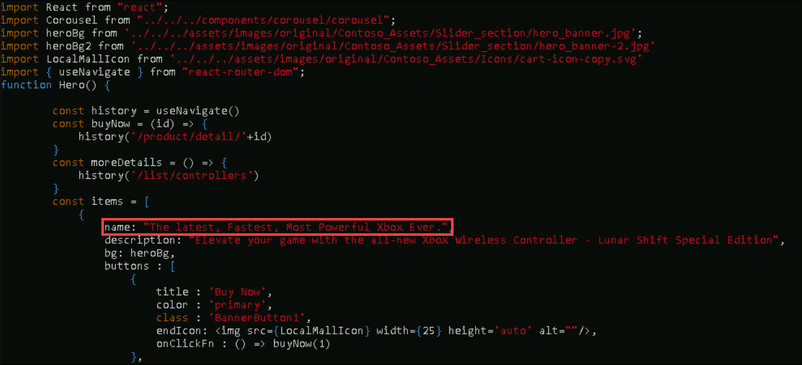

1. Then press **_ESC_**, write **_:wq_** to save your changes and close the file.
    
    >**Note**: If **_ESC_** doesn't work, press `ctrl+[` and then write **_:wq_** to save your changes and close the file.
    

1. Run the below command to change the directory to the ContosoTraders.Ui.Website folder.

     ```bash
     cd
     cd Cloud-Native-Application/labfiles/src/ContosoTraders.Ui.Website
     ```
   
1. Once you are in the correct directory, run the below command to create the new docker image that will have all the latest changes of the web application.
  
   >**Note**: Observe that this time we are using "V1" tag for the image.
  
      ```bash
      docker build . -t contosotradersacr<inject key="DeploymentID" enableCopy="false" />.azurecr.io/contosotradersuiweb:V1 -t contosotradersacr<inject key="DeploymentID" enableCopy="false" />.azurecr.io/contosotradersuiweb:V1

      docker push contosotradersacr<inject key="DeploymentID" enableCopy="false" />.azurecr.io/contosotradersuiweb:V1
      ```

   > **Note:** Please be aware that the above command may take up to 5 minutes to finish the build. Before taking any further action, make sure it runs successfully. Also, you may notice a few warnings related to the npm version update which is expected and doesn't affect the lab's functionality.

   >**Note:** If it throws any error, run the below command:

   ```
   az acr login -n contosotradersacr<inject key="DeploymentID" enableCopy="false" />
   ```

1. Once the docker build and push are completed, Navigate back to the other Command prompt that is not connected to the Linux VM.

1. Open a new Command Prompt and log in using the following command:

   ``` 
   az login
   ```
1. On the **Let's get you signed in** tab, choose the account that you're already signed in with.

   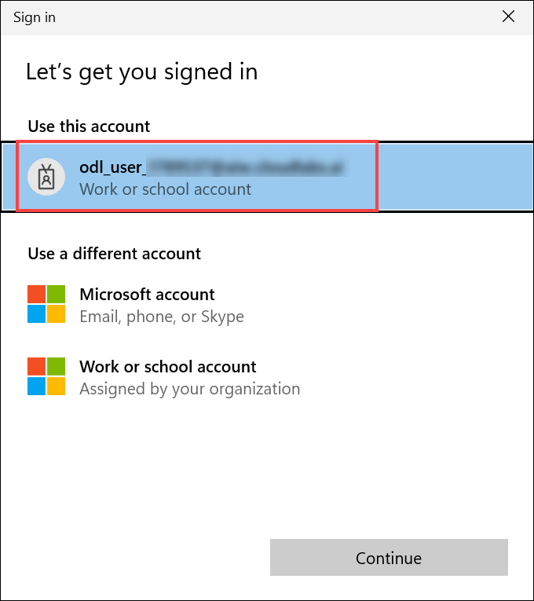

   >**Note**: During sign-in, you may be prompted with a screen asking: "Automatically sign in to all desktop apps and websites on this device", Click **No, this app only**. 

    > **Note:** After running `az login`, if you're prompted to select a **subscription** or **tenant**, simply press **Enter** to continue with the **default subscription** and tenant associated with your account.
  
1. Run the below **_kubectl_** command to retrieve the current deployment in your AKS cluster, as we will be updating the web API to use the latest image. Ensure to copy the name of the **contoso-traders-web###** **(1)** to the notepad. 

    ```bash
    kubectl get deployments -n contoso-traders
    kubectl get pods -n contoso-traders
    ```
    
   

   

1. Now run the below command to view the current image version of the app. Make sure to update the **PODNAME** value with the value you copied in the last step.

     ```bash
     kubectl describe pods [PODNAME] -n contoso-traders
     ```
   
   

1. Now to set the new image on the pods, run the below command.

     ```bash
     kubectl set image deployments/contoso-traders-web -n contoso-traders contoso-traders-web=contosotradersacr<inject key="DeploymentID" />.azurecr.io/contosotradersuiweb:V1
     ```
     
    

1. Run the below kubectl command to get the current updated pods in your AKS. Copy the name of the **contoso-traders-web###** **(1)** to the notepad. 

    ```bash
    kubectl get pods -n contoso-traders
    ```
    
    

1. Now run the below command to describe the latest pods and see which image is mapped with the pod. Make sure to update the **PODNAME** value with the value you copied in the last step.

     ```bash
     kubectl describe pods [PODNAME] -n contoso-traders
     ```

     

    
1. Once the image update to the pod is done, navigate back to the Azure portal and browse/refresh the web application page again and you should be able to see the changes on the home page.

   


> **Congratulations** on completing the task! Now, it's time to validate it. Here are the steps:
> - If you receive a success message, you can proceed to the next task.
> - If not, carefully read the error message and retry the step, following the instructions in the lab guide. 
> - If you need any assistance, please contact us at cloudlabs-support@spektrasystems.com. We are available 24/7 to help you out.

<validation step="2215992c-23d6-4981-9192-cf953a1f8243" />

### Task 2: Configure Kubernetes Ingress

This task will set up a Kubernetes Ingress using an [Nginx proxy server](https://nginx.org/en/) to take advantage of path-based routing and TLS termination.

1. Run the following command from a Windows command terminal to add the Nginx stable Helm repository:

   ```bash
   helm repo add ingress-nginx https://kubernetes.github.io/ingress-nginx
   ```
   

1. Update your helm package list.

   ```bash
   helm repo update
   ```
   

   > **Note**: If you get a "no repositories found." error, then run the following command. This will be added back to the official Helm "stable" repository.
   >
   > ```bash
   > helm repo add stable https://charts.helm.sh/stable 
   > ```

1. Install the Ingress Controller resource to handle ingress requests as they come in. The Ingress Controller will receive a public IP of its own on the Azure Load Balancer and handle requests for multiple services over ports 80 and 443.

   ```bash
   helm install nginx-ingress ingress-nginx/ingress-nginx --namespace contoso-traders --set controller.replicaCount=1 --set controller.nodeSelector."beta\.kubernetes\.io/os"=linux --set defaultBackend.nodeSelector."beta\.kubernetes\.io/os"=linux --set controller.admissionWebhooks.patch.nodeSelector."beta\.kubernetes\.io/os"=linux --set controller.service.externalTrafficPolicy=Local
   ```

1. Navigate to Azure Portal, open **contoso-traders-aks<inject key="DeploymentID" enableCopy="false"/>** Kubernetes service. Select **Services and ingresses** under Kubernetes resources.

1. On the **Overview** **(1)** pane, copy the IP Address for the **External IP** **(2)** for the `nginx-ingress-ingress-nginx-controller` service.

    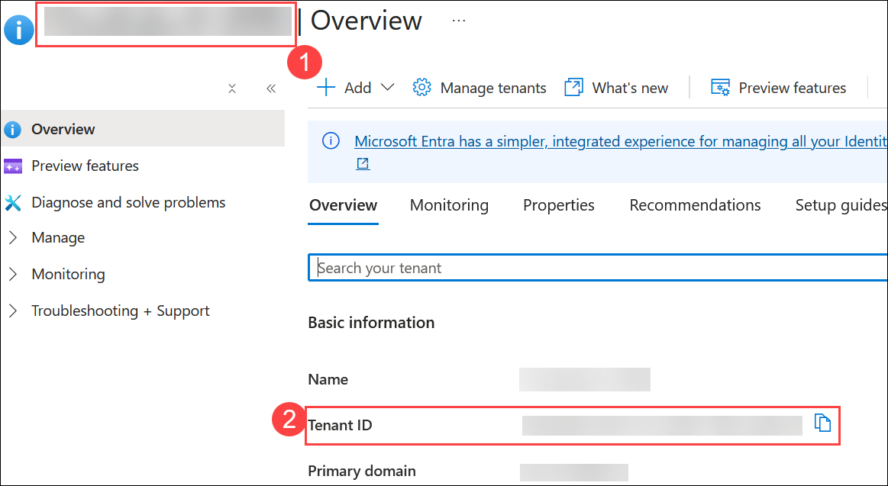

   > **Note**: It could take a few minutes to refresh, alternately, you can find the IP using the following command in Azure Cloud Shell.
   >
   > ```bash
   > kubectl get svc --namespace contoso-traders
   > ```
   >
   

1. In **Azure Portal**, search and open the **Microsoft Entra ID**, and copy **Tenant ID**.

   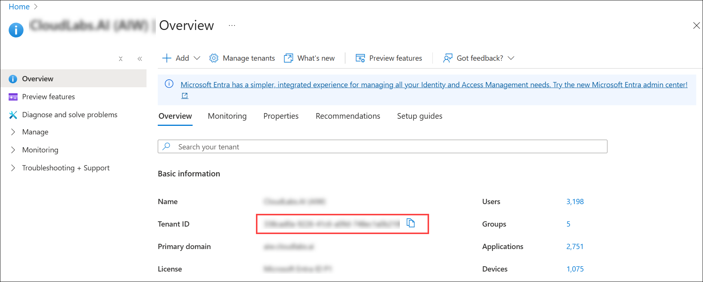

1. Within the Windows command terminal, create a script to update the public DNS name for the external ingress IP.

   ```bash
   code update-ip.ps1
   ```

   Paste the following as the contents. Make sure to replace the following placeholders in the script:

   - `[ipaddress]`: Replace this with the IP Address copied from step 4.
   - `[KUBERNETES_NODE_RG]`: Replace the `SUFFIX` with this value **<inject key="DeploymentID" />**.
   - `[DNSNAME]`: Replace this with the same SUFFIX value **<inject key="DeploymentID" />** that you have used previously for this lab.
   - `[PUBLICIP]`: Replace the `SUFFIX` with this value **<inject key="DeploymentID" />**.
   - `$env:tenantId`: Enter the tenant ID which you copied in previous step. 

     ```bash
     # Create a SecureString from the client's secret
     $securePassword = ConvertTo-SecureString $env:AppSecret -AsPlainText -Force
      
     # Create a PSCredential object using the client ID and secure password
     $credential = New-Object System.Management.Automation.PSCredential($env:AppID, $securePassword)
      
     # Authenticate using the PSCredential object
     Connect-AzAccount -ServicePrincipal -Credential $credential -TenantId $env:tenantId

     $ipaddress="INGRESS PUBLIC IP"

     $KUBERNETES_NODE_RG="contoso-traders-aks-nodes-rg-SUFFIX"

     $DNSNAME="contosotraders-SUFFIX-ingress"

     $PUBLICIP=Get-AzPublicIPAddress -ResourceGroupName contoso-traders-aks-nodes-rg-SUFFIX

     $results = @()

     ForEach ($i in $PUBLICIP)
     {
     If($i.IpAddress -eq $ipaddress){
     $PIPNAME=$i.name
     $i.DnsSettings = @{"DomainNameLabel" = $DNSNAME} 
     Set-AzPublicIpAddress -PublicIpAddress $i
     }
     }
     ```
     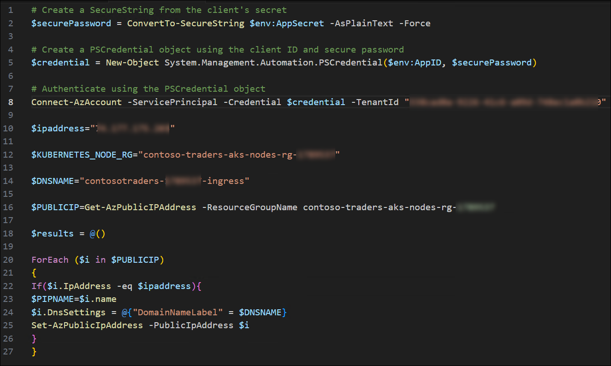

6. Save the changes by **CTRL + S** button to **Save**. and close the editor.

7. Run the update script.

   ```bash
   powershell ./update-ip.ps1
   ```
   
   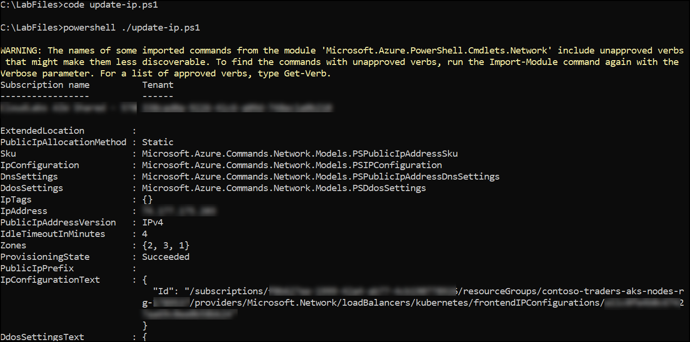

   >**Note:** If you encounter any errors, ignore them and proceed to the next step.

8. Verify the IP update by visiting the URL in your browser.

   > **Note**: It is normal to receive a 404 message at this time.

   ```text
   http://contosotraders-<inject key="DeploymentID" />-ingress.<inject key="Region" />.cloudapp.azure.com/
   ```
    

   >**Note**: If the URL doesn't work or you don't receive a 404 error. Please run the below-mentioned command and try accessing the URL again.

   ```bash
   helm upgrade nginx-ingress ingress-nginx/ingress-nginx --namespace contoso-traders --set controller.service.externalTrafficPolicy=Local
   ```

9. Use helm to install `cert-manager`, a tool that can provision SSL certificates automatically from letsencrypt.org.

   ```bash
   kubectl apply --validate=false -f https://github.com/cert-manager/cert-manager/releases/download/v1.9.1/cert-manager.yaml
   ```
   
   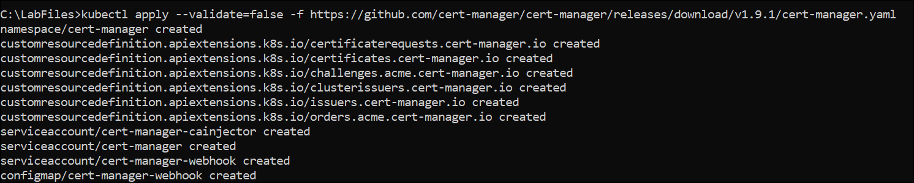

10. To create a custom `ClusterIssuer` resource for the `cert-manager` service to use when handling requests for SSL certificates, run the below command in the Windows command prompt.

    ```bash 
    code clusterissuer.yml
    ```
11. Inside the **clusterissuer.yml** file copy and paste the following content:

    ```yaml
    apiVersion: cert-manager.io/v1
    kind: ClusterIssuer
    metadata:
      name: letsencrypt-prod
      namespace: contoso-traders
    spec:
      acme:
        # The ACME server URL
        server: https://acme-v02.api.letsencrypt.org/directory
        # Email address used for ACME registration
        email: user@contosotraders.com
        # Name of a secret used to store the ACME account private key
        privateKeySecretRef:
          name: letsencrypt-prod
        # Enable HTTP01 validations
        solvers:
        - http01:
            ingress:
              class: nginx
    ```

12. Save the changes by **CTRL + S** button to **Save** and close the editor.

13. Create the issuer using `kubectl`.

    ```bash
    kubectl create --save-config=true -f clusterissuer.yml
    ```
    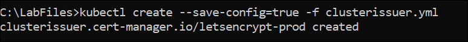

14. Now you can create a certificate object.

    > **Note**:
    > Cert-manager might have already created a certificate object for you using ingress-shim.
    >
    > To verify that the certificate was created successfully, use the `kubectl describe certificate tls-secret` command.
    >
    > If a certificate is already available, skip to step 16.

    ```bash
    code certificate.yml
    ```

15. Inside the **certificate.yml** file copy and paste the following content:

     ```yaml
     apiVersion: cert-manager.io/v1
     kind: Certificate
     metadata:
       name: tls-secret
       namespace: contoso-traders
     spec:
       secretName: tls-secret
       dnsNames:
         - contosotraders-[SUFFIX]-ingress.[AZURE-REGION].cloudapp.azure.com
       issuerRef:
         name: letsencrypt-prod
         kind: ClusterIssuer
     ```
16. Use the following as the contents and update the `[SUFFIX]` with **<inject key="DeploymentID" />** and `[AZURE-REGION]` with **<inject key="Region" />** to match your ingress DNS name.

14. Save changes and close the editor.

15. Create the certificate using `kubectl`.

    ```bash
    kubectl create --save-config=true -f certificate.yml
    ```
      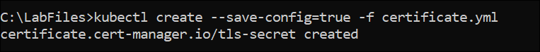

      > **Note**: To check the status of the certificate issuance, use the `kubectl describe certificate tls-secret -n contoso-traders` command and look for an _Events_ output similar to the following:
      >
      > ```text
      > Type    Reason         Age   From          Message
      > ----    ------         ----  ----          -------
      > Normal  Generated           38s   cert-manager  Generated new private key
      > Normal  GenerateSelfSigned  38s   cert-manager  Generated temporary self signed certificate
      > Normal  OrderCreated        38s   cert-manager  Created Order resource "tls-secret-3254248695"
      > Normal  OrderComplete       12s   cert-manager  Order "tls-secret-3254248695" completed successfully
      > Normal  CertIssued          12s   cert-manager  Certificate issued successfully
      > ```

      It can take between 5 and 30 minutes before the tls-secret becomes available. This is due to the delay involved with provisioning a TLS cert from Let Encrypt.

16. Now you can create an ingress resource for the content applications.

    ```bash
    code content.ingress.yml
    ```

17. Inside the **content.ingress.yml** file copy and paste the following content:

    ```yaml
    apiVersion: networking.k8s.io/v1
    kind: Ingress
    metadata:
      name: contoso-ingress
      namespace: contoso-traders
      annotations:
        nginx.ingress.kubernetes.io/rewrite-target: /
        nginx.ingress.kubernetes.io/ssl-redirect: "false"
        cert-manager.io/cluster-issuer: letsencrypt-prod
    spec:
      ingressClassName: nginx  # Fixed ingress class definition
      tls:
      - hosts:
          - contosotraders-SUFFIX-ingress.[AZURE-REGION].cloudapp.azure.com
        secretName: tls-secret
      rules:
      - host: contosotraders-SUFFIX-ingress.[AZURE-REGION].cloudapp.azure.com
        http:
          paths:
          - path: /
            pathType: Prefix
            backend:
              service:
                name: contoso-traders-web
                port:
                  number: 80
          - path: /products  # Fixed path without regex
            pathType: Prefix
            backend:
              service:
                name: contoso-traders-products
                port:
                  number: 3001
    ```

18. Use the following as the contents and update the `[SUFFIX]`: **<inject key="DeploymentID" />** and `[AZURE-REGION]`: **<inject key="Region" />** to match your ingress DNS name.

    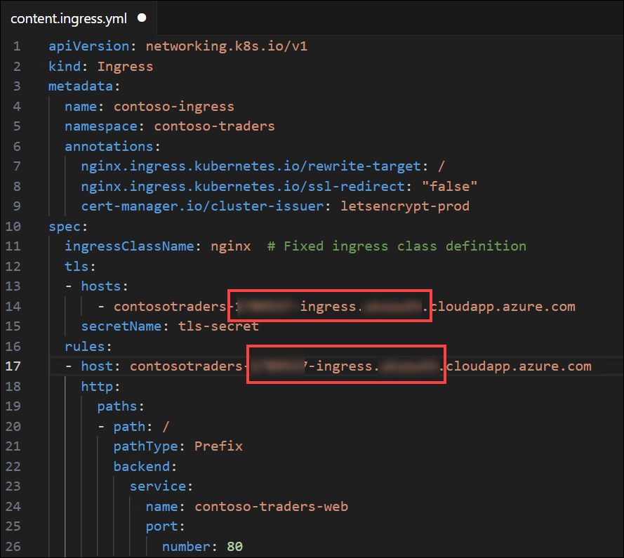

19. Save changes and close the editor.

20. Create the ingress using `kubectl`.

    ```bash
    kubectl create --save-config=true -f content.ingress.yml
    ```
    
    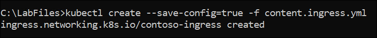

21. Refresh the ingress endpoint in your browser. You should be able to visit the website and see all the content.

    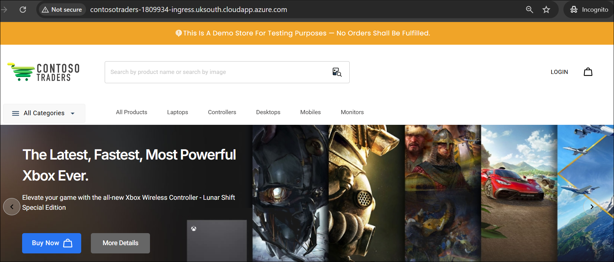
   
22. Test TLS termination by visiting services again using `https://`.

    > **Note**: It can take between 5 and 30 minutes before the SSL site becomes available. This is due to the delay involved with provisioning a TLS cert from Let Encrypt.

23. Click the **Next** button located in the bottom right corner of this lab guide to continue with the next exercise.

## Summary

In this exercise, you have performed a rolling update and configured Kubernetes Ingress.

### You have successfully completed the lab. Click on **Next >>** to proceed with next exercise.
