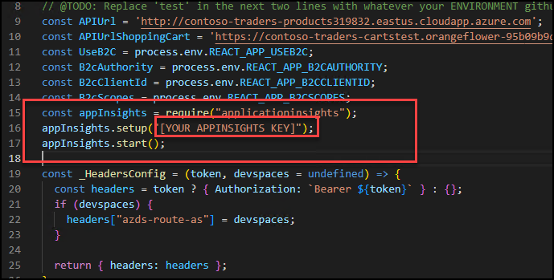
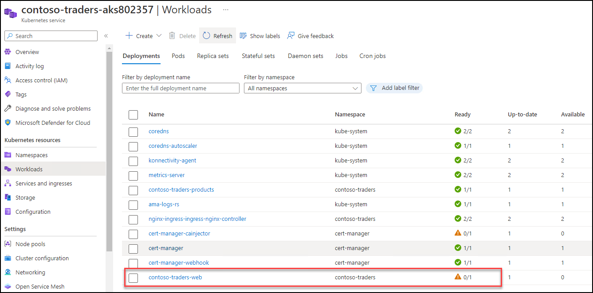
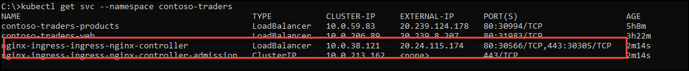
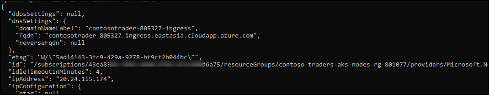

## Exercise 5: Updating Apps & Managing Load Balancing

**Duration**: 40 minutes

## Overview

In the previous exercise, we introduced a restriction to the scale properties of the service. In this exercise, you will configure the api deployments to create pods that use dynamic port mappings to eliminate the port resource constraint during scale activities.

Kubernetes services can discover the ports assigned to each pod, allowing you to run multiple instances of the pod on the same agent node --- something that is not possible when you configure a specific static port (such as 3001 for the API service).

### Task 1: Perform a rolling update
 
In this task, you will edit the web application source code to add Application Insights and update the Docker image used by the deployment. Then you will perform a rolling update to demonstrate how to deploy a code change.

>**Note**: Please perform this task using a new windows command prompt which should be not connected to build agent VM but should be logged into azure.

1. Execute this command in windows command prompt to retrieve the instrumentation key for the `content-web` Application Insights resource. Replace the `SUFFIX` placeholder with **<inject key="DeploymentID" />**.

   ```bash
   az resource show -g contosotraders-[SUFFIX] -n content-web --resource-type "Microsoft.Insights/components" --query properties.InstrumentationKey -o tsv
   ```

   Copy this value. You will use it later.

   >**Note**: If you have a blank result check that the command you issued refers to the right resource.

2. From an windows command terminal, update your development files by pulling the latest changes from the azure and then updating deployment YAML files.

    ```bash
    cd C:\lab-files\Cloud-Native-Application\labfiles\src\ContosoTraders.Ui.Website\src\
    kubectl get deployment contoso-traders-products -n contoso-traders -o=yaml > contoso-traders-products.deployment.yaml
    kubectl get deployment contoso-traders-web -n contoso-traders -o=yaml > contoso-traders-web.deployment.yaml
    
    ```

    > **Note**: The calls to `kubectl` are necessary to fetch recent changes to the port and CPU resource configurations made in previous steps for the `web` and `api` deployments.

3. Install support for Application Insights.

    ```bash
    npm install applicationinsights --force --save
    ```

    > **Note**: Make sure to include the `--save` argument. Without this, a reference to the `applicationinsights` npm package will not get added to the `package.json` file of the `content-web` nodejs project, resulting in a deployment failure in later steps. Also, this can take up to 5 minutes to complete the installation.

4. Edit the `app.js` file using the command ```code configservice.js``` Visual Studio Code remote and and add the following lines immediately after `B2cScopes` is instantiated on line 14. Replace `YOUR APPINSIGHTS KEY` placeholder with the app insights key which you had copied earlier in the task.

    ```javascript
    const appInsights = require("applicationinsights");
    appInsights.setup("[YOUR APPINSIGHTS KEY]");
    appInsights.start();
    ```

    

5. Save changes and close the editor.

6. Delete the existing deployment so that you can build and deploy a new Container image.

    ```bash   
    kubectl delete deployment contoso-traders-web -n contoso-traders
    ```
7. Now run the below commands to create and pusht the new image to ACR and AKS. 

    ```bash
    docker build . -t contosotradersacrSUFFIX.azurecr.io/contosotradersuiweb:latest -t contosotradersacrSUFFIX.azurecr.io/contosotradersuiweb:latest
    ```

    ```bash 
    docker push contosotradersacr[SUFFIX].azurecr.io/contosotradersuiweb:latest
    ```
    
8. Once the build and push is completed, run the below command to create the workload in AKS.

     ```bash
     cd C:/lab-files
     kubectl create --save-config=true -f web.deployment.yml -f web.service.yml
     ```

9. From the navigation menu, select **Replica Sets** (2) under **Workloads** (1). From this view, you will see a new replica set for the **contoso-traders-web** (3), which may still be in the process of deploying (as shown below) or already fully deployed.

    

10. While the deployment is in progress, you can navigate to the web application and observe that the service is running normally, and tasks continue to be load balanced.

    

### Task 2: Configure Kubernetes Ingress

This task will set up a Kubernetes Ingress using an [Nginx proxy server](https://nginx.org/en/) to take advantage of path-based routing and TLS termination.

1. Run the following command from an windows command terminal to add the Nginx stable Helm repository:

    ```bash
    helm repo add ingress-nginx https://kubernetes.github.io/ingress-nginx
    ```

2. Update your helm package list.

   ```bash
   helm repo update
   ```

   > **Note**: If you get a "no repositories found." error, then run the following command. This will add back the official Helm "stable" repository.
   >
   > ```bash
   > helm repo add stable https://charts.helm.sh/stable 
   > ```

3. Install the Ingress Controller resource to handle ingress requests as they come in. The Ingress Controller will receive a public IP of its own on the Azure Load Balancer and handle requests for multiple services over ports 80 and 443.

   ```bash
   helm install nginx-ingress ingress-nginx/ingress-nginx --namespace contoso-traders --set controller.replicaCount=2 --set controller.nodeSelector."beta\.kubernetes\.io/os"=linux --set defaultBackend.nodeSelector."beta\.kubernetes\.io/os"=linux --set controller.admissionWebhooks.patch.nodeSelector."beta\.kubernetes\.io/os"=linux
   ```

4. In the Azure Portal under **Services and ingresses**, copy the IP Address for the **External IP** for the `nginx-ingress-RANDOM-nginx-ingress` service.

    > **Note**: It could take a few minutes to refresh, alternately, you can find the IP using the following command in Azure Cloud Shell.
    >
    > ```bash
    > kubectl get svc --namespace contoso-traders
    > ```
    >
   

5. Within the Azure Cloud Shell, create a script to update the public DNS name for the external ingress IP.

   ```bash
   code update-ip.sh
   ```
   
   Paste the following as the contents. Be sure to replace the following placeholders in the script:

   - `[INGRESS PUBLIC IP]`: Replace this with the IP Address copied from step 5.
   - `[ KUBERNETES_NODE_RG]`: Replace the `SUFFIX` with this value **<inject key="DeploymentID" />** and `REGION` with the region of your resource group: **<inject key="Region" />**.
   - `[SUFFIX]`: Replace this with the same SUFFIX value **<inject key="DeploymentID" />** that you have used previously for this lab.

   ```bash
   #!/bin/bash

   # Public IP address
   IP="[INGRESS PUBLIC IP]"

   # Resource Group that contains AKS Node Pool
   KUBERNETES_NODE_RG="contoso-traders-aks-nodes-rg-SUFFIX"

   # Name to associate with public IP address
   DNSNAME="contosotrader-[SUFFIX]-ingress"

   # Get the resource-id of the public ip
   PUBLICIPID=$(az network public-ip list --resource-group $KUBERNETES_NODE_RG --query "[?ipAddress!=null]|[?contains(ipAddress, '$IP')].[id]" --output tsv)

   # Update public ip address with dns name
   az network public-ip update --ids $PUBLICIPID --dns-name $DNSNAME
   ```
6. Save changes and close the editor.

7. Run the update script.

   ```bash
   bash ./update-ip.sh
   ```
   
    


8. Verify the IP update by visiting the URL in your browser. Make sure to update these values `[SUFFIX]`: **<inject key="DeploymentID" />** and `[AZURE-REGION]`: **<inject key="Region" />** in the URL before browsing it.

    > **Note**: It is normal to receive a 404 message at this time.

    ```text
    http://contosotraders-[SUFFIX]-ingress.[AZURE-REGION].cloudapp.azure.com/
    ```
   
   >**Note**: If the URL doesn't work or you don't receive 404 error. Please run the below mentioned command and try accessing the URL again.

   ```bash
   helm upgrade nginx-ingress ingress-nginx/ingress-nginx \
    --namespace ingress-demo \
    --set controller.service.externalTrafficPolicy=Local
   ```

9. Use helm to install `cert-manager`, a tool that can provision SSL certificates automatically from letsencrypt.org.

    ```bash
    kubectl create namespace cert-manager
    kubectl label namespace cert-manager cert-manager.io/disable-validation=true
    kubectl apply --validate=false -f https://github.com/cert-manager/cert-manager/releases/download/v1.9.1/cert-manager.yaml
    ```

10. To create a custom `ClusterIssuer` resource for the `cert-manager` service to use when handling requests for SSL certificates run the below command in windows prompt.

    ```bash
    cd C:\lab-files
    code clusterissuer.yml
    ```

    ```yaml
    apiVersion: cert-manager.io/v1
    kind: ClusterIssuer
    metadata:
      name: letsencrypt-prod
    spec:
      acme:
        # The ACME server URL
        server: https://acme-v02.api.letsencrypt.org/directory
        # Email address used for ACME registration
        email: user@contosotraders.com
        # Name of a secret used to store the ACME account private key
        privateKeySecretRef:
          name: letsencrypt-prod
        # Enable HTTP01 validations
        solvers:
        - http01:
            ingress:
              class: nginx
    ```

11. Save changes and close the editor.

12. Create the issuer using `kubectl`.

    ```bash
    kubectl create --save-config=true -f clusterissuer.yml
    ```

13. Now you can create a certificate object.

    > **Note**:
    >
    > Cert-manager might have already created a certificate object for you using ingress-shim.
    >
    > To verify that the certificate was created successfully, use the `kubectl describe certificate tls-secret` command.
    >
    > If a certificate is already available, skip to step 16.

    ```bash
    code certificate.yml
    ```

    Use the following as the contents and update the `[SUFFIX]`: **<inject key="DeploymentID" />** and `[AZURE-REGION]`: **<inject key="Region" />** to match your ingress DNS name.

    ```yaml
    apiVersion: cert-manager.io/v1
    kind: Certificate
    metadata:
      name: tls-secret
    spec:
      secretName: tls-secret
      dnsNames:
        - fabmedical-[SUFFIX]-ingress.[AZURE-REGION].cloudapp.azure.com
      issuerRef:
        name: letsencrypt-prod
        kind: ClusterIssuer
    ```

14. Save changes and close the editor.

15. Create the certificate using `kubectl`.

    ```bash
    kubectl create --save-config=true -f certificate.yml
    ```

    > **Note**: To check the status of the certificate issuance, use the `kubectl describe certificate tls-secret` command and look for an _Events_ output similar to the following:
    >
    > ```text
    > Type    Reason         Age   From          Message
    > ----    ------         ----  ----          -------
    > Normal  Generated           38s   cert-manager  Generated new private key
    > Normal  GenerateSelfSigned  38s   cert-manager  Generated temporary self signed certificate
    > Normal  OrderCreated        38s   cert-manager  Created Order resource "tls-secret-3254248695"
    > Normal  OrderComplete       12s   cert-manager  Order "tls-secret-3254248695" completed successfully
    > Normal  CertIssued          12s   cert-manager  Certificate issued successfully
    > ```

    It can take between 5 and 30 minutes before the tls-secret becomes available. This is due to the delay involved with provisioning a TLS cert from letsencrypt.

16. Now you can create an ingress resource for the content applications.

    ```bash
    code content.ingress.yml
    ```

    Use the following as the contents and update the `[SUFFIX]`: **<inject key="DeploymentID" />** and `[AZURE-REGION]`: **<inject key="Region" />** to match your ingress DNS name:

    ```yaml
    apiVersion: networking.k8s.io/v1
    kind: Ingress
    metadata:
      name: contoso-ingress
      namespace: contoso-traders
      annotations:
        kubernetes.io/ingress.class: nginx
        nginx.ingress.kubernetes.io/rewrite-target: /$1
        nginx.ingress.kubernetes.io/use-regex: "true"
        nginx.ingress.kubernetes.io/ssl-redirect: "false"
        cert-manager.io/cluster-issuer: letsencrypt-prod
    spec:
      tls:
      - hosts:
          - contosotrader-[SUFFIX]-ingress.[AZURE-REGION].cloudapp.azure.com
        secretName: tls-secret
      rules:
      - host: contosotrader-[SUFFIX]-ingress.[AZURE-REGION].cloudapp.azure.com
        http:
          paths:
          - path: /(.*)
            pathType: Prefix
            backend:
              service:
                name: web
                port:
                  number: 80
          - path: /content-api/(.*)
            pathType: Prefix
            backend:
              service:
                 name: api
                 port:
                   number: 3001
    ```

17. Save changes and close the editor.

18. Create the ingress using `kubectl`.

    ```bash
    kubectl create --save-config=true -f content.ingress.yml
    ```

19. Refresh the ingress endpoint in your browser. You should be able to visit the website and see all the content.

21. Test TLS termination by visiting services again using `https`.

    > **Note**: It can take between 5 and 30 minutes before the SSL site becomes available. This is due to the delay involved with provisioning a TLS cert from letsencrypt.

22. Click on the Next button present in the bottom-right corner of this lab guide to continue with the next exercise.

## Summary

In this exercise, you have performed a rolling update and configured Kubernetes Ingress.
