# Ejercicio 5: Actualización de Aplicaciones y Gestión de Kubernetes Ingress

### Duración estimada: 70 minutos

## Descripción general

En el ejercicio anterior, introdujimos una restricción a las propiedades de escalado del servicio. En este ejercicio, configurará las implementaciones de API para crear pods que utilicen asignaciones de puertos dinámicas para eliminar la restricción de recursos del puerto durante las actividades de escalado.

Los servicios de Kubernetes pueden descubrir los puertos asignados a cada pod, lo que le permite ejecutar varias instancias del pod en el mismo nodo del agente --- algo que no es posible cuando configura un puerto estático específico (como 3001 para el servicio API).

## Objetivos del laboratorio

Podrá completar las siguientes tareas:

- Tarea 1: Realizar una actualización continua
- Tarea 2: Configurar Kubernetes Ingress

## Tarea 1: Realizar una actualización continua
 
En esta tarea, editará el código fuente de la aplicación web para actualizar algunas configuraciones y actualizar la imagen de Docker utilizada por la implementación. Luego, realizará una actualización continua para demostrar cómo desplegar un cambio de código. Las actualizaciones continuas permiten que las actualizaciones de despliegue se realicen sin tiempo de inactividad mediante la actualización incremental de las instancias de Pods con otras nuevas. Los nuevos Pods se programarán en Nodos con recursos disponibles.

>**Nota**: Por favor realice esta tarea utilizando un nuevo Símbolo del sistema de Windows que no debe estar conectado a la MV del Agente de Compilación, sino que debe estar conectado a Azure.

1. Primero, realizará algunos cambios en el código fuente de su aplicación web y creará una nueva imagen de Docker basada en los últimos cambios.

1. Abre una nueva ventana del símbolo del sistema.

1. Ejecuta el comando proporcionado **<inject key="Command to Connect to Build Agent VM" enableCopy="true" />** Para conectarte a la VM de Linux usando ssh.

    >**Nota**: En el símbolo del sistema, escribe **yes** y presiona **Enter** cuando aparezca el mensaje `¿Está seguro de que desea continuar conectándose (yes/no/[fingerprint])?`

1. Una vez que la conexión SSH se establezca con la VM, por favor ingresa la contraseña de la VM proporcionada a continuación:

   * Password: **<inject key="Build Agent VM Password" enableCopy="true" />**

     

      >**Nota**: Ten en cuenta que mientras escribes la contraseña no podrás verla debido a preocupaciones de seguridad.

1. Vuelva al Símbolo del sistema de Windows donde se conectó a su MV de Linux y ejecute el siguiente comando para navegar hasta el directorio donde deberá realizar los cambios en el código fuente de la aplicación web.

     ```bash
     cd ~/Cloud-Native-Application/labfiles/src/ContosoTraders.Ui.Website/src/pages/home/sections/
     ```
1. Una vez que esté en el directorio correcto, ejecute el siguiente comando para abrir el archivo **hero.js** y realizar algunos cambios de texto en la página de inicio de su aplicación web.

     ```bash
     sudo chmod 777 hero.js
     vim hero.js
     ```
     
   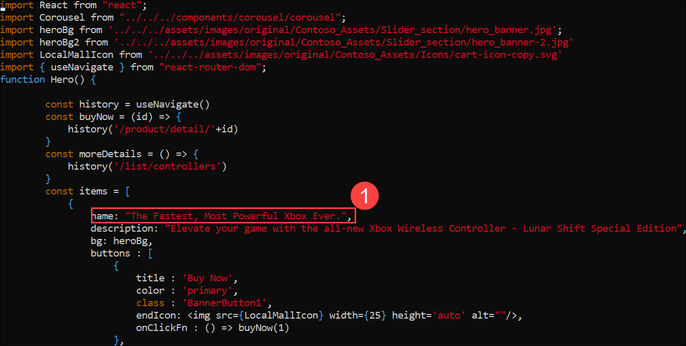
   
1. Una vez que el archivo esté abierto, presione "i" para ingresar al modo de inserción y actualizar el valor existente mencionado a continuación en la sección **items (1)** y en el valor de **name (2)**.

     ```
     The Latest, Fastest, Most Powerful Xbox Ever.
     ```
 
   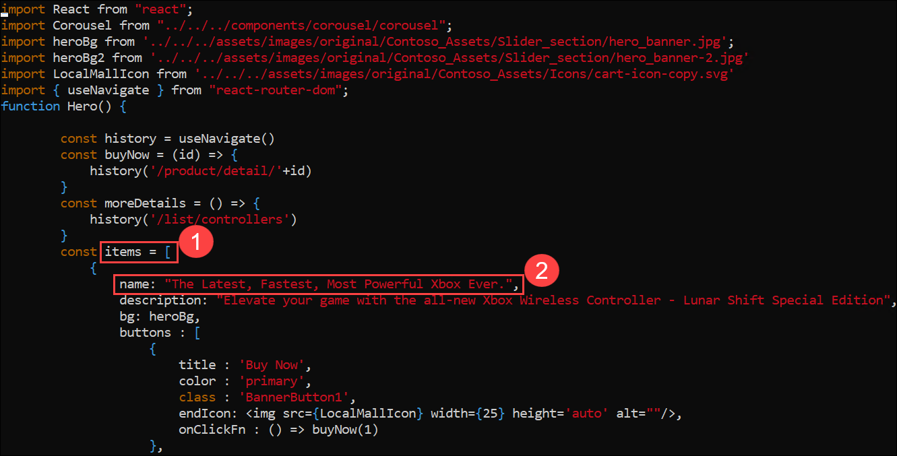

1. Luego presione **_ESC_**, escriba **_:wq_** para guardar los cambios y cerrar el archivo.
    
    >**Nota**: Si **_ESC_** no funciona, presione `ctrl+[` y luego escriba **_:wq_** para guardar los cambios y cerrar el archivo.
    

1. Ejecute el siguiente comando para cambiar el directorio a la carpeta ContosoTraders.Ui.Website.

     ```bash
     cd
     cd Cloud-Native-Application/labfiles/src/ContosoTraders.Ui.Website
     ```
   
1. Una vez que esté en el directorio correcto, ejecute el siguiente comando para crear la nueva imagen de la ventana acoplable que tendrá los últimos cambios de la aplicación web.
  
   >**Nota**: Observe que esta vez estamos usando la etiqueta "V1" para la imagen.
  
      ```bash
      docker build . -t contosotradersacr<inject key="DeploymentID" enableCopy="true"/>.azurecr.io/contosotradersuiweb:V1 -t contosotradersacr<inject key="DeploymentID" enableCopy="true"/>.azurecr.io/contosotradersuiweb:V1

      docker push contosotradersacr<inject key="DeploymentID" enableCopy="true"/>.azurecr.io/contosotradersuiweb:V1
      ```

   > **Nota:** Por favor tenga en cuenta que el comando anterior puede tardar hasta 5 minutos en finalizar la compilación. Antes de realizar cualquier otra acción, asegúrese de que se ejecute correctamente. Además, es posible que observe algunas advertencias relacionadas con la actualización de la versión de npm, lo cual es esperado, y no afecta la funcionalidad del laboratorio.

   >**Nota:** Si arroja un error, ejecute el siguiente comando:

   ```
   az acr login -n contosotradersacr<inject key="DeploymentID" enableCopy="false" />
   ```

1. Una vez que se completen los comandos docker build y push, regrese al otro símbolo del sistema que no está conectado a la MV de Linux.

1. Abra un nuevo símbolo del sistema y inicie sesión usando el siguiente comando:

   ``` 
   az login
   ```
1. En la pestaña Iniciar sesión en Microsoft, verá la pantalla de inicio de sesión. Ingrese el correo electrónico/nombre de usuario y luego haga clic en Siguiente.

   

   >**Nota**: Para obtener sus credenciales de inicio de sesión, navegue a la pestaña Entorno. En la sección Campos de autenticación, encontrará el nombre de usuario y la contraseña necesarios para acceder al entorno del laboratorio. Utilice el ícono de copiar junto a cada campo para copiar los valores al instante.

1. Ahora ingrese la contraseña y haga clic en Iniciar sesión.

   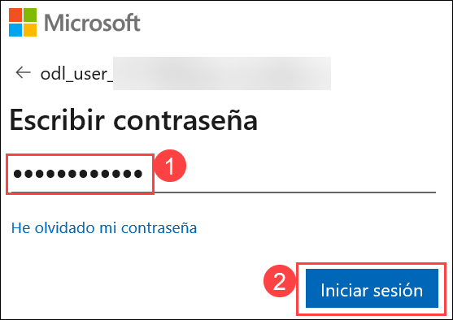

   >**Nota**: Durante el inicio de sesión, es posible que se le muestre una pantalla que pregunta: "¿Iniciar sesión automáticamente en todas las aplicaciones de escritorio y sitios web en este dispositivo?" Haga clic en No, solo esta aplicación.

1. Ejecute el siguiente comando kubectl para obtener la implementación actual en su AKS, ya que ahora actualizaremos la API web a la imagen más reciente. Copie el nombre de **contoso-traders-web###** en el Bloc de notas.

    ```bash
    kubectl get deployments -n contoso-traders
    kubectl get pods -n contoso-traders
    ```
    
   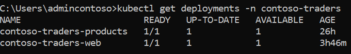

   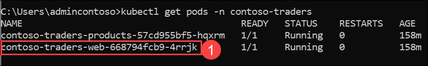

1. Ahora ejecute el siguiente comando para ver la versión de imagen actual de la aplicación. Asegúrese de actualizar el valor **PODNAME** con el valor que copió en el último paso.

     ```bash
     kubectl describe pods [PODNAME] -n contoso-traders
     ```
   
   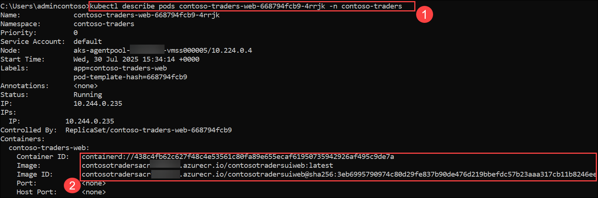

1. Ahora, para configurar la nueva imagen en los pods, ejecute el siguiente comando.

     ```bash
     kubectl set image deployments/contoso-traders-web -n contoso-traders contoso-traders-web=contosotradersacr<inject key="DeploymentID" />.azurecr.io/contosotradersuiweb:V1
     ```
     
     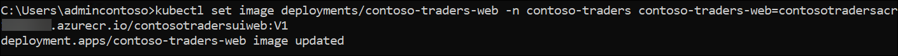

1. Ejecute el siguiente comando kubectl para obtener los pods actualizados en su AKS. Copie el nombre **contoso-traders-web###** en el bloc de notas.


      ```bash
      kubectl get pods -n contoso-traders
      ```

    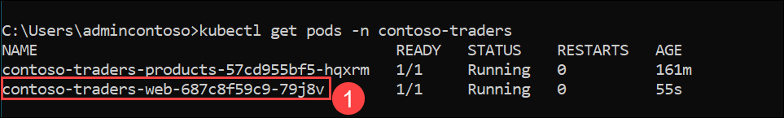

1. Ahora ejecute el siguiente comando para describir los pods más recientes y ver qué imagen está asignada a cada uno. Asegúrese de actualizar el valor **PODNAME** con el valor que copió en el paso anterior.

     ```bash
     kubectl describe pods [PODNAME] -n contoso-traders
     ```

   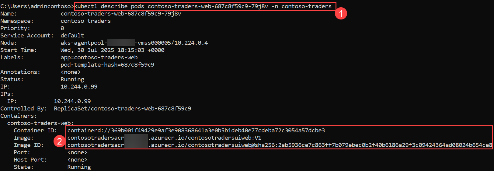

    
1. Una vez realizada la actualización de la imagen en el pod, regrese al portal de Azure y explore/actualice la página de la aplicación web nuevamente y debería poder ver los cambios en la página de inicio.

   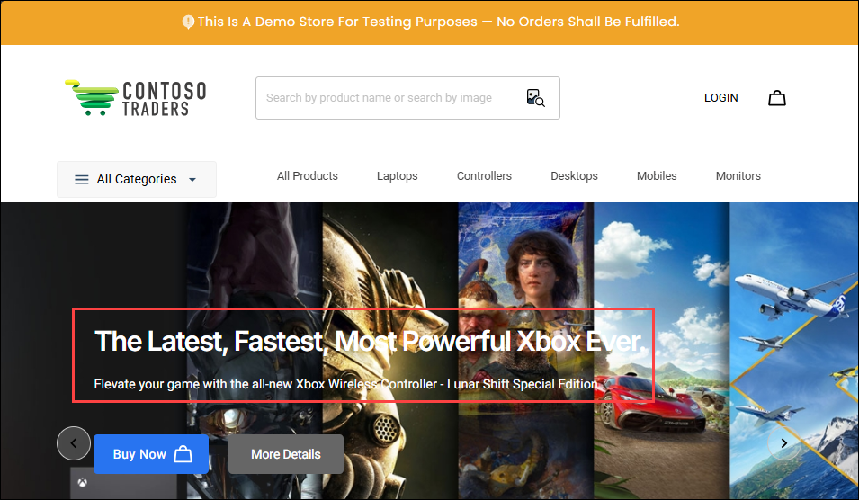

    >**Nota:** Si no recibes el resultado en un minuto, continúa con la siguiente tarea sin esperar. Puedes revisar el resultado más tarde.


> **Felicitaciones** por completar la tarea. Ahora es momento de validarla. Estos son los pasos:
> - Si recibe un mensaje de éxito, puede continuar con la siguiente tarea.
> - Si no es así, lea atentamente el mensaje de error y vuelva a intentar el paso, siguiendo las instrucciones de la guía de laboratorio.
> - Si necesita ayuda, comuníquese con nosotros a cloudlabs-support@spektrasystems.com. Estamos disponibles las 24 horas, los 7 días de la semana para ayudarlo.

<validation step="2ff92949-6873-481f-9805-f362697ba094" />

## Tarea 2: Configurar Kubernetes Ingress

Esta tarea configurará un Kubernetes Ingress utilizando un [servidor proxy Nginx](https://nginx.org/en/) para aprovechar el enrutamiento basado en rutas y la terminación TLS.

1. Ejecute el siguiente comando desde una terminal de comandos de Windows para agregar el repositorio estable Helm de Nginx:

   ```bash
   helm repo add ingress-nginx https://kubernetes.github.io/ingress-nginx
   ```
    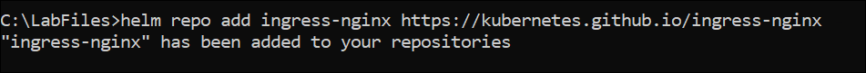

1. Actualice su lista de paquetes de helm.

   ```bash
   helm repo update
   ```
    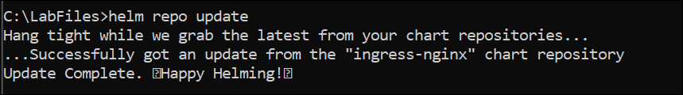
  
   > **Nota**: Si aparece el mensaje de error "no se encontraron repositorios", ejecute el siguiente comando. Esto agregará nuevamente el repositorio "estable" oficial de Helm.
   
   >
   > ```bash
   > helm repo add stable https://charts.helm.sh/stable 
   > ```

1. Instale el recurso de Controlador Ingress para manejar las solicitudes de ingreso a medida que llegan. El Controlador Ingress recibirá una dirección IP pública propia en Azure Load Balancer y manejará las solicitudes para múltiples servicios a través de los puertos 80 y 443.

   ```bash
   helm install nginx-ingress ingress-nginx/ingress-nginx --namespace contoso-traders --set controller.replicaCount=1 --set controller.nodeSelector."beta\.kubernetes\.io/os"=linux --set defaultBackend.nodeSelector."beta\.kubernetes\.io/os"=linux --set controller.admissionWebhooks.patch.nodeSelector."beta\.kubernetes\.io/os"=linux --set controller.service.externalTrafficPolicy=Local
   ```

1. Navegue al Portal de Azure, abra el servicio de Kubernetes **contoso-traders-aks<inject key="DeploymentID" enableCopy="false"/>**. Seleccione **Servicios y entradas** en los recursos de Kubernetes y copie la Dirección IP en **External IP** para el servicio `nginx-ingress-ingress-nginx-controller`.

   > **Nota**: La actualización podría tardar unos minutos; alternativamente, puede encontrar la IP usando el siguiente comando en Azure Cloud Shell.
    
   >
   > ```bash
   > kubectl get svc --namespace contoso-traders
   > ```
   >
   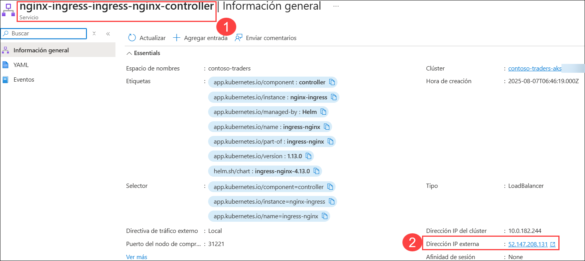

   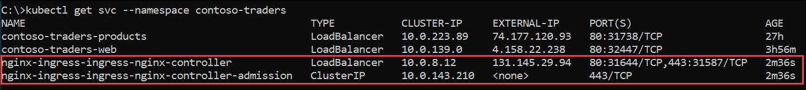

1. En **Azure Portal**, busque y abra **Microsoft Entra ID** y copie **Tenant ID**.

   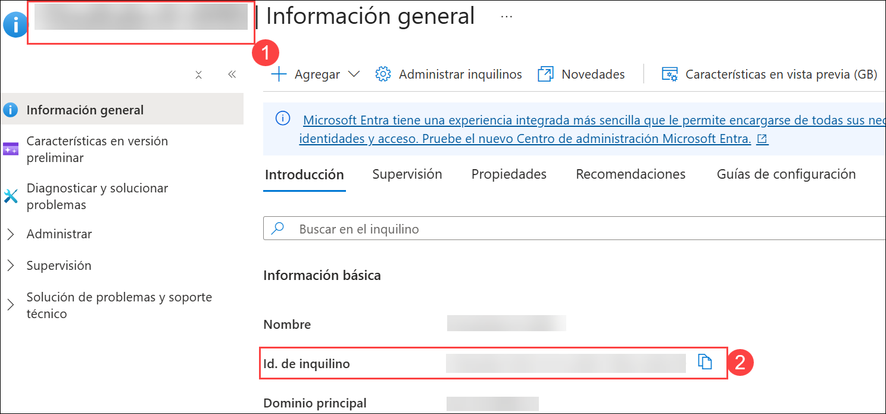

1. Dentro de la terminal de comandos de Windows, cree un script para actualizar el nombre DNS público para la IP externa de ingress.

   ```bash
   code update-ip.ps1
   ```
   
   Pegue lo siguiente como contenido del script. Asegúrese de reemplazar los siguientes marcadores de posición en el script:

   - `$env:tenantId`: Ingrese la identificación del inquilino que copió en el paso anterior **(1)**. 

   - `[ipaddress]`: Reemplace esto con la Dirección IP copiada del paso 4 **(2)**.
   - `[KUBERNETES_NODE_RG]`: Reemplace `SUFFIX` con este valor: **<inject key="DeploymentID" />** **(3)**.
   - `[DNSNAME]`: Reemplace esto con el mismo valor SUFFIX **<inject key="DeploymentID" />** **(4)** que utilizó anteriormente para esta práctica de laboratorio.
   - `[PUBLICIP]`: Reemplace `SUFFIX` con este valor: **<inject key="DeploymentID" />** **(5)**.
  
     ```bash
     # Create a SecureString from the client's secret
     $securePassword = ConvertTo-SecureString $env:AppSecret -AsPlainText -Force
      
     # Create a PSCredential object using the client ID and secure password
     $credential = New-Object System.Management.Automation.PSCredential($env:AppID, $securePassword)
      
     # Authenticate using the PSCredential object
     Connect-AzAccount -ServicePrincipal -Credential $credential -TenantId $env:tenantId

     $ipaddress="INGRESS PUBLIC IP"

     $KUBERNETES_NODE_RG="contoso-traders-aks-nodes-rg-SUFFIX"

     $DNSNAME="contosotraders-SUFFIX-ingress"

     $PUBLICIP=Get-AzPublicIPAddress -ResourceGroupName contoso-traders-aks-nodes-rg-SUFFIX

     $results = @()

     ForEach ($i in $PUBLICIP)
     {
     If($i.IpAddress -eq $ipaddress){
     $PIPNAME=$i.name
     $i.DnsSettings = @{"DomainNameLabel" = $DNSNAME} 
     Set-AzPublicIpAddress -PublicIpAddress $i
     }
     }
     ```
      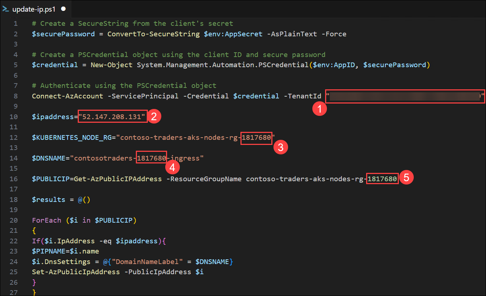

1. Guarde los cambios y cierre el editor.

1. Ejecute el script de actualización.

   ```bash
   powershell ./update-ip.ps1
   ```
   
    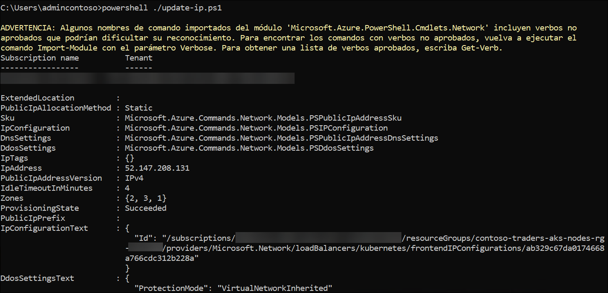

   > **Nota:** Si encuentra algún error, ignórelo y continúe con el siguiente paso.

1. Verifique la actualización de IP visitando la URL en su navegador.

   > **Nota**: Es normal recibir un mensaje 404 en este momento.

   ```text
   http://contosotraders-<inject key="DeploymentID" />-ingress.<inject key="Region" />.cloudapp.azure.com/
   ```

   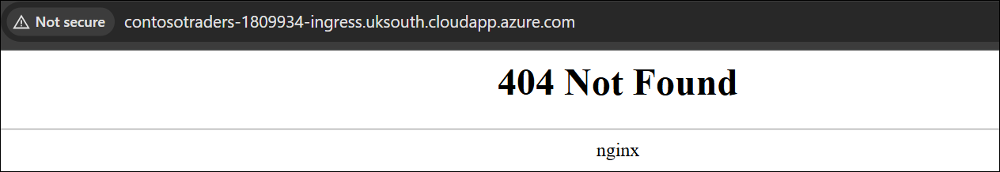

   > **Nota**: Si la URL no funciona o no recibe un error 404. Ejecute el comando que se menciona a continuación e intente acceder a la URL nuevamente.

   ```bash
   helm upgrade nginx-ingress ingress-nginx/ingress-nginx --namespace contoso-traders --set controller.service.externalTrafficPolicy=Local
   ```

1. Utilice helm para instalar `cert-manager`, una herramienta que puede proporcionar certificados SSL automáticamente desde letsencrypt.org.

   ```bash
   kubectl apply --validate=false -f https://github.com/cert-manager/cert-manager/releases/download/v1.9.1/cert-manager.yaml
   ```

1. Para crear un recurso `ClusterIssuer` personalizado para que el servicio `cert-manager` lo utilice al manejar solicitudes de certificados SSL, ejecute el siguiente comando en el Símbolo del sistema de Windows.

    ```bash 
    code clusterissuer.yml
    ```

1. Dentro del archivo **clusterissuer.yml** copie y pegue el siguiente contenido:

    ```yaml
    apiVersion: cert-manager.io/v1
    kind: ClusterIssuer
    metadata:
      name: letsencrypt-prod
      namespace: contoso-traders
    spec:
      acme:
        # The ACME server URL
        server: https://acme-v02.api.letsencrypt.org/directory
        # Email address used for ACME registration
        email: user@contosotraders.com
        # Name of a secret used to store the ACME account private key
        privateKeySecretRef:
          name: letsencrypt-prod
        # Enable HTTP01 validations
        solvers:
        - http01:
            ingress:
              class: nginx
    ```

1. Guarde los cambios y cierre el editor.

1. Cree el emisor usando `kubectl`.

    ```bash
    kubectl create --save-config=true -f clusterissuer.yml
    ```

1. Ahora puede crear un objeto de certificado.

    > **Nota**:
    > Es posible que Cert-manager ya haya creado un objeto de certificado para usted usando ingress-shim.
    >
    > Para verificar que el certificado se creó correctamente, utilice el comando `kubectl describe certificado tls-secret`.
    >
    > Si ya hay un certificado disponible, vaya al paso 16.

    ```bash
    code certificate.yml
    ```

1. Dentro del archivo **certificate.yml** copie y pegue el siguiente contenido:

     ```yaml
     apiVersion: cert-manager.io/v1
     kind: Certificate
     metadata:
       name: tls-secret
       namespace: contoso-traders
     spec:
       secretName: tls-secret
       dnsNames:
         - contosotraders-[SUFFIX]-ingress.[AZURE-REGION].cloudapp.azure.com
       issuerRef:
         name: letsencrypt-prod
         kind: ClusterIssuer
     ```

1. Actualice el valor `[SUFFIX]` con **<inject key="DeploymentID" />** y `[AZURE-REGION]` con **<inject key="Region" />** para que coincida con su nombre DNS de Ingress.

1. Guarde los cambios y cierre el editor.

1. Cree el certificado usando `kubectl`.

    ```bash
    kubectl create --save-config=true -f certificate.yml
    ```

    > **Nota**: Para verificar el estado de la emisión del certificado, use el comando `kubectl describe certificate tls-secret -n contoso-traders` y busque en la salida una sección _Events_ similar a la siguiente:
    >
    > ```text
    > Type    Reason         Age   From          Message
    > ----    ------         ----  ----          -------
    > Normal  Generated           38s   cert-manager  Generated new private key
    > Normal  GenerateSelfSigned  38s   cert-manager  Generated temporary self signed certificate
    > Normal  OrderCreated        38s   cert-manager  Created Order resource "tls-secret-3254248695"
    > Normal  OrderComplete       12s   cert-manager  Order "tls-secret-3254248695" completed successfully
    > Normal  CertIssued          12s   cert-manager  Certificate issued successfully
    > ```

    > Pueden pasar entre 5 y 30 minutos antes de que tls-secret esté disponible. Esto se debe al retraso que implica el aprovisionamiento de un certificado TLS de Let's Encrypt. También, anota el nombre DNS, lo usaremos más adelante en las mismas tareas.

    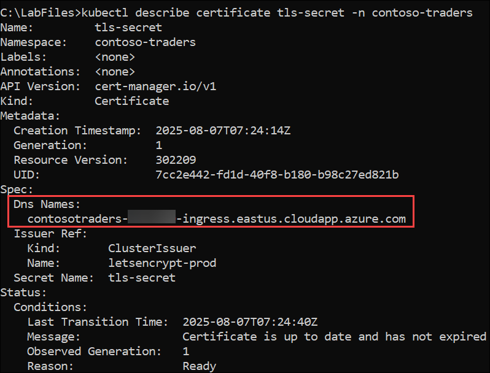

1. Ahora puede crear un recurso de Ingress para las aplicaciones de contenido.
 
    ```bash
    code content.ingress.yml
    ```

1. Dentro del archivo **content.ingress.yml** copie y pegue el siguiente contenido:

    ```yaml
    apiVersion: networking.k8s.io/v1
    kind: Ingress
    metadata:
      name: contoso-ingress
      namespace: contoso-traders
      annotations:
        nginx.ingress.kubernetes.io/rewrite-target: /
        nginx.ingress.kubernetes.io/ssl-redirect: "false"
        cert-manager.io/cluster-issuer: letsencrypt-prod
    spec:
      ingressClassName: nginx  # Fixed ingress class definition
      tls:
      - hosts:
          - contosotraders-SUFFIX-ingress.[AZURE-REGION].cloudapp.azure.com
        secretName: tls-secret
      rules:
      - host: contosotraders-SUFFIX-ingress.[AZURE-REGION].cloudapp.azure.com
        http:
          paths:
          - path: /
            pathType: Prefix
            backend:
              service:
                name: contoso-traders-web
                port:
                  number: 80
          - path: /products  # Fixed path without regex
            pathType: Prefix
            backend:
              service:
                name: contoso-traders-products
                port:
                  number: 3001
    ```

1. Actualice el valor `[SUFFIX]`: **<inject key="DeploymentID" />** y `[AZURE-REGION]`: **<inject key="Region" />** para que coincidan con su nombre DNS de Ingress.

1. Guarde los cambios y cierre el editor.

1. Cree el ingress usando `kubectl`.

    ```bash
    kubectl create --save-config=true -f content.ingress.yml
    ```

1. Actualice el punto de conexión de Ingress en su navegador. Debería poder visitar el sitio web y ver todo el contenido.

    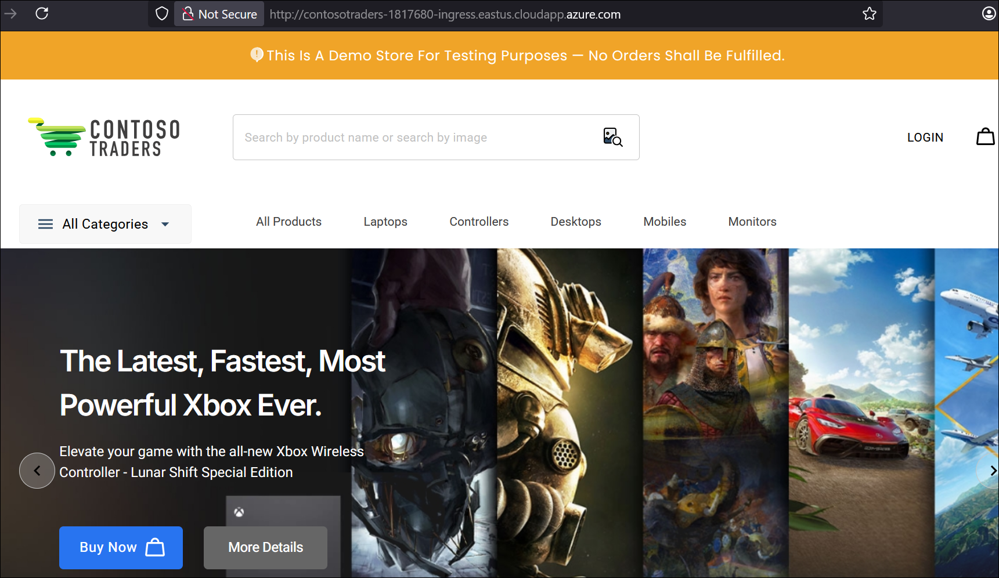

    > **Nota:** Si el sitio web no aparece al acceder a través de la IP, utiliza el nombre DNS que copiaste. Añade `http://` antes, pégalo en el navegador y verifica.
   
1. Pruebe la terminación TLS visitando los servicios nuevamente usando `https://`.

    > **Nota**: El sitio SSL puede tardar entre 5 y 30 minutos en estar disponible. Esto se debe al retraso que implica el aprovisionamiento de un certificado TLS de Let's Encrypt.

1. Haga clic en el botón **Siguiente** ubicado en la esquina inferior derecha de esta guía de laboratorio para continuar con el siguiente ejercicio.

## Resumen

En este ejercicio, realizó una actualización continua y configuró Kubernetes Ingress.

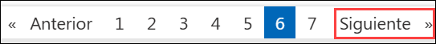