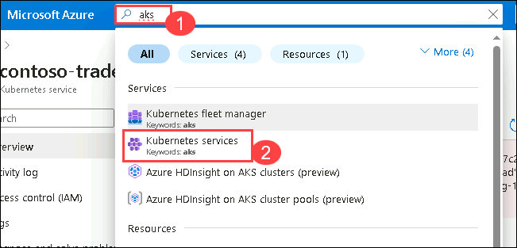
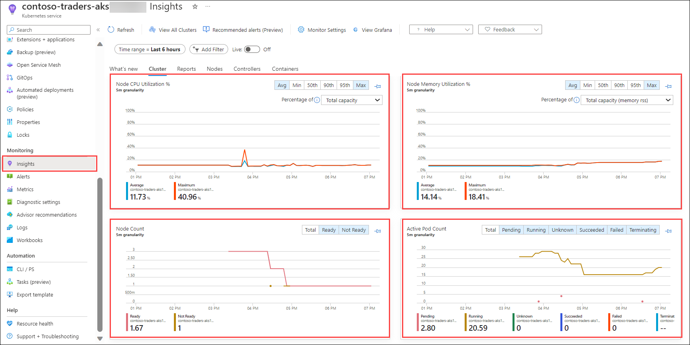

# Exercise 6: Azure Monitor for Containers
   
### Estimated Duration: 20 minutes

## Overview

In this exercise, you will be reviewing the Azure Monitor container insights for the AKS cluster. Azure Monitor helps you maximize the availability and performance of your applications and services. It delivers a comprehensive solution for collecting, analyzing, and acting on telemetry from your cloud and on-premises environments.

A few examples of what you can do with Azure Monitor include:

- Detect and diagnose issues across applications and dependencies with Application Insights.
- Correlate infrastructure issues with VM insights and Container insights.
- Collect data from monitored resources by using Azure Monitor Metrics.

## Lab Objectives

You will be able to complete the following tasks:

- Task 1: Review Azure Monitor metrics

### Task 1: Review Azure Monitor metrics

In this task, you will be reviewing the monitored AKS cluster.

1. Navigate back to the Azure portal in the browser and search for **aks (1)**, Select **Kubernetes services (2)** from the result.

   
     
1. On the Kubernetes Services page, select **contoso-traders-aks<inject key="DeploymentID" enableCopy="false"/>**.
   
1. In the Insights section, under monitoring in your Kubernetes service resource blade and you should be able to see some logs.

   > **Note**: The Azure Monitor can take up to 15 minutes to populate the data in the insight blade.
    
    

<validation step="ba51688d-c5b8-43c8-811c-e78e9a5539ce" />

> **Congratulations** on completing the task! Now, it's time to validate it. Here are the steps:
> - If you receive a success message, you can proceed to the next task.
> - If not, carefully read the error message and retry the step, following the instructions in the lab guide. 
> - If you need any assistance, please contact us at cloudlabs-support@spektrasystems.com. We are available 24/7 to help you out.

## Summary

In this exercise, you have Reviewed Azure Monitor container insights for the AKS cluster.

### You have successfully completed the lab!