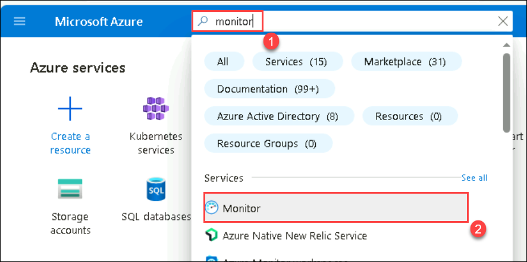
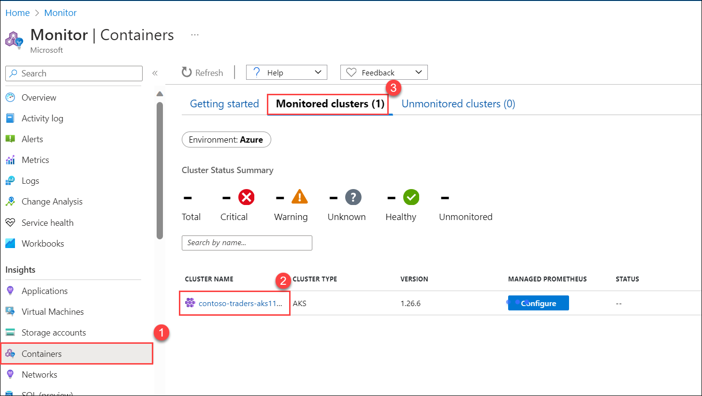

## Ejercicio 6: Azure Monitor para contenedores - Opcional

**Duración**: 10 Minutos

## Descripción general

En este ejercicio, revisará la información del contenedor de Azure Monitor para el clúster de AKS. Azure Monitor le ayuda a maximizar la disponibilidad y el rendimiento de sus aplicaciones y servicios. Ofrece una solución integral para recopilar, analizar y actuar sobre la telemetría desde su nube y entornos on-premise (locales).

Algunos ejemplos de lo que puede hacer con Azure Monitor incluyen:

- Detectar y diagnosticar problemas entre aplicaciones y dependencias con Application Insights.
- Correlacionar problemas de infraestructura con información de MV y de contenedores.
- Recopile datos de recursos monitoreados mediante Azure Monitor Metrics.
  

### Tarea 1: Revisar las métricas de Azure Monitor

En esta tarea, revisará el clúster de AKS monitoreado.

1. Vuelva al Portal de Azure en el navegador y busque **Monitor (1)**. Seleccione **Monitor (2)** en el resultado.

   
     
1. En el panel de navegación izquierdo, seleccione **Contenedores (1)** en el menú Información, navegue hasta la sección **Clústeres supervisados (2)** para revisar los registros y seleccione su **servicio Kubernetes (3)**.

   
   
1. Será redirigido a la sección Información en su hoja de recursos del servicio Kubernetes y debería poder ver algunos registros.

   > **Nota**: Azure Monitor puede tardar hasta 15 minutos en mostrar datos en la hoja de información.
    
    

      <validation step="cfa0366b-4e75-49b9-8d47-ec6d7e50c3b2" />

## Resumen

En este ejercicio, revisó la información sobre contenedores de Azure Monitor para el clúster de AKS.

## Fin del laboratorio
