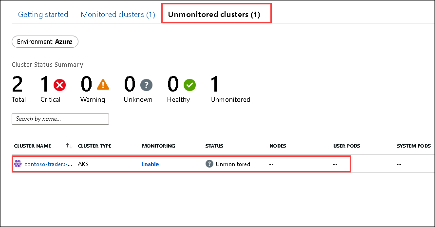
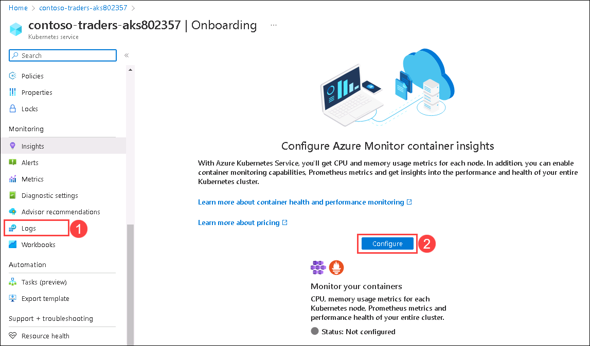
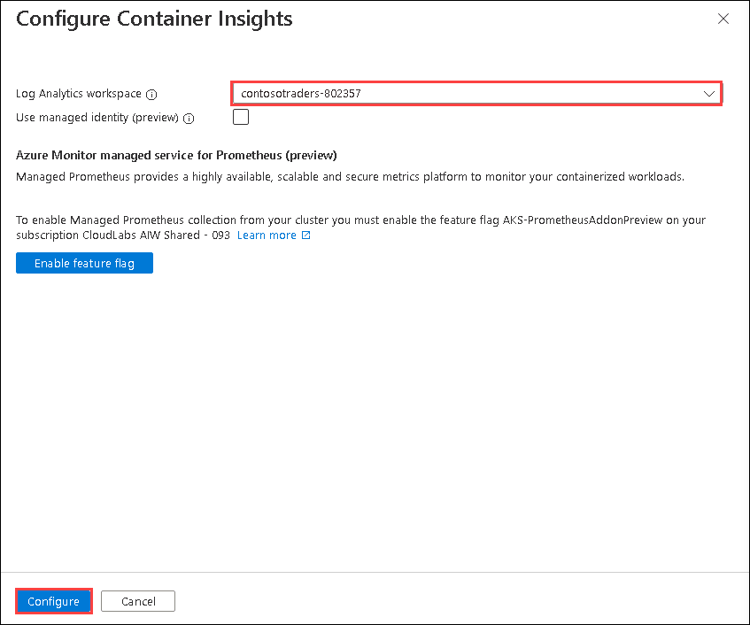

## Exercise 6: Azure Monitor for Containers-Optional

  In this exercise, you will be configuring the Azure Monitor on your containers.
  
### Task 1: Deploy Azure Monitor for Containers 
  
1. Navigate back to Azure Portal in the browser and search for **Monitor**. 
    
1. Select **Monitor** from the list.

   
     
1. In the Overview page of Monitor, select **Container** from the left side menu.
     
   
     
1. On the Getting Started page, Click on **Onboard unmonitored clusters** to onboard your container and cluster

   
    
1. You will be redirected to the **Unmonitored Cluster** section, here click on your AKS cluster to onboard it to Azure Monitor.

   

1. Once you click on the Cluster, you will be redirected to AKS resource. Select **Logs** under Monitoring from the left-menu and click on **Configure** to Configure Azure Monitor container insights.

   
   
1. In the Configure Container Insights pane, select the **contosotraders<inject key="DeploymentID" enableCopy="false"/>** Log Analytics workspace from the drop-down and click on **Configure**.

    
    

### Task 2: Review Azure Monitor metrics & Setup Alerts 

1. Once you onboarded the cluster to Azure monitor. To review the logs, navigate to **Monitored clusters** section and select your AKS.

   
   
1. You will be redirect to the Insight section in you AKS resource blade and you should be able to see some logs.

   > **Note**: The Azure Monitor can take up to 15 minutes to populate the data in insight blade.
    
  

1. Now to setup the alerts, Click on **Recommended alerts** on the same insight page.

    

1. A new window will open for **Recommended alerts**, on the page enable the **Restarting container count** to setup the alert for this
  
     
     
1. So far, we have enabled the alerts and you can see these alerts using Log analytic workspace and Azure Monitor, to read more about this:  https://learn.microsoft.com/en-us/azure/azure-monitor/containers/container-insights-overview

