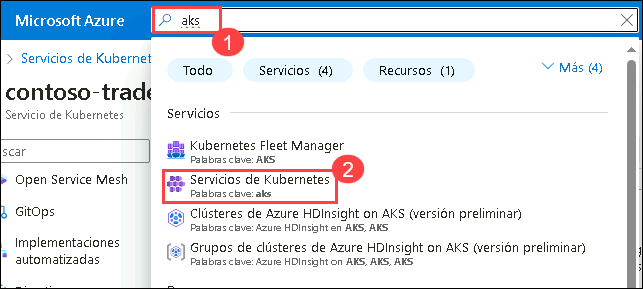

# Ejercicio 6: Azure Monitor para Contenedores

### Duración estimada: 40 minutos

## Descripción general

En este ejercicio, revisará la información del contenedor de Azure Monitor para el clúster de AKS. Azure Monitor le ayuda a maximizar la disponibilidad y el rendimiento de sus aplicaciones y servicios. Ofrece una solución integral para recopilar, analizar y actuar sobre la telemetría desde su nube y entornos on-premise (locales).

Algunos ejemplos de lo que puede hacer con Azure Monitor incluyen:

- Detectar y diagnosticar problemas entre aplicaciones y dependencias con Application Insights.
- Correlacionar problemas de infraestructura con información de MV y de contenedores.
- Recopile datos de recursos monitoreados mediante Azure Monitor Metrics.

## Objetivos del laboratorio

Podrá completar las siguientes tareas:

- Tarea 1: Revisar las métricas de Azure Monitor  

## Tarea 1: Revisar las métricas de Azure Monitor

En esta tarea, revisará el clúster de AKS supervisado. Esta tarea se centra en la revisión visual de las métricas y los registros disponibles en Azure Monitor para su clúster de AKS. No se prevé la detección de alertas ni problemas a menos que se configuren explícitamente.

1. Vuelva al Portal de Azure en el navegador y busque **aks (1)**. Seleccione **Servicios de Kubernetes (2)** en el resultado.

   
     
1. En la página Servicios de Kubernetes, seleccione contoso-traders-aks<inject key="DeploymentID" enableCopy="false"/>
   
1. En la sección Información de la hoja de recursos del servicio Kubernetes debería poder ver algunos registros.

   > **Nota**: Azure Monitor puede tardar hasta 15 minutos en mostrar datos en la hoja de información.

   > **Importante**: Esta tarea es solo para revisión visual. Si desea explorar las alertas, puede configurar una regla de alerta en Azure Monitor. Por ejemplo, puede crear una alerta para un uso elevado de CPU o de memoria. Consulte la documentación de Azure para obtener instrucciones sobre cómo configurar reglas de alerta.

    

> **Felicitaciones** por completar la tarea. Ahora es momento de validarla. Estos son los pasos:
> - Si recibe un mensaje de éxito, puede continuar con la siguiente tarea.
> - Si no es así, lea atentamente el mensaje de error y vuelva a intentar el paso, siguiendo las instrucciones de la guía de laboratorio.
> - Si necesita ayuda, comuníquese con nosotros a cloudlabs-support@spektrasystems.com. Estamos disponibles las 24 horas, los 7 días de la semana para ayudarlo.

<validation step="cfa0366b-4e75-49b9-8d47-ec6d7e50c3b2" />

## Resumen

En este ejercicio, ha revisado la información del contenedor de Azure Monitor para el clúster de AKS.

### ¡Ha completado el laboratorio correctamente!
