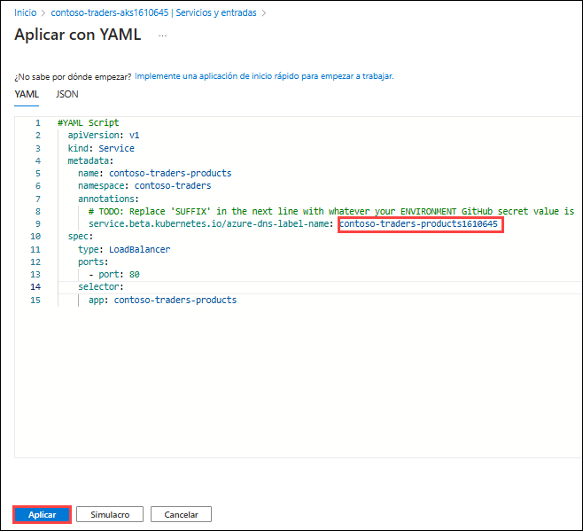
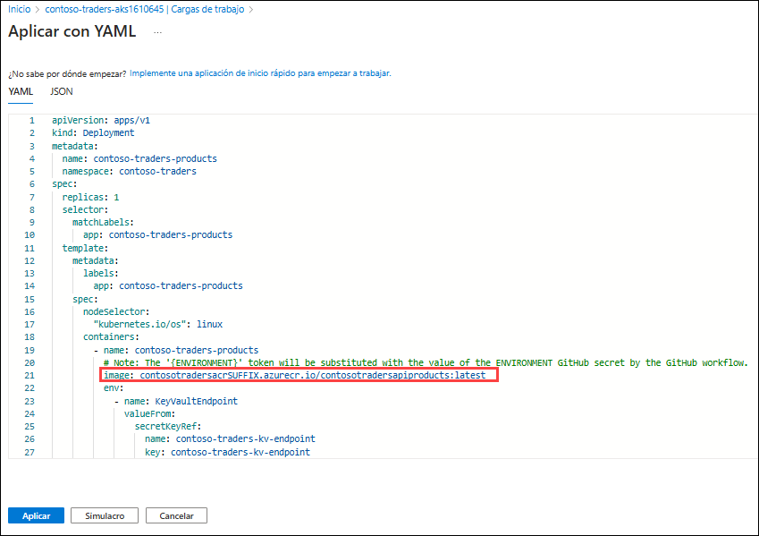

# Ejercicio 3: Implementar la aplicación en Azure Kubernetes Service

### Duración : 40 Minutos

## Descripción general

En este ejercicio, desplegará su aplicación web en contenedores hacia AKS (Azure Kubernetes Service) con la ayuda de Key Vault Secrets y ACR, donde almacenó las imágenes de su aplicación web en contenedores. Además, explorará dos formas de desplegar la aplicación en AKS.

## Tarea 1: Túnel hacia el clúster de Azure Kubernetes Service 

Esta tarea recopilará la información que necesita sobre su clúster de Azure Kubernetes Service para conectarse al clúster y ejecutar comandos para conectarse al panel de administración de Kubernetes desde Cloud Shell.

> **Nota**: Las siguientes tareas deben ejecutarse en el **Símbolo del sistema**.

1. Abra un nuevo símbolo del sistema como Administrador en su JumpVM e inicie sesión en Azure con los siguientes comandos después de actualizar los valores en el siguiente comando.
   
    ```bash
    az login -u <inject key="AzureAdUserEmail"></inject> -p <inject key="AzureAdUserPassword"></inject>
    ```
    
    > **Nota:** Si encuentra algún error al ejecutar el comando 'az', ejecute el siguiente comando para instalar Azure CLI y cierre el símbolo del sistema. Vuelva a realizar el paso 1 en un nuevo símbolo del sistema como Administrador.

    ```bash
    choco install azure-cli
    ```

1. Verifique que esté conectado a la suscripción correcta con el siguiente comando para mostrar su suscripción predeterminada:

   ```bash
   az account show
   ```

   - Asegúrese de estar conectado a la suscripción correcta. De lo contrario, enumere sus suscripciones y luego configure la suscripción por su ID con los siguientes comandos:

   ```bash
   az account list
   az account set --subscription {id}
   ```

1. Ejecute el siguiente comando para configurar la conexión del clúster de Kubernetes utilizando kubectl.

   ```bash
   az aks get-credentials -a --name contoso-traders-aks<inject key="DeploymentID" enableCopy="true"/> --resource-group ContosoTraders-<inject key="DeploymentID" enableCopy="true"/>
   ```
   
   

1. Rápidamente ejecute un comando kubectl para generar una lista de nodos y verificar si la configuración es correcta.

   ```bash
   kubectl get nodes
   ```

      

## Tarea 2: Configurar Key Vault & Secretos

En esta tarea, generará un secreto en Key vault y creará la conexión entre AKS y Key Vault.

1. Navegue al Portal de Azure, busque **Key Vault** en la barra de búsqueda, y seleccione **Almacenes de claves** de la lista.

    

1. A continuación seleccione **contosotraderskv<inject key="DeploymentID" enableCopy="false" />**, key vault de la lista.

1. Una vez que esté en la página del Almacén de claves **contosotraderskv<inject key="DeploymentID" enableCopy="false" />** , seleccione **Secretos** debajo de Objetos en el menú lateral izquierdo.

    
    
1. Ahora haga clic en el botón **Generar o importar** para crear el nuevo secreto.

    
    
1. En el panel **Crear un secreto**, ingrese los siguientes detalles:

    - Nombre: **mongodbconnection**
    - Valor secreto: Pegue la cadena de conexión de la cuenta de Azure CosmosDB for MongoDB que copió en el ejercicio anterior. 
    - Mantenga los demás valores con la información por defecto y haga clic en **Crear**.
    
      
     
      
     
1. Abra un nuevo **Símbolo del sistema** y ejecute el siguiente comando para crear un secreto usando kubectl. 

    ```sh
    kubectl create secret generic mongodbconnection --from-literal=mongodbconnection=mongodbconnection --namespace=contoso-traders
    ```
    
    
1. Vuelva al navegador y abra el AKS **contoso-traders-aks<inject key="DeploymentID" enableCopy="false"/>** en el Portal de Azure, seleccione **Configuración (1)** del menú del lado izquierdo y haga clic en la sección **Secretos (2)**. En **Secretos (3)**, debería poder ver el secreto recién creado. 

          

> **Felicitaciones** por completar la tarea. Ahora es momento de validarla. Estos son los pasos:
> - Si recibe un mensaje de éxito, puede continuar con la siguiente tarea.
> - Si no es así, lea atentamente el mensaje de error y vuelva a intentar el paso, siguiendo las instrucciones de la guía de laboratorio.
> - Si necesita ayuda, comuníquese con nosotros a cloudlabs-support@spektrasystems.com. Estamos disponibles las 24 horas, los 7 días de la semana para ayudarlo.

<validation step="90140152-1f25-4761-805f-6ecb42cd0f5b" />

## Tarea 3: Desplegar un espacio de nombres, un servicio y una carga de trabajo en Azure Kubernetes Service utilizando el Portal de Azure
   
En esta tarea, implementará la aplicación API Carts en el clúster de Azure Kubernetes Service utilizando el Portal de Azure.
   
1. Ya hemos definido un nuevo Espacio de nombres para el despliegue de su API. En el futuro, utilizará únicamente el espacio de nombres **contoso-traders**. 

    
    
2. Defina un Servicio para su API, de modo que se pueda acceder a la aplicación dentro del clúster Seleccione la hoja **Servicios y entradas (1)** de la página de detalles del recurso AKS **contoso-traders-aks<inject key="DeploymentID" enableCopy="false"/>** en el Portal de Azure. En la pestaña Servicios, seleccione **+ Crear (2)** y elija **Aplicar un YAML (3)**. 
    
    

3. En el panel **Aplicar con YAML**, pegue el siguiente código YAML que crea un servicio en AKS y haga clic en **Aplicar**. Asegúrese de reemplazar SUFFIX con el valor DeploymentID **<inject key="DeploymentID" enableCopy="true"/>** proporcionado en el archivo YAML.
    >**Información**: El siguiente script YAML creará un servicio AKS dentro del espacio de nombres contoso-traders que creó en los pasos anteriores. El servicio AKS es una forma abstracta de exponer una aplicación que se ejecuta en un conjunto de Pods como un servicio de red. 

    ```yaml
      #YAML Script
      apiVersion: v1
      kind: Service
      metadata:
        name: contoso-traders-products
        namespace: contoso-traders
        annotations:
          # TODO: Replace 'SUFFIX' in the next line with whatever your ENVIRONMENT GitHub secret value is
          service.beta.kubernetes.io/azure-dns-label-name: contoso-traders-productsSUFFIX
      spec:
        type: LoadBalancer
        ports:
          - port: 80
        selector:
          app: contoso-traders-products

      ```       
   

   **Nota:** Asegúrese de que la sangría en su script YAML coincida con el formato que se muestra en la imagen para evitar errores.

1. Seleccione **Cargas de trabajo (1)** en la sección de recursos Kubernetes en el menú a la izquierda. Con **Implementaciones** seleccionado por defecto, elija **+ Crear (2)** y luego seleccione **Aplicar un YAML (3)**.

    

1. En el panel **Aplicar con YAML**, pegue el siguiente código YAML que crea un servicio en AKS y haga clic en **Aplicar**. Asegúrese de reemplazar SUFFIX con el valor DeploymentID **<inject key="DeploymentID" enableCopy="true"/>** proporcionado en el archivo YAML para actualizar el nombre LOGINSERVER de la instancia ACR.
    >**Información**: El siguiente archivo YAML creará pods de despliegue en el espacio de nombres contoso-traders. Una implementación de Kubernetes le dice a Kubernetes cómo crear o modificar instancias de los pods que contienen una aplicación en contenedores. Las implementaciones pueden ayudar a escalar de manera eficiente el número de réplicas de pods, permitir el despliegue de código actualizado de una manera controlada o volver a una versión de implementación anterior si es necesario.

   ```YAML
   apiVersion: apps/v1
   kind: Deployment
   metadata:
     name: contoso-traders-products
     namespace: contoso-traders
   spec:
     replicas: 1
     selector:
       matchLabels:
         app: contoso-traders-products
     template:
       metadata:
         labels:
           app: contoso-traders-products
       spec:
         nodeSelector:
           "kubernetes.io/os": linux
         containers:
           - name: contoso-traders-products
             # Note: The '{ENVIRONMENT}' token will be substituted with the value of the ENVIRONMENT GitHub secret by the GitHub workflow.
             image: contosotradersacrSUFFIX.azurecr.io/contosotradersapiproducts:latest
             env:
               - name: KeyVaultEndpoint
                 valueFrom:
                   secretKeyRef:
                     name: contoso-traders-kv-endpoint
                     key: contoso-traders-kv-endpoint
               - name: ManagedIdentityClientId
                 valueFrom:
                   secretKeyRef:
                     name: contoso-traders-mi-clientid
                     key: contoso-traders-mi-clientid
             resources:
               requests:
                 cpu: 50m
                 memory: 64Mi
               limits:
                 cpu: 250m
                 memory: 256Mi
             ports:
               - containerPort: 3001
                 hostPort: 3001
                 protocol: TCP
   ```
   

1. Después de unos minutos, verá la implementación en la lista, que debería estar ejecutándose.

   

> **Felicitaciones** por completar la tarea. Ahora es momento de validarla. Estos son los pasos:
> - Si recibe un mensaje de éxito, puede continuar con la siguiente tarea.
> - Si no es así, lea atentamente el mensaje de error y vuelva a intentar el paso, siguiendo las instrucciones de la guía de laboratorio.
> - Si necesita ayuda, comuníquese con nosotros a cloudlabs-support@spektrasystems.com. Estamos disponibles las 24 horas, los 7 días de la semana para ayudarlo.

<validation step="5027ff24-34ab-49f1-9fa2-72e214db0831" />

## Tarea 4: Implementar un servicio y una carga de trabajo usando kubectl

En esta tarea, implementará el servicio web y su carga de trabajo utilizando kubectl.

1. Abra un **Explorador de archivos** desde su JumpVM.

1. Navegue hasta el directorio `C:\LabFiles` **(1)** y seleccione el archivo `web.deployment.yml` **(2)**. Haga clic derecho y seleccione **Abrir** **(3)** para abrir el archivo en VS Code.

   

1. Asegúrese de actualizar el SUFIJO con el valor DeploymentID **<inject key="DeploymentID" enableCopy="true"/>** proporcionado en el archivo YAML para que coincida con el nombre de su Login Server de ACR.

    

1. Guarde los cambios presionando **CTRL + S** para **Guardar**.

1. Vuelva al símbolo del sistema de Windows y ejecute el siguiente comando para cambiar el directorio a la carpeta `~/LabFiles`.

    ```bash
    cd C:/LabFiles
    ```

1. Inicie sesión en Azure si aún no lo ha hecho con el siguiente comando después de actualizar los valores en el comando.

    ```
    az login -u <inject key="AzureAdUserEmail"></inject> -p <inject key="AzureAdUserPassword"></inject>
    ```

1. Ejecute el siguiente comando para desplegar la aplicación descrita en los archivos YAML. Recibirá un mensaje indicando que el elemento `kubectl` ha creado una implementación web y un servicio web.
   
   >**Información**: El siguiente comando kubectl creará la carga de trabajo de implementación y el servicio en el espacio de nombres que hemos definido en los archivos YAML. 

    ```bash
    kubectl create --save-config=true -f web.deployment.yml -f web.service.yml 
    ```

    

1. Regrese a la hoja de AKS en el Portal de Azure. En el menú de navegación, seleccione **Servicios y entradas** en **Recursos de Kubernetes**. Debería poder acceder al sitio web a través de un **Punto de conexión externo**.

    

    

   > **Nota:** Si el sitio web no se carga, intente actualizar la página varias veces, ya que AKS puede tardar un poco en completar el sitio web.
    
1. Haga clic en el botón **Siguiente** ubicado en la esquina inferior derecha de esta guía de laboratorio para continuar con el siguiente ejercicio.

> **Felicitaciones** por completar la tarea. Ahora es momento de validarla. Estos son los pasos:
> - Si recibe un mensaje de éxito, puede continuar con la siguiente tarea.
> - Si no es así, lea atentamente el mensaje de error y vuelva a intentar el paso, siguiendo las instrucciones de la guía de laboratorio.
> - Si necesita ayuda, comuníquese con nosotros a cloudlabs-support@spektrasystems.com. Estamos disponibles las 24 horas, los 7 días de la semana para ayudarlo.

<validation step="bf5a46a2-1e97-41f7-a010-d514c5e91636" />

## Resumen

En este ejercicio, implementó su aplicación web en contenedores en AKS que contiene el espacio de nombres, el servicio y la carga de trabajo en Azure Kubernetes. Además, creó un servicio para AKS y accedió al sitio web mediante un punto de conexión externo. Además, ha configurado el secreto del almacén de claves para acceder a MongoDB desde AKS.
