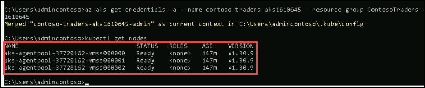
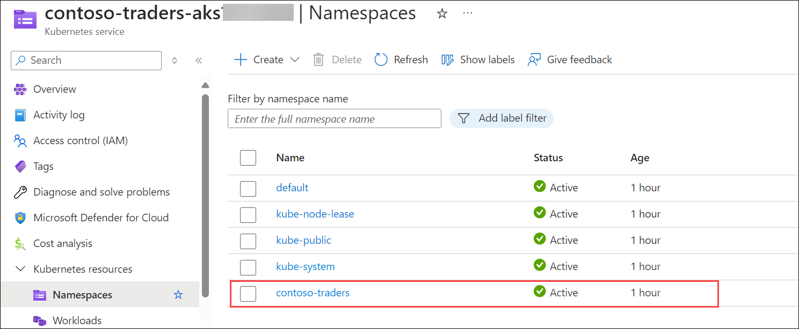
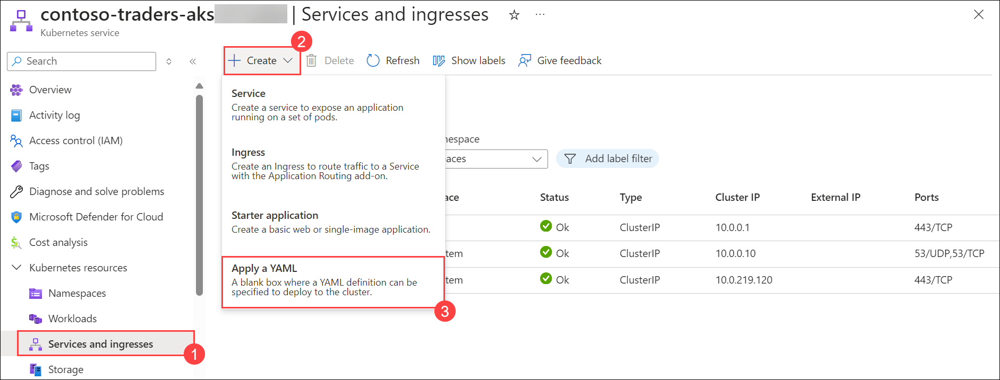
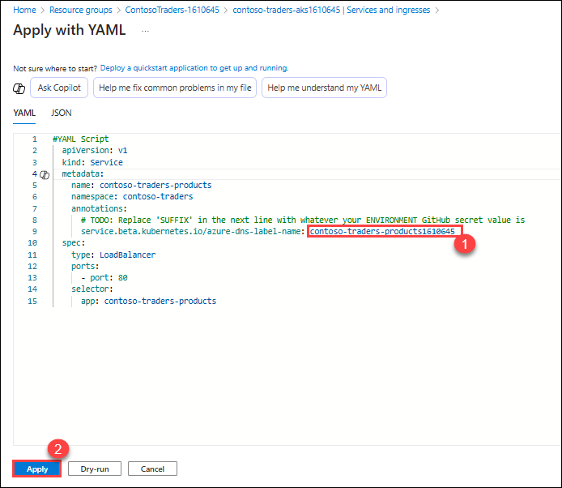
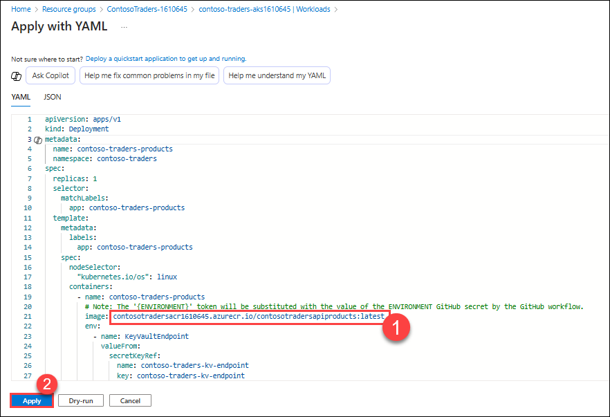
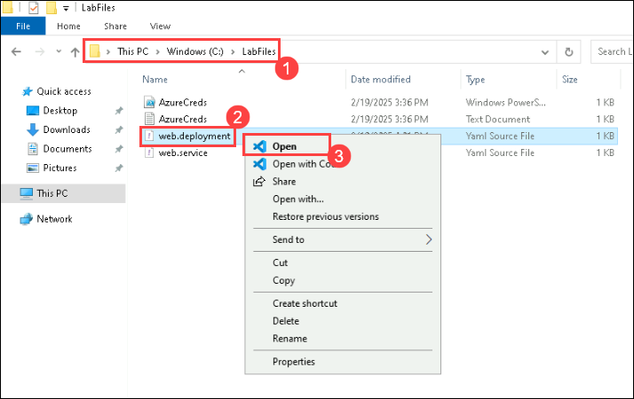
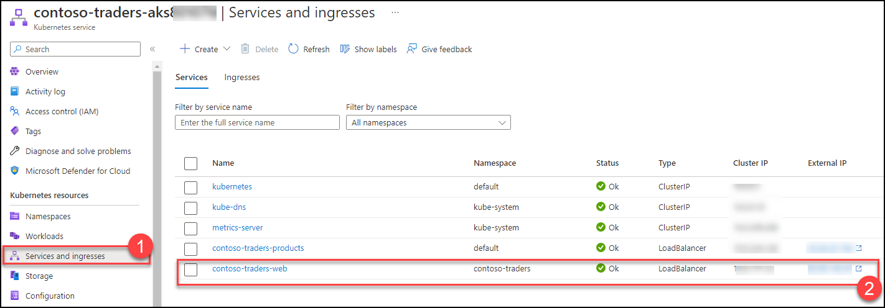

# Exercise 3: Deploy the application to the Azure Kubernetes Service
   
### Estimated Duration: 120 minutes

## Overview

In this exercise, you will be deploying your containerized web application to AKS (Azure Kubernetes Service) with the help of Key Vault Secrets and ACR, where you have stored your containerized web application images. Also, you will be exploring two ways to deploy the app to AKS. 

## Lab Objectives

You will be able to complete the following tasks:

- Task 1: Tunnel into the Azure Kubernetes Service cluster
- Task 2: Deploy a namespace, service, and workload in the Azure Kubernetes Service using the Azure Portal
- Task 3: Deploy a service & workload using kubectl

### Task 1: Tunnel into the Azure Kubernetes Service cluster  

This task will gather the information you need about your Azure Kubernetes Service cluster to connect to the cluster and execute commands to connect to the Kubernetes management dashboard from the cloud shell.

> **Note**: The following tasks should be executed in the command prompt.

1. Open a new command prompt as Administrator in your jump VM and log in to Azure with the below command.
   
    ```bash
    az login -u <inject key="AzureAdUserEmail"></inject> -p <inject key="AzureAdUserPassword"></inject>
    ```
    
    > **Note:** If you face any error while running the 'az' command, then run the below command to install the Azure CLI and close the command prompt. Re-perform step 1 in a new command prompt as Administrator.

    ```bash
    choco install azure-cli
    ```

1. Verify that you are connected to the correct subscription with the following command to show your default subscription:

   ```bash
   az account show
   ```

   - Ensure you are connected to the correct subscription. If not, list your subscriptions and then set the subscription by its ID with the following commands:

      ```bash
      az account list
      az account set --subscription {id}
      ```

1. Run the following command to set up the Kubernetes cluster connection using kubectl.

   ```bash
   az aks get-credentials -a --name contoso-traders-aks<inject key="DeploymentID" enableCopy="true"/> --resource-group ContosoTraders-<inject key="DeploymentID" enableCopy="true"/>
   ```

1. Run a quick kubectl command to generate a list of nodes to verify if the setup is correct.

   ```bash
   kubectl get nodes
   ```

      


### Task 2: Deploy a namespace, service, and workload in the Azure Kubernetes Service using the Azure Portal
   
In this task, you will deploy the API Carts application to the Azure Kubernetes Service cluster using the Azure Portal.

1. Navigate back to the **ContosoTraders-<inject key="DeploymentID" enableCopy="true"/>** resource group, and select the **contoso-traders-aks<inject key="DeploymentID" enableCopy="true"/>** Kubernetes service.
   
1. We have already defined a new Namespace for your API deployment. Going further, you will be using the **contoso-traders** namespace only. 

    
    
1. Define a Service for your API so that the application is accessible within the cluster. Select the **Services and ingresses (1)** blade of the **contoso-traders-aks<inject key="DeploymentID" enableCopy="false"/>** AKS resource detail page in the Azure Portal. In the Services tab, select **+ Create (2)** and choose **Apply a YAML (3)**. 
    
    

1. In the **Apply with YAML** pane, paste the below YAML code, which creates a service in AKS and click on **Apply (2)**. Make sure to replace the SUFFIX with the given DeploymentID **<inject key="DeploymentID" enableCopy="true"/>** **(1)** value in the YAML file.
    
    >**Info**: The below YAML script will create an AKS service inside the contoso-traders namespace that you have created in the previous steps. AKS Service is an abstract way to expose an application running on a set of Pods as a network service. 

    ```yaml
      #YAML Script
      apiVersion: v1
      kind: Service
      metadata:
        name: contoso-traders-products
        namespace: contoso-traders
        annotations:
          # TODO: Replace 'SUFFIX' in the next line with whatever your ENVIRONMENT GitHub secret value is
          service.beta.kubernetes.io/azure-dns-label-name: contoso-traders-productsSUFFIX
      spec:
        type: LoadBalancer
        ports:
          - port: 80
        selector:
          app: contoso-traders-products

      ```    
    

    >**Note:** Ensure that the indentation in your YAML script matches the format shown in the image to avoid errors.

1. Select **Workloads (1)** under the Kubernetes resources section in the left navigation. With **Deployments** selected by default, select **+ Create (2)** and then choose **Apply a YAML (3)**.

    

1. In the **Apply with YAML** pane, paste the below YAML code, which creates a workload in AKS and click on **Apply (2)**. Make sure to replace the SUFFIX with the given DeploymentID **<inject key="DeploymentID" enableCopy="true"/> (1)** value in the YAML file to update the LOGINSERVER name of the ACR instance.

    >**Info**: The below YAML file will create deployment pods in the namespace contoso-traders. A Kubernetes Deployment tells Kubernetes how to create or modify instances of the pods that hold a containerized application. Deployments can help to efficiently scale the number of replica pods, enable the rollout of updated code in a controlled manner, or roll back to an earlier deployment version if necessary.

   ```YAML
   apiVersion: apps/v1
   kind: Deployment
   metadata:
     name: contoso-traders-products
     namespace: contoso-traders
   spec:
     replicas: 1
     selector:
       matchLabels:
         app: contoso-traders-products
     template:
       metadata:
         labels:
           app: contoso-traders-products
       spec:
         nodeSelector:
           "kubernetes.io/os": linux
         containers:
           - name: contoso-traders-products
             # Note: The '{ENVIRONMENT}' token will be substituted with the value of the ENVIRONMENT GitHub secret by the GitHub workflow.
             image: contosotradersacrSUFFIX.azurecr.io/contosotradersapiproducts:latest
             env:
               - name: KeyVaultEndpoint
                 valueFrom:
                   secretKeyRef:
                     name: contoso-traders-kv-endpoint
                     key: contoso-traders-kv-endpoint
               - name: ManagedIdentityClientId
                 valueFrom:
                   secretKeyRef:
                     name: contoso-traders-mi-clientid
                     key: contoso-traders-mi-clientid
             resources:
               requests:
                 cpu: 50m
                 memory: 64Mi
               limits:
                 cpu: 250m
                 memory: 256Mi
             ports:
               - containerPort: 3001
                 hostPort: 3001
                 protocol: TCP
   ```
     
   

1. After a few minutes, you will see the deployment listed, and it should be in a running state.

   .png "Selecting + Add to create a deployment")

<validation step="8e8b8774-50eb-413f-84e0-c1861a2b10b7" />

> **Congratulations** on completing the task! Now, it's time to validate it. Here are the steps:
> - If you receive a success message, you can proceed to the next task.
> - If not, carefully read the error message and retry the step, following the instructions in the lab guide. 
> - If you need any assistance, please contact us at cloudlabs-support@spektrasystems.com. We are available 24/7 to help you out.

### Task 3: Deploy a service & workload using kubectl

In this task, you will deploy the web service & its workload using kubectl.

1. Open a **File Explorer** from your JumpVM.

1. Navigate to `C:\LabFiles` **(1)** directory and select `web.deployment.yml` **(2)** file. Right-click and select **Open** **(3)** to open the file in VS Code.

   

1. Make sure to update the SUFFIX with the given DeploymentID **<inject key="DeploymentID" enableCopy="true"/>** value in the YAML file to match the name of your ACR Login Server.

    

1. Save the changes by **CTRL + S** button to **Save**.

1. Navigate back to the Windows command prompt and run the below command to change the directory to the `~/LabFiles` folder.

    ```bash
    cd C:/LabFiles
    ```

1. Log in to Azure if not already done with the below command after updating the values in the command.

    ```
    az login -u <inject key="AzureAdUserEmail"></inject> -p <inject key="AzureAdUserPassword"></inject>
    ```

1. Execute the below command to deploy the application described in the YAML files. You will receive a message indicating the item `kubectl` has created a web deployment and a web service.
   >**Info**: The below kubectl command will create the Deployment workload and Service in the namespace that we have defined in the YAML files. 

    ```bash
    kubectl create --save-config=true -f web.deployment.yml -f web.service.yml 
    ```

    

1. Return to the AKS blade in the Azure Portal. From the navigation menu, select the **Services and ingresses (1)** under **Kubernetes resources**. You should be able to access the website via an **External endpoint (2)**.

    

    
    
1. Click the **Next** button located in the bottom right corner of this lab guide to continue with the next exercise.

<validation step="a9fa4d00-ae23-4b56-a3e3-ee1f2effdfb2" />

> **Congratulations** on completing the task! Now, it's time to validate it. Here are the steps:
> - If you receive a success message, you can proceed to the next task.
> - If not, carefully read the error message and retry the step, following the instructions in the lab guide. 
> - If you need any assistance, please contact us at cloudlabs-support@spektrasystems.com. We are available 24/7 to help you out.
     
## Summary

In this exercise, you have deployed your containerized web application to AKS that contains the namespace, service, and workload in Azure Kubernetes. Also, you have created a service to AKS and accessed the website using an external endpoint.


### You have successfully completed the lab. Click on **Next >>** to proceed with next exercise.
