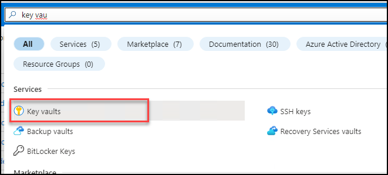
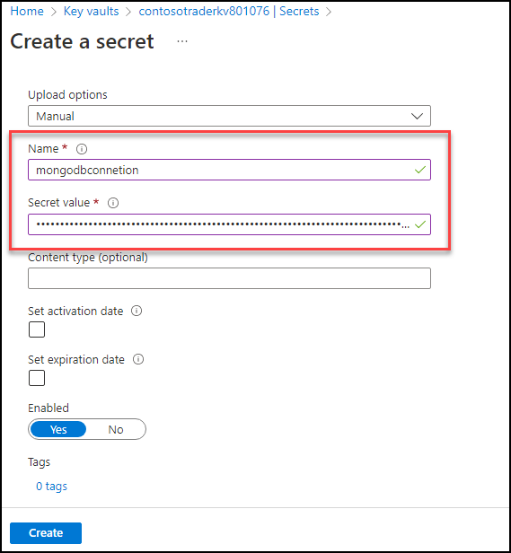

## Exercise 3: Deploy the application to the Azure Kubernetes Service
   
**Duration**: 40 Minutes

## Overview

In this exercise, you will be setting up the key vault secrets, and then you will be deploying the app to Azure Kubernetes Services using the Docker images.

### Task 1: Setup Key Vault & Secrets 

In this task, you will be generating a secret in Key vault and creating the connection between AKS and Key vault.

1. Navigate to Azure portal, search for **Key Vault** in the search bar and select **Key vaults** from the list.

    

1. Then select **contosotraderskv<inject key="DeploymentID" enableCopy="false" />** **Key vaults** from the list.

1. Once you are in **contosotraderskv<inject key="DeploymentID" enableCopy="false" />** Key vault page, select **secrets** under Objects from the left side menu.

    
    
1. Now click on the **Generate/Import** button to create the new secret.

    
    
1. In the **Create a secret** pane, enter the following details:

    - Name: **mongodbconnetion**
    - Secret Value: Paste the connection string you have copied in previous exercise
    
    Keep other values default and click on **Create**
    
     
     
     
     
1. Once the secret is created in Key vault, you will be creating the secret in AKS to create the connection between AKS and Key vault.

1. Open a new **Command Prompt** and run the below command to create secret using kubectl. Make sure to update your key vault secret in the below command which you created in the previous steps.

    ```sh
    kubectl create secret generic mongodbconnection --from-literal=mongodbconnection=[yourkeyvaultsecret] 
    ```
    
    
1. Navigate back to browser and open AKS in Azure portal, select **Configuration** from the left side menu and click on **Secrets** section. Under secrets you should be able to see the newly created secret. 

     
     
### Task 2: Tunnel into the Azure Kubernetes Service cluster  

This task will gather the information you need about your Azure Kubernetes Service cluster to connect to the cluster and execute commands to connect to the Kubernetes management dashboard from the cloud shell.

> **Note**: The following tasks should be executed in command prompt.

1. Open a new command prompt in your jump VM and login to azure with the below commands after updating the values in the below command.

   * Username: **<inject key="AzureAdUserEmail"></inject>**
   * Password: **<inject key="AzureAdUserPassword"></inject>**

    ```
    az login -u [username] -p [Password]
    ```

1. Verify that you are connected to the correct subscription with the following command to show your default subscription:

   ```bash
   az account show
   ```

   - Ensure you are connected to the correct subscription. If not, list your subscriptions and then set the subscription by its ID with the following commands:

   ```bash
   az account list
   az account set --subscription {id}
   ```

1. Setup the Kubernetes cluster connection using kubectl. Make sure to replace the SUFFIX with the given DeploymentID **<inject key="DeploymentID" enableCopy="true"/>** value in the below command.

   ```bash
   az aks get-credentials -a --name contoso-traders-aksSUFFIX --resource-group ContosoTraders-SUFFIX
   ```

1. Run a quick kubectl command to generate a list of nodes to verify that the setup is correct.

   ```bash
   kubectl get nodes
   ```

   
   
   
### Task 3: Deploy a namespace, service, and workload in the Azure Kubernetes Service using the Azure Portal
   
In this task, you will deploy the API Carts application to the Azure Kubernetes Service cluster using the Azure Portal.
   
1. Define a new Namespace for your API deployment. Select the **Namespaces** blade of the **contoso-traders-aks<inject key="DeploymentID" enableCopy="false"/>** AKS resource detail page of the Azure Portal. In the Namespaces tab, select **+ Create** and then select **Create with YAML** button.

    
    
1. In the **Add with YAML** pane, paste the below YAML code which creates a namespace in AKS and click on **Add**. Once added you should be able to see a new namespace with **contoso-traders** name.

    ```yaml
    apiVersion: v1
    kind: Namespace
    metadata:
      labels:
        name: contoso-traders
      name: contoso-traders
    ```   
1. Define a Service for our API so that the application is accessible within the cluster. Select the **Services and ingresses** blade of the **contoso-traders-aks<inject key="DeploymentID" enableCopy="false"/>** AKS resource detail page of the Azure Portal. In the Services tab, select **+ Create** and choose **Create with YAML**. 
    
    

1. In the **Add with YAML** pane, paste the below YAML code which creates a service in AKS and click on **Add**. Make sure to replace the SUFFIX with the given DeploymentID **<inject key="DeploymentID" enableCopy="true"/>** value in the YAML file.

    ```yaml
    apiVersion: v1
    kind: Service
    metadata:
      name: contoso-traders-products
      namespace: contoso-traders
      annotations:
        #@TODO: Replace 'SUFFIX' in the next line with whatever your ENVIRONMENT github secret value is
        service.beta.kubernetes.io/azure-dns-label-name: contoso-traders-productsSUFFIX
    spec:
      type: LoadBalancer
      ports:
        - port: 80
      selector:
        app: contoso-traders-products
    ``` 
    
    

1. Select **Workloads** under the Kubernetes resources section in the left navigation. With **Deployments** selected by default, select **+ Create** and then choose **Create with YAML**.

    

1. In the Add with YAML screen that loads, paste the below YAML code which creates a workload in AKS and click on **Add**. Make sure to replace the SUFFIX with the given DeploymentID **<inject key="DeploymentID" enableCopy="true"/>** value in the YAML file to update the LOGINSERVER name of the ACR instance.

    ```YAML
    apiVersion: apps/v1
    kind: Deployment
    metadata:
      name: contoso-traders-products
      namespace: contoso-traders
    spec:
      replicas: 1
      selector:
        matchLabels:
          app: contoso-traders-products
      template:
        metadata:
          labels:
            app: contoso-traders-products
        spec:
          nodeSelector:
            "kubernetes.io/os": linux
          containers:
            - name: contoso-traders-products
              #@TODO: Replace 'SUFFIX' in the next line with whatever your ENVIRONMENT SUFFIX is
              image: contosotradersacrSUFFIX.azurecr.io/contosotradersapiproducts:latest
              env:
                - name: KeyVaultEndpoint
                  valueFrom:
                    secretKeyRef:
                      name: contoso-traders-kv-endpoint
                      key: contoso-traders-kv-endpoint
              resources:
                requests:
                  cpu: 1000m
                  memory: 128Mi
                ports:
                  - containerPort: 80
                    hostPort: 3001
                    protocol: TCP
    ```
   

1. This can take a few minutes after which you will see the deployment listed and it should be in running state.

   


### Task 4: Deploy a service using kubectl

In this task, you will deploy the web service using kubectl.

1. Open a **new** windows command prompt.

1. Create a text file called `web.deployment.yml` in the `~/LABFILES` folder using the windows command prompt using VS code.
   Editor.

   ```bash
   cd C:/LABFILES
   code web.deployment.yml
   ```

1. Copy and paste the following text into the editor:

    > **Note**: Be sure to copy and paste only the contents of the code block carefully to avoid introducing any special characters.

    ```yaml
    apiVersion: apps/v1
    kind: Deployment
    metadata:
      labels:
        app: contoso-traders-web
      name: contoso-traders-web
      namespace: contoso-traders
    spec:
      replicas: 1
      selector:
        matchLabels:
          app: contoso-traders-web
      strategy:
        rollingUpdate:
          maxSurge: 1
          maxUnavailable: 1
        type: RollingUpdate
      template:
        metadata:
          labels:
            app: contoso-traders-web
          name: contoso-traders-web
        spec:
          containers:
          - image: contosotradersacrSUFFIX.azurecr.io/contosotradersuiweb:latest
            env:
              - name: contosotraderproduct
                value: http://contoso-traders-products:3001
            livenessProbe:
              httpGet:
                path: /
                port: 3000
              initialDelaySeconds: 30
              periodSeconds: 20
              timeoutSeconds: 10
              failureThreshold: 3
            imagePullPolicy: Always
            name: contoso-traders-web
            ports:
              - containerPort: 3000
                hostPort: 80
                protocol: TCP
            resources:
              requests:
                cpu: 1000m
                memory: 128Mi
            securityContext:
              privileged: false
            terminationMessagePath: /dev/termination-log
            terminationMessagePolicy: File
          dnsPolicy: ClusterFirst
          restartPolicy: Always
          schedulerName: default-scheduler
          securityContext: {}
          terminationGracePeriodSeconds: 30
   ```

1. Make sure to Update the SUFFIX with the given DeploymentID **<inject key="DeploymentID" enableCopy="true"/>** value in the YAML file to match the name of your ACR Login Server.

    

1. Enter **CTRL + S** button to **Save**.

1. Now again, navigate back to window command shell and create a text file called `web.service.yml` in the `~/lab-files` folder using the Azure Cloud Shell Editor.

    ```bash
    code web.service.yml
    ```

1. Copy and paste the following text into the editor:

    > **Note**: Be sure to copy and paste only the contents of the code block carefully to avoid introducing any special characters.

    ```yaml
    apiVersion: v1
    kind: Service
    metadata:
      labels:
        app: contoso-traders-web
      name: contoso-traders-web
      namespace: contoso-traders
    spec:
      ports:
        - name: web-traffic
          port: 80
          protocol: TCP
          targetPort: 3000
      selector:
        app: contoso-traders-web
      sessionAffinity: None
      type: LoadBalancer

    ```

1. Save changes with **CTRL+S** and close the VS Code.

1. Login to azure with the below commands after updating the values in the command.

   * Username: **<inject key="AzureAdUserEmail"></inject>**
   * Password: **<inject key="AzureAdUserPassword"></inject>**

    ```
    az login -u [username] -p [Password]
    ```

1. Execute the commands below to deploy the application described by the YAML files. You will receive a message indicating the items `kubectl` has created a web deployment and a web service.

    ```bash
    kubectl create --save-config=true -f web.deployment.yml -f web.service.yml
    ```

    

1. Return to the AKS blade in the Azure Portal. From the navigation menu, under **Kubernetes resources**, select the **Services and ingresses** view. You should be able to access the website via an external endpoint.

    

    
    
1. Click the **Next** button located in the bottom right corner of this lab guide to continue with the next exercise.

## Summary

In this exercise, you have deployed a namespace, service, and workload in the Azure Kubernetes. Also, you have created a service to AKS and accessed website using external endpoint.
