# Exercise 03 : Deploy the application to the Azure Kubernetes Service
   
### Estimated Duration: 90 Minutes

## Overview

In this exercise, you will be deploying your containerized web application to AKS (Azure Kubernetes Service) with the help of Key Vault secrets and ACR, where you have stored your containerized web application images. Also, you will be exploring two ways to deploy the app to AKS. 

## Objectives

In this Exercise, you will be able to complete the following tasks:

- Task 1: Tunnel into the Azure Kubernetes Service cluster
- Task 2: Set up MongoDB Secrets with AKS 
- Task 3: Deploy a namespace, service, and workload in the Azure Kubernetes Service using the Azure Portal
- Task 4: Deploy a service & workload using kubectl

## Task 1: Tunnel into the Azure Kubernetes Service cluster  

This task will gather the information you need about your Azure Kubernetes Service cluster to connect to the cluster and execute commands to connect to the Kubernetes management dashboard from the cloud shell.

> **Note:** The following tasks should be executed in the command prompt.

1. In the LabVM, search for **cmd (1)**, right click on the **Command Prompt (1)** then select **Run as administrator (3)**.

    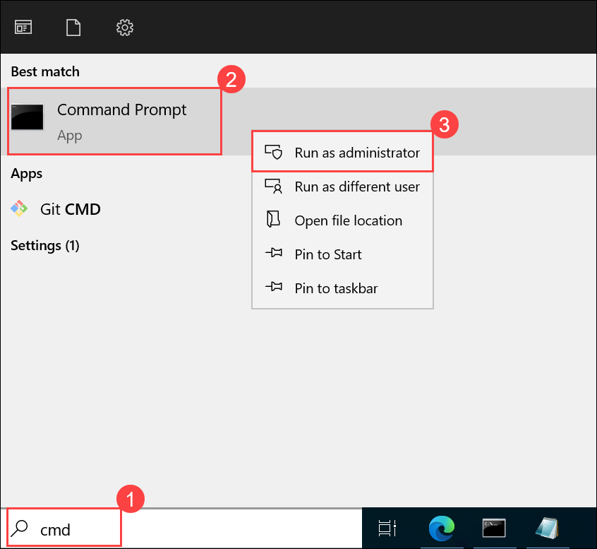

1. If you're prompted with a message saying **Do you want to allow this app to make changes to your device?**, click **Yes** to continue.

    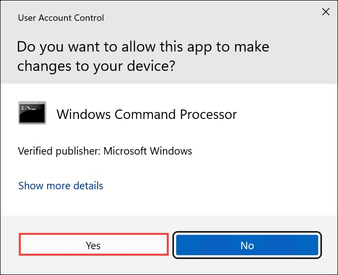

1. Open a new command prompt as Administrator in your jump VM and log in to Azure with the below command **(1)**. Then a pop-up appears for _SignIn_ then choose **Work or school account (2)** and click on **Continue (3)**.
   
    ```bash
    az login
    ```
    

    > **Note:** If you face any error while running the 'az' command, then run the below command to install the Azure CLI and close the command prompt. Re-perform step 1 in a new command prompt as Administrator.

    ```bash
    choco install azure-cli
    ```
    > **Note:** If you are unable to see the pop-up for Signin, minimize the command prompt to view the pop-up window.

1. On the **Sign into Microsoft Azure** tab, you will see the login screen. In that enter the following email/username and then click on **Next**. 

   * Email/Username: <inject key="AzureAdUserEmail"></inject>
   
     
     
1. Now enter the following password and click on **Sign in**.

   * Password: <inject key="AzureAdUserPassword"></inject>
   
     .png "Enter Password")

     >**Note**: During sign-in, you may be prompted with a screen asking: "Sign in to all apps, websites, and services on this device?", Click **No, this app only**.

     .png)

     > **Note:** After running `az login`, if you're prompted to select a **subscription** or **tenant**, simply press **Enter** to continue with the **default subscription** and tenant associated with your account.

     .png)
    
1. Run the following command to set up the Kubernetes cluster connection using kubectl.

   ```bash
   az aks get-credentials -a --name contoso-traders-aks<inject key="DeploymentID" enableCopy="true"/> --resource-group contosoTraders-<inject key="DeploymentID" enableCopy="true"/>
   ```
   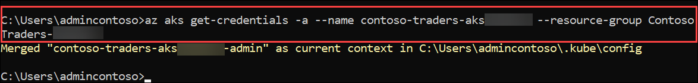

1. Run the following command to set up the Kubernetes cluster connection using kubectl. 

   ```bash
   az aks get-credentials -a --name contoso-traders-aks<inject key="DeploymentID" enableCopy="true"/> --resource-group ContosoTraders-<inject key="DeploymentID" enableCopy="true"/>
   ```

   

1. Run a quick kubectl command to generate a list of nodes to verify if the setup is correct.

   ```bash
   kubectl get nodes
   ```

      

## Task 2: Set up MongoDB Secrets with AKS 

In this task, you will be creating a secret in the Kubernetes cluster to fetch the data from MongoDB.
     
1. Run the following command to create a secret using kubectl. 

    ```sh
    kubectl create secret generic mongodbconnection --from-literal=mongodbconnection=mongodbconnection --namespace=contoso-traders
    ```

    

1. Navigate back to **ContosoTraders-<inject key="DeploymentID" enableCopy="false" />** resource group. Search for **contoso-traders-aks<inject key="DeploymentID" enableCopy="false"/> (1)** and select **contoso-traders-aks<inject key="DeploymentID" enableCopy="false"/> (2)** Kubernetes service. 

     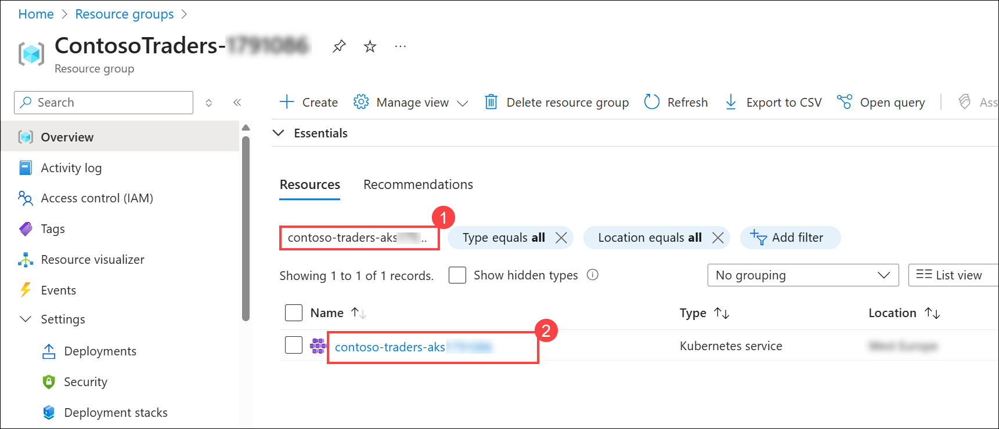
    
1. Select **Configuration (1)** from the left side menu under **Kubernetes resources** and click on **Secrets (2)** section. Under secrets, you should be able to see the newly created `mongodbconnection` secret **(3)**.

     

> **Congratulations** on completing the task! Now, it's time to validate it. Here are the steps:
> - Hit the Validate button for the corresponding task. If you receive a success message, you can proceed to the next task.
> - If not, carefully read the error message and retry the step, following the instructions in the lab guide. 
> - If you need any assistance, please contact us at cloudlabs-support@spektrasystems.com. We are available 24/7 to help you out.

<validation step="c33258ca-4b95-48b4-9483-25b150719d00" />

## Task 3: Deploy a namespace, service, and workload in the Azure Kubernetes Service using the Azure Portal
   
In this task, you will deploy the API Carts application to the Azure Kubernetes Service cluster using the Azure Portal.
   
1. Select **Namespaces (1)** from the left side menu under **Kubernetes resources**. We have already defined a new Namespace for your API deployment. Going further, you will be using the **contoso-traders (2)** namespace only. 

    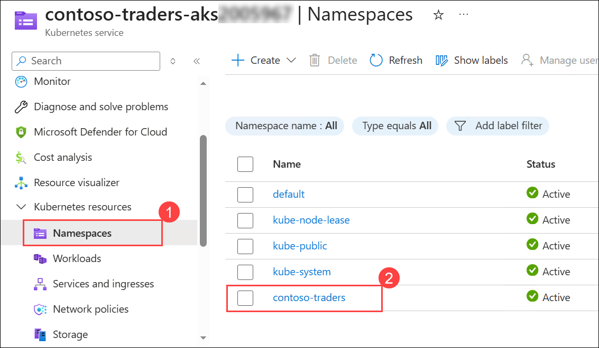
    
1. Select the **Services and ingresses (1)** under **Kubernetes resources** from the left-hand menu. Click on the drop-down arrow, adjacent to **+ Create (2)** and then select **Apply a YAML (3)**.
    
    

1. In the **Apply with YAML** pane, paste the below YAML code, which creates a service in AKS **(1)** and click on **Apply (2)**. Make sure to replace the SUFFIX with the given DeploymentID **<inject key="DeploymentID" enableCopy="true"/>** value in the YAML file.

    >**Info:** The below YAML script will create an AKS service inside the contoso-traders namespace that you have created in the previous steps. AKS Service is an abstract way to expose an application running on a set of Pods as a network service. 

    ```yaml
      #YAML Script
      apiVersion: v1
      kind: Service
      metadata:
        name: contoso-traders-products
        namespace: contoso-traders
        annotations:
          # TODO: Replace 'SUFFIX' in the next line with whatever your ENVIRONMENT GitHub secret value is
          service.beta.kubernetes.io/azure-dns-label-name: contoso-traders-productsSUFFIX
      spec:
        type: LoadBalancer
        ports:
          - port: 80
        selector:
          app: contoso-traders-products
      ```

       

      >**Note:** While entering the YAML code, if you're prompted with the suggestion **Draft with Copilot**, click the **Close** button to dismiss it.
      
      > 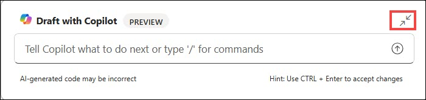
       
1. Select **Workloads (1)** under the **Kubernetes resources** section in the left navigation. With **Deployments** selected by default, select **+ Create (2)** and then choose **Apply a YAML (3)**.

    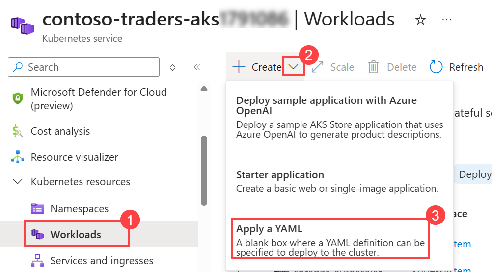

1. In the **Apply with YAML** pane, paste the below **YAML code (1)**, which creates a workload in AKS and click on **Apply (2)**. Make sure to replace the SUFFIX with the given DeploymentID **<inject key="DeploymentID" enableCopy="true"/>** value in the YAML file to update the LOGINSERVER name of the ACR instance.

    >**Info:** The below YAML file will create deployment pods in the namespace contoso-traders. A Kubernetes Deployment tells Kubernetes how to create or modify instances of the pods that hold a containerized application. Deployments can help to efficiently scale the number of replica pods, enable the rollout of updated code in a controlled manner, or roll back to an earlier deployment version if necessary.

   ```YAML
   apiVersion: apps/v1
   kind: Deployment
   metadata:
     name: contoso-traders-products
     namespace: contoso-traders
   spec:
     replicas: 1
     selector:
       matchLabels:
         app: contoso-traders-products
     template:
       metadata:
         labels:
           app: contoso-traders-products
       spec:
         nodeSelector:
           "kubernetes.io/os": linux
         containers:
           - name: contoso-traders-products
             # Note: The '{ENVIRONMENT}' token will be substituted with the value of the ENVIRONMENT GitHub secret by the GitHub workflow.
             image: contosotradersacrSUFFIX.azurecr.io/contosotradersapiproducts:latest
             env:
               - name: KeyVaultEndpoint
                 valueFrom:
                   secretKeyRef:
                     name: contoso-traders-kv-endpoint
                     key: contoso-traders-kv-endpoint
               - name: ManagedIdentityClientId
                 valueFrom:
                   secretKeyRef:
                     name: contoso-traders-mi-clientid
                     key: contoso-traders-mi-clientid
             resources:
               requests:
                 cpu: 50m
                 memory: 64Mi
               limits:
                 cpu: 250m
                 memory: 256Mi
             ports:
               - containerPort: 3001
                 hostPort: 3001
                 protocol: TCP
   ```

   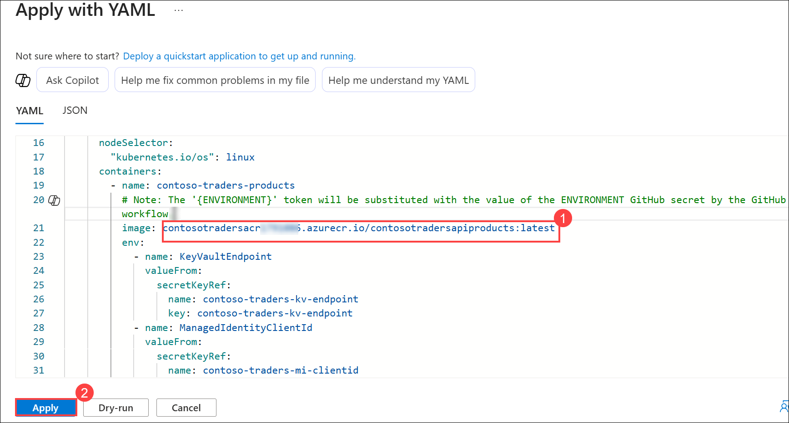

1. After a few minutes, you will see the deployment listed, and it should be in a running state.

   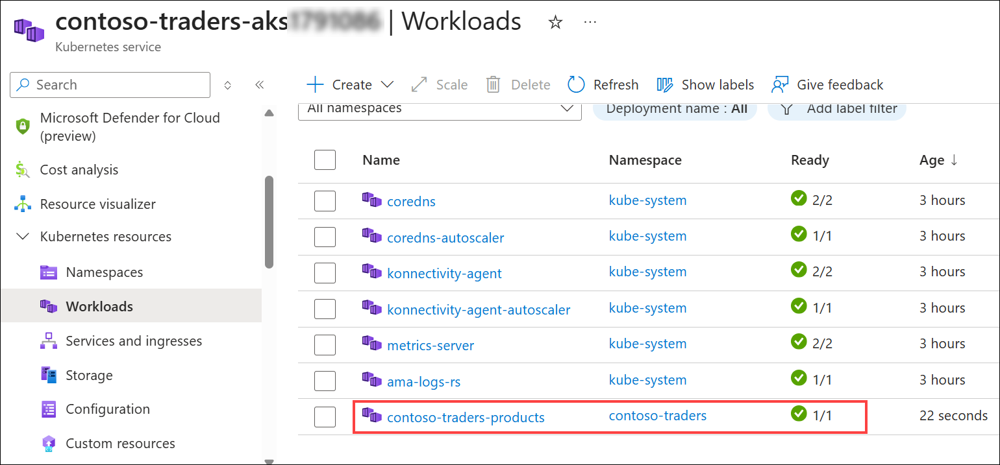

   > **Note:** If the deployment status shows as **0/1** or remains in a failed state (⚠️) instead of running, perform the following steps:

      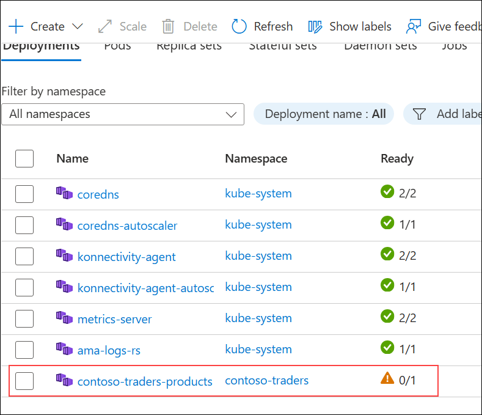

    1. At the top of the Azure Portal, click on the **Cloud Shell (1)** icon to open the Azure Cloud Shell session.

        
    
    1. In the **Welcome to Azure Cloud Shell** dialog, select **PowerShell** to proceed.

        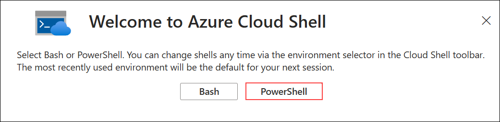

    1. On the **Getting started** dialog:
       - Select **No storage account required (1)**.  
       - Choose your **Subscription (2)** from the drop-down list.  
       - Click **Apply (3)** to continue.  

          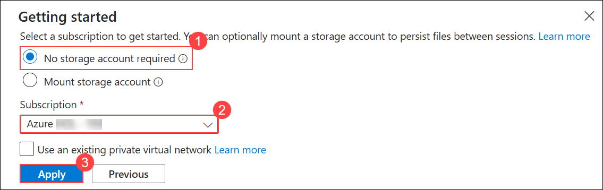

    1. In the Cloud Shell PowerShell session, run the following command to set the Deployment ID:

        ```powershell
        $deploymentId = "<inject key="DeploymentID" enableCopy="true"/>"
        ```

        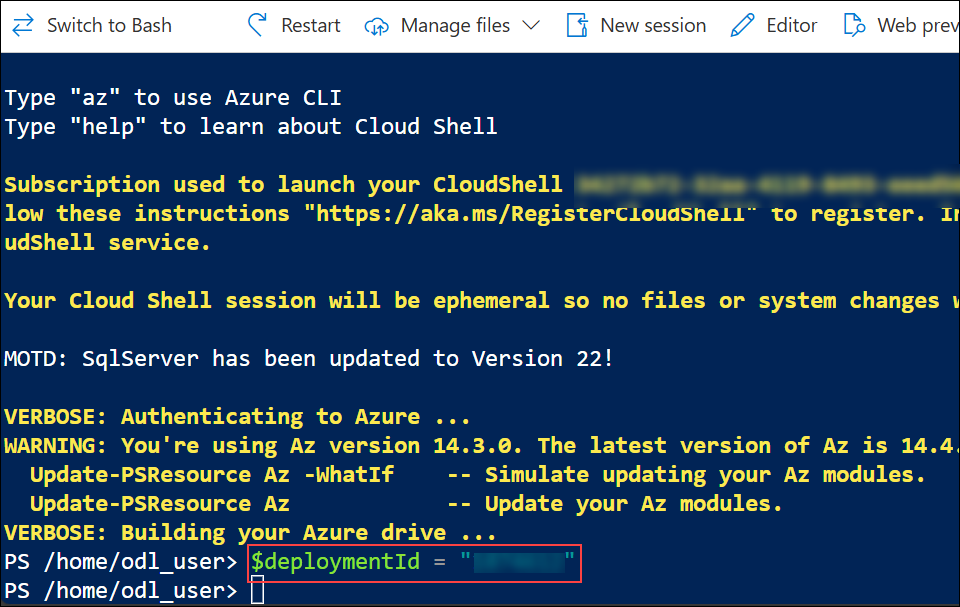
    
    1. Run the following PowerShell commands in the Cloud Shell to configure the required resources and restart the deployment:

        ```powershell
        $RESOURCE_GROUP_NAME = "contosotraders-$deploymentId"
        $AKS_CLUSTER_NAME = "contoso-traders-aks$deploymentId"
        $KV_NAME = "contosotraderskv$deploymentId"
        $USER_ASSIGNED_MANAGED_IDENTITY_NAME = "contoso-traders-mi-kv-access$deploymentId"
        $AKS_NODES_RESOURCE_GROUP_NAME = "contoso-traders-aks-nodes-rg-$deploymentId"
      
        $vmssName = $(az vmss list -g $AKS_NODES_RESOURCE_GROUP_NAME --query "[0].name" -o tsv)
        if (-not $vmssName) { Write-Host "VMSS not found." -ForegroundColor Red; exit }
      
        $identityId = $(az identity show --name $USER_ASSIGNED_MANAGED_IDENTITY_NAME --resource-group $RESOURCE_GROUP_NAME --query "id" -o tsv)
        if (-not $identityId) { Write-Host "Managed Identity not found." -ForegroundColor Red; exit }
      
        $assignedIdentities = $(az vmss identity show -g $AKS_NODES_RESOURCE_GROUP_NAME -n $vmssName --query "userAssignedIdentities" -o json)
        if ($assignedIdentities -notlike "*$identityId*") {
            az vmss identity assign --name $vmssName --resource-group $AKS_NODES_RESOURCE_GROUP_NAME --identities $identityId
        }
      
        $principalId = $(az identity show --name $USER_ASSIGNED_MANAGED_IDENTITY_NAME --resource-group $RESOURCE_GROUP_NAME --query "principalId" -o tsv)
        $policyCheck = $(az keyvault show --name $KV_NAME --query "properties.accessPolicies[?objectId=='$principalId' && permissions.secrets[?@=='get' || @=='list']].permissions.secrets" -o json)
        if ($policyCheck -notlike "*get*" -or $policyCheck -notlike "*list*") {
            az keyvault set-policy --name $KV_NAME --secret-permissions get list --object-id $principalId
        }
      
        az aks get-credentials --resource-group $RESOURCE_GROUP_NAME --name $AKS_CLUSTER_NAME --overwrite-existing
        kubectl rollout restart deployment contoso-traders-products -n contoso-traders
        ```
      1. Wait for **2–3 minutes** to allow the deployment status to update. 

## Task 4: Deploy a service & workload using kubectl

In this task, you will deploy the web service & its workload using kubectl.

1. Open a **File Explorer** from your JumpVM.

1. Navigate to `C:\LabFiles` **(1)** directory and select `web.deployment.yml` **(2)** file. Right-click and select **Open** **(3)** to open the file in VS Code.

   

1. Make sure to update the **SUFFIX** with the given DeploymentID **<inject key="DeploymentID" enableCopy="true"/>** value in the YAML file to match the name of your ACR Login Server.

    

1. Save the changes by **CTRL + S** button to **Save**.

1. Navigate back to the Windows command prompt and run the command below to change the directory to the `~/LabFiles` folder.

    ```bash
    cd C:/LabFiles
    ```

1. Log in to Azure if not already done with the below command after updating the values in the command.

    ```bash
    az login -u <inject key="AzureAdUserEmail"></inject> -p <inject key="AzureAdUserPassword"></inject>
    ```

1. Execute the command below to deploy the application described in the YAML files. You will receive a message indicating the item `kubectl` has created a web deployment and a web service.

   >**Info:** The below kubectl command will create the Deployment workload and Service in the namespace that we have defined in the YAML files. 

    ```bash
    kubectl create --save-config=true -f web.deployment.yml -f web.service.yml 
    ```

    

1. Return to the AKS blade in the Azure Portal. From the navigation menu, select the **Services and ingresses (1)** under **Kubernetes resources**. You should be able to access the website via an **External IP (2)**.

    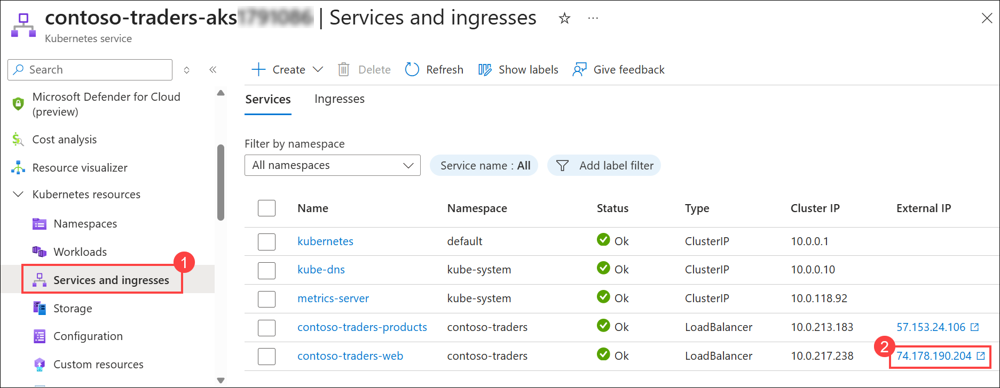

    

    > **Note:** This may take 1–2 minutes to load. Thank you for your patience!

## Summary

In this exercise, you have accomplished the following:

- Task 1: Tunnelled into the Azure Kubernetes Service cluster
- Task 2: Set up MongoDB Secrets with AKS 
- Task 3: Deployed a namespace, service, and workload in the Azure Kubernetes Service using the Azure Portal
- Task 4: Deployed a service & workload using kubectl

### You have successfully completed the lab.
