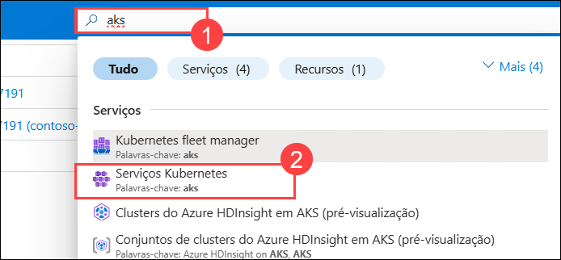

# Exercício 6: Azure Monitor para contentores

### Duração estimada: 20 minutos

## Visão geral

Neste exercício, irá analisar os insights do contentor no Azure Monitor para o cluster AKS. O Azure Monitor ajuda-o a maximizar a disponibilidade e o desempenho das suas aplicações e serviços. Oferece uma solução abrangente para recolher, analisar e atuar na telemetria dos seus ambientes de cloud e locais.

Alguns exemplos do que pode fazer com o Azure Monitor incluem:

- Detetar e diagnosticar problemas em aplicações e dependências com o Application Insights.
- Correlacionar problemas de infraestrutura com insights de VM e insights de contentores.
- Recolher dados de recursos monitorizados utilizando métricas do Azure Monitor.

## Objectivos do Laboratório

Poderá completar as seguintes tarefas:

- Tarefa 1: Rever as métricas do Azure Monitorar

### Tarefa 1: Rever as métricas do Azure Monitorar

Nesta tarefa, irá rever o cluster AKS monitorizado.

1. Navegue de volta para o portal do Azure e procure **aks (1)**, selecione **Serviços Kubernetes (2)** no resultado.

    

1. Na página Serviços Kubernetes, selecione **contoso-traders-aks<inject key="DeploymentID" enableCopy="false"/>**.

    
   
1. Navegue até a seção **Monitorar** folha de recursos do serviço Kubernetes, você poderá ver alguns logs.
   
    > **Nota**: O Monitorar do Azure pode demorar até 15 minutos a preencher os dados na folha de insights.

    

<validation step="ba51688d-c5b8-43c8-811c-e78e9a5539ce" />

> **Parabéns** por concluir a tarefa! Agora é hora de validá-lo. Aqui estão as etapas:
> - Se você receber uma mensagem de sucesso, poderá prosseguir para a próxima tarefa.
> - Caso contrário, leia atentamente a mensagem de erro e repita a etapa, seguindo as instruções do guia do laboratório.
> - Se precisar de ajuda, entre em contato conosco em cloudlabs-support@spektrasystems.com. Estamos disponíveis 24/7 para ajudá-lo.        

## Sumário

Neste exercício, reviu os insights do contentor do Azure Monitor para o cluster AKS.

### Concluiu o laboratório com sucesso
