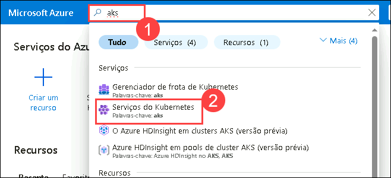

# Exercício 6: Azure Monitor para contentores

### Duração estimada: 20 minutos

## Visão geral

Neste exercício, irá analisar os insights do contentor no Azure Monitor para o cluster AKS. O Azure Monitor ajuda-o a maximizar a disponibilidade e o desempenho das suas aplicações e serviços. Oferece uma solução abrangente para recolher, analisar e atuar na telemetria dos seus ambientes de cloud e locais.

Alguns exemplos do que pode fazer com o Azure Monitor incluem:

- Detetar e diagnosticar problemas em aplicações e dependências com o Application Insights.
- Correlacionar problemas de infraestrutura com insights de VM e insights de contentores.
- Recolher dados de recursos monitorizados utilizando métricas do Azure Monitor.

## Objectivos do Laboratório

Poderá completar as seguintes tarefas:

- Tarefa 1: Rever as métricas do Azure Monitorar

### Tarefa 1: Rever as métricas do Azure Monitorar

Nesta tarefa, irá rever o cluster AKS monitorizado.

1. Navegue de volta para o portal do Azure e procure **aks (1)**, selecione **Serviços do Kubernetes (2)** no resultado.

    

1. Na página Serviços Kubernetes, selecione contoso-traders-aks<inject key="DeploymentID" enableCopy="false"/>
   
1. Na seção Insights, em monitoramento na folha de recursos do serviço Kubernetes, você poderá ver alguns logs.
   
    > **Nota**: O Monitor do Azure pode demorar até 15 minutos a preencher os dados na folha de insights.

    .png "Definir réplicas para 2")

## Sumário

Neste exercício, reviu os insights do contentor do Azure Monitor para o cluster AKS.

### Concluiu o laboratório com sucesso
