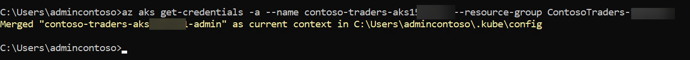
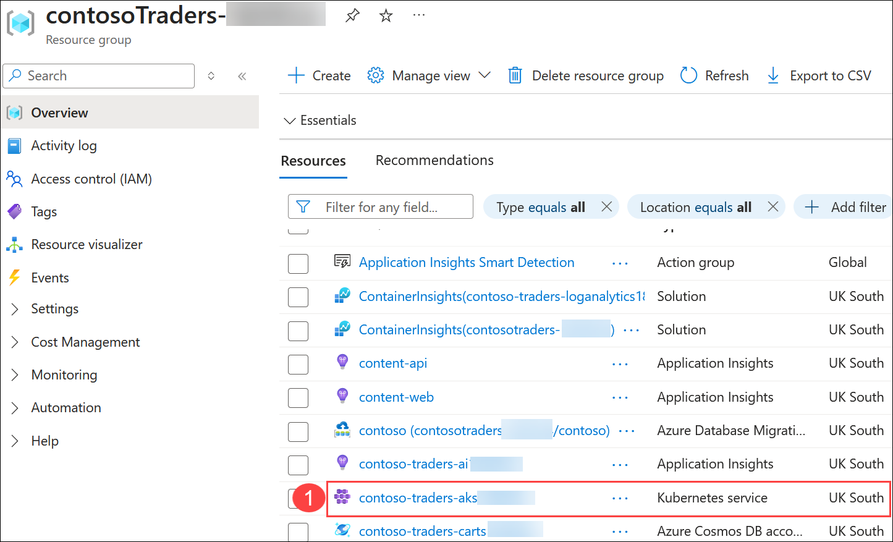
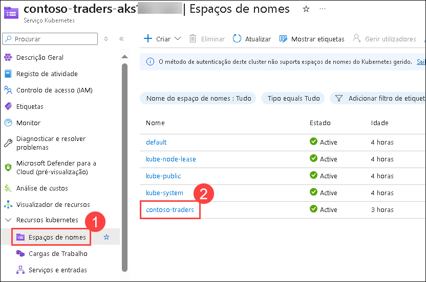
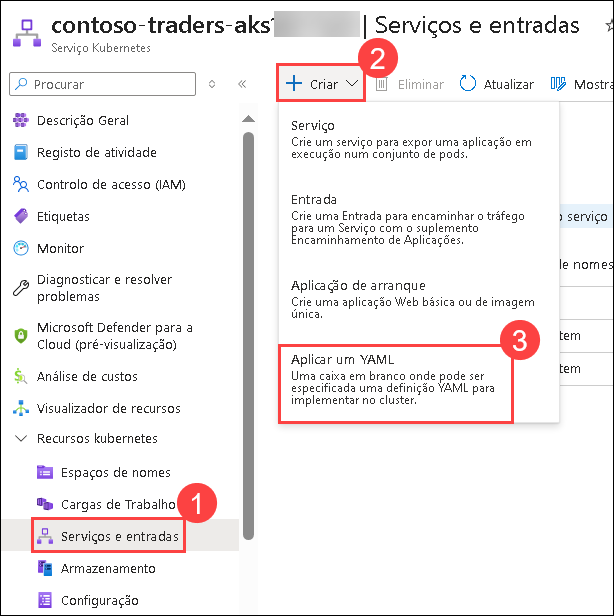
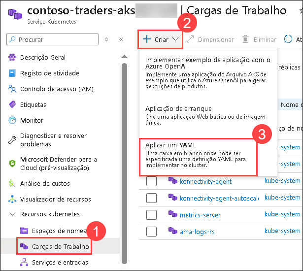
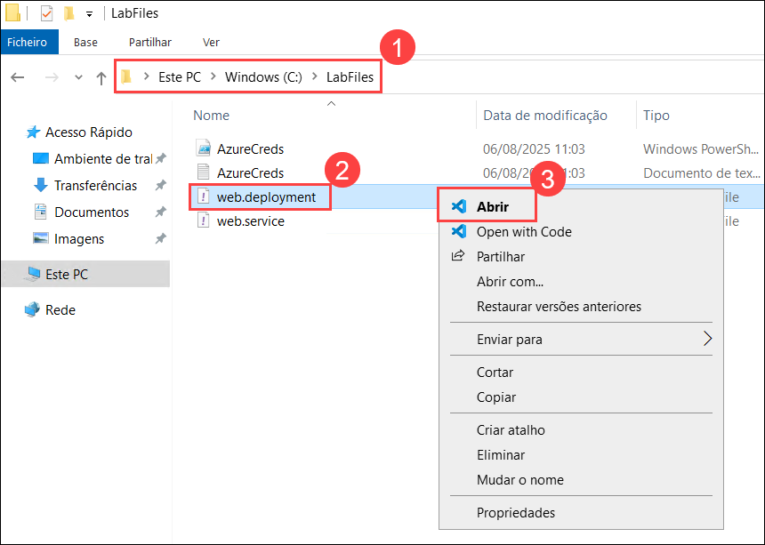
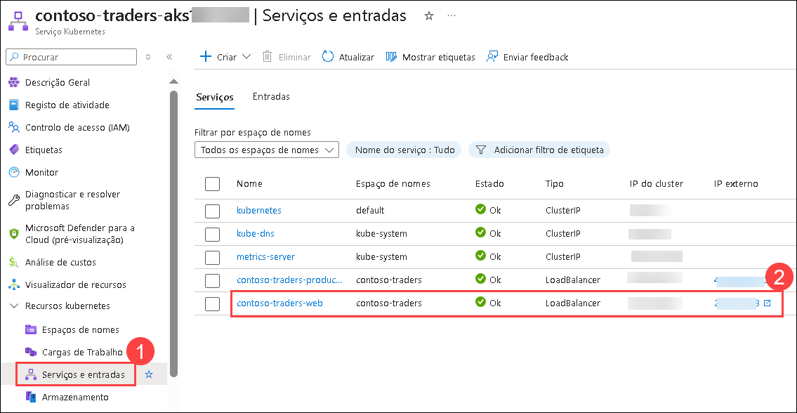

# Exercício 3: Implantar a aplicação no Serviço Azure Kubernetes

### Duração estimada: 120 Minutos

## Visão geral

Neste exercício, você implantará sua aplicação web em contêineres no Serviço de Kubernetes do Azure (AKS) usando o Azure Key Vault para gerenciar segredos e o Azure Container Registry (ACR), onde as imagens da aplicação web em contêineres estão armazenadas. Além disso, você explorará dois métodos diferentes para implantar a aplicação no AKS.

## Objetivos do Laboratório

Você será capaz de completar as seguintes tarefas:

- Tarefa 1: Conectar-se ao cluster do Serviço de Kubernetes do Azure
- Tarefa 2: Implantar um namespace, serviço e carga de trabalho no Serviço de Kubernetes do Azure
- Tarefa 3: Implantar um serviço e carga de trabalho usando o kubectl

### Tarefa 1: Conectar-se ao cluster do Serviço de Kubernetes do Azure

Nesta tarefa, você coletará as informações necessárias sobre seu cluster do Serviço de Kubernetes do Azure (AKS) para estabelecer uma conexão e acessar o painel de gerenciamento do Kubernetes a partir do Cloud Shell.

> **Observação**: As tarefas a seguir devem ser executadas no **prompt de comando**.

1. Abra um novo prompt de comando como Administrador em sua VM de salto (jump VM) e faça login no Azure com o comando abaixo.

    ```bash
    az login -u <inject key="AzureAdUserEmail"></inject> -p <inject key="AzureAdUserPassword"></inject>
    ```

    

     > **Observação:** Se ocorrer algum erro ao executar o comando az, utilize o comando abaixo para instalar a CLI do Azure. Em seguida, feche o prompt de comando e repita o passo 1 em um novo prompt de comando aberto como Administrador.

     ```bash
     choco install azure-cli
     ```

1. Execute o comando a seguir para configurar a conexão do cluster Kubernetes usando o kubectl.

    ```bash
    az aks get-credentials -a --name contoso-traders-aks<inject key="DeploymentID" enableCopy="true"/> --resource-group ContosoTraders-<inject key="DeploymentID" enableCopy="true"/>
    ```

    

1. Execute um comando rápido do kubectl para gerar uma lista de nós e verificar se a configuração está correta.

    ```bash
    kubectl get nodes
    ```

    

### Tarefa 2: Implantar um namespace, serviço e carga de trabalho no Serviço de Kubernetes do Azure

Nesta tarefa, você definirá um Serviço Kubernetes para sua API para permitir a acessibilidade interna da aplicação dentro do cluster do Serviço de Kubernetes do Azure (AKS).

1. Navegue de volta para o grupo de recursos **contosoTraders-<inject key="DeploymentID" />** e selecione o serviço **Kubernetes contoso-traders-aks<inject key="DeploymentID" />** **(1)**.



1. Já definimos um novo **Namespaces (1)** para a sua implementação de API. Daqui para frente, apenas utilizará o espaços de nomes **contoso-traders (2)**.

   

1. Na página do recurso **contoso-traders-aks<inject key="DeploymentID" enableCopy="false"/>**, clique na seção **Recursos do Kubernetes**, selecione **Serviços e entradas (1)**, em seguida, selecione **+ Criar (2)** e clique em **Aplicar um YAML (3)**. 

   

1. No painel **Aplicar um YAML**, cole o código YAML abaixo que cria um serviço no AKS **(1)** e clique em **Aplicar (2)**. Certifique-se de que substitui o `SUFFIX` pelo valor DeploymentID **<inject key="DeploymentID" enableCopy="true"/>** fornecido no arquivo YAML.

   >**Observação**: O script YAML abaixo criará um serviço AKS no namespace **contoso-traders**, previamente configurado nos passos anteriores. Esse serviço fornece uma abstração para expor uma aplicação em execução em um conjunto de Pods como um serviço de rede, facilitando o acesso e a comunicação dentro do cluster.

    ```yaml
      #YAML Script
      apiVersion: v1
      kind: Service
      metadata:
        name: contoso-traders-products
        namespace: contoso-traders
        annotations:
          # TODO: Replace 'SUFFIX' in the next line with whatever your ENVIRONMENT GitHub secret value is
          service.beta.kubernetes.io/azure-dns-label-name: contoso-traders-productsSUFFIX
      spec:
        type: LoadBalancer
        ports:
          - port: 80
        selector:
          app: contoso-traders-products
      ```   

    

    **Observação:** Certifique-se de que a identação do seu script YAML siga exatamente o formato mostrado na imagem, a fim de evitar erros de execução.

1. No menu de navegação à esquerda, na seção Recursos do Kubernetes, selecione **Cargas de trabalho** **(1)**. Clique em **+ Criar** **(2)** e escolha **Aplicar um YAML** **(3)**.

   

1. No painel Aplicar com YAML, cole o código abaixo — que cria uma carga de trabalho no AKS — e clique em **Aplicar (2)**. Lembre-se de substituir `SUFFIX` pelo DeploymentID **<inject key="DeploymentID" enableCopy="true"/>** **(1)**, conforme indicado no arquivo YAML, para atualizar corretamente o campo `LOGINSERVER` da instância do ACR.

    >**Observação**: O arquivo YAML abaixo criará pods de implantação no namespace `contoso-traders`. Uma Implantação do Kubernetes informa ao Kubernetes como criar ou modificar instâncias dos pods que contêm uma aplicação em contêineres. As Implantações podem ajudar a escalar eficientemente o número de pods de réplica, permitir o lançamento de código atualizado de maneira controlada ou reverter para uma versão de implantação anterior, se necessário.

    ```YAML
    apiVersion: apps/v1
    kind: Deployment
    metadata:
     name: contoso-traders-products
     namespace: contoso-traders
    spec:
     replicas: 1
     selector:
       matchLabels:
         app: contoso-traders-products
     template:
       metadata:
         labels:
           app: contoso-traders-products
       spec:
         nodeSelector:
           "kubernetes.io/os": linux
         containers:
           - name: contoso-traders-products
             image: contosotradersacrSUFFIX.azurecr.io/contosotradersapiproducts:latest
             env:
               - name: KeyVaultEndpoint
                 valueFrom:
                   secretKeyRef:
                     name: contoso-traders-kv-endpoint
                     key: contoso-traders-kv-endpoint
               - name: ManagedIdentityClientId
                 valueFrom:
                   secretKeyRef:
                     name: contoso-traders-mi-clientid
                     key: contoso-traders-mi-clientid
             resources:
               requests:
                 cpu: 50m
                 memory: 64Mi
               limits:
                 cpu: 250m
                 memory: 256Mi
             ports:
               - containerPort: 3001
                 hostPort: 3001
                 protocol: TCP
    ```

   

1. Após alguns minutos, você verá a implantação listada e ela deverá estar em estado de execução.

   

> **Parabéns** por concluir a tarefa! Agora, é hora de validá-la. Aqui estão os passos:
> - Se você receber uma mensagem de sucesso, poderá prosseguir para a próxima tarefa.
> - Caso contrário, leia atentamente a mensagem de erro e repita a etapa, seguindo as instruções do guia do laboratório.
> - Se precisar de ajuda, entre em contato conosco em cloudlabs-support@spektrasystems.com. Estamos disponíveis 24/7 para ajudá-lo.

<validation step="8e8b8774-50eb-413f-84e0-c1861a2b10b7" />   

### Tarefa 3: Implantar um serviço e carga de trabalho usando o kubectl

Nesta tarefa, você implantará o serviço web e sua carga de trabalho usando o kubectl.

1. Abra um **Explorador de arquivos** na máquina virtual do laboratório.

1. Navegue até ao diretório `C:\LabFiles` **(1)** e selecione o arquivo `web.deployment.yml` **(2)**. Clique com o botão direito e selecione **Abrir** **(3)** para abrir o arquivo no VS Code.

      

1. Certifique-se de que atualiza o SUFFIX com o valor DeploymentID **<inject key="DeploymentID" enableCopy="true"/>** fornecido no arquivo YAML para corresponder ao nome do seu servidor de início de sessão ACR.

      

1. Salve as alterações com o atalho **CTRL + S**.

1. Navegue de volta para o prompt de comando do Windows e execute o comando abaixo para mudar o diretório para a pasta `~/LabFiles`.

      ```bash
      cd C:/LabFiles
      ```

          

1. Faça login no Azure, se ainda não o fez, com o comando abaixo após atualizar os valores.

      ```
      az login -u <inject key="AzureAdUserEmail"></inject> -p <inject key="AzureAdUserPassword"></inject>
      ```

1. Execute o comando abaixo para implementar a aplicação descrita nos arquivos YAML. Você receberá uma mensagem indicando que o item `kubectl` criou uma implementação web e um serviço web.

      ```bash
      kubectl create --save-config=true -f web.deployment.yml -f web.service.yml
      ```

      

      > **Observação**:  O comando kubectl abaixo criará a carga de trabalho de Implantação e o Serviço no namespace que definimos nos arquivos YAML.

1. Retorne ao painel do AKS no Portal do Azure. No menu de navegação, selecione **Serviços e entradas (1)** em **Recursos do Kubernetes**. Você deve conseguir acessar o site através de um **IP Externo (2)**.

      

      

1. Clique no botão **Próximo** localizado no canto inferior direito deste guia de laboratório para continuar com o exercício seguinte.

> **Parabéns** por concluir a tarefa! Agora, é hora de validá-la. Aqui estão os passos:
> - Se você receber uma mensagem de sucesso, poderá prosseguir para a próxima tarefa.
> - Caso contrário, leia atentamente a mensagem de erro e repita a etapa, seguindo as instruções do guia do laboratório.
> - Se precisar de ajuda, entre em contato conosco em cloudlabs-support@spektrasystems.com. Estamos disponíveis 24/7 para ajudá-lo. 

<validation step="a9fa4d00-ae23-4b56-a3e3-ee1f2effdfb2" />  

## Resumo

Neste exercício, você implantou sua aplicação web em contêineres no AKS, que contém o namespace, serviço e carga de trabalho no Kubernetes do Azure. Além disso, você criou um serviço para o AKS e acessou o site usando um endpoint externo.

### Você concluiu o laboratório com sucesso. Clique em Próximo >>  para prosseguir para o próximo exercício.


