# Exercício 1: Criar imagens Docker para a aplicação

### Duração estimada: 65 Minutos

## Visão geral

Neste exercício, você aprenderá como conteinerizar a aplicação Contoso Traders usando imagens Docker. Aplicações conteinerizadas rodam em ambientes de execução isolados chamados contêineres. Uma imagem Docker é um arquivo usado para construir e executar o código em um contêiner Docker. As imagens Docker funcionam como um conjunto de instruções para construir um contêiner Docker, como um modelo. Além disso, você enviará as imagens Docker criadas para o Azure Container Registry.

## Objetivos do Laboratório

Você será capaz de completar as seguintes tarefas:

- Tarefa 1: Configurar uma infraestrutura local com a VM Linux
- Tarefa 2: Criar imagens Docker para conteinerizar a aplicação e enviá-las para o registro de contêiner

### Tarefa 1: Configurar uma infraestrutura local com a VM Linux

Nesta tarefa, você se conectará à VM do agente de Build usando o Prompt de Comando e clonará o repositório GitHub do site Contoso Traders.

1. Depois de iniciar sessão na VM, pesquise **CMD** **(1)** na barra de pesquisa do Windows e clique em **Prompt de Comando** **(2)** para abrir.

   

1. Execute o comando **<inject key="Command to Connect to Build Agent VM" enableCopy="true" />** para se conectar à VM Linux usando SSH.

    >**Observação**: No prompt de comando, digite **yes** e pressione **Enter** para a pergunta `Are you sure you want to continue connecting (yes/no/[fingerprint])?`

1. Assim que o SSH estiver conectado à VM, por favor, insira a senha da VM fornecida abaixo:

    * Senha: **<inject key="Build Agent VM Password" enableCopy="true" />**

      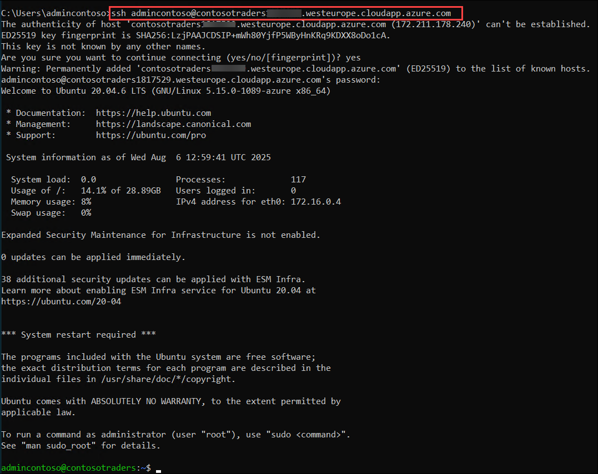

      >**Observação**: Por favor, observe que ao digitar a senha, você não conseguirá vê-la por questões de segurança.

1. Uma vez que a VM esteja conectada, execute o seguinte comando para navegar até o repositório GitHub clonado que usaremos no laboratório.

    ``` 
    cd Cloud-Native-Application/labfiles/
    ```
    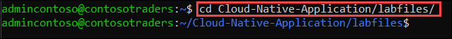
   
     > **Observação:** Se receber uma mensagem de saída a informando - `destination path 'Cloud-Native-Application/labfiles' No such file or directory`, por favor, execute o comando a seguir e, em seguida, refaça o passo 4 da tarefa.

    ```
    git clone https://github.com/CloudLabsAI-Azure/Cloud-Native-Application
    ```

    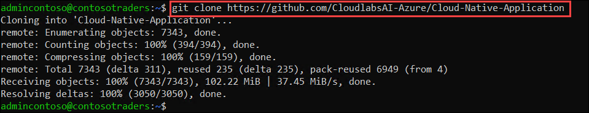

    > **Observação:** Se você receber uma mensagem de saída informando - `destination path 'Cloud-Native-Application' already exists and is not an empty directory`, por favor, execute os seguintes comandos e, em seguida, refaça o comando "git clone" e repita o Passo 4 para navegar até o repositório clonado.
    
    ```
    sudo su
    rm -rf Cloud-Native-Application
    exit
    ```

   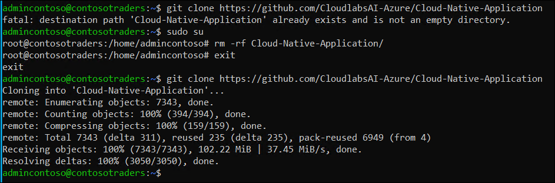

### Tarefa 2: Criar imagens Docker para conteinerizar a aplicação e enviá-las para o registro de contêiner

Nesta tarefa, você irá construir as imagens Docker para conteinerizar a aplicação e, subsequentemente, enviá-las para o **Azure Container Registry (ACR)** para uso posterior no **Azure Kubernetes Service (AKS)**.

1. Certifique-se de que você está no diretório **labfiles** antes de prosseguir com os próximos passos, pois o build do Docker precisa acessar o Dockerfile para criar a imagem.

     ```
    cd Cloud-Native-Application/labfiles/
    ```

1. Execute o comando abaixo para baixar o Azure CLI,

   ```
   sudo apt install azure-cli
   ```

   >**Observação:** No prompt de comando, digite **Y** e pressione **Enter** para a pergunta **Do you want to continue? [Y/n]**.

1. Execute o comando abaixo para fazer login no Azure. Navegue até a URL de login do dispositivo `https://microsoft.com/devicelogin` no navegador e copie o código de autenticação.

    ```
    az login
    ```

   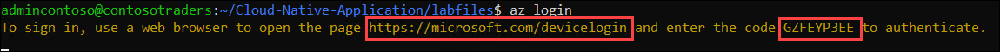

   >**Observação:** Se você receber um erro `command az not found`, execute o comando `sudo apt install azure-cli` para instalar a CLI do Azure.

1. Insira o **código de autenticação** copiado **(1)** e clique em **Avançar** **(2)**.

   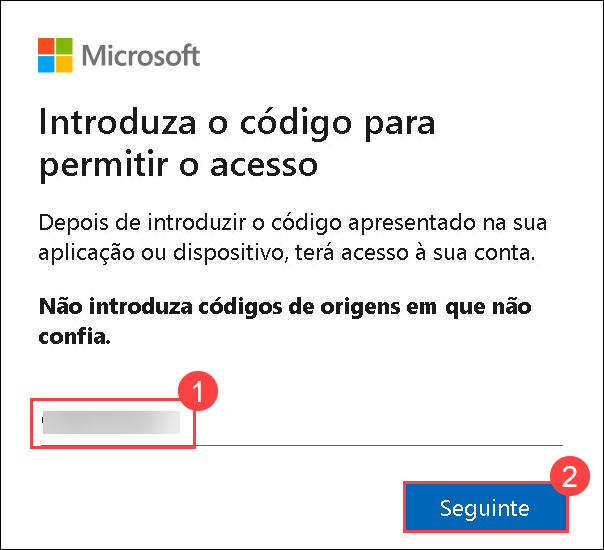

1. Na aba **Entrar no Microsoft Azure**, você verá uma tela de login. Insira o seguinte e-mail/nome de usuário e clique em**Avançar**.

    * E-mail/Usuário: **<inject key="AzureAdUserEmail"></inject>**

1. Agora digite a seguinte senha e clique em **Entrar**.

    * Senha: **<inject key="AzureAdUserPassword"></inject>**

1. Em um pop-up para confirmar o login na CLI do Microsoft Azure, clique em **Continuar**.

   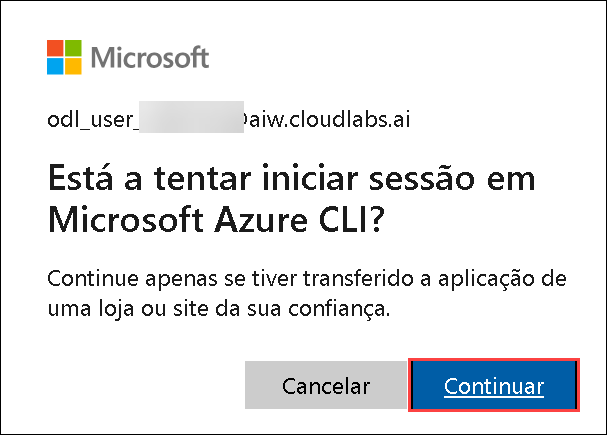

1. Assim que fizer login no Azure, volte para o prompt de comando. Agora você irá construir as imagens Docker nos próximos passos e enviá-las para o ACR.

   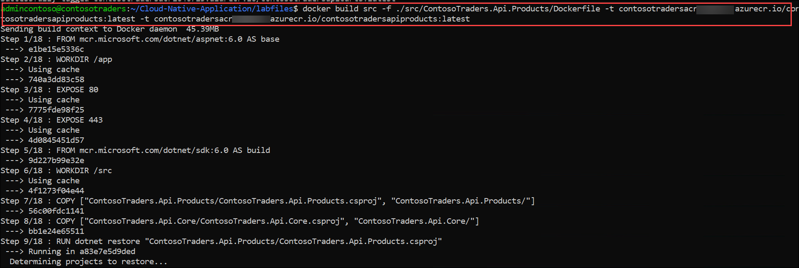

1. Agora, crie a imagem docker **contosotraders-carts** utilizando o Dockerfile no diretório. Observe como o Azure Container Registry implantado é referenciado.

    ```
    docker build src -f ./src/ContosoTraders.Api.Carts/Dockerfile -t contosotradersacr<inject key="DeploymentID" enableCopy="false"/>.azurecr.io/contosotradersapicarts:latest -t contosotradersacr<inject key="DeploymentID" enableCopy="false"/>.azurecr.io/contosotradersapicarts:latest
    ```

   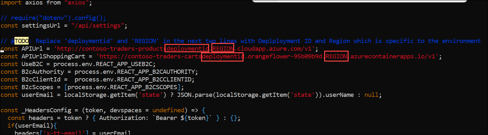

   >**Observação**:  Este passo pode levar de 1 a 2 minutos para construir a imagem docker.

1. Repita os passos para criar a imagem docker **contosotraders-Products** com o comando abaixo.

    ```
    docker build src -f ./src/ContosoTraders.Api.Products/Dockerfile -t contosotradersacr<inject key="DeploymentID" enableCopy="false"/>.azurecr.io/contosotradersapiproducts:latest -t contosotradersacr<inject key="DeploymentID" enableCopy="false"/>.azurecr.io/contosotradersapiproducts:latest
    ```

   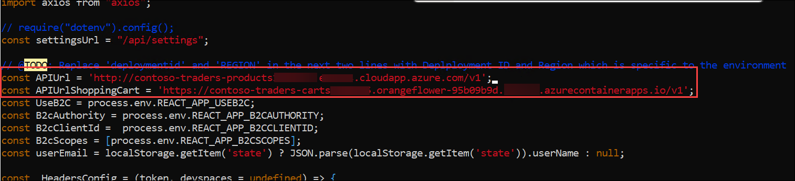

   >**Observação**: Este passo pode levar de 1 a 2 minutos para construir a imagem docker.

1. Execute o comando abaixo para mudar para o diretório `services` e abra o arquivo `configService.js`.

    ```
    cd src/ContosoTraders.Ui.Website/src/services
    sudo chmod 777 configService.js
    vi configService.js
    ```

   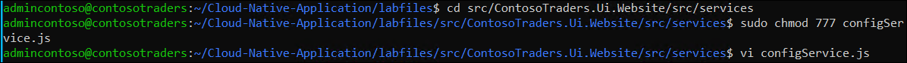

1. No editor `vi`, pressione **_i_** para entrar no modo `insert`.  Substitua os valores de **deploymentid** **<inject key="DeploymentID" enableCopy="true"/>** e **REGION** **<inject key="Region" enableCopy= "true"/>** fornecidos na `APIUrl`. Em seguida, pressione **_ESC_**, escreva **_:wq_** para salvar suas alterações e feche o arquivo. Precisamos atualizar a URL da API aqui para que a aplicação Contoso Traders possa se conectar à API de produtos assim que for enviada para os contêineres do AKS.

    >**Observação**: Se **_ESC_** não funcionar pressione `ctrl + [` e depois escreva **_:wq_** para salvar suas alterações e fechar o arquivo.

    ```
    const APIUrl = 'http://contoso-traders-products<inject key="DeploymentID" enableCopy="true"/>.<inject key="Region" enableCopy="true"/>.cloudapp.azure.com/v1';
    const APIUrlShoppingCart = 'https://contoso-traders-carts<inject key="DeploymentID" enableCopy="true"/>.orangeflower-95b09b9d.<inject key="Region" enableCopy="true"/>.azurecontainerapps.io/v1';
    ```

   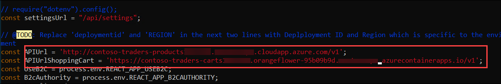

1. Execute o comando abaixo para mudar para o diretório da pasta `ContosoTraders.Ui.Website`.

    ```
    cd
    cd Cloud-Native-Application/labfiles/src/ContosoTraders.Ui.Website
    ```

1. Agora, crie a imagem docker **contosotraders-UI-Website** com o comando abaixo.

    ```
    docker build . -t contosotradersacr<inject key="DeploymentID" enableCopy="true"/>.azurecr.io/contosotradersuiweb:latest -t contosotradersacr<inject key="DeploymentID" enableCopy="true"/>.azurecr.io/contosotradersuiweb:latest
    ```

   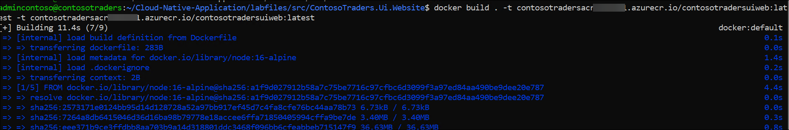

   >**Observação**: Por favor, esteja ciente de que o comando acima pode levar até 5 minutos para concluir a construção. Antes de tomar qualquer outra ação, certifique-se de que ele foi executado com sucesso.

1. Redirecione para o diretório **labfiles** antes de executar os próximos passos.

    ```
    cd
    cd Cloud-Native-Application/labfiles/
    ```

1. Observe as imagens Docker construídas executando o comando `docker image ls`. As imagens são marcadas com a tag `latest`. Também é possível usar outros valores de tag para versionamento.

    ```
    docker image ls
    ```

   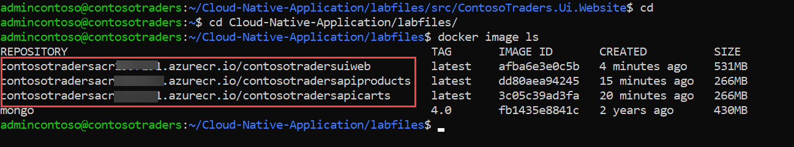

1. Navegue até ao portal Azure, abra o registro de contêiner **contosotradersacr<inject key="DeploymentID" enableCopy="false" />** a partir do grupo de recursos **contosoTraders-<inject key="DeploymentID" enableCopy="false" />**.

   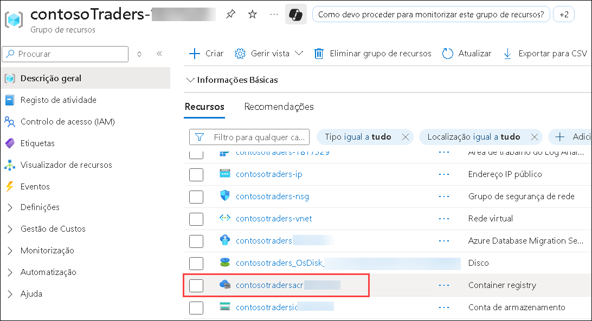

1. Na página do registro de contêiner **contosotradersacr<inject key="DeploymentID" enableCopy="false" /> (1)**, selecione **Chaves de acesso (2)** m Configurações no menu do lado esquerdo. Clique em **Mostrar (3)** e depois **Copie (4)** a senha e cole-a em um bloco de notas para uso posterior.

   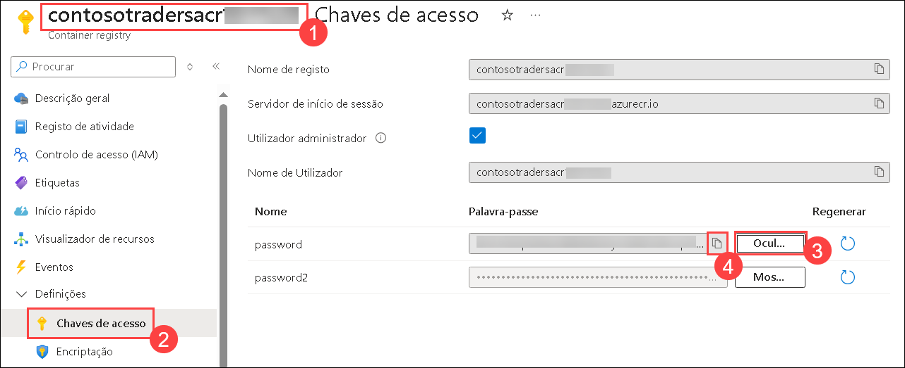

1. Agora, faça login no ACR usando o comando abaixo. Por favor, atualize o valor da **senha** do ACR no comando. Você deverá ver a saída mostrada na captura de tela. Certifique-se de substituir a senha pela senha do registro de contêiner que você copiou no passo anterior.

    ```
    docker login contosotradersacr<inject key="DeploymentID" enableCopy="true"/>.azurecr.io -u contosotradersacr<inject key="DeploymentID" enableCopy="true"/> -p [password]
    ```

   

1. Depois de fazer login no ACR, execute os seguintes comandos para enviar as imagens Docker para o registro de contêiner do Azure.

    ```
    docker push contosotradersacr<inject key="DeploymentID" enableCopy="true"/>.azurecr.io/contosotradersapicarts:latest 
    ```

    ```
    docker push contosotradersacr<inject key="DeploymentID" enableCopy="true"/>.azurecr.io/contosotradersapiproducts:latest
    ```

    ```
    docker push contosotradersacr<inject key="DeploymentID" enableCopy="true"/>.azurecr.io/contosotradersuiweb:latest
    ```

1. Você deverá ver a imagem Docker sendo enviada para o ACR, como mostrado na captura de tela abaixo.

   

1. Clique no botão **Próximo** localizado no canto inferior direito deste guia de laboratório para continuar com o próximo exercício.

## Resumo

Neste exercício, você conteinerizou completamente sua aplicação web com a ajuda do Docker e a enviou para o registro de contêiner.

### Você completou o laboratório com sucesso. Clique em "Próximo" para prosseguir para o próximo exercício.


