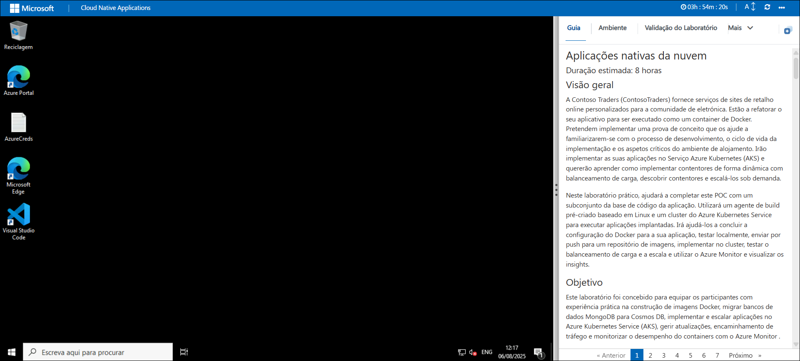
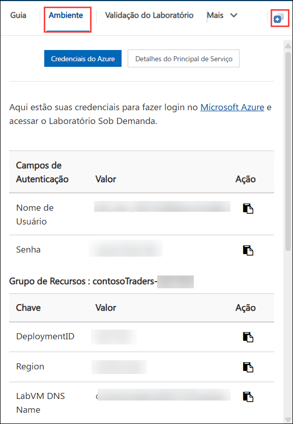
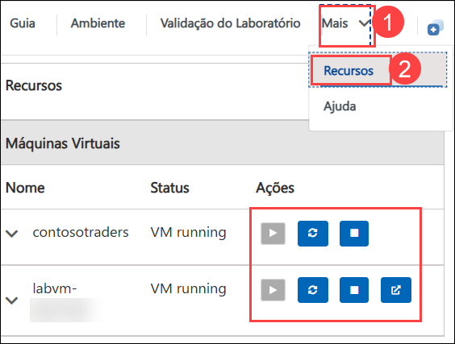
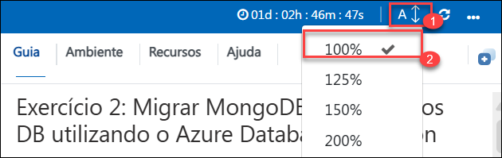
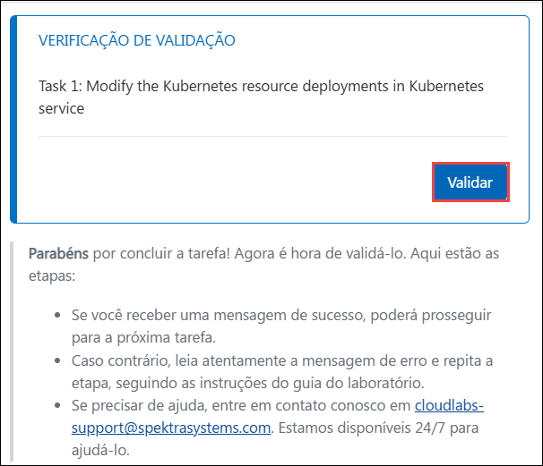
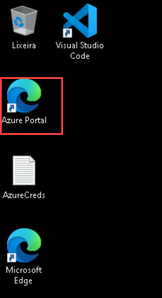
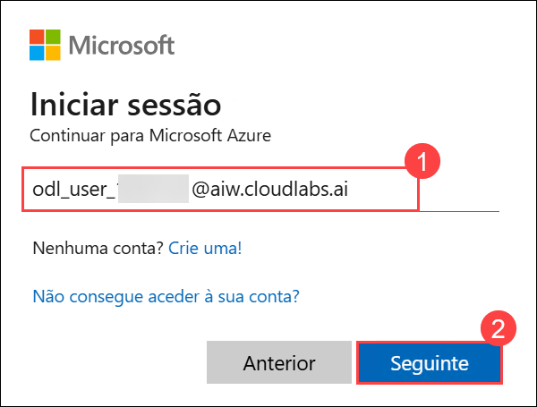
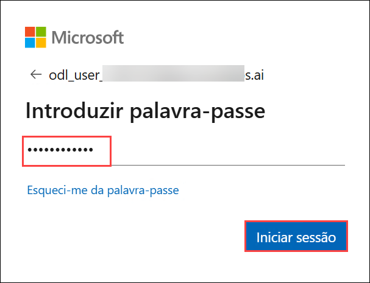
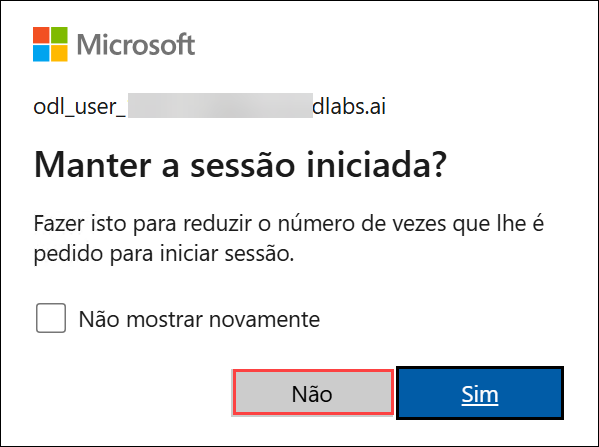

# Aplicações nativas da nuvem

### Duração estimada: 8 horas

## Visão geral

A Contoso Traders (ContosoTraders) fornece serviços de sites de retalho online personalizados para a comunidade de eletrónica. Estão a refatorar o seu aplicativo para ser executado como um container de Docker. Pretendem implementar uma prova de conceito que os ajude a familiarizarem-se com o processo de desenvolvimento, o ciclo de vida da implementação e os aspetos críticos do ambiente de alojamento. Irão implementar as suas aplicações no Serviço Azure Kubernetes (AKS) e quererão aprender como implementar contentores de forma dinâmica com balanceamento de carga, descobrir contentores e escalá-los sob demanda.

Neste laboratório prático, ajudará a completar este POC com um subconjunto da base de código da aplicação. Utilizará um agente de build pré-criado baseado em Linux e um cluster do Azure Kubernetes Service para executar aplicações implantadas. Irá ajudá-los a concluir a configuração do Docker para a sua aplicação, testar localmente, enviar por push para um repositório de imagens, implementar no cluster, testar o balanceamento de carga e a escala e utilizar o Azure Monitor e visualizar os insights.

## Objetivo

Este laboratório foi concebido para equipar os participantes com experiência prática na construção de imagens Docker, migrar bancos de dados MongoDB para Cosmos DB, implementar e escalar aplicações no Azure Kubernetes Service (AKS), gerir atualizações, encaminhamento de tráfego e monitorizar o desempenho do containers com o Azure Monitor .

- **Criar imagens Docker para a aplicação:** Este exercício prático tem como objetivo criar imagens Docker para containerizar a sua aplicação para implementações consistentes e portáteis. Os participantes irão containerizar a aplicação, permitindo uma implementação consistente em vários ambientes.

- **Migrar o MongoDB para o Cosmos DB utilizando a Migração de Base de Dados do Azure:** Este exercício prático tem como objetivo transferir os seus dados do MongoDB para o Azure Cosmos DB para tirar partido dos seus serviços de banco de dados escaláveis ​​​​e geridos. Os participantes migrarão os dados do MongoDB para o Azure Cosmos DB, garantindo a disponibilidade dos dados e a compatibilidade com os serviços do Azure.

- **Implantar a aplicação no Serviço Azure Kubernetes:** Este exercício prático tem como objetivo implementar e gerir a sua aplicação containerizada utilizando o Serviço Azure Kubernetes para orquestração e escalabilidade. Os participantes irão implementar a aplicação em contentor no Azure Kubernetes Service, fornecendo um ambiente escalonável e gerido para operação.

- **Escale a aplicação e valide o HA:** Este exercício prático tem como objetivo ajustar o dimensionamento da aplicação e confirmar a sua alta disponibilidade para garantir que tem um bom desempenho sob cargas variadas. Os participantes irão escalar a aplicação para lidar com cargas variadas e confirmar a sua alta disponibilidade para manter o desempenho e a fiabilidade.

- **Atualização de aplicações e gestão do Kubernetes Ingress:** Este exercício prático tem como objetivo aplicar atualizações à sua aplicação e configurar o Kubernetes Ingress para gerir e encaminhar o tráfego externo de forma eficaz. Os participantes irão atualizar a aplicação com sucesso e configurar o Kubernetes Ingress para gerir e encaminhar eficazmente o tráfego externo.

- **Azure Monitor para Contentores:** Este exercício prático tem como objetivo utilizar o Azure Monitor para Contentores para rastrear e analisar o desempenho e a integridade das suas aplicações containerizadas no AKS. Os participantes configurarão a monitorização de aplicações em contentores com o Azure Monitor, fornecendo insights sobre o desempenho e a integridade operacional.

## Pré-requisitos

Os participantes deverão:

- Compreender conceitos Docker, como containers, imagens e Dockerfiles.
- Conhecimento das estruturas de dados do MongoDB e das capacidades do Azure Cosmos DB para uma migração eficaz.
- Compreensão básica dos conceitos do Kubernetes, incluindo pods, implementações e serviços, bem como do Azure Kubernetes Service (AKS).
- Uma subscrição ativa do Azure com as permissões apropriadas para criar e gerir recursos.
- Compreensão geral de serviços de cloud, orquestração de contentores e estratégias de escalabilidade.
- Proficiência na utilização de ferramentas e interfaces de linha de comandos, como o Azure CLI e o Docker CLI.
- Familiaridade com práticas de Integração Contínua e Implantação Contínua, pois podem ser relevantes para a gestão de atualizações e implementações.

## Arquitetura

Os exercícios utilizam vários serviços do Azure para criar, implementar e gerir aplicações de forma eficaz. O Azure Container Registry (ACR) é utilizado para armazenar e gerir imagens de contentores Docker, enquanto o Azure Cosmos DB fornece uma solução de banco de dados escalável e multimodelo para migração de dados. O Azure Kubernetes Service (AKS) permite a implantação e gestão de aplicações containerizada num ambiente Kubernetes gerido. Para escalabilidade e alta disponibilidade, o Azure Load Balancer distribui o tráfego entre servidores, e o Azure Application Gateway oferece balanceamento de carga e encaminhamento avançados para aplicações Web. Por fim, o Azure Monitor monitoriza o desempenho e a saúde das aplicações e da infraestrutura, incluindo ambientes containerizados, garantindo monitorização e insights abrangentes.

## Diagrama de Arquitetura

## Explicação dos Componentes

A arquitetura deste laboratório envolve vários componentes principais:

- **Azure Container Registry (ACR):** um registo de contentor Docker gerido para armazenar e gerir imagens de contentores Docker.
- **Azure Cosmos DB:** um serviço de base de dados multimodelo distribuído globalmente para gerir e escalar dados NoSQL.
- **Azure Kubernetes Service (AKS):** um serviço gerido de orquestração de contentores Kubernetes para a implementação, dimensionamento e gestão de aplicações em contentores.
- **Balanceador de carga do Azure (parte do AKS):** um balanceador de carga de alto desempenho que distribui o tráfego de rede por vários servidores para garantir a alta disponibilidade.
- **Azure Application Gateway (parte do AKS):** Um balanceador de carga de tráfego web que lhe permite gerir o tráfego para as suas aplicações web e fornece encaminhamento baseado em URL e terminação SSL.
- **Azure Monitor:** um serviço de monitorização abrangente que fornece informações sobre o desempenho e a integridade de aplicações e infraestruturas, incluindo cargas de trabalho em contentores.

## Introdução ao laboratório

Depois de o ambiente ser provisionado, uma máquina virtual (JumpVM) e um guia de laboratório serão carregados no seu browser. Utilize esta máquina virtual durante todo o workshop para realizar o laboratório. Pode ver o número na parte inferior do guia de laboratório para alternar para os diferentes exercícios do **Guia do laboratório**.

   

## Máquina Virtual e Guia de Laboratório

Sua máquina virtual é seu carro-chefe durante todo o workshop. O guia de laboratório é o seu roteiro para o sucesso

1. Para obter os detalhes do ambiente de laboratório, pode selecionar o separador **Ambiente**. Além disso, as credenciais também serão enviadas para o seu endereço de e-mail registado. Também pode abrir o Guia do laboratório numa janela completa e separada, selecionando **Janela dividida** no canto superior direito. 

   

   > Verá o valor DeploymentID no separador **Ambiente**.

## Gerenciando sua máquina virtual

Clique em **Mais (1)** e vá à aba **Recursos (2)** para **Iniciar, Parar ou Reiniciar** a máquina virtual..

   

## Utilizando o recurso de aumentar/diminuir zoom   

Para ajustar o nível de zoom da página do ambiente, clique no ícone **A↕ : 100%** localizado próximo ao cronômetro no ambiente de laboratório.

## Validação do Lab

1. Depois de concluir a tarefa, clique no botão **Validar** na guia Validação integrada ao seu guia de laboratório. Se receber uma mensagem de sucesso, você poderá prosseguir para a próxima tarefa; caso contrário, leia atentamente a mensagem de erro e repita a etapa, seguindo as instruções do guia do laboratório.

   

1. Se precisar de ajuda, contacte-nos através do e-mail cloudlabs-support@spektrasystems.com.

## Faça login no Portal Azure

1. No JumpVM, clique no atalho do portal Azure do navegador Microsoft Edge que é criado no ambiente de trabalho.

   

1. No separador **Entrar no Microsoft Azure** verá o ecrã de login, nele digite o seguinte e-mail/nome de utilizador **(1)** e clique em **Seguinte (2)**.

    * E-mail/Nome de utilizador: <inject key="AzureAdUserEmail"></inject>

      

1. Agora digite a seguinte palavra-passe e clique em **Iniciar sessão**.

    * Palavra-passe: <inject key="AzureAdUserPassword"></inject>

      

    > Se vir a caixa de diálogo **Ajude-nos a proteger a sua conta**, selecione a opção **Saltar por enquanto**.

1. Se vir o pop-up **Manter a sessão iniciada?**, clique em **Não**.

   

1. Se vir o pop-up **Tem recomendações gratuitas do Azure Advisor!**, feche a janela para continuar o laboratório.

1. Se for apresentada uma janela pop-up **Bem-vindo ao Microsoft Azure**, clique em **Talvez mais tarde** para ignorar o tour.

1. Agora verá o Painel do Portal do Azure, clique em **Grupos de recursos** no painel Navegar para ver os grupos de recursos.

   .png "Resource Groups")

No final deste laboratório, os participantes aprenderão a criar imagens Docker para aplicações em contentores, a migrar dados do MongoDB para o Azure Cosmos DB e a implementar aplicações no Azure Kubernetes Service (AKS) para orquestração. Também irão escalar aplicações e garantir alta disponibilidade, gerir atualizações e encaminhamento de tráfego e utilizar o Azure Monitor para monitorizar o desempenho e a integridade das suas aplicações em contentores.

## Contato de suporte

A equipe de suporte da CloudLabs está disponível 24 horas por dia, 7 dias por semana, 365 dias por ano, por e-mail e chat ao vivo para garantir assistência contínua a qualquer momento. Oferecemos canais de suporte dedicados, adaptados especificamente para alunos e instrutores, garantindo que todas as suas necessidades sejam atendidas de forma rápida e eficiente.

Contatos de suporte ao aluno:
- Suporte por e-mail: cloudlabs-support@spektrasystems.com
- Suporte por chat ao vivo: https://cloudlabs.ai/labs-support

Agora, clique em **próximo** no canto inferior direito para passar para a próxima página.

### Boa aprendizagem!!
