# Exercise 1: Build Docker Images for the Application
  
**Duration**: 30 Minutes

## Overview

In this exercise, you will learn how to Containerize the Contoso traders application using Docker images. Containerized applications are applications that run in isolated runtime environments called containers A Docker image is a file used to execute code in a Docker container. Docker images act as a set of instructions to build a Docker container, like a template. Also, you will be pushing the created Docker images to the Azure Container Registry.
   
### Task 1: Set up a local infrastructure with the Linux VM

In this task, you will be connecting to Build agent VM using Command prompt and will be clonning the Contoso trader website GitHub repo.  

1. Once you log into the VM, search for **cmd** **(1)** in the search bar and click on **Command Prompt** **(2)** to open.

   
    
1. Run the given command **<inject key="Command to Connect to Build Agent VM" enableCopy="true" />** to connect to the Linux VM using ssh.
   
   >**Note**: In the command prompt, type **yes** and press **Enter** for `Are you sure you want to continue connecting (yes/no/[fingerprint])?`
   
1. Once the ssh is getting connected to the VM, please enter the VM password given below:
   
    * Password: **<inject key="Build Agent VM Password" enableCopy="true" />**

   
   
   >**Note**: Please note that while typing the password you won’t be able to see it due to the security concerns.
    
1. Once the VM is connected, run the below command to clone the GitHub repository that contains all the files related to Contoso traders application which you will be using for the lab.

    ``` 
    git clone https://github.com/CloudLabsAI-Azure/Cloud-Native-Application
    ```
    
    
    
1. After the GitHub cloning is completed, run the below command to change the directory to the labfiles.
    
    ```
    cd Cloud-Native-Application/labfiles/ 
    ```
    
    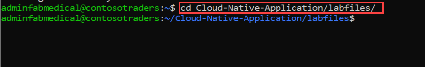
    
### Task 2: Build Docker images to containerize the application and push them to the container registry

In this task, you will be building the docker images to containerize the application and will be pushing them to the ACR(Azure Container Registry) to later use in AKS.

1. Run the below command to login to Azure, navigate to device login URL `https://microsoft.com/devicelogin` in the browser and copy the authentication code.

   ``` 
   az login
   ```
    
   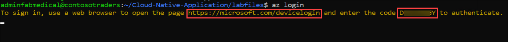
    
1. Enter the copied authentication code **(1)** and click on **Next** **(2)**.

   
   
1. On **Sign in to Microsoft Azure** tab you will see login screen, in that enter following email/username and then click on **Next**.

   * Email/Username: **<inject key="AzureAdUserEmail"></inject>**

1. Now enter the following password and click on **Sign in**.

   * Password: **<inject key="AzureAdUserPassword"></inject>**

1. In a pop-up to confirm the sign into Microsoft Azure CLI, click on **Continue**.

   

1. Once you logged in to Azure, you are going to build the Docker images in the next steps and will be pushing them to ACR.

   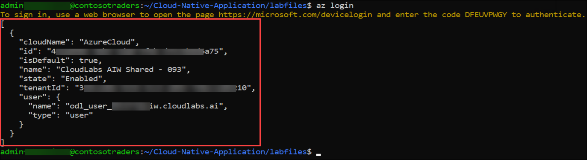

1. Please make sure that you are in **labfiles** directory before running the next steps as the docker build needs to find the DockerFile to create the image.

    ```
    cd Cloud-Native-Application/labfiles/
    ```
    
1. Now build the **contosotraders-carts** docker image using the Dockerfile in the directory. Take a note how the deployed Azure Container Registry is referenced. Replace the SUFFIX placeholder in the below command with the given DeploymentID **<inject key="DeploymentID" enableCopy="true"/>** value.

    ```
     docker build src -f ./src/ContosoTraders.Api.Carts/Dockerfile -t contosotradersacr[SUFFIX].azurecr.io/contosotradersapicarts:latest -t contosotradersacr[SUFFIX].azurecr.io/contosotradersapicarts:latest
    ```
    
    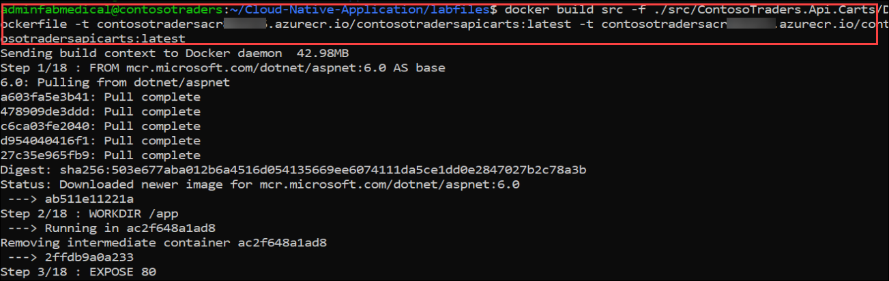
    
1. Repeat the steps to create the **contosotraders-Products** docker image with the below command. Make sure to replace the SUFFIX with the given DeploymentID **<inject key="DeploymentID" enableCopy="true"/>** value in the below command.

    ```
     docker build src -f ./src/ContosoTraders.Api.Products/Dockerfile -t contosotradersacr[SUFFIX].azurecr.io/contosotradersapiproducts:latest -t contosotradersacr[SUFFIX].azurecr.io/contosotradersapiproducts:latest
    ```

    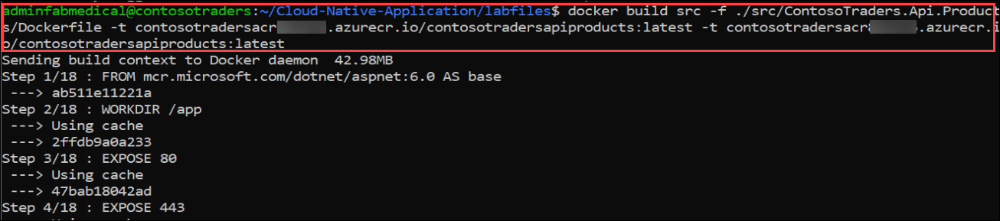

1. Run the below command to change the directory to `services` and open `configService.js` file.

    ```
    cd src/ContosoTraders.Ui.Website/src/services
    vi configService.js
    ```
    
    
    
1. In the `vi` editor, press **_i_** to get into the `insert` mode. Replace the given DeploymentID **<inject key="DeploymentID" enableCopy="true"/>** value in the APIUrl. Then press **_ESC_**, write **_:wq_** to save you changes and close the file. We need to update the API URL here so that Contoso Traders application can connect to product API once its pushed to AKS containers.
    
    >**Note**: If **_ESC_** doesn't work press `ctrl + [` and then write **_:wq_** to save you changes and close the file.

    ```
    const APIUrl = 'http://contoso-traders-productsXXXXX.eastus.cloudapp.azure.com';
    ```

    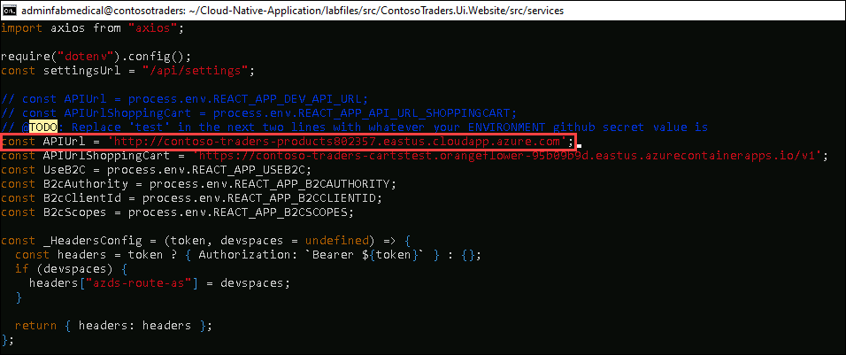

1. Run the below command to change the directory to the `ContosoTraders.Ui.Website` folder.

    ```
    cd
    cd Cloud-Native-Application/labfiles/src/ContosoTraders.Ui.Website
    ```

1. Now build the **contosotraders-UI-Website** docker image with the below command. Make sure to replace the SUFFIX with the given DeploymentID **<inject key="DeploymentID" enableCopy="true"/>** value in the below command.

    ```
    docker build . -t contosotradersacr[SUFFIX].azurecr.io/contosotradersapiproducts:latest -t contosotradersacr[SUFFIX].azurecr.io/contosotradersuiweb:latest
    ```    
    
    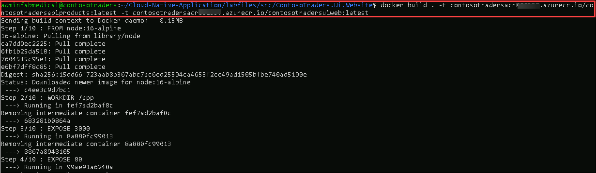
    
1. Redirect to the **labfiles** directory before running the next steps.

    ```
    cd
    cd Cloud-Native-Application/labfiles/
    ```

1. Observe the built Docker images by running command `docker image ls`. The images are tagged with latest, also it is possible to use other tag values for versioning.

    ```
    docker image ls
    ```

    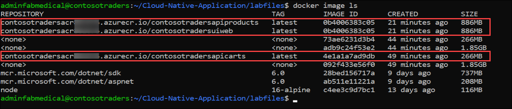

1. Navigate to Azure portal, open **contosotradersacr<inject key="DeploymentID" enableCopy="false" />** Container registry from **ContosoTraders-<inject key="DeploymentID" enableCopy="false" />** resource group.

   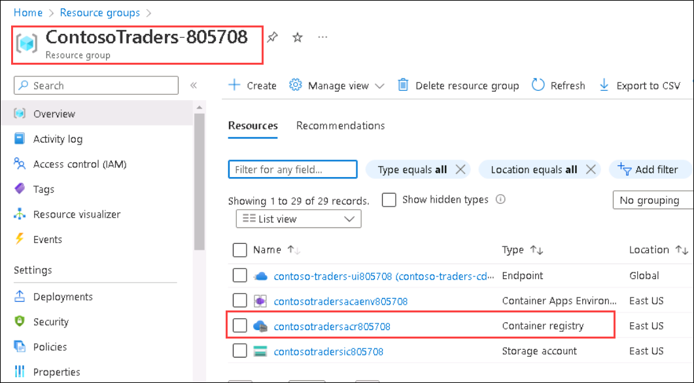
   
1. From **contosotradersacr<inject key="DeploymentID" enableCopy="false" />** **(1)** Container registry, select **Access keys** under Settings from left side menu. **Copy** the Password and paste it in text file for later use.

   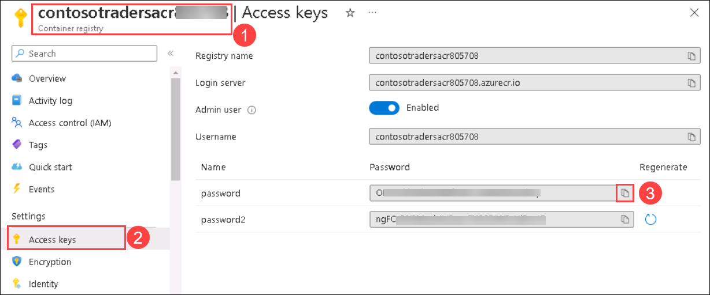    

1. Now login to ACR using the below command, please update the Suffix and ACR password value in the below command. You should be able to see that output as below in the screenshot. Make sure to replace the SUFFIX with the given DeploymentID **<inject key="DeploymentID" enableCopy="true"/>** value and password with the copied conatiner registry password which you have copied in the previous step in the below command.

    ```
    docker login contosotradersacr[SUFFIX].azurecr.io -u contosotradersacr[SUFFIX] -p [password]
    ```

    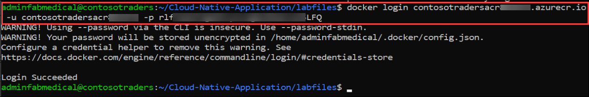

1. Once you logged in to the ACR, please run the below commands to push the Docker images to Azure container registry. Also, make sure to update the SUFFIX value with the given DeploymentID **<inject key="DeploymentID" enableCopy="true"/>** value in the below commands.

   ```
   docker push contosotradersacr[SUFFIX].azurecr.io/contosotradersapicarts:latest 
   ```
   
   ```
   docker push contosotradersacr[SUFFIX].azurecr.io/contosotradersapiproducts:latest
   ```
   
   ```
   docker push contosotradersacr[SUFFIX].azurecr.io/contosotradersuiweb:latest
   ```
   
1. You should be able to see the docker image getting pushed to ACR as shown in the below screenshot. 
    
    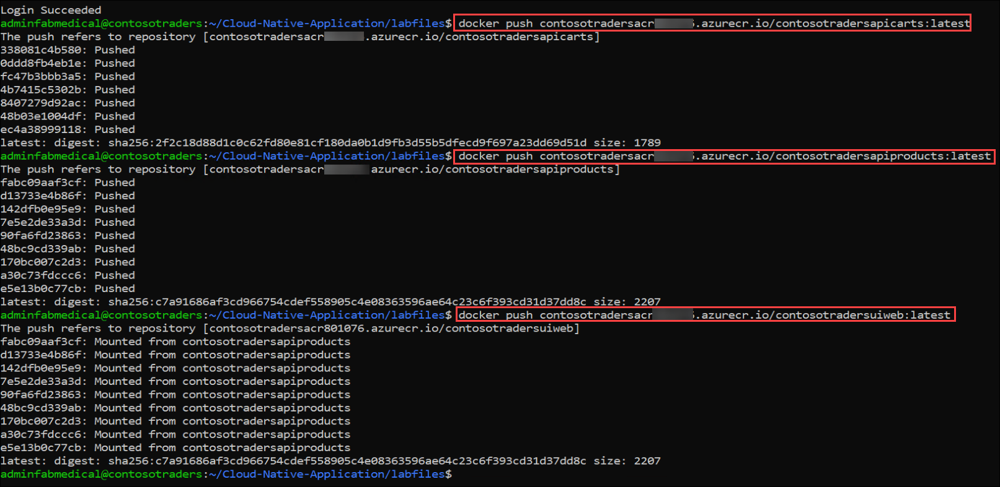
    
1. Click the **Next** button located in the bottom right corner of this lab guide to continue with the next exercise.


## Summary

In this exercise, you have completly containerized you web application with the help of docker and pushed them to the container registry.
