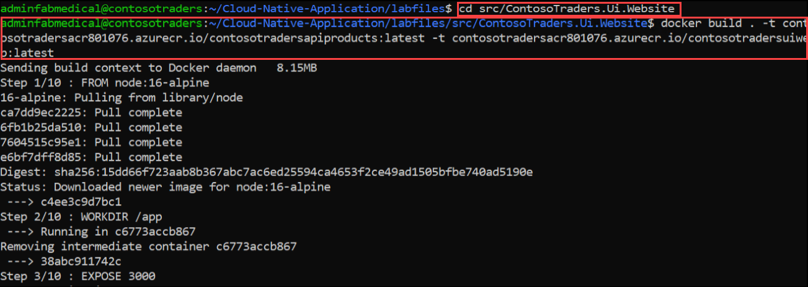

# Exercise 1: Create Docker Images for Application

### Task 1: Create Local Infrastructure using Linux VM

1. Once you log into the VM, open **Command Prompt** from the desktop of your VM on the left side of the envrionment.

    
    
1. Run the below given command **<inject key="Command to Connect to Build Agent VM" enableCopy="true" />** to connect to the Linux VM using ssh.
   
   ```
   ssh adminfabmedical@contosotraders[DID].[Region].cloudapp.azure.com
   ```
   
   >**Note**: Replace the DeploymentID and Region in the above command.
   
1. Once the ssh is getting connected to the VM, please enter the VM password given below:
   
    * Password: <inject key="Build Agent VM Password" enableCopy="true" />

   
   
   >**Note**: Please note that while typing the password you wont be able to see it due to the security concerns.
    
1. Once the VM is connected, run the below command to clone the Github repositry that we are going to use for the lab.

    ``` 
    git clone https://github.com/CloudLabsAI-Azure/Cloud-Native-Application
    ```
    
    
    
1. After the github cloning is completed, run the below command to change the directory to the labfiles.
    
    ```
    cd Cloud-Native-Application/labfiles/ 
    ```
    
    
    
### Task 2: Create Docker images and push to container registry

In this task, you will be building the docker image and will be pushing them to the ACR to later use in AKS

1. Run the below command to login to Azure, navigate to device login URL `https://microsoft.com/devicelogin` in the browser and copy the authentication code.

   ``` 
   az login
   ```
    
   
    
1. Enter the copied authentication code **(1)** and click on **Next** **(2)**.

   
   
1. On **Sign in to Microsoft Azure** tab you will see login screen, in that enter following email/username and then click on **Next**.

   * Email/Username: <inject key="AzureAdUserEmail"></inject>

1. Now enter the following password and click on **Sign in**.

   * Password: <inject key="AzureAdUserPassword"></inject> 

1. In a pop-up to confirm the sign in to Microsoft Azure CLI, click on **Continue**.

   

1. Once you logged in to Azure, you are going to build the Docker images in the next steps and will be pushing them to ACR.

   

1. Please make sure that you are in **labfiles** directory before running the next steps.

    ```
    cd Cloud-Native-Application/labfiles/
    ```
    
1. Now build the contosotraders-carts container image using the Dockerfile in the directory. Note how the deployed Azure Container Registry is referenced. Replace the SUFFIX placeholder in the command with the Suffix value.

    ```
     docker build src -f ./src/ContosoTraders.Api.Carts/Dockerfile -t contosotradersacr[SUFFIX].azurecr.io/contosotradersapicarts:latest -t contosotradersacr[SUFFIX].azurecr.io/contosotradersapicarts:latest
    ```
    
    
    
1. Repeat the steps to create the contosotraders-Products docker image with the below command.

    ```
     docker build src -f ./src/ContosoTraders.Api.Products/Dockerfile -t contosotradersacr[SUFFIX].azurecr.io/contosotradersapiproducts:latest -t contosotradersacr[SUFFIX].azurecr.io/contosotradersapiproducts:latest
    ```

    

1. Repeat the steps to create the contosotraders-UI-Website docker image with the below command.

    ```
    cd src/ContosoTraders.Ui.Website
    docker build . -t contosotradersacr[SUFFIX].azurecr.io/contosotradersapiproducts:latest -t contosotradersacr[SUFFIX].azurecr.io/contosotradersuiweb:latest
    ```    
    
    
    
1. Re-direct to `cd Cloud-Native-Application/labfiles/` directory. Observe the built Docker images by running command `docker image ls`. The images were tagged with latest, but it is possible to use other tag values for versioning.

    ```
    docker image ls
    ```

    
    
1. Now login to ACR using the below commands, please update the Suffix and ACR password value in the belwo command. You should be able to see that output as below in the screenshot.

    ```
    docker login contosotradersacr[SUFFIX].azurecr.io -u contosotradersacr[SUFFIX] -p [password]
    ```

   

1. Once you logged in to the ACR, please run the below commands to push the Docker images to Azure container registry.Also, make sure to update the SUFFIX value.

   *   ``` docker push contosotradersacr[SUFFIX].azurecr.io/contosotradersapicarts:latest ```
   *  ```  docker push contosotradersacr[SUFFIX].azurecr.io/contosotradersapiproducts:latest ```
   *  ```  docker push contosotradersacr[SUFFIX].azurecr.io/contosotradersuiweb:latest ```
    
1. You should be able to see the docker image getting pushed to ACR as per the below screenshots. 
    
    
    
