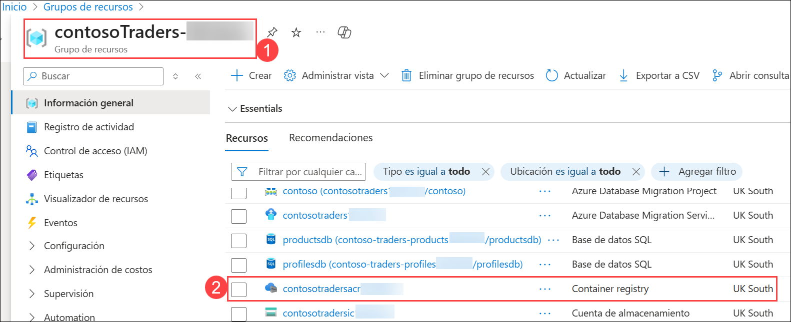
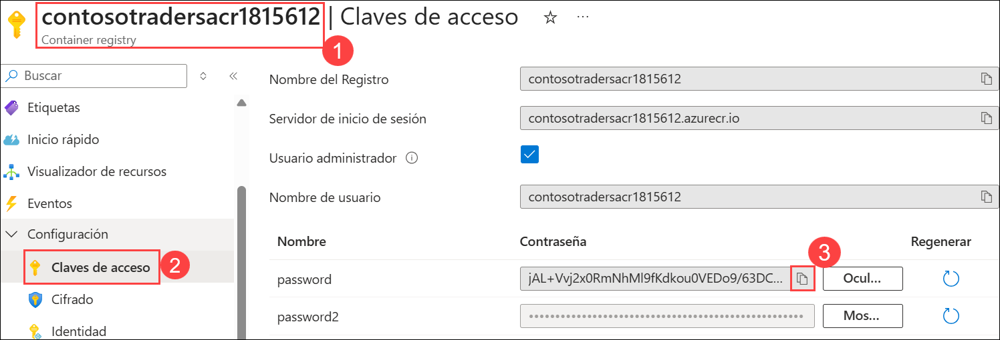
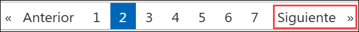

### Ejercicio 1: Crear Imágenes de Docker para la Aplicación
  
### Duración estimada: 65 minutos

## Descripción General

En este ejercicio, aprenderá a containerizar la aplicación Contoso Traders utilizando imágenes de Docker. Las aplicaciones en contenedores son aplicaciones que se ejecutan en entornos de ejecución aislados llamados contenedores. Una imagen de Docker es un archivo que se utiliza para ejecutar código en un contenedor de Docker. Las imágenes de Docker actúan como un conjunto de instrucciones para crear un contenedor Docker, como una plantilla. Además, enviará las imágenes de Docker creadas a Azure Container Registry.

## Objetivos del laboratorio

Podrá completar las siguientes tareas:

- Tarea 1: Configurar una infraestructura local con la máquina virtual Linux
- Tarea 2: Crear imágenes de Docker para contenerizar la aplicación y enviarlas a Container Registry

## Tarea 1: Configurar una infraestructura local con la Máquina Virtual Linux

En esta tarea, se conectará a la Máquina Virtual (MV) del Agente de Compilación mediante el Símbolo del sistema y clonará el repositorio de GitHub del sitio web de Contoso Traders.

1. Una vez que inicie sesión en la Máquina Virtual, busque **cmd** **(1)** en la barra de búsqueda de Windows y haga clic en **Símbolo del sistema** **(2)** para abrirla.

      .png "abrir cmd")
    
1. Ejecute el comando proporcionado **<inject key="Command to Connect to Build Agent VM" enableCopy="true" />** para conectarse a la MV de Linux usando ssh.
   
   >**Nota**: En el símbolo del sistema, escriba **yes** y presione **Enter** para `¿Seguro que         quiere seguir conectándote (yes/no/[fingerprint])?`
   
1. Una vez que SSH esté conectado a la VM, ingrese la contraseña de la VM que se proporciona a continuación:
   
    * Contraseña: **<inject key="Build Agent VM Password" enableCopy="true" />**

      
   
         >**Nota**: Tenga en cuenta que mientras escribe la contraseña no podrá verla por motivos de         seguridad.
    
1. Una vez que la VM esté conectada, ejecute el siguiente comando para navegar al repositorio GitHub clonado que vamos a utilizar para el laboratorio.

    ``` 
    cd Cloud-Native-Application/labfiles/
    ```
    
     
    
     **Nota:** Si recibe un mensaje de salida que indica que la ruta de destino 'Cloud-Native-Application/labfiles' no existe, ejecute el siguiente comando y vuelva a            realizar el paso 4 de la tarea.

     ```
     git clone https://github.com/CloudLabsAI-Azure/Cloud-Native-Application
        
     ```

     

     - Si recibe un mensaje de salida que indica que la ruta de destino "Cloud-Native-Application" ya existe y no es un directorio vacío, ejecute los siguientes                  comandos y, a continuación, vuelva a ejecutar el comando "git clone" y repita el paso 4 para acceder al repositorio clonado.

       ```
       sudo su
       rm -rf Cloud-Native-Application
       exit
       ```
   
       
        
## Tarea 2: Crear Imágenes de Docker para contenerizar la aplicación y subirlas al registro del contenedor

En esta tarea, creará las imágenes de Docker para contenerizar la aplicación y las enviará a ACR (Azure Container Registry) para usarlas más adelante en Azure Kubernetes Service (AKS).

1. Asegúrese de estar en el directorio **labfiles** antes de ejecutar los siguientes pasos, ya que la compilación de Docker necesita encontrar DockerFile para crear la imagen.

     ```
     cd Cloud-Native-Application/labfiles/ 
     ```

1. Ejecute el siguiente comando para descargar la CLI de Azure:

     ```
     sudo apt install azure-cli
     ```

      >**Nota:** En el símbolo del sistema, escriba **Y** y presione **Enter** para **¿Quieres continuar? [Y/n]**.

1. Ejecute el siguiente comando para iniciar sesión en Azure, navegue hasta la URL de inicio de sesión del dispositivo `https://microsoft.com/devicelogin` en el navegador y copie el código de autenticación.
 
    ``` 
    az login
    ```
    
      
    
     > **Note:** Si recibe un error que indica que no se encontró el comando az, ejecute el comand _'sudo apt install azure-cli'_ para instalar la CLI de Azure. 

1. Ingrese el código de autenticación copiado **(1)** y haga clic en **Siguiente** **(2)**.

      
   
   
1. En la pestaña **Inicie sesión en su cuenta** verá una pantalla de inicio de sesión, en ella ingrese el siguiente correo electrónico/nombre de usuario y luego haga clic en **Siguiente**.

     * Correo electrónico/Nombre de usuario: **<inject key="AzureAdUserEmail"></inject>**

1. Ahora ingrese la siguiente contraseña y haga clic en **Iniciar sesión**.

     * Contraseña: **<inject key="AzureAdUserPassword"></inject>**

1. En la ventana emergente para confirmar el inicio de sesión en la CLI de Microsoft Azure, haga clic en **Continuar**.

      

1. Una vez que inicie sesión en Azure, vuelva al símbolo del sistema. Creará las imágenes de Docker en los siguientes pasos y las enviará a ACR.

      
    
1. Ahora construya la imagen docker **contosotraders-carts** usando el Dockerfile que se encuentra en el directorio. Observe cómo se hace referencia al Azure Container Registry implementado.

     ```
     docker build src -f ./src/ContosoTraders.Api.Carts/Dockerfile -t contosotradersacr<inject key="DeploymentID" enableCopy="false"/>.azurecr.io/contosotradersapicarts:latest -t contosotradersacr<inject     key="DeploymentID" enableCopy="false"/>.azurecr.io/contosotradersapicarts:latest
     ```
    
      

      >**Nota:** Este paso puede tardar entre 1 y 2 minutos para generar la imagen de Docker.
    
1. Repita los pasos para crear la imagen docker **contosotraders-Products** con el siguiente comando. 

     ```
     docker build src -f ./src/ContosoTraders.Api.Products/Dockerfile -t contosotradersacr<inject key="DeploymentID" enableCopy="false"/>.azurecr.io/contosotradersapiproducts:latest -t contosotradersacr<inject key="DeploymentID" enableCopy="false"/>.azurecr.io/contosotradersapiproducts:latest

     ```

      

      >**Nota:** Este paso puede tardar entre 1 y 2 minutos para generar la imagen de Docker.

1. Ejecute el siguiente comando para cambiar el directorio a `services` y abra el archivo `configService.js`.

     ```
     cd src/ContosoTraders.Ui.Website/src/services
     sudo chmod 777 configService.js
     vi configService.js
     ```
    
      
    
1. En el editor `vi`, presione **_i_** para ingresar al modo `insertar`. Reemplace el ID de implementación **<inject key="DeploymentID" enableCopy="true"/>** y el valor de Región **<inject key="Region" enableCopy="true"/>** en APIUrl. Luego presione **ESC**, escriba **:wq** para guardar los cambios y cierre el archivo. Necesitamos actualizar la URL de la API aquí para que la aplicación Contoso Traders pueda conectarse a la API del producto una vez que se envíe a los contenedores de AKS.

      > **Nota**: Si **ESC** no funciona, presione `ctrl + [` y luego escriba **:wq** para guardar los cambios y cerrar el archivo.
    
      ```
      const APIUrl = 'http://contoso-traders-products<inject key="DeploymentID" enableCopy="true"/>.<inject key="Region" enableCopy="true"/>.cloudapp.azure.com/v1';

      const APIUrlShoppingCart = 'https://contoso-traders-carts<inject key="DeploymentID" enableCopy="true"/>.orangeflower-95b09b9d.<inject key="Region" enableCopy="true"/>.azurecontainerapps.io/v1';
      ```

      

1. Ejecute el siguiente comando para cambiar el directorio a la carpeta `ContosoTraders.Ui.Website`.

     ```
     cd
     cd Cloud-Native-Application/labfiles/src/ContosoTraders.Ui.Website
     ```

1. Ahora construya la imagen docker **contosotraders-UI-Website** con el siguiente comando.

     ```
     docker build . -t contosotradersacr<inject key="DeploymentID" enableCopy="true"/>.azurecr.io/contosotradersuiweb:latest -t contosotradersacr<inject key="DeploymentID" enableCopy="true"/>.azurecr.io/contosotradersuiweb:latest
     ```    
    
      
    
      >**Nota**: Tenga en cuenta que el comando anterior puede tardar hasta 5 minutos en finalizar la compilación. Antes de realizar cualquier otra acción, asegúrese de que se ejecute correctamente. 
    
1. Rediríjase al directorio **labfiles** antes de ejecutar los siguientes pasos.

     ```
     cd
     cd Cloud-Native-Application/labfiles/
     ```

1. Observe las imágenes de Docker creadas ejecutando el comando `docker image ls`. Las imágenes están etiquetadas con latest, la última versión, aunque también es posible utilizar otros valores de etiqueta para el control de versiones.

     ```
     docker image ls
     ```

      

1. Navegue al Portal de Azure, abra el Registro de contenedor **contosotradersacr<inject key="DeploymentID" enableCopy="false" />** desde el Grupo de recursos **ContosoTraders-<inject key="DeploymentID" enableCopy="false" />**.

      
   
1. Desde el Registro de Contenedor **contosotradersacr<inject key="DeploymentID" enableCopy="false" />** **(1)** seleccione **Claves de acceso** **(2)** en Configuración del menú lateral de la izquierda. **Copie** **(3)** la Contraseña y péguela en un archivo de texto para usarla más adelante.

          

1. Ahora inicie sesión en ACR usando el siguiente comando, actualice el valor de la contraseña de ACR en el siguiente comando. Debería poder ver el resultado a continuación en la captura de pantalla. Asegúrese de reemplazar la contraseña con la contraseña de registro del contenedor copiada que copió en el paso anterior en el siguiente comando.

     ```
     docker login contosotradersacr<inject key="DeploymentID" enableCopy="true"/>.azurecr.io -u contosotradersacr<inject key="DeploymentID" enableCopy="true"/> -p [password]
     ```

     

1. Una vez que inicie sesión en ACR, ejecute los siguientes comandos para enviar las imágenes de Docker al registro del contenedor de Azure.

     ```
     docker push contosotradersacr<inject key="DeploymentID" enableCopy="true"/>.azurecr.io/contosotradersapicarts:latest 
     ```
   
     ```
     docker push contosotradersacr<inject key="DeploymentID" enableCopy="true"/>.azurecr.io/contosotradersapiproducts:latest
     ```
   
     ```
     docker push contosotradersacr<inject key="DeploymentID" enableCopy="true"/>.azurecr.io/contosotradersuiweb:latest
     ```
   
1. Debería poder ver la imagen de docker enviada al ACR como se muestra en la siguiente captura de pantalla.
    
      
    
1. Haga clic en el botón **Siguiente** ubicado en la esquina inferior derecha de esta guía de laboratorio para continuar con el siguiente ejercicio.

## Resumen

En este ejercicio, ha contenedorizado completamente su aplicación web con la ayuda de Docker y la ha empujado al registro de contenedores.

### Ha completado el laboratorio correctamente. Haga clic en **Siguiente >>** para continuar con el siguiente ejercicio.


