# Exercise 1: Build Docker Images for the Application
  
### Estimated Duration: 65 Minutes

## Overview

In this exercise, you will learn how to Containerize the Contoso Traders application using Docker images. Containerized applications run in isolated runtime environments called containers. A Docker image is a file used to build and run the code in a Docker container. Docker images act as a set of instructions to build a Docker container, like a template. Also, you will push the created Docker images to the Azure Container Registry.

## Lab Objectives

You will be able to complete the following tasks:

- Task 1: Set up a local infrastructure with the Linux VM
- Task 2: Build Docker images to containerize the application and push them to the container registry
   
## Task 1: Set up a local infrastructure with the Linux VM

In this task, you will be connecting to the Build agent VM using the Command prompt and will be cloning the Contoso trader website GitHub repo.  

1. Once you log into the VM, search for **cmd** **(1)** in the Windows search bar and click on **Command Prompt** **(2)** to open.

   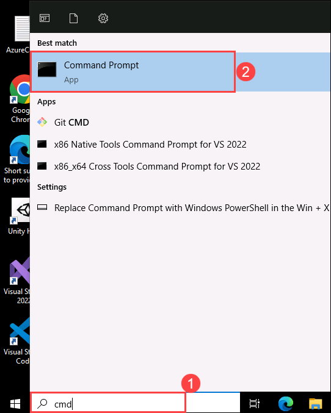
    
1. Run the given command **<inject key="Command to Connect to Build Agent VM" enableCopy="true" />** to connect to the Linux VM using ssh.
   
   >**Note**: In the command prompt, type **yes** and press **Enter** for `Are you sure you want to continue connecting (yes/no/[fingerprint])?`
   
1. Once the SSH is connected to the VM, please enter the VM password given below:
   
    * Password: **<inject key="Build Agent VM Password" enableCopy="true" />**

        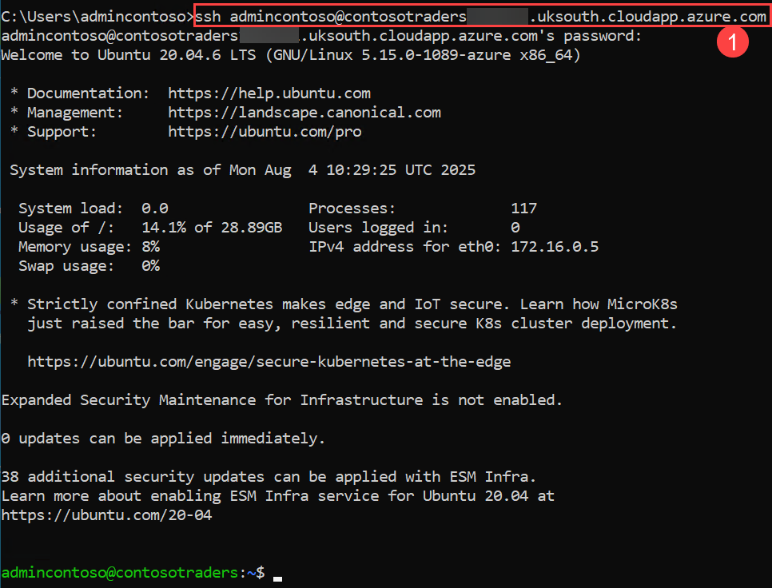
   
        >**Note**: Please note that while typing the password, you won’t be able to see it due to security concerns.
    
1. Once the VM is connected, run the following command to navigate to the cloned GitHub repository that we are going to use for the lab.

     ``` 
    cd Cloud-Native-Application/labfiles/
    ``` 
       
     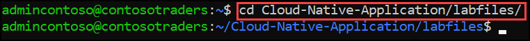

    
    > **Note:** If you receive an output message stating - destination path 'Cloud-Native-Application/labfiles' No such file or directory. Please run the following command and then reperform step 4 of the task.

    ```
    git clone https://github.com/CloudLabsAI-Azure/Cloud-Native-Application
    
    ```

    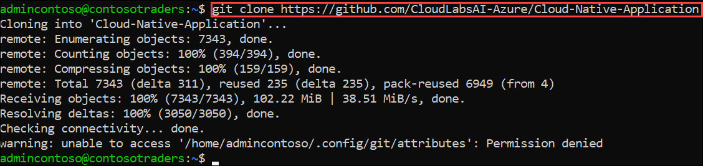

    - If you receive an output message stating - destination path 'Cloud-Native-Application' already exists and is not an empty directory. Please run the following commands and then reperform the "git clone" command and repeat Step 4 to navigate to the cloned repository.

        ```
        sudo su
        rm -rf Cloud-Native-Application
        exit
        ```   
        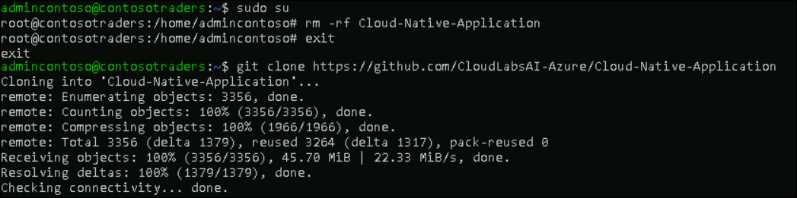
    
    
## Task 2: Build Docker images to containerize the application and push them to the container registry

In this task, you will build the Docker images to containerize the application and subsequently will be pushing them to the Azure Container Registry (ACR) for later use in Azure Kubernetes Service (AKS).


1. Ensure that you are in the **labfiles** directory before proceeding with the next steps, as the Docker build needs to access the Docker file to create the image.

    ```
    cd Cloud-Native-Application/labfiles/
    ```

1. Run the below command to download the Azure CLI,

    ```
    sudo apt install azure-cli
    ```
    >**Note:** In the command prompt type **Y**, and press **Enter** for **Do you want to continue? [Y/n]**.

1. Run the below command to log in to Azure, navigate to the device login URL `https://microsoft.com/devicelogin` in the browser and copy the authentication code.

   ``` 
   az login
   ```
    
   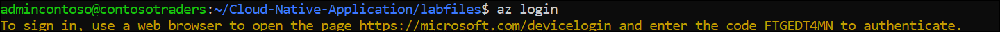
   
   > **Note:** If you receive an error command az not found, then run the command _'sudo apt install azure-cli'_ to install az cli. 
    
1. Enter the copied **Authentication code** **(1)** and click on **Next** **(2)**.

   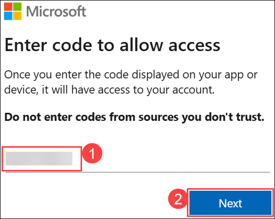
   
1. On the **Sign in to Microsoft Azure** tab, you will see a login screen. Enter the following email/username and then click on **Next**.

   * Email/Username: **<inject key="AzureAdUserEmail"></inject>**
   
        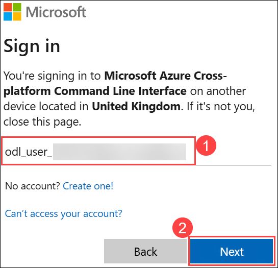

1. Now enter the following password and click on **Sign in**.

   * Password: **<inject key="AzureAdUserPassword"></inject>**

     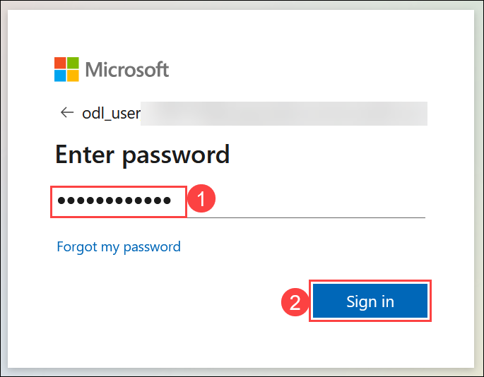

1. In a pop-up to confirm the sign-in to Microsoft Azure CLI, click on **Continue**.

   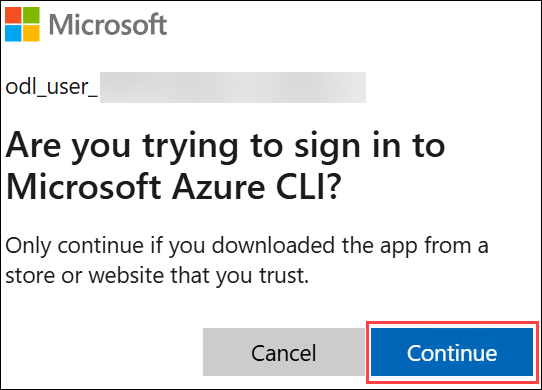

1. Once you log in to Azure, navigate back to the command prompt now, you are going to build the Docker images in the next steps and will be pushing them to ACR.

   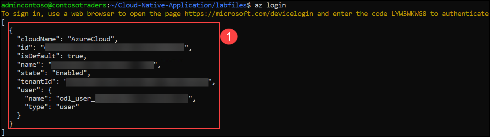
   
1. Now build the **contosotraders-carts** Docker image using the Dockerfile in the directory. Take note of how the deployed Azure Container Registry is referenced.

    ```
    docker build src -f ./src/ContosoTraders.Api.Carts/Dockerfile -t contosotradersacr<inject key="DeploymentID" enableCopy="false"/>.azurecr.io/contosotradersapicarts:latest -t contosotradersacr<inject key="DeploymentID" enableCopy="false"/>.azurecr.io/contosotradersapicarts:latest
    ```
    
    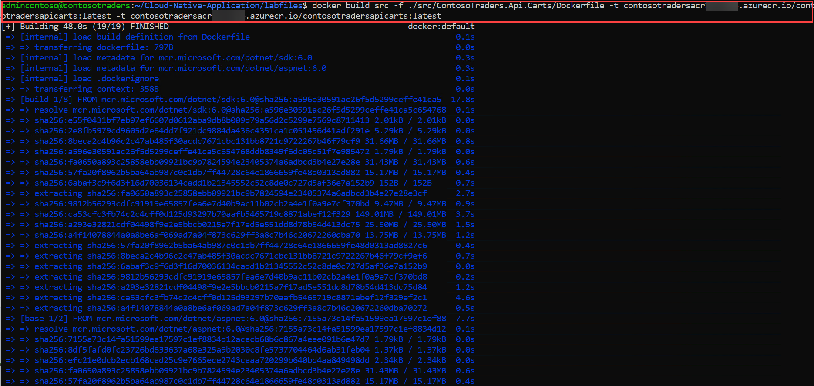

    >**Note:** This step might take 1-2 minutes to build docker image.

1. Repeat the steps to create the **contosotraders-Products** Docker image with the below command. 

    ```
     docker build src -f ./src/ContosoTraders.Api.Products/Dockerfile -t contosotradersacr<inject key="DeploymentID" enableCopy="false"/>.azurecr.io/contosotradersapiproducts:latest -t contosotradersacr<inject key="DeploymentID" enableCopy="false"/>.azurecr.io/contosotradersapiproducts:latest
    ```

    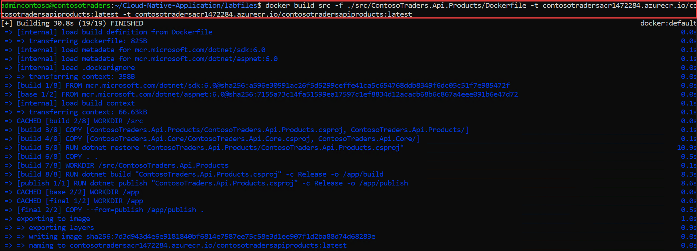

    >**Note:** This step might take 1-2 minutes to build Docker image.

1. Run the below command to change the directory to `services` and open the `configService.js` file.

    ```
    cd src/ContosoTraders.Ui.Website/src/services
    sudo chmod 777 configService.js
    vi configService.js
    ```
    
    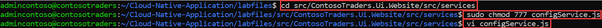
    
1. In the `vi` editor, press **_i_** to get into the `insert` mode. Replace the given deploymentID **<inject key="DeploymentID" enableCopy="true"/>** and Region **<inject key="Region" enableCopy="true"/>** value in the APIUrl. Then press **_ESC_**, write **_:wq_** to save your changes, and close the file. We need to update the API URL here so that the Contoso Traders application can connect to the product API once it's pushed to AKS containers.
    
    >**Note**: If **_ESC_** doesn't work press `ctrl + [` and then write **_:wq_** to save you changes and close the file.
    

    ```
    const APIUrl = 'http://contoso-traders-products<inject key="DeploymentID" enableCopy="true"/>.<inject key="Region" enableCopy="true"/>.cloudapp.azure.com/v1';

    const APIUrlShoppingCart = 'https://contoso-traders-carts<inject key="DeploymentID" enableCopy="true"/>.orangeflower-95b09b9d.<inject key="Region" enableCopy="true"/>.azurecontainerapps.io/v1';
    ```

    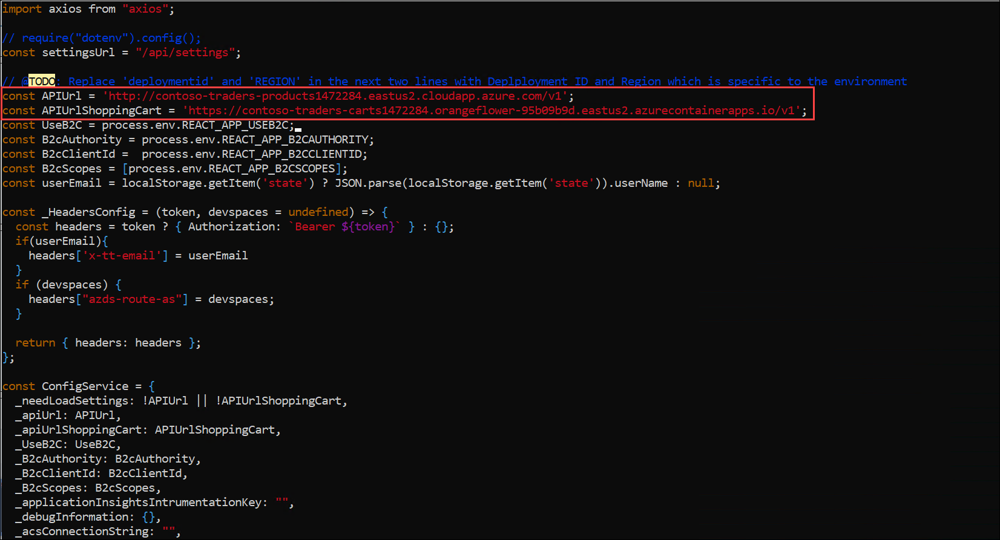

1. Run the below command to change the directory to the `ContosoTraders.Ui.Website` folder.

    ```
    cd
    cd Cloud-Native-Application/labfiles/src/ContosoTraders.Ui.Website
    ```

1. Now build the **contosotraders-UI-Website** docker image with the below command.

    ```
    docker build . -t contosotradersacr<inject key="DeploymentID" enableCopy="true"/>.azurecr.io/contosotradersuiweb:latest -t contosotradersacr<inject key="DeploymentID" enableCopy="true"/>.azurecr.io/contosotradersuiweb:latest
    ```    
    
    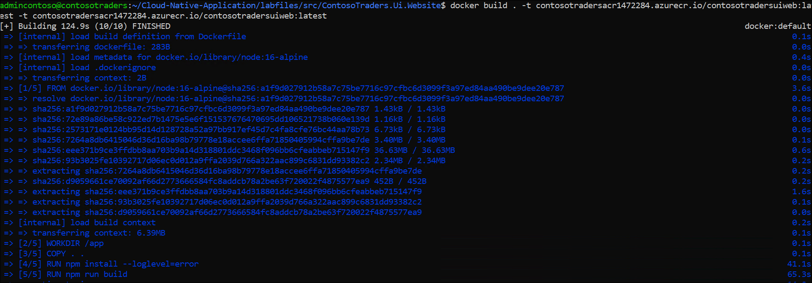
    
    
    >**Note**: Please be aware that the above command may take up to 5 minutes to finish the build. Before taking any further action, make sure it ran successfully.
    
1. Redirect to the **labfiles** directory before running the next steps.

    ```
    cd
    cd Cloud-Native-Application/labfiles/
    ```

1. Observe the built Docker images by running the command `docker image ls`. The images are tagged with the latest, also, it is possible to use other tag values for versioning.

    ```
    docker image ls
    ```

    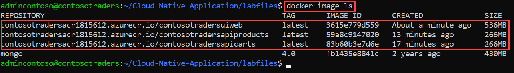

1. Navigate to Azure portal, open **contosotradersacr<inject key="DeploymentID" enableCopy="false" />** **(1)** Container registry from **contosoTraders-<inject key="DeploymentID" enableCopy="false" />** **(2)** resource group.

   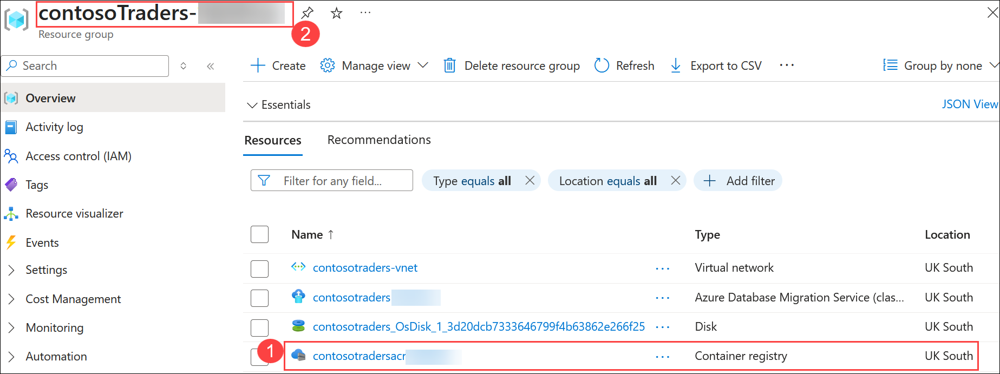
   
1. On the **contosotradersacr<inject key="DeploymentID" enableCopy="false" />** Container registry page, select **Access keys (1)** blade under Settings from left side menu. **Copy (2)** the Password and paste it into a notepad for later use.

   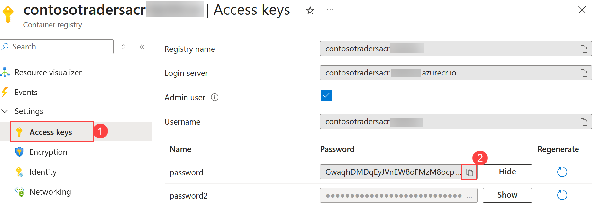    

1. Now, log in to ACR using the command below. Please update the ACR password value in the command below. You should be able to see the output below in the screenshot. Make sure to replace the password with the copied container registry password, which you have copied in the previous step, in the command below.

    ```
    docker login contosotradersacr<inject key="DeploymentID" enableCopy="true"/>.azurecr.io -u contosotradersacr<inject key="DeploymentID" enableCopy="true"/> -p [password]
    ```

    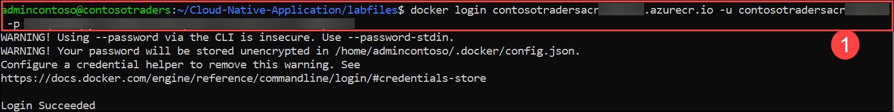

1. Once you have logged in to the ACR, please run the following commands to push the Docker images to the Azure container registry.

   ```
   docker push contosotradersacr<inject key="DeploymentID" enableCopy="true"/>.azurecr.io/contosotradersapicarts:latest 
   ```
   
   ```
   docker push contosotradersacr<inject key="DeploymentID" enableCopy="true"/>.azurecr.io/contosotradersapiproducts:latest
   ```
   
   ```
   docker push contosotradersacr<inject key="DeploymentID" enableCopy="true"/>.azurecr.io/contosotradersuiweb:latest
   ```
   
1. You should be able to see the Docker image getting pushed to ACR as shown in the screenshot below. 
    
    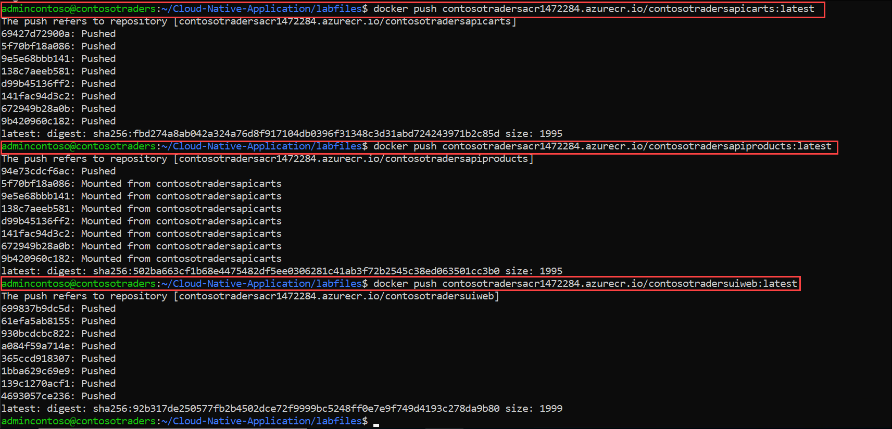
    
1. Click the **Next** button located in the bottom right corner of this lab guide to continue with the next exercise.


## Summary

In this exercise, you have completely containerized your web application with the help of Docker and pushed it to the container registry.

### You have successfully completed the lab. Click on **Next >>** to proceed with the next exercise.
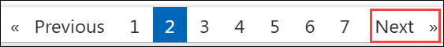
