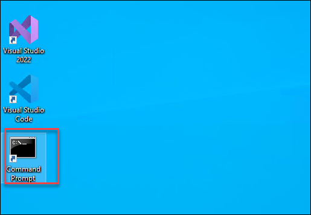
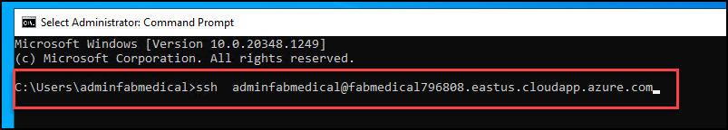
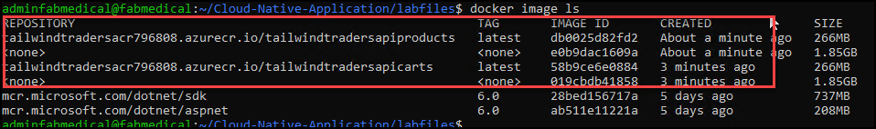
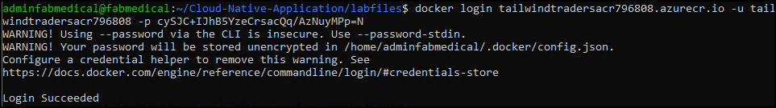
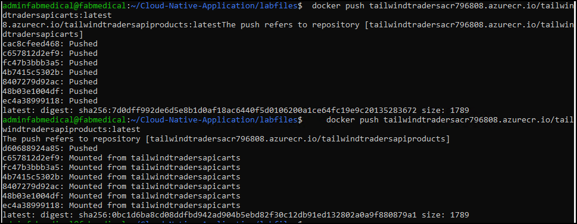

# Exercise 1: Create Docker Images for Application

### Task 1: Create Local Infrastructure using Linux VM

1. Once you log into the VM, open **Command Prompt** from the desktop of your VM on the left side of the envrionment.

    
    
1. Run the given command **<inject key="Command to Connect to Build Agent VM" enableCopy="true" />** to connect to the Linux VM using ssh.
   
   
   
1. Once the ssh is getting connected to the VM, please enter the VM password given below:
   
    * Password: <inject key="Build Agent VM Password" enableCopy="true" />

   
   
   >**Note**: Please note that while typing the password you wont be able to see it due to the security concerns.
    
1. Once the VM is connected, run the below command to clone the Github repositry that we are going to use for the lab.

    ``` 
    git clone https://github.com/CloudLabsAI-Azure/Cloud-Native-Application
    ```
    
    
    
1. After the github cloning is completed, run the below command to change the directory to the labfiles.
    
    ```
    cd Cloud-Native-Application/labfiles/ 
    ```
    
    
    
### Task 2: Create Docker images and push to container registry

In this task you will be building the docker image and will be pushing them to the ACR to later use in AKS

1. Run the below command to login to Azure.

    ``` 
    az login
    ```

1. Once you logged in to Azure, you are going to build the Docker images in the next steps and will be pushing them to ACR

1. Please make sure that you are in **labfiles** directory before running the next steos

    ```
    cd Cloud-Native-Application/labfiles/
    ```
    
1. Now build the  Tailwindtraders-carts container image using the Dockerfile in the directory. Note how the deployed Azure Container Registry is referenced. Replace the SUFFIX placeholder in the command with the Suffix value.

    ```
     docker build src -f ./src/TailwindTraders.Api.Carts/Dockerfile -t tailwindtradersacr[SUFFIX].azurecr.io/tailwindtradersapicarts:latest -t tailwindtradersacr[SUFFIX].azurecr.io/tailwindtradersapicarts:latest
    ```
    
1. Repeat the steps to create the Tailwindtraders-Products docker image with the below command.

    ```
     docker build src -f ./src/TailwindTraders.Api.Products/Dockerfile -t tailwindtradersacr[SUFFIX].azurecr.io/tailwindtradersapiproducts:latest -t tailwindtradersacr[SUFFIX].azurecr.io/tailwindtradersapiproducts:latest  ```

1. Repeat the steps to create the Tailwindtraders-UI-Website docker image with the below command.

    ```
    cd src/TailwindTraders.Ui.Website
    docker build . -t tailwindtradersacr[SUFFIX].azurecr.io/tailwindtradersapiproducts:latest -t tailwindtradersacr[SUFFIX].azurecr.io/tailwindtradersuiweb:latest         ```    
    
1. Observe the built Docker images by running docker image ls. The images were tagged with latest, but it is possible to use other tag values for versioning.

    
    
1. Now login to ACR using the below commands, please update the Suffix and ACR password value in the belwo command. You should be able to see that output as below in the screenshot.

    ```
    docker login tailwindtradersacr[SUFFIX].azurecr.io -u tailwindtradersacr[SUFFIX] -p [password]
    ```

   

1. Once you logged in to the ACR, please run the below commands to push the Docker images to Azure container registry.Also, make sure to update the SUFFIX value.

   *   ``` docker push tailwindtradersacr[SUFFIX].azurecr.io/tailwindtradersapicarts:latest ```
   *  ```  docker push tailwindtradersacr[SUFFIX].azurecr.io/tailwindtradersapiproducts:latest ```
   *  ```  docker push tailwindtradersacr[SUFFIX].azurecr.io/tailwindtradersuiweb:latest ```
    
1. You should be able to see the docker image getting pushed to ACR as per the below screenshots. 
    
    
    
