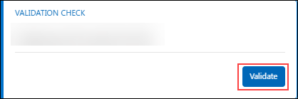

# Cloud Native Apps with Azure Services 

### Overall Estimated Duration: 8 hours

## Overview

Contoso Traders (ContosoTraders) provides online retail website services tailored to the electronics community. They are refactoring their application to run as a Docker application. They want to implement a proof of concept that will help them get familiar with the development process, lifecycle of deployment, and critical aspects of the hosting environment. They will be deploying their applications to Azure Kubernetes Service and want to learn how to deploy containers in a dynamically load-balanced manner, discover containers, and scale them on demand.

In this hands-on lab, you will assist with completing this POC with a subset of the application codebase. You will use a pre-created build agent based on Linux and an Azure Kubernetes Service cluster for running deployed applications. You will be helping them to complete the Docker setup for their application, test locally, push to an image repository, deploy to the cluster, test load-balancing and scale and use Azure Monitor and view the insights.

## Objective

The objective is to understand how to deploy containerized applications to Azure Kubernetes Service (AKS), manage scaling, and monitor performance.By the end of this lab, you will be able to:

- **Build Docker Images for the Application** The objective is to understand the process of containerizing an application using Docker images, pushing the images to Azure Container Registry, and managing them for secure and centralized access.

- **Migrate MongoDB to Cosmos DB using Azure Database Migration:** The objective is to learn how to migrate an on-premises MongoDB database hosted on an Azure Linux VM to Azure Cosmos DB using the Azure Database Migration Service, simplifying and automating the migration process.

- **Deploy the application to the Azure Kubernetes Service:** The objective is to deploy a containerized web application to Azure Kubernetes Service (AKS) using Key Vault Secrets and Azure Container Registry (ACR), while exploring two different deployment methods.

- **Scale the application and validate HA:** The objective is to scale the front-end web service by increasing the number of container instances in the existing Kubernetes cluster.

- **Updating Apps & Managing Kubernetes Ingress:** The objective is to configure API deployments to use dynamic port mappings, allowing multiple pod instances to run on the same agent node and eliminating port resource constraints during scaling activities.

- **Azure Monitor for Containers:** The objective is to review Azure Monitor container insights for the AKS cluster, enabling you to analyze telemetry data to maximize the availability and performance of your applications and services.

## Prerequisites

Participants should have:

- **Azure Platform Understanding:** Basic knowledge of Azure services, including Azure Database for PostgreSQL.

- **Basic Docker Knowledge:** Familiarity with Docker concepts, including images, containers, and Dockerfiles.

- **Basic MongoDB Understanding:** Basic knowledge of MongoDB and its usage in cloud environments.

- **Kubernetes Basics:** Understanding of Kubernetes concepts such as pods, deployments, and services.

## Architecture

The exercises utilize several Azure services to build, deploy, and manage applications effectively. Azure Container Registry (ACR) is used for storing and managing Docker container images, while Azure Cosmos DB provides a scalable, multi-model database solution for data migration. Azure Kubernetes Service (AKS) enables the deployment and management of containerized applications within a managed Kubernetes environment. For scaling and high availability, Azure Load Balancer distributes traffic across servers, and Azure Application Gateway offers advanced load balancing and routing for web applications. Finally, Azure Monitor tracks the performance and health of applications and infrastructure, including containerized environments, ensuring comprehensive monitoring and insights.

## Architecture Diagram

## Explanation of Components

The architecture for this lab involves several key components:

- **Azure Container Registry (ACR):** A managed Docker container registry for storing and managing Docker container images.
- **Azure Cosmos DB:** A globally distributed, multi-model database service for managing and scaling NoSQL data.
- **Azure Kubernetes Service (AKS):** A managed Kubernetes container orchestration service for deploying, scaling, and managing containerized applications.
- **Azure Load Balancer (Part of AKS):** A high-performance load balancer that distributes network traffic across multiple servers to ensure high availability.
- **Azure Application Gateway (Part of AKS):** A web traffic load balancer that enables you to manage traffic to your web applications and provides URL-based routing and SSL termination.
- **Azure Monitor:** A comprehensive monitoring service that provides insights into the performance and health of applications and infrastructure, including containerized workloads.

## Getting Started with the lab
 
Welcome to your Cloud Native Application lab, We've prepared a seamless environment for you to explore and learn about Azure services. Let's begin by making the most of this experience:
 
## **Accessing Your Lab Environment**
 
Once you're ready to dive in, your virtual machine and **Guide** will be right at your fingertips within your web browser.

   

### **Virtual Machine & Lab Guide**
 
Your virtual machine is your workhorse throughout the workshop. The guide is your roadmap to success.
 
## **Exploring Your Lab Resources**
 
To get a better understanding of your lab resources and credentials, navigate to the **Environment Details** tab.

   
 
## **Utilizing the Split Window Feature**
 
For convenience, you can open the lab guide in a separate window by selecting the **Split Window** button from the Top right corner.
 
   
 
## **Managing Your Virtual Machine**
 
Feel free to start, stop, or restart your virtual machine as needed from the **Resources** tab. Your experience is in your hands!
 
  

## Lab Validation

1. After completing the task, hit the **Validate** button under the Validation tab integrated within your lab guide. If you receive a success message, you can proceed to the next task, if not, carefully read the error message and retry the step, following the instructions in the lab guide.

   

1. If you need any assistance, please contact us at labs-support@spektrasystems.com.

## Lab Duration Extension

1. To extend the duration of the lab, kindly click the **Hourglass** icon in the top right corner of the lab environment. 

   

   >**Note:** You will get the **Hourglass** icon when 10 minutes are remaining in the lab.

2. Click **OK** to extend your lab duration.
 
   

3. If you have not extended the duration prior to when the lab is about to end, a pop-up will appear, giving you the option to extend. Click **OK** to proceed.
      
## **Let's Get Started with Azure Portal**
 
1. On your virtual machine, click on the Azure Portal icon as shown below:
 
    
 
2. You'll see the **Sign into Microsoft Azure** tab. Here, enter your credentials:
 
   - **Email/Username:** <inject key="AzureAdUserEmail"></inject>
 
        
 
3. Next, provide your password:
 
   - **Password:** <inject key="AzureAdUserPassword"></inject>
 
        
 
4. If you see the pop-up **Stay Signed in?**, click **No**.

    

5. If you see the pop-up **You have free Azure Advisor recommendations!**, close the window to continue the lab.

6. If a **Welcome to Microsoft Azure** popup window appears, click **Maybe Later** to skip the tour.

## Support Contact

The CloudLabs support team is available 24/7, 365 days a year, via email and live chat to ensure seamless assistance at any time. We offer dedicated support channels tailored specifically for both learners and instructors, ensuring that all your needs are promptly and efficiently addressed.

Learner Support Contacts:

- Email Support: cloudlabs-support@spektrasystems.com

- Live Chat Support: https://cloudlabs.ai/labs-support
   
Now, click on Next from the lower right corner to move to the next page.

### Happy Learning!!

