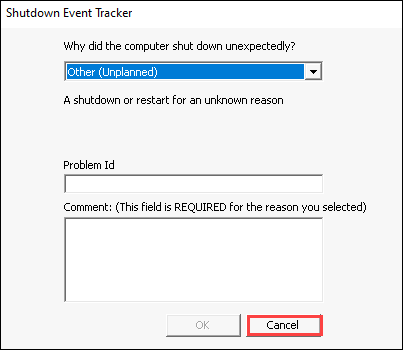
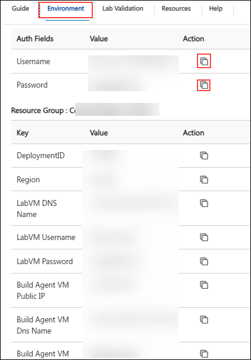
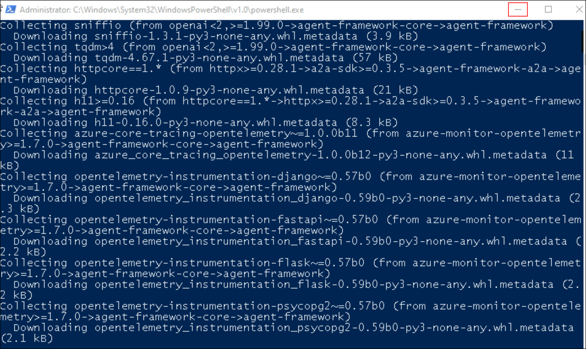
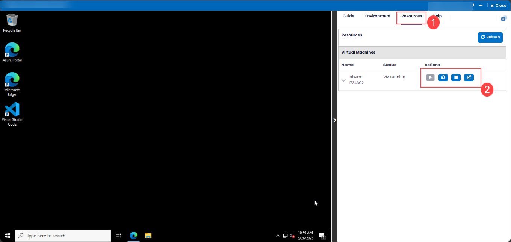
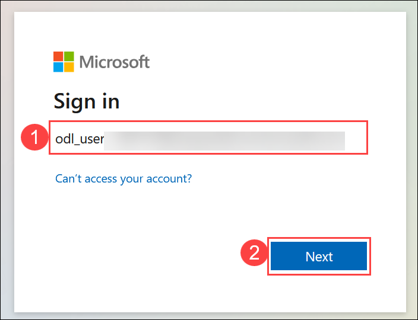

# Cloud Native Apps with Azure Services - Build Docker Images for the Application

### Overall Estimated Duration: 60 Minutes

## Overview

In this lab, you'll learn to containerize an application using Docker and deploy it to Azure Container Registry (ACR). You'll start by creating a Dockerfile to define your application's environment. Next, you'll build a Docker image from this Dockerfile and test it locally to ensure it functions correctly. After verifying, you'll create an ACR instance in your Azure subscription to securely store your Docker images. You'll then tag your Docker image appropriately and push it to ACR. Finally, you'll configure authentication and permissions to manage access to your containerized application. This process provides a comprehensive understanding of containerizing applications and managing them using Azure services.

## Objective

The objective of the Containerization Lab is to equip participants with the skills to seamlessly containerize applications using Docker and deploy them to Azure Container Registry (ACR). By the end of this lab, you will be able to:

- **Build Docker Images for the Application:** The objective is to gain an understanding of the process of containerizing the Contoso Traders application using Docker, testing it locally, and deploying the Docker image to Azure Container Registry for centralized management and secure access.

## Prerequisites

Participants should have:

- **Azure Platform Understanding:** Basic knowledge of Azure services, including Azure Database for PostgreSQL.

- **Basic Docker Knowledge:** Familiarity with Docker concepts, including images, containers, and Dockerfiles.

## Architechture

This architecture illustrates the deployment process for containerizing an application using Docker and pushing the created images to Azure Container Registry. In this lab, the user will walk through the process of building a Docker image on a Linux VM, configuring Docker to containerize the application, and then pushing the Docker image to Azure Container Registry for secure storage and management. This lab provides a foundational understanding of working with Docker and Azure Container Registry to manage containerized applications in a cloud environment.

## Explanation of Components

- **Azure Virtual Machine:** A virtual machine running a Linux operating system, used to create and test the Docker image. The Linux VM serves as the environment where Docker is installed and configured to build containerized applications.

- **Docker:** A platform used to build, ship, and run applications in isolated containers. Docker allows the creation of images, which are executable snapshots of an application’s environment, including dependencies, code, and runtime configurations. In this lab, Docker is used to create the containerized version of the application.

- **Azure Container Registry (ACR):** A managed Docker registry service provided by Azure, where Docker images can be securely stored, managed, and accessed. After building the Docker image on the Linux VM, it is pushed to ACR for centralized storage. Azure Container Registry ensures the images are readily available for deployment across different Azure services or environments.

## Getting Started with the lab
 
Welcome to your Cloud Native Application lab, We've prepared a seamless environment for you to explore and learn about Azure services. Let's begin by making the most of this experience:
 
## **Accessing Your Lab Environment**
 
Once you're ready to dive in, your virtual machine and **Lab Guide** will be right at your fingertips within your web browser.

   

Once you get access to Virtual Machine, in the dialog for shutdown event tracker, click on **cancel**.

   

If a **PowerShell** window opens and starts installing packages, **do not close it**. Click the **Minimize** button and continue with the lab.

   

### **Virtual Machine & Lab Guide**
 
Your virtual machine is your workhorse throughout the workshop. The lab guide is your roadmap to success.
 
## **Exploring Your Lab Resources**
 
To get a better understanding of your lab resources and credentials, navigate to the **Environment Details** tab.

   
 
## **Utilizing the Split Window Feature**
 
For convenience, you can open the lab guide in a separate window by selecting the **Split Window** button from the Top right corner.
 
   

If a **PowerShell** window opens and starts installing packages, **do not close it**. Click the **Minimize** button and continue with the lab.

   
 
## **Managing Your Virtual Machine**
 
Feel free to start, stop, or restart your virtual machine as needed from the **Resources** tab. Your experience is in your hands!
 
   
 
## **Let's Get Started with Azure Portal**
 
1. On your virtual machine, click on the Azure Portal icon as shown below:
 
    
 
2. You'll see the **Sign into Microsoft Azure** tab. Here, enter your credentials:
 
   - **Email/Username:** <inject key="AzureAdUserEmail"></inject>
 
     
 
3. Next, provide your password:
 
   - **Password:** <inject key="AzureAdUserPassword"></inject>
 
     
 
4. If you see the pop-up **Stay Signed in?**, click **No**.

     

5. If you see the pop-up **You have free Azure Advisor recommendations!**, close the window to continue the lab.

6. If a **Welcome to Microsoft Azure** popup window appears, click **Maybe Later** to skip the tour.

## Support Contact

The CloudLabs support team is available 24/7, 365 days a year, via email and live chat to ensure seamless assistance at any time. We offer dedicated support channels tailored specifically for both learners and instructors, ensuring that all your needs are promptly and efficiently addressed.

Learner Support Contacts:

- Email Support: cloudlabs-support@spektrasystems.com

- Live Chat Support: https://cloudlabs.ai/labs-support
   
Now, click on Next from the lower right corner to move to the next page.

   

### Happy Learning!!

