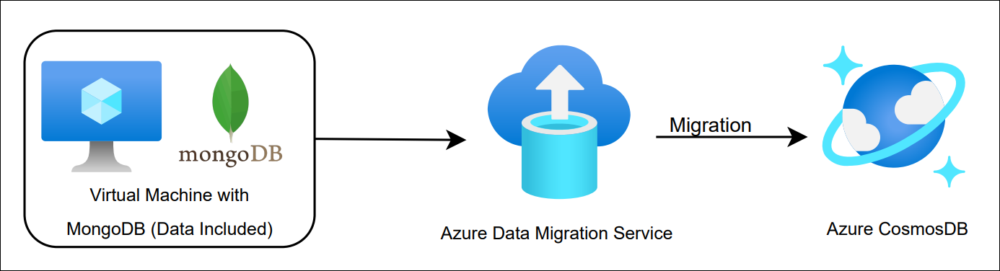

# Cloud Native Apps with Azure Services - Migrate MongoDB to Cosmos DB using Azure Database Migration

### Overall Estimated Duration: 60 Minutes

## Overview

In this lab, you will learn how to migrate an on-premises MongoDB database, hosted on an Azure Linux VM, to Azure Cosmos DB using Azure Database Migration Service. This service simplifies and automates the migration process, allowing for a seamless transition of your MongoDB data to the cloud. You will walk through the process of setting up and configuring the Azure Database Migration Service, ensuring compatibility with Cosmos DB, and performing the migration with minimal downtime and data loss.

## Objective

Equip participants with the skills to seamlessly migrate an on-premises MongoDB database, hosted on an Azure Linux VM, to Azure Cosmos DB using Azure Database Migration Service. By the end of this lab, you will be able to:

- **Migrate MongoDB to Cosmos DB using Azure Database Migration:** The objective of this lab is to enable participants to migrate an on-premises MongoDB database, hosted on an Azure Linux VM, to Azure Cosmos DB using Azure Database Migration Service.

## Prerequisites

Participants should have:

- **Azure Platform Understanding:** Basic knowledge of Azure services, including Azure Database for PostgreSQL.

## Architechture

This architecture illustrates the migration process for transferring a MongoDB database to Azure Cosmos DB using Azure Database Migration Service. In this lab, the user will walk through the process of setting up a VM with MongoDB preloaded with tables and data, configuring Azure Database Migration Service to facilitate the migration, and transferring the database to Azure Cosmos DB. This lab provides a foundational understanding of using Azure tools to migrate on-premises databases to the cloud securely and efficiently.

## Architechture Diagram

## Explanation of Components

- **Azure Virtual Machine (VM):** A virtual machine hosting a MongoDB database, preloaded with tables and data. The VM serves as the on-premises environment for the MongoDB database, which will be migrated to Azure Cosmos DB.

- **MongoDB:** A popular open-source NoSQL database designed for flexibility and scalability. It stores data in a document-oriented format (JSON-like) and is widely used for modern application development. In this lab, MongoDB is the source database hosted on the virtual machine, and its data will be migrated to Azure Cosmos DB.

- **Azure Database Migration Service (DMS):** A fully managed migration service that simplifies and automates the migration of databases to Azure. In this lab, DMS is used to assess compatibility and migrate the MongoDB database from the virtual machine to Azure Cosmos DB while ensuring minimal downtime and data consistency.

- **Azure Cosmos DB:** A globally distributed, multi-model database service that supports MongoDB API for seamless integration. Cosmos DB provides scalability, high availability, and low latency. In this lab, Cosmos DB is the target database where the migrated MongoDB data will be stored, offering enhanced performance and global distribution capabilities.

## Getting Started with the lab
 
Welcome to your Cloud Native Application lab, We've prepared a seamless environment for you to explore and learn about Azure services. Let's begin by making the most of this experience:
 
## **Accessing Your Lab Environment**
 
Once you're ready to dive in, your virtual machine and **Lab Guide** will be right at your fingertips within your web browser.

   

### **Virtual Machine & Lab Guide**
 
Your virtual machine is your workhorse throughout the workshop. The lab guide is your roadmap to success.
 
## **Exploring Your Lab Resources**
 
To get a better understanding of your lab resources and credentials, navigate to the **Environment Details** tab.

   
 
## **Utilizing the Split Window Feature**
 
For convenience, you can open the lab guide in a separate window by selecting the **Split Window** button from the Top right corner.
 
   
 
## **Managing Your Virtual Machine**
 
Feel free to start, stop, or restart your virtual machine as needed from the **Resources** tab. Your experience is in your hands!
 
  
 
## **Let's Get Started with Azure Portal**
 
1. On your virtual machine, click on the Azure Portal icon as shown below:
 
    
 
2. You'll see the **Sign into Microsoft Azure** tab. Here, enter your credentials:
 
   - **Email/Username:** <inject key="AzureAdUserEmail"></inject>
 
        
 
3. Next, provide your password:
 
   - **Password:** <inject key="AzureAdUserPassword"></inject>
 
        
 
4. If you see the pop-up **Stay Signed in?**, click **No**.

    

5. If you see the pop-up **You have free Azure Advisor recommendations!**, close the window to continue the lab.

6. If a **Welcome to Microsoft Azure** popup window appears, click **Maybe Later** to skip the tour.

## Support Contact

The CloudLabs support team is available 24/7, 365 days a year, via email and live chat to ensure seamless assistance at any time. We offer dedicated support channels tailored specifically for both learners and instructors, ensuring that all your needs are promptly and efficiently addressed.

Learner Support Contacts:

- Email Support: cloudlabs-support@spektrasystems.com

- Live Chat Support: https://cloudlabs.ai/labs-support
   
Now, click on Next from the lower right corner to move to the next page.

### Happy Learning!!

