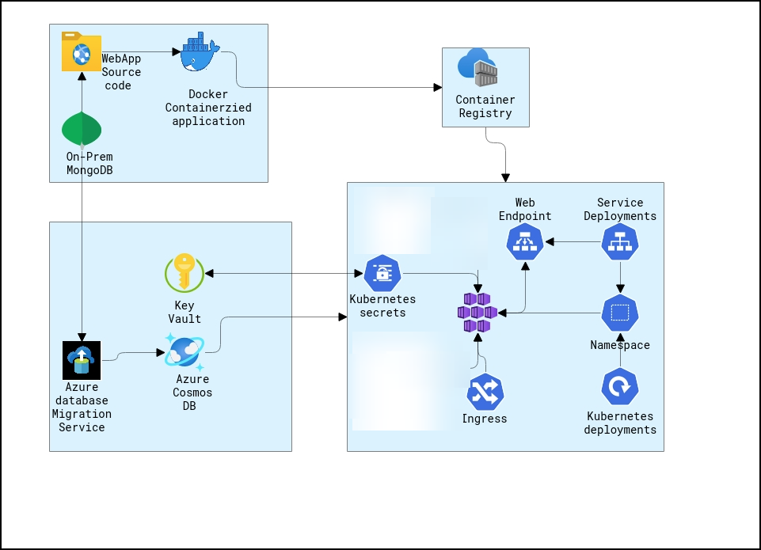
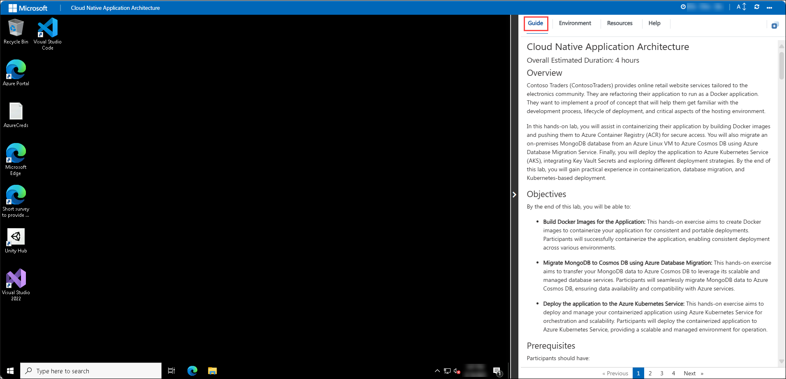
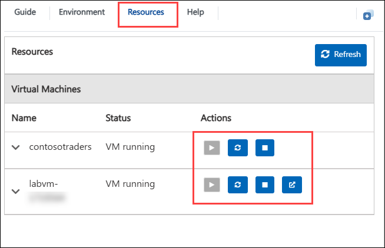
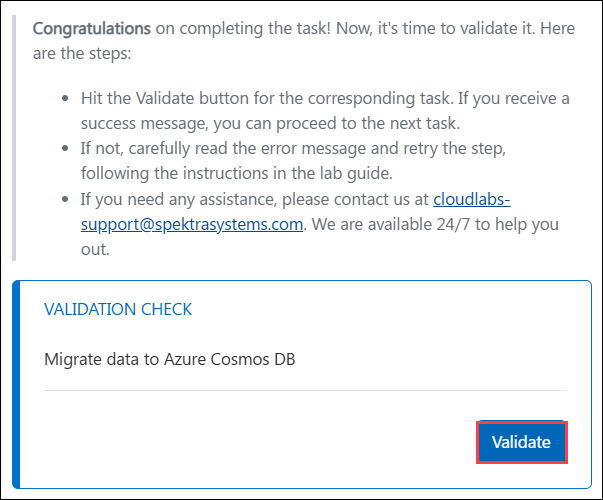
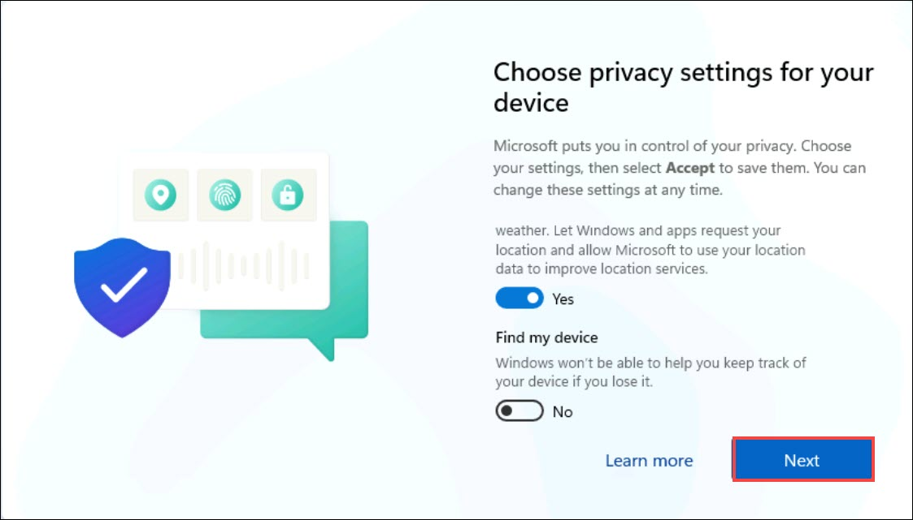
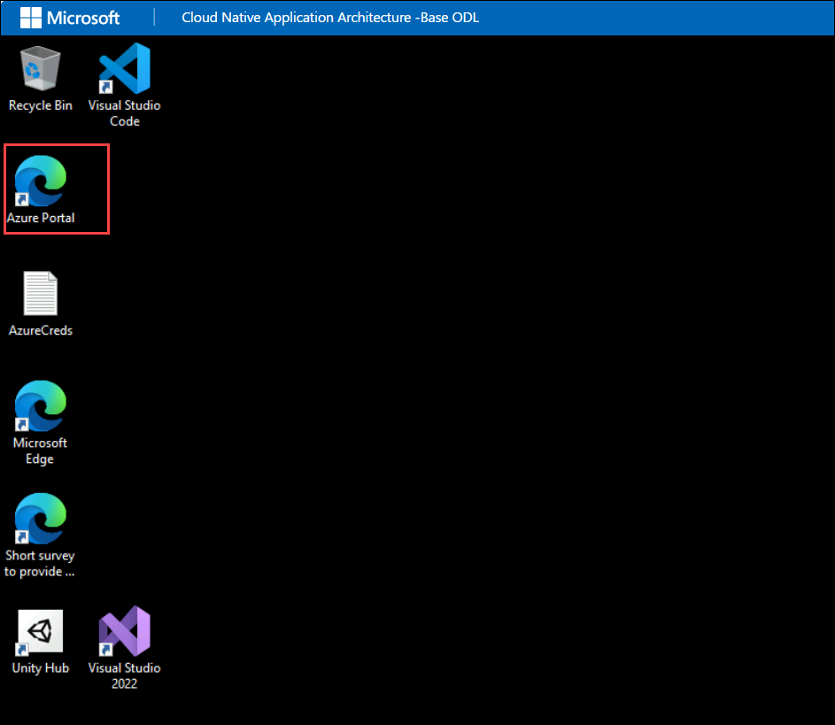
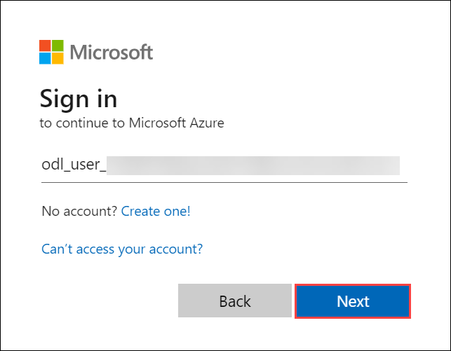
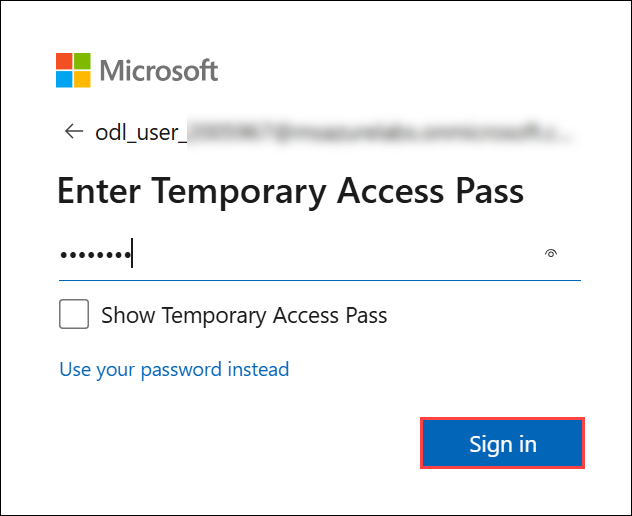
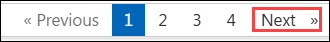

# Cloud Native Application Architecture

### Overall Estimated Duration: 4 Hours

## Overview

Contoso Traders (ContosoTraders) provides online retail website services tailored to the electronics community. They are refactoring their application to run as a Docker application. They want to implement a proof of concept that will help them get familiar with the development process, the lifecycle of deployment, and the critical aspects of the hosting environment.

In this hands-on lab, you will assist in containerising their application by building Docker images and pushing them to Azure Container Registry (ACR) for secure access. You will also migrate an on-premises MongoDB database from an Azure Linux VM to Azure Cosmos DB using Azure Database Migration Service. Finally, you will deploy the application to Azure Kubernetes Service (AKS), integrating Key Vault Secrets and exploring different deployment strategies. By the end of this lab, you will gain practical experience in containerization, database migration, and Kubernetes-based deployment.

## Objectives

By the end of this lab, you will be able to:

- **Build Docker Images for the Application:** This hands-on exercise aims to create Docker images to containerize your application for consistent and portable deployments. Participants will successfully containerize the application, enabling consistent deployment across various environments.

- **Migrate MongoDB to Cosmos DB using Azure Database Migration:** This hands-on exercise aims to transfer your MongoDB data to Azure Cosmos DB to leverage its scalable and managed database services. Participants will seamlessly migrate MongoDB data to Azure Cosmos DB, ensuring data availability and compatibility with Azure services.

- **Deploy the application to the Azure Kubernetes Service:** This hands-on exercise aims to deploy and manage your containerized application using Azure Kubernetes Service for orchestration and scalability. Participants will deploy the containerized application to Azure Kubernetes Service, providing a scalable and managed environment for operation.

## Prerequisites

Participants should have:

- Understanding Docker concepts such as containers, images, and Dockerfiles.
- Knowledge of MongoDB data structures and Azure Cosmos DB capabilities for effective migration.
- Basic understanding of Kubernetes concepts, including pods, deployments, and services, as well as Azure Kubernetes Service (AKS).
- General understanding of cloud services, container orchestration, and scaling strategies.
- Proficiency in using command-line tools and interfaces, such as Azure CLI and Docker CLI.

## Architecture

The lab utilize several Azure services to build, deploy, and manage applications effectively. Azure Container Registry (ACR) is used for storing and managing Docker container images, while Azure Cosmos DB provides a scalable, multi-model database solution for data migration. Azure Kubernetes Service (AKS) enables the deployment and management of containerized applications within a managed Kubernetes environment

## Architecture Diagram

## Explanation of Components

The architecture for this lab involves several key components:

- **Azure Container Registry (ACR):** A managed Docker container registry for storing and managing Docker container images.
- **Azure Cosmos DB:** A globally distributed, multi-model database service for managing and scaling NoSQL data.
- **Azure Kubernetes Service (AKS):** A managed Kubernetes container orchestration service for deploying, scaling, and managing containerized applications.
- **Azure Database Migration Service (DMS):** A fully managed service designed to streamline and automate the migration of databases to Azure with minimal downtime. It supports migrations from various database sources, including SQL Server, MySQL, PostgreSQL, MongoDB, and Oracle, to Azure SQL Database, Azure Cosmos DB, and other Azure data platforms.
- **Azure Key Vault:** A cloud service that securely stores and manages sensitive information like secrets, encryption keys, and certificates used by applications and services

## Getting Started with the Lab

Welcome to your Cloud Native Application Architecture Workshop! We've prepared a seamless environment for you to explore and learn about Azure services. Let's begin by making the most of this experience:

## Accessing Your Lab Environment
 
Once you're ready to dive in, your virtual machine and **Guide** will be right at your fingertips within your web browser.

   

   >**Note:** Once the environment gets set up, you will see the PowerShell automation script executing on the desktop. Wait for it to complete and ensure not to close or cancel it.

## Virtual Machine & Lab Guide
 
Your virtual machine is your workhorse throughout the workshop. The lab guide is your roadmap to success.
 
## Exploring Your Lab Resources
 
To get a better understanding of your lab resources and credentials, navigate to the **Environment** tab.
 
.png)
 
   > You will see the **DeploymentID** value on the **Environment** tab, use it wherever you see SUFFIX or DeploymentID in lab steps.

## Utilizing the Split Window Feature
 
For convenience, you can open the lab guide in a separate window by selecting the **Split Window** button from the Top right corner.
 
 .png)

## Managing Your Virtual Machine
 
Feel free to **Start, Stop, or Restart** your virtual machine as needed from the **Resources** tab. Your experience is in your hands!
 
    

## Lab Guide Zoom In/Zoom Out

To adjust the zoom level for the environment page, click the **A↕ : 100%** icon located next to the timer in the lab environment.

.png)

## Lab Validation

After completing the task, hit the **Validate** button under the Validation tab integrated within your lab guide. If you receive a success message, you can proceed to the next task; if not, carefully read the error message and retry the step, following the instructions in the lab guide.

   

If you need any assistance, please contact us at cloudlabs-support@spektrasystems.com.

## Login to Azure Portal

1. Once you are on the LabVM, if a Windows screen titled **Choose privacy settings for your device** appears, proceed by clicking **Next** through each of the configuration steps, typically four times, then click **Accept** to complete the setup.

   

1. In the LabVM, click on the **Azure Portal** shortcut of the Microsoft Edge browser, which is created on the desktop.

   
   
1. On the **Sign into Microsoft Azure** tab, you will see the login screen. In that enter the following email/username and then click on **Next**. 
   * Email/Username: <inject key="AzureAdUserEmail"></inject>
   
     
     
1. Now enter the following password and click on **Sign in**.
   * Password: <inject key="AzureAdUserPassword"></inject>
   
     
  
1. If you see the pop-up **Stay Signed in?**, click **No**.

   .png "Enter Password")

1. If you see the pop-up **You have free Azure Advisor recommendations!**, close the window to continue the lab.

1. If a **Welcome to Microsoft Azure** popup window appears, click **Cancel** to skip the tour.

## Support Contact

The CloudLabs support team is available 24/7, 365 days a year, via email and live chat to ensure seamless assistance at any time. We offer dedicated support channels tailored specifically for both learners and instructors, ensuring that all your needs are promptly and efficiently addressed.

Learner Support Contacts:

- Email Support: cloudlabs-support@spektrasystems.com
- Live Chat Support: https://cloudlabs.ai/labs-support

Now, click on **Next** from the lower right corner to move on to the next page.

## Happy Learning!!
