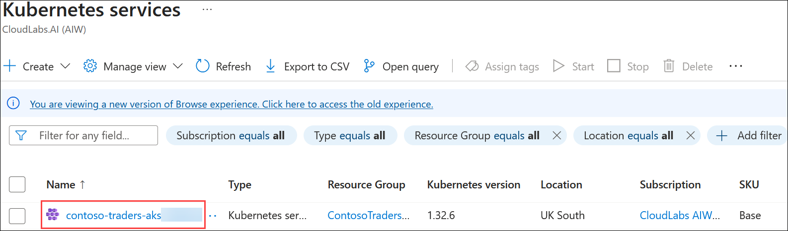
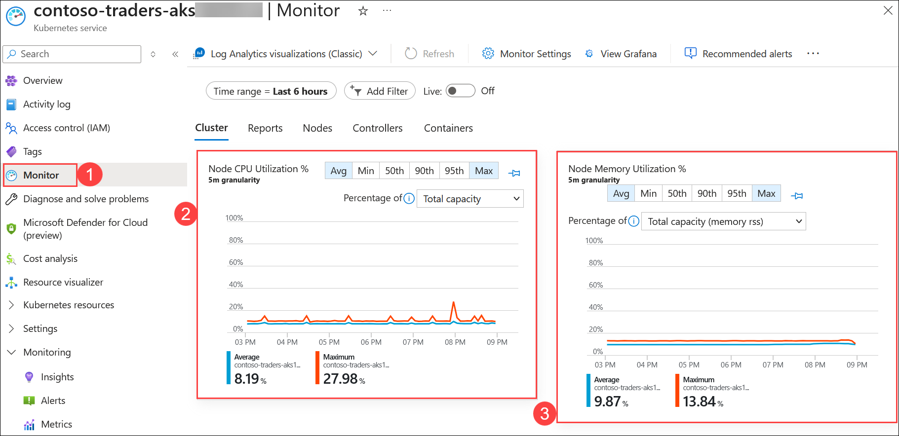

# Exercise 6: Azure Monitor for Containers

## Estimated Duration: 30 Minutes

## Overview

In this exercise, you will be reviewing the Azure Monitor container insights for the AKS cluster. Azure Monitor helps you maximize the availability and performance of your applications and services. It delivers a comprehensive solution for collecting, analyzing, and acting on telemetry from your cloud and on-premises environments.

A few examples of what you can do with Azure Monitor include:

- Detect and diagnose issues across applications and dependencies with Application Insights.
- Correlate infrastructure issues with VM insights and Container insights.
- Collect data from monitored resources by using Azure Monitor Metrics.

## Objectives

In this exercise, you will complete the following task:
- Task 1: Review Azure Monitor metrics

### Task 1: Review Azure Monitor metrics

In this task, you will review the monitored AKS cluster, focusing on visually inspecting the metrics and logs available in Azure Monitor. No alerts or issues are expected to be detected unless they have been explicitly configured.

1. Navigate back to the Azure portal in the browser and search for **aks (1)**. Select **Kubernetes services (2)** from the result.

   
     
1. On the Kubernetes Services page, select **contoso-traders-aks<inject key="DeploymentID" enableCopy="false"/>**.

   
   
1. In the **Monitor (1)** section of your Kubernetes service resource blade, you can view logs related to the service's activity, such as Node CPU, Node Memory utilization, etc.

   > **Note**: The Azure Monitor can take up to 15 minutes to populate the data in the insight blade.

   > **Important**: This task is for visual review only. If you wish to explore alerts, you can configure an alert rule in Azure Monitor. For example, you can create an alert for high CPU usage or memory consumption. Refer to the Azure documentation for guidance on setting up alert rules.
    
    

<!--
#### Validation

> **Congratulations** on completing the task! Now, it's time to validate it. Here are the steps:
> - If you receive a success message, you can proceed to the next task.
> - If not, carefully read the error message and retry the step, following the instructions in the lab guide. 
> - If you need any assistance, please contact us at labs-support@spektrasystems.com. We are available 24/7 to help you out.

<validation step="61a4d164-94b8-4a8a-a3cd-5000a222fa68" />
-->

## Summary

In this exercise, you have reviewed Azure Monitor container insights for the AKS cluster.

## Lab ends

