# Ejercicio 2: Migrar MongoDB a Cosmos DB mediante Azure Database Migration
  
### Duración estimada: 65 minutos

## Descripción General

En este ejercicio, migrará su base de datos MongoDB on-premises (local) hospedada en una Máquina Virtual (MV) Linux de Azure a Azure CosmosDB utilizando Azure Database Migration. Azure Database Migration Service es una herramienta que le ayuda a simplificar, guiar y automatizar la migración de su base de datos a Azure.

## Objetivos del laboratorio

Podrá completar las siguientes tareas:

- Tarea 1: Explorar las bases de datos y colecciones en MongoDB
- Tarea 2: Crear un proyecto de migración y migrar datos a Azure Cosmos DB

## Tarea 1: Explorar las bases de datos y colecciones en MongoDB

En esta tarea, se conectará a una base de datos Mongo alojada en una Máquina Virtual Linux de Azure y explorará las bases de datos y colecciones que contiene.

1. Conéctese a su máquina virtual Linux y ejecute el siguiente comando para comprobar si MongoDB está instalado:

   ```
   mongo --version
   ```  

   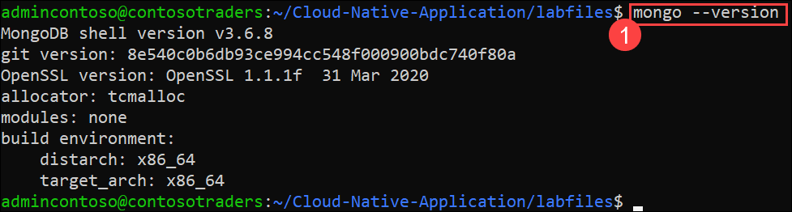   

   >**Nota:** Si MongoDB está instalado, continúe con el siguiente paso. Si no lo está, siga los pasos de solución de problemas a continuación.

   > Ejecute el comando **<inject key="Command to Connect to Build Agent VM" enableCopy="true" />**. Escriba **yes** en el mensaje **Are you sure you want to continue connection (yes/no/[fingerprint])?** e introduzca la contraseña de la máquina virtual **<inject key="Build Agent VM Password" enableCopy="true" />** para conectarse a la máquina virtual Linux mediante SSH. Ejecute los siguientes comandos.


   ```
   sudo apt install mongodb-server
   cd /etc
   sudo sed -i 's/bind_ip = 127.0.0.1/bind_ip = 0.0.0.0/g' /etc/mongodb.conf
   sudo sed -i 's/#port = 27017/port = 27017/g' /etc/mongodb.conf
   cd ~/Cloud-Native-Application/labfiles/src/developer/content-init
   npm ci
   nodejs server.js   
   sudo service mongodb stop
   sudo service mongodb start
   ```   

      

1. Mientras esté conectado a su máquina virtual Linux, ejecute el siguiente comando para conectarse al shell mongo para mostrar las bases de datos y colecciones en él usando el shell mongo.

   ```
   mongo
   ```

   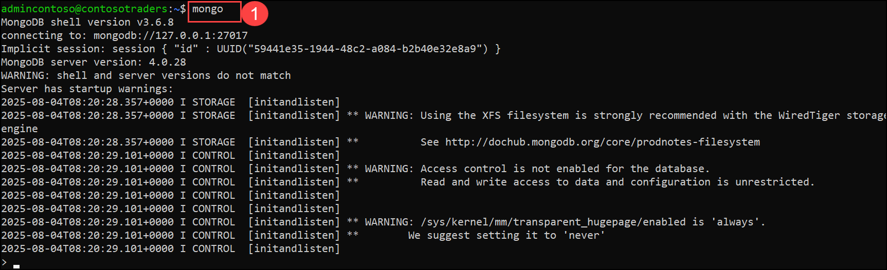 

   
1. Ejecute los siguientes comandos para verificar la base de datos en Mongo shell. Debería poder ver la base de datos **contentdb** disponible y las colecciones **item & products** dentro de **contentdb**.

   ```
   show dbs
   use contentdb
   show collections
   ```
   
   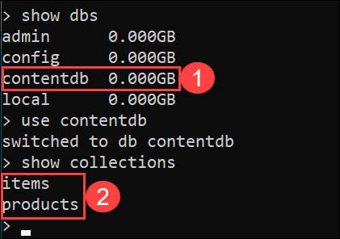 


## Tarea 2: Crear un Proyecto de Migración y migrar datos a Azure CosmosDB

En esta tarea, creará un Proyecto de Migración dentro de Azure Database Migration Service, y luego migrará los datos de MongoDB a Azure Cosmos DB. En los ejercicios posteriores, utilizará Azure CosmosDB para recuperar los datos de la página de productos. 

1. En el Portal de Azure, navegue a su máquina virtual **contosotraders** en el grupo de recursos **contosoTraders-<inject key="DeploymentID" enableCopy="false" />**. Copie la **Dirección IP Privada** **(2)** y péguela en el bloc de notas para usarla más adelante.

   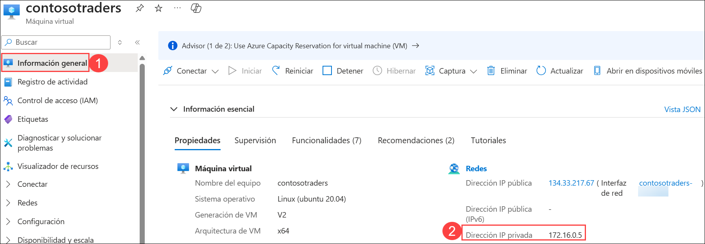

1. Navegue al grupo de recursos **contosoTraders<inject key="DeploymentID" enableCopy="false" />(1)** y abra la cuenta de Cosmos DB para MongoDB (RU) **contosotraders-<inject key="DeploymentID" enableCopy="false" />(2)**.

   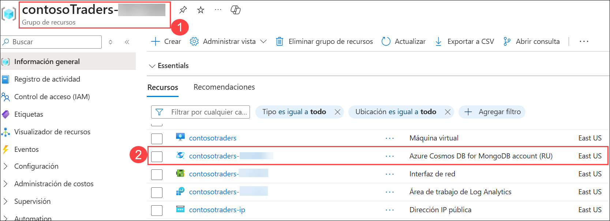

1. Haga clic en **Explorador de datos (1)**. Ahora haga clic en la flecha desplegable, junto a **+ Nueva colección (2)** y luego seleccione **+ Nueva base de datos (3)**.

   -new.png)

1. Proporcione el nombre como `contentdb` **(1)** para el **Id. de la base de datos**. Seleccione **Asignar rendimiento (2)** y luego seleccione **Rendimiento de la base de datos** como **Manual** **(3)**, proporcione el valor de RU/s como `400` **(4)** y haga clic en **Aceptar (5)**.

      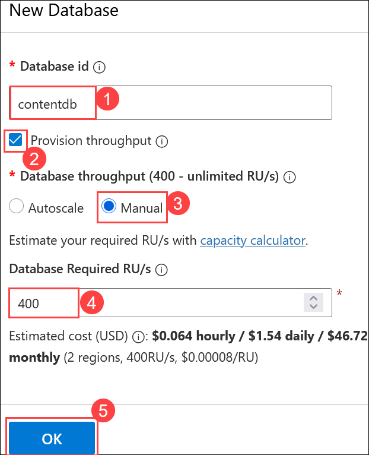

   > **Nota:** Para visualizar las configuraciones, asegúrate de que la opción Provision throughput esté **marcada**.

1. En el grupo de recursos **contosoTraders-<inject key="DeploymentID" enableCopy="false" />**, busque el recurso **contosotraders<inject key="DeploymentID" enableCopy="false" />** **(1)** de Azure Database Migration Service y diríjase a ese recurso **(2)**

   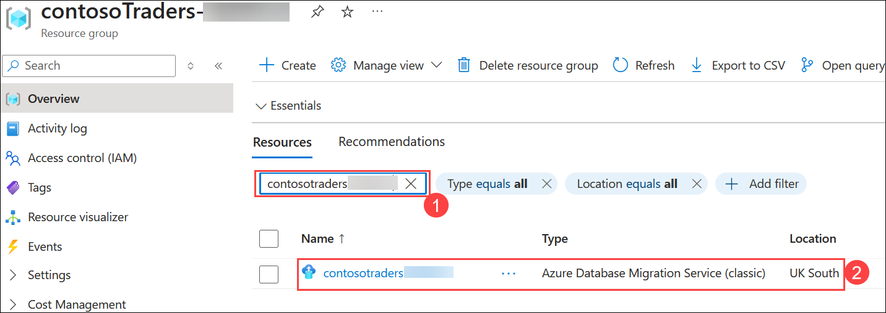

1. En la hoja Azure Database Migration Service, seleccione **+ Nuevo Proyecto de Migración (2)** en el panel **información general (1)**.

   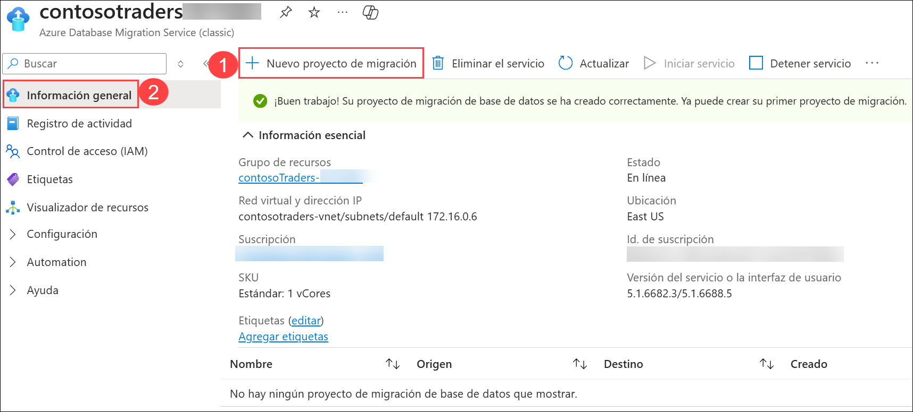

1. En el panel **Nuevo proyecto de migración**, ingrese los siguientes valores y luego seleccione **Crear y ejecutar una actividad**:

    - **Nombre de proyecto**: `contoso` **(1)**
    - **Tipo de servidor de origen**: `MongoDB` **(2)**
    - **Tipo de servidor de destino**: `CosmosDB (API de MongoDB)` **(3)**
    - **Tipo de actividad de migración**: `Migración de datos sin conexión` **(4)**

      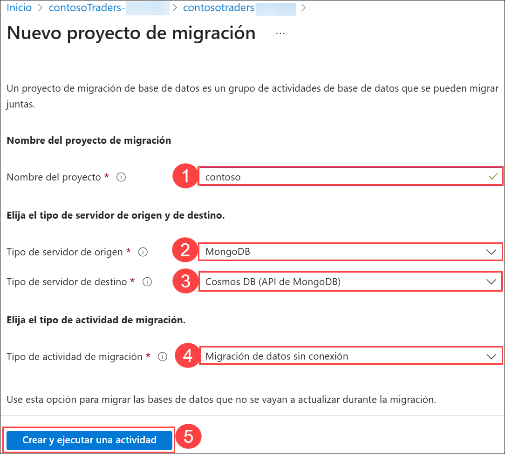

      >**Nota**: El tipo de actividad **Migración de datos sin conexión** está seleccionado ya que realizará una migración única de MongoDB a Cosmos DB. Además, los datos de la base de datos no se actualizarán durante la migración. En un escenario de producción, deberá elegir el tipo de actividad del proyecto de migración que mejor se adapte a los requisitos de su solución.

1. En el panel **Asistente de migración sin conexión de MongoDB a Azure Database for CosmosDB**, ingrese los siguientes valores para la pestaña **Seleccionar origen**:

    - Modo: **Modo estándar (1)**
    - Nombre del servidor de origen: ingrese la Dirección IP Privada de la MV del Agente de Compilación (Build Agent VM) utilizada en esta práctica de laboratorio. **(2)**
    - Puerto del servidor: `27017` **(3)**
    - Requerir SSL: Sin seleccionar **(4)**
    - Elija **Siguiente: Seleccionar el destino >> (5)**

    > **Nota:** Deje el **Nombre de usuario** y la **Contraseña** en blanco ya que la instancia de MongoDB en la MV del Agente de Compilación para esta práctica de laboratorio no tiene la autenticación activada. Azure Database Migration Service está conectado a la misma red virtual que la MV del Agente de Compilación, por lo que puede comunicarse dentro de la red virtual directamente con la MV sin exponer el servicio MongoDB a Internet. En escenarios de producción, siempre debe tener habilitada la autenticación en MongoDB.

      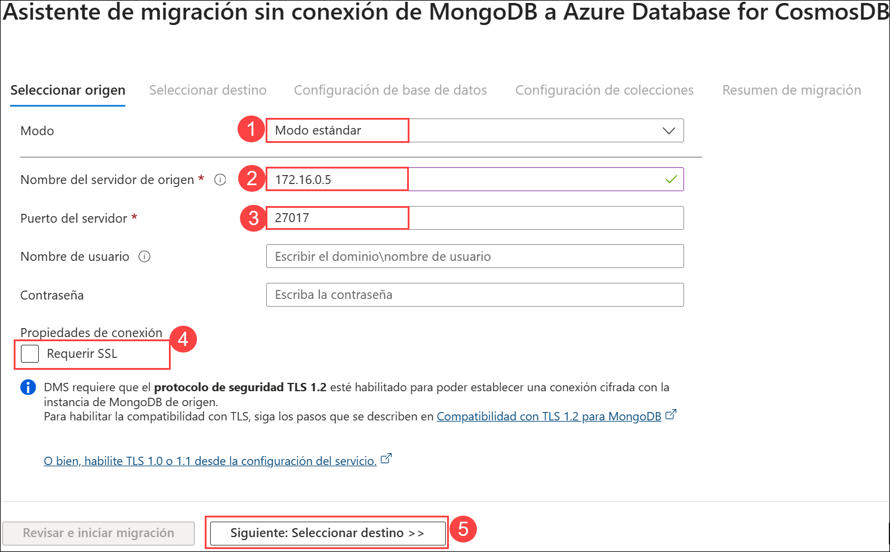
    
    > **Nota:** Si se encuentra con un problema al conectarse a la base de datos de origen tal como error: conexión denegada, por favor ejecute los siguientes comandos en **la MV del Agente de Compilación conectado en CloudShell**. Puede usar el **Comando para Conectarse a la MV del Agente de Compilación**, el cual se proporciona en la página de detalles del ambiente de laboratorio.
    

    ```bash
    cd /etc
    sudo sed -i 's/bind_ip = 127.0.0.1/bind_ip = 0.0.0.0/g' /etc/mongodb.conf
    sudo sed -i 's/#port = 27017/port = 27017/g' /etc/mongodb.conf
    sudo service mongodb stop
    sudo service mongodb start
    ```

1. En el panel **Seleccionar destino**, elija los siguientes valores: 

    - Modo: **Seleccionar destino de la base de datos de Cosmos DB**

    - Suscripción: seleccione la suscripción de Azure que está usando para esta práctica de laboratorio.

    - Seleccionar el nombre de Cosmos DB: Seleccione la instancia de CosmosDB  **contosotraders-<inject key="DeploymentID" enableCopy="false" />** .

    - Seleccione **Siguiente: Configuración de base de datos >>**.

      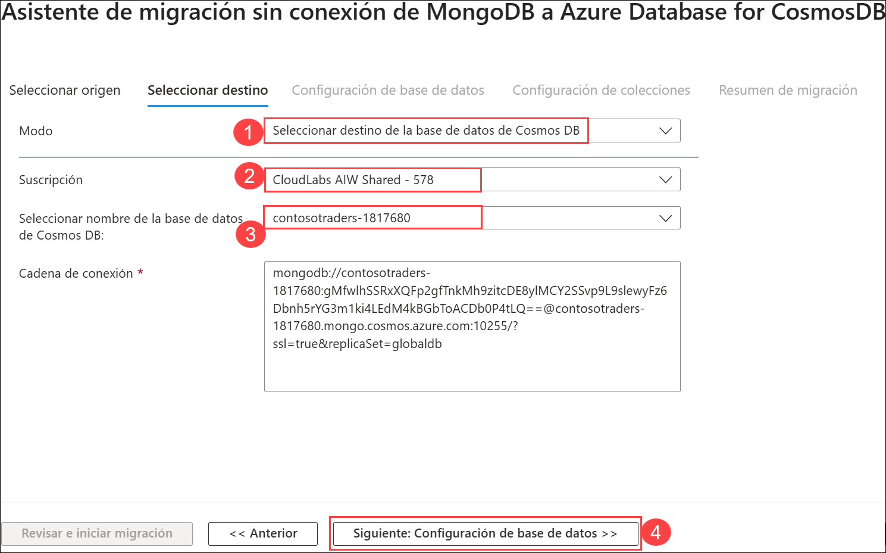

      Tenga en cuenta que la **Cadena de conexión** se completará automáticamente con la clave de su instancia de Azure Cosmos DB.

1. En la pestaña **Configuración de base de datos**, seleccione la **Base de datos de origen** `contentdb` **(1)**, a fin de que esta base de datos de MongoDB se migre a Azure Cosmos DB. Seleccione **Siguiente: Configuración de colecciónes >> (2)**.

   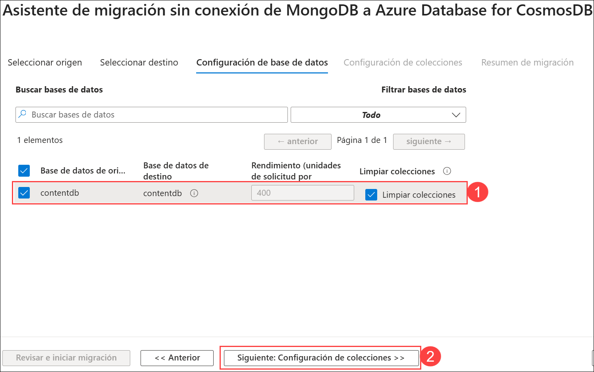

1. En la pestaña **Configuración de colección**, expanda la base de datos **contentdb** y asegúrese de que tanto las colecciones **products** como **items** estén seleccionadas para la migración. Además, actualice el **Rendimiento (RU/s)** a `400` **(1)** para ambas colecciones. Seleccione **Siguiente: Resumen de migración >> (2)**.

   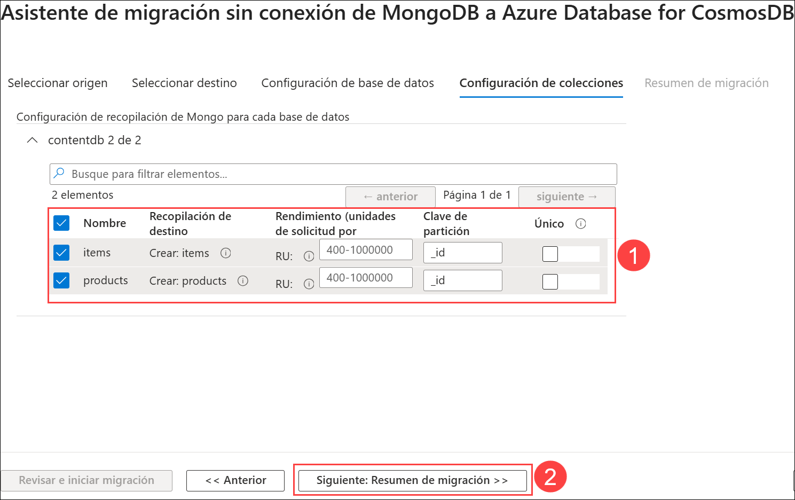

1. En la pestaña **Resumen de migración**, ingrese `MigrateData` **(1)** en el campo **Nombre de actividad** y luego seleccione **Iniciar la migración (2)** para iniciar la migración de los datos de MongoDB a Azure Cosmos DB.

   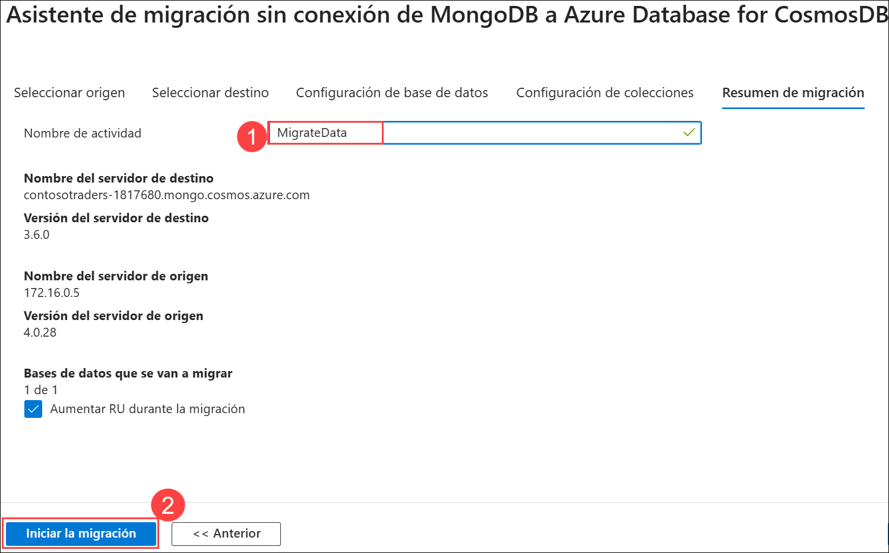

1. Se mostrará el estado de la actividad de migración. La migración finalizará en cuestión de segundos. Seleccione **Actualizar** para recargar el estado y asegurarse de que sea **completo**.

   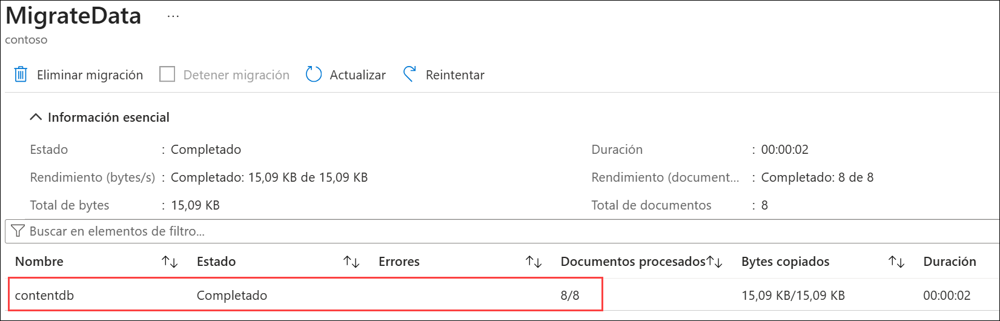

1. Para verificar los datos migrados, navegue hasta la cuenta Azure CosmosDB for MongoDB account (RU) en **contosotraders-<inject key="DeploymentID" enableCopy="false" />** en el Grupo de recursos **ContosoTraders-<inject key="DeploymentID" enableCopy="false" />**. Seleccione **Explorador de datos** del menú izquierdo.

   

1. Verá las colecciones `items` **(1)** y `products` **(2)** listadas dentro de la base de datos `contentdb` y podrá explorar los documentos **(3)**.

   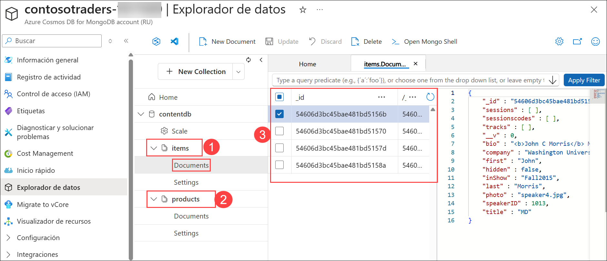

1. Dentro de la cuenta Azure CosmosDB for MongoDB **contosotraders-<inject key="DeploymentID" enableCopy="false" />** **(1)** , seleccione **Inicio rápido** **(2)** del menú a la izquierda y **Copie** la **CADENA DE CONEXIÓN PRIMARIA** **(3)** y péguela en el archivo de texto para usarla más tarde en el siguiente ejercicio. 

   

1. Haga clic en el botón **Siguiente** ubicado en la esquina inferior derecha de esta guía de laboratorio para continuar con el siguiente ejercicio.

> **Felicitaciones** por completar la tarea. Ahora es momento de validarla. Estos son los pasos:
> - Si recibe un mensaje de éxito, puede continuar con la siguiente tarea.
> - Si no es así, lea atentamente el mensaje de error y vuelva a intentar el paso, siguiendo las instrucciones de la guía de laboratorio.
> - Si necesita ayuda, comuníquese con nosotros a cloudlabs-support@spektrasystems.com. Estamos disponibles las 24 horas, los 7 días de la semana para ayudarlo.

<validation step="a8c090c8-01fe-467c-840b-a9a271068777" />

## Resumen

En este ejercicio, completó la exploración de su MongoDB on-premises (local) y la migración de su base de datos MongoDB local a Azure CosmosDB mediante el servicio Azure Database Migration.

### Ha completado el laboratorio correctamente. Haga clic en **Siguiente >>** para continuar con el siguiente ejercicio.

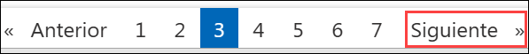