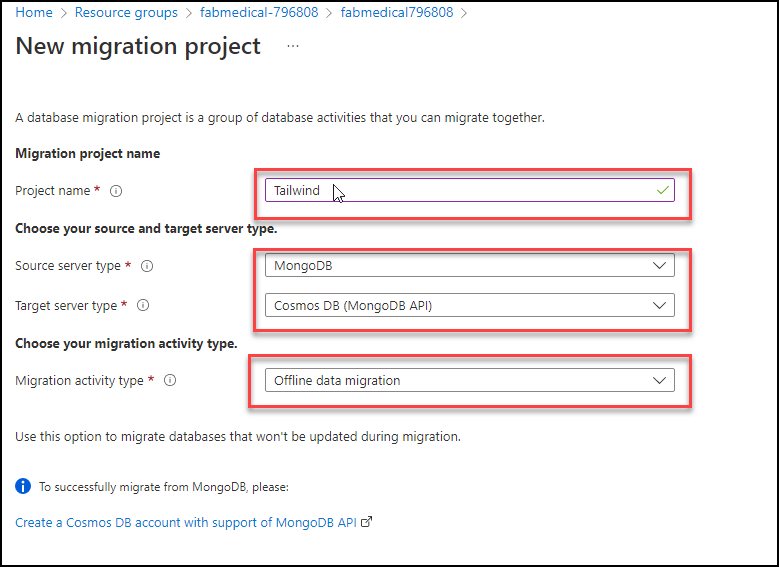
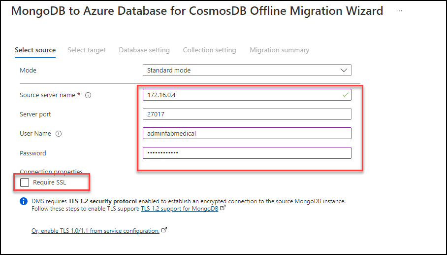

## Exercise 2: Migrate MongoDB to Cosmos DB using Azure Database Migration
  Duration: 30 Minutes
   
In this exercise you will be migrating you on-prem mongodb database to Azure cosmos db using Azure database migration.

### Task 1: Seed the data into on-prem mongo db

1. While connected to you Linux VM, check the mondodb service status.
    >Note: Mongodb is already installed and configured in the Linux VM

1. Now run the below command to run the seed script to import the data into mongodb

### Task2: Migrate data to Azure Cosmos DB

In this task, you will create a Migration project within Azure Database Migration Service, and then migrate the data from MongoDB to Azure Cosmos DB.

1. In the Azure Portal, navigate to your fabmedical(Build Agent) virtual machine in the resource group and copy the Private IP address (2) and Paste the private Ip address into the notepad for future use.

1. Navigate to the Database Migration Service **contoso<inject key="DeploymentID" enableCopy="false" />** resource blade in the **contoso-<inject key="DeploymentID" enableCopy="false" />** resource group.

On the Azure Database Migration Service blade, select **+ New Migration Project** on the **Overview** pane.

   

4. On the **New migration project** pane, enter the following values, then select **Create and run activity**:

    - Project name: `contoso`
    - Source server type: `MongoDB`
    - Target server type: `CosmosDB (MongoDB API)`
    - Choose type of activity: `Offline data migration`

    

    > **Note:** The **Offline data migration** activity type is selected since you will be performing a one-time migration from MongoDB to Cosmos DB. Also, the data in the database won't be updated during the migration. In a production scenario, you will want to choose the migration project activity type that best fits your solution requirements.

5. On the **MongoDB to Azure Database for CosmosDB Offline Migration Wizard** pane, enter the following values for the **Select source** tab:

    - Mode: **Standard mode**
    - Source server name: Enter the Private IP Address of the Build Agent VM used in this lab.
    - Server port: `27017`
    - Require SSL: Unchecked

    > **Note:** Leave the **User Name** and **Password** blank as the MongoDB instance on the Build Agent VM for this lab does not have authentication turned on. The Azure Database Migration Service is connected to the same VNet as the Build Agent VM, so it's able to communicate within the VNet directly to the VM without exposing the MongoDB service to the Internet. In production scenarios, you should always have authentication enabled on MongoDB.

    
    
    > **Note:** If you face an issue while connecting to the source DB with error connection refused. Please run the following commands in **build agent VM connected in CloudShell**. You can use the **Command to Connect to Build Agent VM**, which is given on lab environment details page.

    ```bash
    sudo apt install mongodb-server
    cd /etc
    sudo sed -i 's/bind_ip = 127.0.0.1/bind_ip = 0.0.0.0/g' /etc/mongodb.conf
    sudo sed -i 's/#port = 27017/port = 27017/g' /etc/mongodb.conf
    sudo service mongodb stop
    sudo service mongodb start
    ```
    
1. Select **Next: Select target >>**.

1. On the **Select target** pane, select the following values:

    - Mode: **Select Cosmos DB target**

    - Subscription: Select the Azure subscription you're using for this lab.

    - Select Cosmos DB name: Select the **fabmedical-<inject key="DeploymentID" enableCopy="false" />** Cosmos DB instance.

    

    Notice, the **Connection String** will automatically populate with the Key for your Azure Cosmos DB instance.

1. Select **Next: Database setting >>**.

1. On the **Database setting** tab, select the `contentdb` **Source Database** so this database from MongoDB will be migrated to Azure Cosmos DB.

    

1. Select **Next: Collection setting >>**.

1. On the **Collection setting** tab, expand the **contentdb** database, and ensure both the **sessions** and **speakers** collections are selected for migration. Also, update the **Throughput (RU/s)** to `400` for both collections.

    

1. Select **Next: Migration summary >>**.

1. On the **Migration summary** tab, enter `MigrateData` in the **Activity name** field, then select **Start migration** to initiate the migration of the MongoDB data to Azure Cosmos DB.

     

1. The status for the migration activity will be shown. The migration will only take a few seconds to complete. Select **Refresh** to reload the status to ensure it shows a **Status** of **Complete**.

    

1. To verify the data was migrated, navigate to the **Cosmos DB Account** for the lab within the Azure Portal, then select the **Data Explorer**. You will see the `speakers` and `sessions` collections listed within the `contentdb` database, and you will be able to explore the documents within.

    

1. Click on the **Next** button present in the bottom-right corner of this lab guide.

