## Exercise 2: Migrate MongoDB to Cosmos DB using Azure Database Migration
  
**Duration**: 30 Minutes

## Overview

In this exercise, you will be migrating your on-premises MongoDB database hosted over Azure Linux VM to Azure CosmosDB using Azure database migration. Azure Database Migration Service is a tool that helps you simplify, guide, and automate your database migration to Azure.

### Task 1: Explore the databases and collections in MongoDB

In this task, you will be connecting to a Mongo database hosted over an Azure Linux VM and exploring the databases and collections in it.

1. While connected to your Linux VM, run the below command for connecting to Mongo shell to display the databases and collections in it using the Mongo shell.

   ```
   mongo
   ```
   
   >**Note**: If you face an issue while connecting to the source DB with an error connection is refused. Run the **<inject key="Command to Connect to Build Agent VM" enableCopy="true" />** command and enter the VM password **<inject key="Build Agent VM Password" enableCopy="true" />** to connect to the Linux VM using ssh. Please run the following commands and reperform step - 1 of the task.

   ```
   sudo apt install mongodb-server
   cd /etc
   sudo sed -i 's/bind_ip = 127.0.0.1/bind_ip = 0.0.0.0/g' /etc/mongodb.conf
   sudo sed -i 's/#port = 27017/port = 27017/g' /etc/mongodb.conf
   sudo service mongodb stop
   sudo service mongodb start
   ```
   
   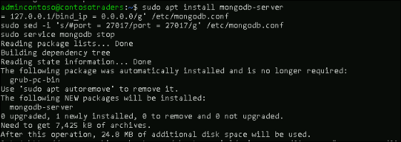
   
1. Run the following commands to verify the database in the Mongo shell. You should be able to see the **contentdb** available and **item & products** collections inside **contentdb**.

   ```
   show dbs
   use contentdb
   show collections
   ```
   
   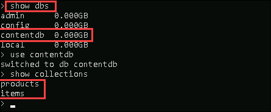 

   >**Note**: In case you don't see the data inside the Mongo. Please follow the steps mentioned below.

   - Enter `exit` to exit from Mongo.

   - Please run the below-mentioned commands in the command prompt and perform steps 1 and 2 again.

   ```
   cd ~/Cloud-Native-Application/labfiles/src/developer/content-init
   sudo npm ci
   nodejs server.js
   ```     

### Task 2: Create a Migration Project and migrate data to Azure CosmosDB

In this task, you will create a Migration project within Azure Database Migration Service, and then migrate the data from MongoDB to Azure Cosmos DB. In the later exercises, you will be using the Azure CosmosDB to fetch the data for the products page. 

1. In the Azure Portal, navigate to your **contosotraders** virtual machine in the **ContosoTraders-<inject key="DeploymentID" enableCopy="false" />** resource group. Copy the **Private IP address** and paste it on the notepad for later use.

   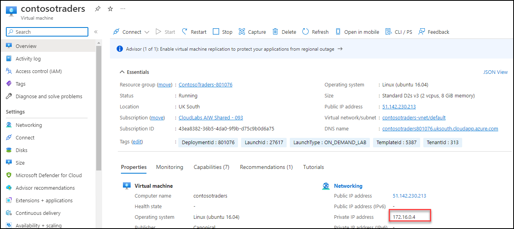

1. Navigate to **ContosoTraders<inject key="DeploymentID" enableCopy="false" />(1)** resource group and open **contosotraders-<inject key="DeploymentID" enableCopy="false" />(2)** CosmosDB resource and click on **Data Explorer(3)**. Now click on drop down arrow, adjacent to **New Collection(4)** and then select **New Database(5)**.

   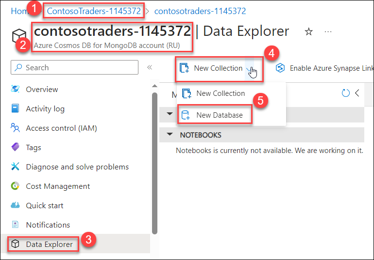

> **Note:** If you get **Welcome! What is Cosmos DB?** popup, close it by click on **X**.

1. Provide name as `contentdb` **(1)** for **Database id** and select **Databse throughput** as **Manual** **(2)**,  provide the RU/s value to `400` **(3)** and click on **OK(4)**.

   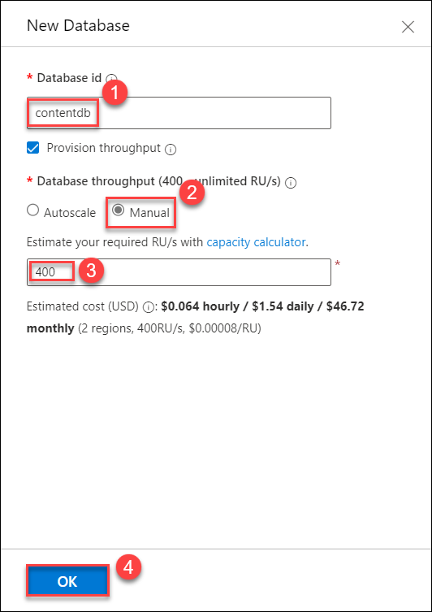

1. Navigate to the Azure Database Migration Service **contosotraders<inject key="DeploymentID" enableCopy="false" />** resource blade in the **ContosoTraders-<inject key="DeploymentID" enableCopy="false" />** resource group.

1. On the Azure Database Migration Service blade, select **+ New Migration Project** on the **Overview** pane.

   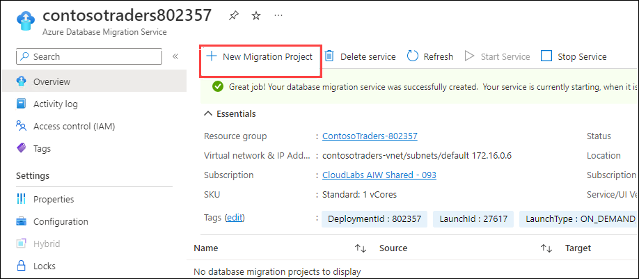

1. On the **New migration project** pane, enter the following values and then select **Create and run activity**:

    - Project name: `contoso`
    - Source server type: `MongoDB`
    - Target server type: `CosmosDB (MongoDB API)`
    - Migration activity type: `Offline data migration`

    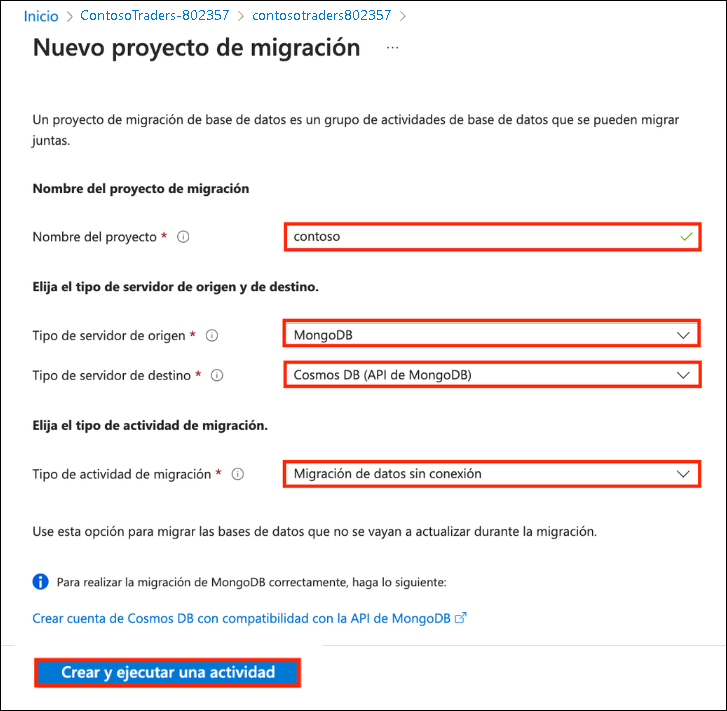

    >**Note**: The **Offline data migration** activity type is selected since you will be performing a one-time migration from MongoDB to Cosmos DB. Also, the data in the database won't be updated during the migration. In a production scenario, you will want to choose the migration project activity type that best fits your solution requirements.

1. On the **MongoDB to Azure Database for CosmosDB Offline Migration Wizard** pane, enter the following values for the **Select source** tab:

    - Mode: **Standard mode**
    - Source server name: Enter the Private IP Address of the Build Agent VM used in this lab.
    - Server port: `27017`
    - Require SSL: Unchecked

    > **Note:** Leave the **User Name** and **Password** blank as the MongoDB instance on the Build Agent VM for this lab does not have authentication turned on. The Azure Database Migration Service is connected to the same VNet as the Build Agent VM, so it's able to communicate within the VNet directly to the VM without exposing the MongoDB service to the Internet. In production scenarios, you should always have authentication enabled on MongoDB.

    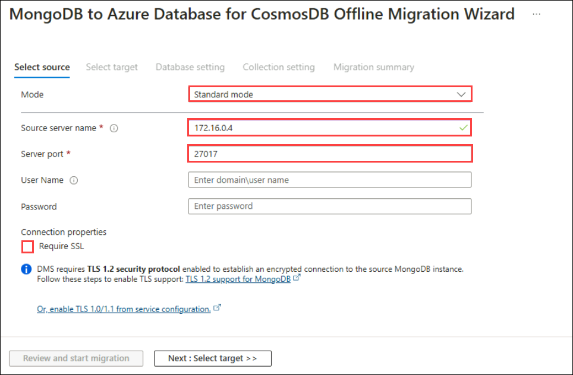
    
    > **Note:** If you face an issue while connecting to the source DB with an error connection is refused. Please run the following commands in **build agent VM connected in CloudShell**. You can use the **Command to Connect to Build Agent VM**, which is given on the lab environment details page.

    ```bash
    sudo apt install mongodb-server
    cd /etc
    sudo sed -i 's/bind_ip = 127.0.0.1/bind_ip = 0.0.0.0/g' /etc/mongodb.conf
    sudo sed -i 's/#port = 27017/port = 27017/g' /etc/mongodb.conf
    sudo service mongodb stop
    sudo service mongodb start
    ```
    
1. Select **Next: Select target >>**.

1. On the **Select target** pane, select the following values:

    - Mode: **Select Cosmos DB target**

    - Subscription: Select the Azure subscription you're using for this lab.

    - Select Cosmos DB name: Select the **contosotraders-<inject key="DeploymentID" enableCopy="false" />** Cosmos DB instance.

   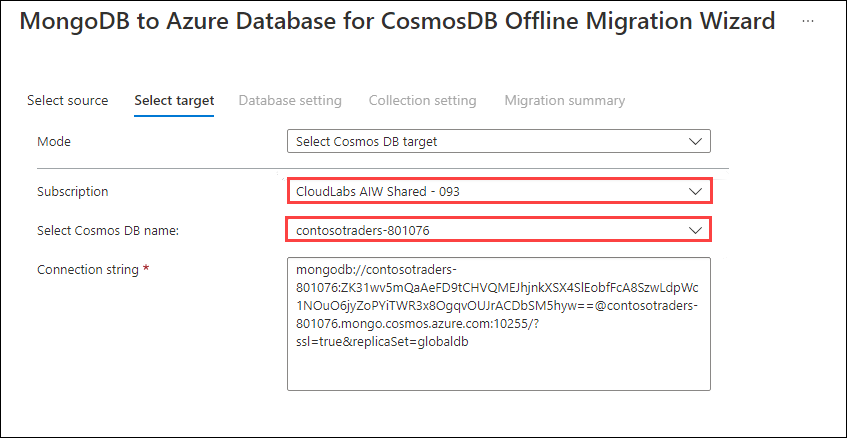

   Notice, that the **Connection String** will automatically populate with the Key for your Azure Cosmos DB instance.

1. Select **Next: Database setting >>**.

1. On the **Database setting** tab, select the `contentdb` **Source Database**, so this database from MongoDB will be migrated to Azure Cosmos DB.

   

1. Select **Next: Collection setting >>**.

1. On the **Collection setting** tab, expand the **contentdb** database, and ensure both the **products** and **items** collections are selected for migration. Also, update the **Throughput (RU/s)** to `400` for both collections.

   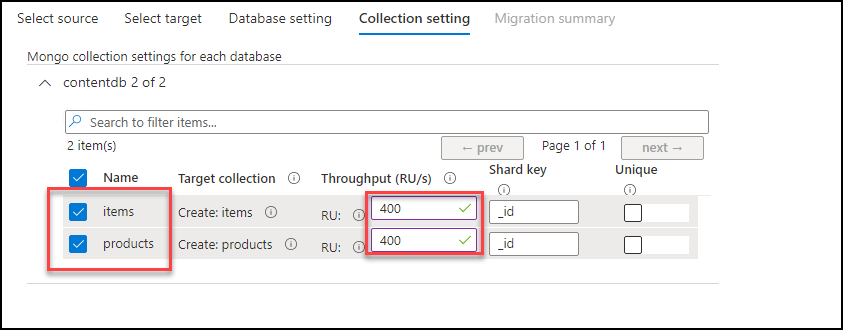

1. Select **Next: Migration summary >>**.

1. On the **Migration summary** tab, enter `MigrateData` in the **Activity name** field, and then select **Start migration** to initiate the migration of the MongoDB data to Azure Cosmos DB.

   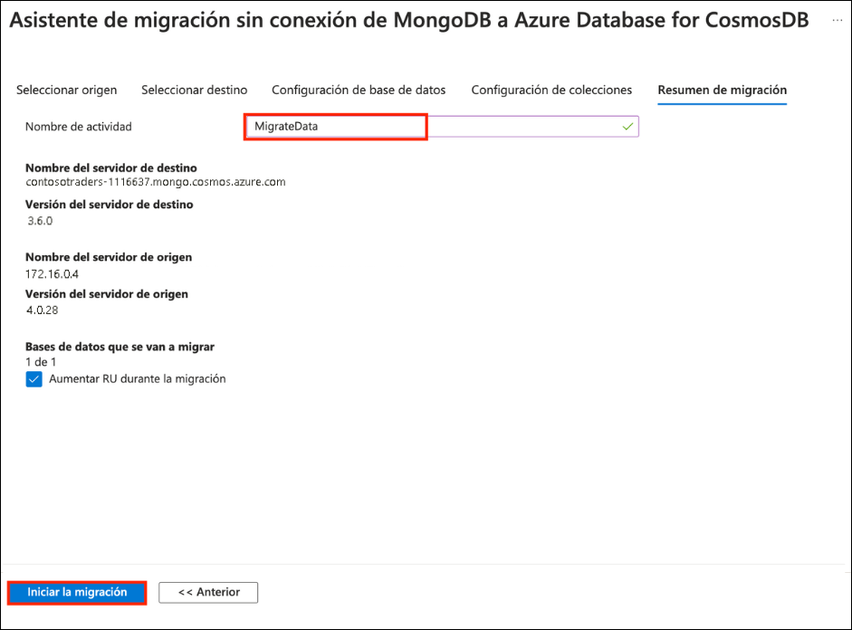

1. The migration activity's status will be displayed. The migration will be finished in a matter of seconds. Select **Refresh** to reload the status and ensure it is **complete**. 

   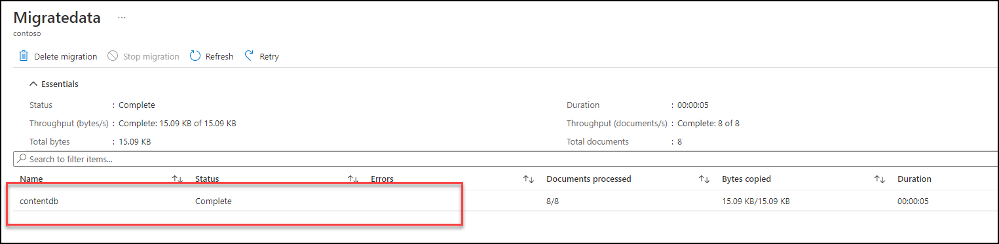

1. To verify the migrated data, navigate to the **contosotraders-<inject key="DeploymentID" enableCopy="false" />** Azure CosmosDB for MongoDB account in the **ContosoTraders-<inject key="DeploymentID" enableCopy="false" />** resource group. Select **Data Explorer** from the left menu.

   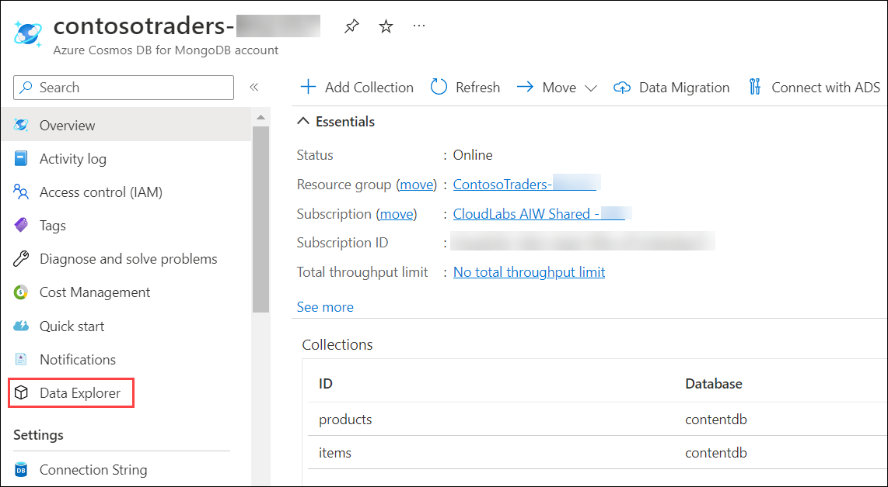

1. You will see the `items` and `products` collections listed within the `contentdb` database and you will be able to explore the documents.

   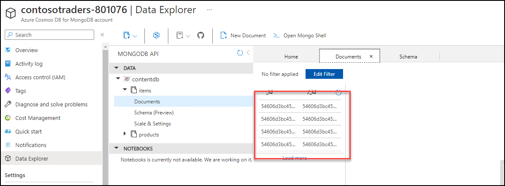

1. Within the **contosotraders-<inject key="DeploymentID" enableCopy="false" />** **(1)** Azure CosmosDB for MongoDB account. Select **Quick start** **(2)** from the left menu and **Copy** the **PRIMARY CONNECTION STRING** **(3)** and paste it into the text file for later use in the next exercise.

   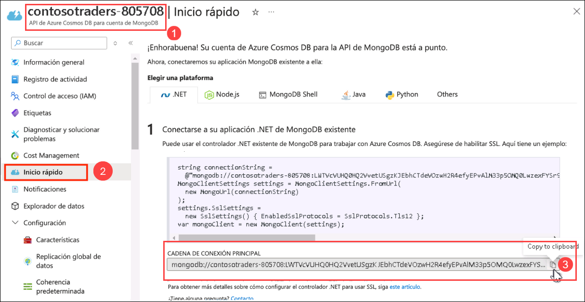

1. Click the **Next** button located in the bottom right corner of this lab guide to continue with the next exercise.


## Summary

In this exercise, you have completed exploring your on-prem Mongodb and migrating your on-premises MongoDB database to Azure CosmosDB using Azure database migration.
