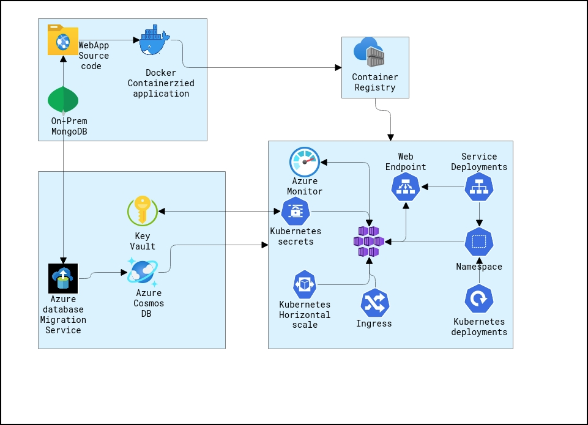
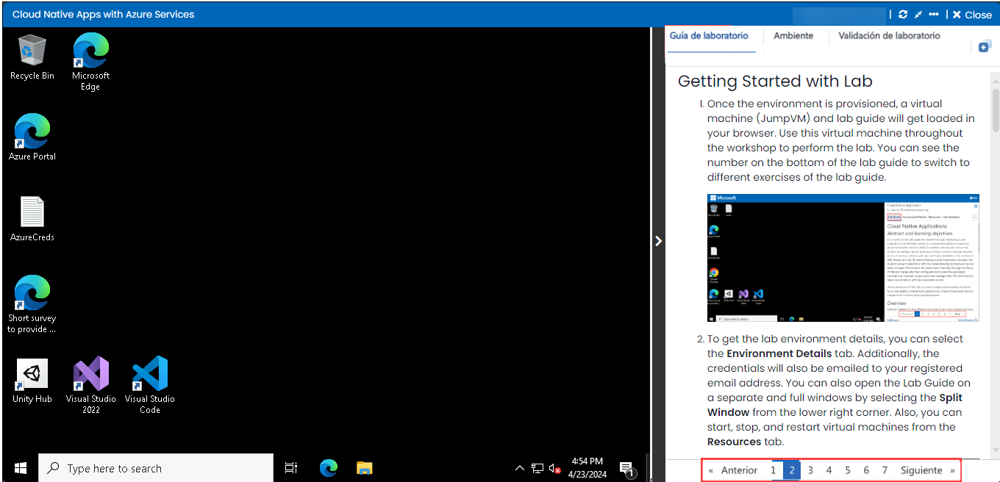
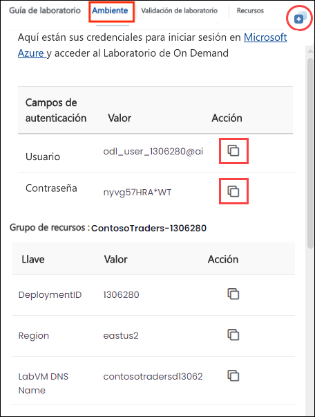
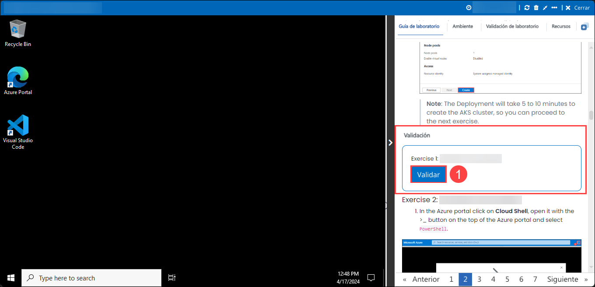
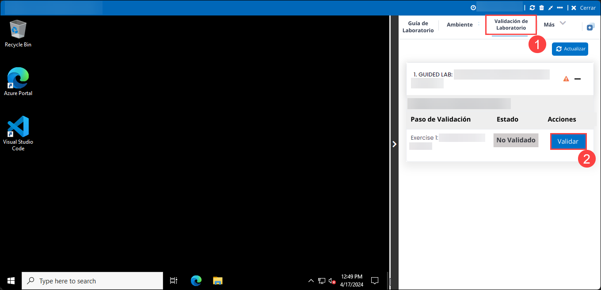
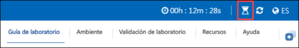
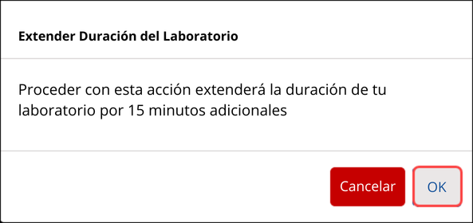

# Cloud Native Applications

### Overall Estimated Duration: 8 hours

## Overview

Contoso Traders (ContosoTraders) provides online retail website services tailored to the electronics community. They are refactoring their application to run as a Docker application. They want to implement a proof of concept that will help them get familiar with the development process, lifecycle of deployment, and critical aspects of the hosting environment. They will be deploying their applications to Azure Kubernetes Service and want to learn how to deploy containers in a dynamically load-balanced manner, discover containers, and scale them on demand.

In this hands-on lab, you will assist with completing this POC with a subset of the application codebase. You will use a pre-created build agent based on Linux and an Azure Kubernetes Service cluster for running deployed applications. You will be helping them to complete the Docker setup for their application, test locally, push to an image repository, deploy to the cluster, test load-balancing and scale and use Azure Monitor and view the insights.

## Objective

This lab is designed to equip participants with hands-on experience in building Docker images, migrate MongoDB to Cosmos DB, deploy and scale applications on Azure Kubernetes Service, manage updates and traffic routing, and monitor container performance with Azure Monitor.

1. **Build Docker Images for the Application:** This hands-on exercise aims to create Docker images to containerize your application for consistent and portable deployments. Participants will successfully containerize the application, enabling consistent deployment across various environments.

1. **Migrate MongoDB to Cosmos DB using Azure Database Migration:** This hands-on exercise aims to transfer your MongoDB data to Azure Cosmos DB to leverage its scalable and managed database services. Participants will seamlessly migrate MongoDB data to Azure Cosmos DB, ensuring data availability and compatibility with Azure services.

1. **Deploy the application to the Azure Kubernetes Service:** This hands-on exercise aims to deploy and manage your containerized application using Azure Kubernetes Service for orchestration and scalability. Participants will deploy the containerized application to Azure Kubernetes Service, providing a scalable and managed environment for operation.

1. **Scale the application and validate HA:** This hands-on exercise aims to adjust the application's scale and confirm its high availability to ensure it performs well under varying loads. Participants will scale the application to handle varying loads and confirmed its high availability to maintain performance and reliability.

1. **Updating Apps & Managing Kubernetes Ingress:** This hands-on exercise aims to apply updates to your application and configure Kubernetes Ingress to manage and route external traffic effectively. Participants will update the application successfully and configure Kubernetes Ingress to effectively manage and route external traffic.

1. **Azure Monitor for Containers:** This hands-on exercise aims to utilize Azure Monitor for Containers to track and analyze the performance and health of your containerized applications in AKS. Participants will enable monitoring of containerize applications with Azure Monitor, providing insights into performance and operational health.

## Prerequisites

Participants should have:

- Understanding Docker concepts such as containers, images, and Dockerfiles.
- Knowledge of MongoDB data structures and Azure Cosmos DB capabilities for effective migration.
- Basic understanding of Kubernetes concepts including pods, deployments, and services, as well as Azure Kubernetes Service (AKS).
- An active Azure subscription with appropriate permissions to create and manage resources.
- General understanding of cloud services, container orchestration, and scaling strategies.
- Proficiency in using command-line tools and interfaces, such as Azure CLI and Docker CLI.
- Familiarity with Continuous Integration and Continuous Deployment practices, as they may be relevant for managing updates and deployments.

## Architecture

The exercises utilize several Azure services to build, deploy, and manage applications effectively. Azure Container Registry (ACR) is used for storing and managing Docker container images, while Azure Cosmos DB provides a scalable, multi-model database solution for data migration. Azure Kubernetes Service (AKS) enables the deployment and management of containerized applications within a managed Kubernetes environment. For scaling and high availability, Azure Load Balancer distributes traffic across servers, and Azure Application Gateway offers advanced load balancing and routing for web applications. Finally, Azure Monitor tracks the performance and health of applications and infrastructure, including containerized environments, ensuring comprehensive monitoring and insights.

## Architecture Diagram

## Explanation of Components

The architecture for this lab involves several key components:

- **Azure Container Registry (ACR):** A managed Docker container registry for storing and managing Docker container images.
- **Azure Cosmos DB:** A globally distributed, multi-model database service for managing and scaling NoSQL data.
- **Azure Kubernetes Service (AKS):** A managed Kubernetes container orchestration service for deploying, scaling, and managing containerized applications.
- **Azure Load Balancer (Part of AKS):** A high-performance load balancer that distributes network traffic across multiple servers to ensure high availability.
- **Azure Application Gateway (Part of AKS):** A web traffic load balancer that enables you to manage traffic to your web applications and provides URL-based routing and SSL termination.
- **Azure Monitor:** A comprehensive monitoring service that provides insights into the performance and health of applications and infrastructure, including containerized workloads.

## Getting Started with Lab

1. Once the environment is provisioned, a virtual machine (JumpVM) and lab guide will get loaded in your browser. Use this virtual machine throughout the workshop to perform the lab. You can see the number on the bottom of the lab guide to switch to different exercises of the lab guide.

   

1. To get the lab environment details, you can select the **Environment** tab. Additionally, the credentials will also be emailed to your registered email address. You can also open the Lab Guide on a separate and full window by selecting the **Split Window** from the top right corner. Also, you can start, stop, and restart virtual machines from the **Resources** tab.

   
 
   > You will see the DeploymentID value on the **Environment** tab, use it wherever you see SUFFIX or DeploymentID in lab steps.

## Lab Validation

1. After completing the task, hit the **Validate** button under the Validation tab integrated within your lab guide. If you receive a success message, you can proceed to the next task, if not, carefully read the error message and retry the step, following the instructions in the lab guide.

   

1. You can also validate the task by navigating to the **Lab Validation** tab, from the upper right corner in the lab guide section.

   

1. If you need any assistance, please contact us at labs-support@spektrasystems.com.

## Lab Duration Extension

1. To extend the duration of the lab, kindly click the **Hourglass** icon in the top right corner of the lab environment. 

   

   >**Note:** You will get the **Hourglass** icon when 10 minutes are remaining in the lab.

2. Click **OK** to extend your lab duration.
 
   

3. If you have not extended the duration prior to when the lab is about to end, a pop-up will appear, giving you the option to extend. Click **OK** to proceed.
     
## Login to Azure Portal

1. In the JumpVM, click on the Azure portal shortcut of the Microsoft Edge browser which is created on the desktop.

   
   
1. On the **Sign into Microsoft Azure** tab you will see the login screen, in that enter the following email/username and then click on **Next**. 
   * Email/Username: <inject key="AzureAdUserEmail"></inject>
   
     
     
1. Now enter the following password and click on **Sign in**.
   * Password: <inject key="AzureAdUserPassword"></inject>
   
     
     
   > If you see the **Help us protect your account** dialog box, then select the **Skip for now** option.

     
  
1. If you see the pop-up **Stay Signed in?**, click No

1. If you see the pop-up **You have free Azure Advisor recommendations!**, close the window to continue the lab.

1. If a **Welcome to Microsoft Azure** popup window appears, click **Maybe Later** to skip the tour.
   
1. Now you will see the Azure Portal Dashboard, click on **Resource groups** from the Navigate panel to see the resource groups.

    
   
By the end of this lab, participants will learn to build Docker images for containerizing applications, migrate data from MongoDB to Azure Cosmos DB, and deploy applications to Azure Kubernetes Service (AKS) for orchestration. They will also scale applications and ensure high availability, manage updates and traffic routing, and use Azure Monitor to track the performance and health of their containerized applications.

### Happy Learning!!
